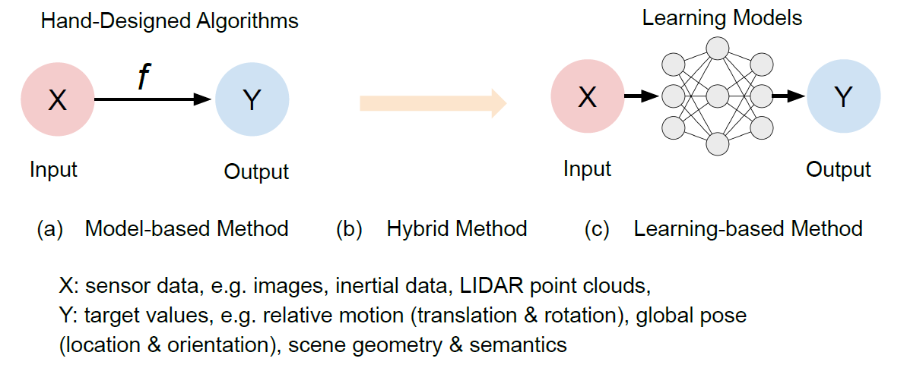
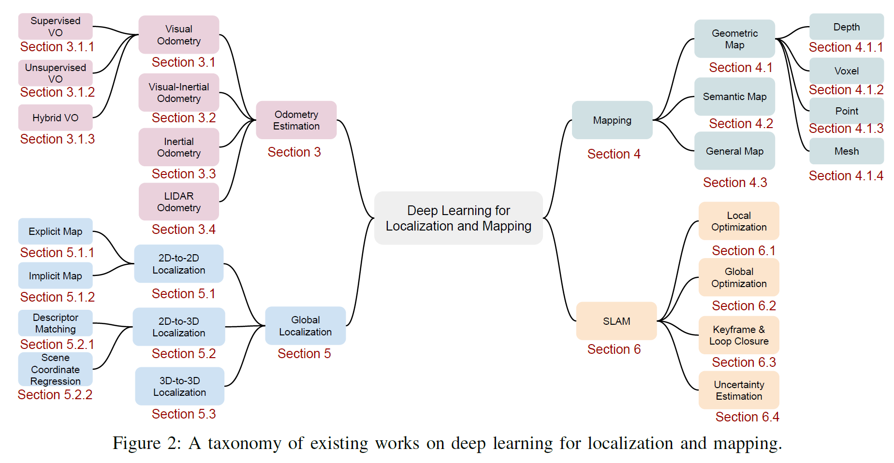
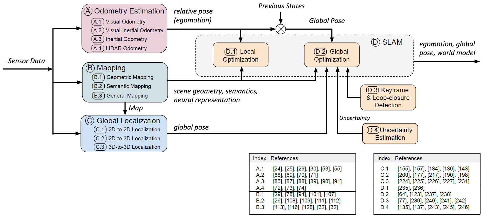
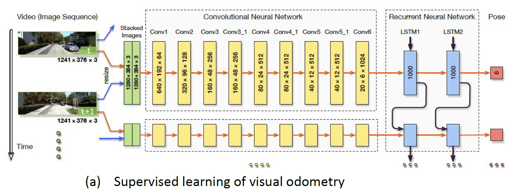
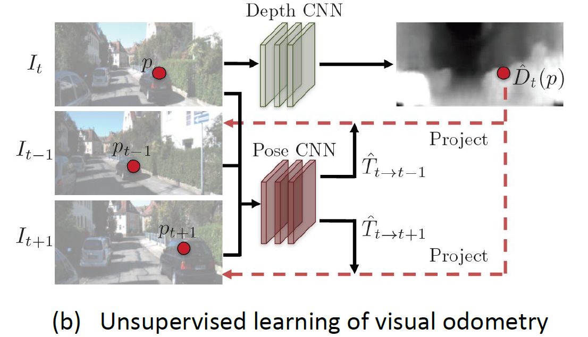

# A Survey on Deep Learning for Localization and Mapping: Towards the Age of Spatial Machine Intelligence

##### 一篇关于深度学习在地图-定位应用的综述: 面向空间机器智能时代

Abstract—Deep learning based localization and mapping has recently attracted significant attention. Instead of creating hand-designed algorithms through exploitation of physical models or geometric theories, deep learning based solutions provide an alternative to solve the problem in a data-driven way. Benefiting from ever-increasing volumes of data and computational power, these methods are fast evolving into a new area that offers accurate and robust systems to track motion and estimate scenes and their structure for real-world applications. **In this work, we provide a comprehensive survey, and propose a new taxonomy for localization and mapping using deep learning.** We also discuss the limitations of current models, and indicate possible future directions. A wide range of topics are covered, from learning odometry estimation, mapping, to global localization and simultaneous localization and mapping (SLAM). We revisit the problem of perceiving self-motion and scene understanding with on-board sensors,and show how to solve it by integrating these modules intoa prospective spatial machine intelligence system (SMIS). Itis our hope that this work can connect emerging works fromrobotics, computer vision and machine learning communities,and serve as a guide for future researchers to apply deeplearning to tackle localization and mapping problems.
Index Terms—Deep Learning, Localization, Mapping, SLAM,Perception, Correspondence Matching, Uncertainty Estimation

- odometry estimation, mapping
- global localization and simultaneous localization and mapping (SLAM).

摘要基于深度学习的定位和映射技术近年来备受关注。基于深度学习的解决方案提供了一种以数据驱动的方式解决问题的替代方案，而不是通过利用物理模型或几何理论来创建手工设计的算法。得益于不断增长的数据量和计算能力，这些方法正在迅速发展成为一个新的领域，为现实应用提供精确和鲁棒的系统来跟踪运动和估计场景及其结构。**在这项工作中，我们提供了一个全面的调查，并提出了一种新的分类定位和映射使用深度学习。**我们还讨论了当前模型的局限性，并指出可能的未来方向。课程涵盖范围广泛，包括学习测程估计、映射、全球定位和同步定位与映射(SLAM)。我们重新讨论了利用机载传感器感知自我运动和场景理解的问题，并展示了如何通过将这些模块集成到未来的空间机器智能系统(SMIS)中来解决这个问题。我们希望这项工作能够连接机器人、计算机视觉和机器学习领域的新兴成果，并为未来的研究人员应用深度学习解决定位和映射问题提供指导。

索引术语-深度学习，定位，映射，SLAM，感知，对应匹配，不确定性估计

#### 1 Introduction

- 人可以感知自己的运动，从而在复杂的环境中知道自己在哪里

- 这种认知能力无论对人还是对机器都很重要。机器人也要感知周围环境、确定自己的状态，从而做出自己的决策。

- 这些应用需要精确和鲁棒的定位，并且以增量的形式构建一个世界模型，用来持续处理新的输入。这个问题被称作 Spatial Machine Intelligence System (SMIS)

  - localization：internal

  - mapping：external

  二者可以独立工作，也可以协同工作（SLAM），来实时定位和构建全局环境地图。

#### 1.1. Why to Study Deep Learning for Localization and Mapping

The limitations of model based solutions, together with recent advances in machine learning, especially deep learning, have motivated researchers to consider data-driven (learning) methods as an alternative to solve problem.

The advantages of learning based methods are three-fold:

1. neural network automatically discover features relevant to task (especially featureless areas) 视觉里程表在其设计[24]，[25]中加入了数据驱动的方法，在鲁棒性方面取得了显著的改进，优于最先进的传统算法；能够将抽象元素与人类可以理解的术语[26]、[27]联系起来，例如SLAM中的语义标签，这很难用正式的数学方式来描述。
2. learning methods allow spatial machine intelligence systems to learn from past experience, and actively exploit new information 数据驱动模型，从过去的经验中学习，并积极开发新的信息。通过构建一个通用的数据驱动模型，它避免了在部署之前指定关于数学和物理规则[28]的完整知识来解决领域特定问题的人工工作。
3. 第三个好处是它能够充分利用不断增加的传感器数据量和计算能力。深度学习或深度神经网络具有大规模问题的能力。通过反向传播和梯度下降算法在大数据集上进行训练，将损失函数最小化，从而自动优化DNN框架内的大量参数。例如，最近发布的GPT-3[33]是最大的预训练语言模型，具有令人难以置信的超过1750亿个参数，即使没有调优，也能在各种自然语言处理(NLP)任务上取得最先进的结果。此外，各种与定位和映射相关的大规模数据集已经发布，例如，在自动驾驶汽车场景中，[34]、[35]、[36]是传感器数据、运动和语义标签的丰富组合集合。这给了我们一种想象，利用数据和计算的能力来解决定位和映射是可能的。

然而，必须指出的是，这些学习技术依赖于大量数据集来提取统计上有意义的模式，并且很难推广到外部环境。缺乏模型的可解释性。此外，尽管它们具有高度的可并行性，但它们的计算成本通常也比更简单的模型高。第7节讨论了限制的细节。

#### 1.2. Comparison with Other Surveys 文献综述

本文对深度学习的模型只有简要概述，没有深度讲解。另外，罗列了一下传统的基于模型的解决方案的文献，说可以参考。

值得注意的是，虽然定位和映射问题属于机器人技术的关键概念，但学习方法的结合是与机器学习、计算机视觉甚至自然语言处理等其他研究领域一起进行的。因此，在将相关工作综合总结为调查论文时，这一跨学科领域带来了不小的困难。据我们所知，这是第一篇全面而广泛地涵盖了深度学习在定位和映射方面的现有工作的调查文章。

#### 1.3. Survey Organization 论文结构

本文的其余部分组织如下:

第2节提供了概述，并介绍了现有的基于深度学习的定位和映射的分类;第3、4、5、6节讨论了现有的深度学习在相对运动(odometry 里程表)估计、几何映射、语义和一般映射、全局定位、同时定位和映射等方面的工作，重点分别是SLAM后端;在第7节中总结了有待解决的问题，讨论了现有工作的局限性和未来前景;最后，第8节对全文进行了总结。

#### 2. Taxonomy of Existing Approaches 现有方法的分类

We provide a new taxonomy of existing deep learning approaches, relevant to localization and mapping, to connect the fields of robotics, computer vision and machine learning. Broadly, they can be categorized into **odometry estimation, mapping, global localization and SLAM**, as illustrated by the taxonomy shown in Figure 2：

1) Odometry estimation

Odometry estimation 涉及计算相对变化的姿态，在平移和旋转，两帧或多帧传感器数据之间。它不断地跟踪自我运动，然后通过一个过程将这些位姿变化与初始状态相结合，以获得位置和方向方面的全局位姿。这被广泛称为所谓的航迹推算解决方案。里程表估计可用于提供姿态信息，并作为里程表运动模型辅助机器人控制的反馈回路。关键问题是从各种传感器测量中准确地估计运动变换。为此，深度学习被应用于端到端的运动动力学模型，或者以混合的方式提取有用的特征来支持预先构建的系统。

2) Mapping

mapping 建立和重建一个一致的模型来描述周围的环境。映射可以为人类操作者和机器人高级任务提供环境信息，约束测程估计的误差漂移，检索全局定位[39]的查询观测。深度学习是一种有用的工具，可以从高维原始数据中发现场景几何和语义，用于映射。基于深度学习的映射方法分为几何映射、语义映射和一般映射，这取决于神经网络是学习场景的显式几何或语义，还是分别将场景编码为隐式神经表示。

3) Global localization

Global localization retrieves the global pose of mobile agents in a known scene with prior knowledge.。这是通过将查询输入数据与**预先构建的**2D或3D地图、其他空间参考或**以前访问过的场景**相匹配来实现的。它可以用来减少航迹推算系统的姿态漂移或解决“kidnapped robot”问题[40]。**深度学习**用于解决查询数据与地图之间因视图、光照、天气和场景动态变化而复杂的数据关联问题。

4) Simultaneous Localisation and Mapping (SLAM)

SLAM 将上述 odometry estimation, global localization and mapping 的过程集成为 front-ends，并联合优化这些模块，以提高定位和测绘的性能。除上述模块外，SLAM的其他几个模块也保证了整个系统的一致性:

- local optimization 保证了摄像机运动和场景几何的局部一致性;
- global optimization 的目标是在全局范围内约束全局轨迹的漂移;
- keyframe detection 在基于关键帧的SLAM中使用关键帧检测，使推理更有效，而系统错误漂移可以通过全局优化来缓解，一旦循环闭包检测到一个循环;
- uncertainty estimation 提供了对学习到的姿态和映射的信任度量，这对SLAM系统的概率传感器融合和后端优化至关重要。

尽管单个组件的设计目标不同，但上述组件可以集成到空间机器智能系统(SMIS)中，以解决现实世界的挑战，允许健壮的操作和在野外的长期自治。这种基于深度学习的集成定位与映射系统的概念图如图3所示，显示了这些组件之间的关系。在下面的部分中，我们将详细讨论这些组件。

#### 3. Odometry Estimation

This section discusses deep learning approaches to achieve odometry estimation from various sensor data, that are fundamentally different in their data properties and application scenarios. The discussion mainly focuses on odometry estimation from visual, inertial and point-cloud data, as they are the common choices of sensing modalities on mobile agents.

VO 估计相机的自我运动，通过相邻图片的自我运动估计全局的姿态。

#### 3.1. Visual Odometry

深度学习方法能够从图像中提取高级特征表示，从而提供了解决VO问题的替代方案，而不需要手工制作的 feature extractors。

depending on whether they are **purely neural-network based** or whether they are a **combination of classical VO algorithms and deep neural networks**, existing deep learning based VO models can be categorized into:

- end-to-end VO（纯神经网络，端到端，没有中间的图像分割的过程）
- hybrid VO（经典vo算法+深度神经网络）

#### end-to-end VO

Depending on the **availability of ground-truth labels** in the training phase, **end-to-end VO** systems can be further classified into:

- supervised VO
- unsupervised VO

##### supervised VO

通过**带有标签的数据集**训练一个深度神经网络模型，用来构建一个映射，此映射将连续的图片直接转化为位置的移动，而非像传统vo算法那样，从几何结构上分析图片。它的输入是一对连续的图片，输出是根据两帧图片估计出的位移和姿态。

在这个领域的**第一个作品**是Konda等人的[44]。该方法将视觉测程作为一个分类问题，并利用卷积神经网络(ConvNet)预测输入图像的方向和速度的离散变化。Costante等[45]利用卷积神经网络从密集光流中提取视觉特征，并基于这些视觉特征输出 frame-to-frame 运动估计。然而，这两部作品并没有实现从图像到运动估计的 end-to-end 学习，而且其性能仍然有限。

**DeepVO**[24]利用卷积神经网络(ConvNet)和递归神经网络(RNN)的组合来实现视觉测程的端到端学习。由于其在端到端学习方面的特殊性，DeepVO框架成为实现VO监督学习的典型选择。图4 (a)给出了基于RNN+ConvNet的VO系统的架构，该系统通过卷积神经网络(ConvNet)从对图像中提取视觉特征，并将特征通过RNN进行特征的时间相关性建模。其ConvNet编码器基于一种FlowNet结构来提取适合于光流和自运动估计的视觉特征。使用基于FlowNet的编码器可以被视为在学习过程中引入了光流的先验知识，并可能防止DeepVO被过度拟合到训练数据集。递归模型将历史信息归纳为其隐藏状态，以便从过去的经验和当前的传感器观测卷积神经网络特征推断输出。它是训练在大规模数据集与地面真实相机姿态作为标签。为了恢复框架的最优参数，优化目标是使估计平移^ p2r3和欧拉角基旋转^ ' 2r3的均方误差(MSE)最小化

DeepVO报告了令人印象深刻的估计车辆姿态的结果，即使在以前没有见过的情况下。在KITTI测程数据集[46]的实验中，该数据驱动解决方案的性能优于传统的有代表性的单目VO，如VISO2[47]和ORB-SLAM(无闭环)[21]。另一个优点是，监控VO可以自然地从单目摄像机中产生具有绝对尺度的轨迹，而经典的VO算法只使用单目信息就会产生尺度模糊。这是因为深度神经网络可以隐式地从大量的图像集合中学习和维护全局尺度，这可以看作是学习过去的经验来预测当前的尺度度量。在这种典型的监督VO模型的基础上，许多工作进一步扩展了这种方法，以提高模型的性能。

总之，这些端到端学习方法受益于机器学习技术和计算能力的最新进展，可以直接从原始图像自动学习姿态转换，从而解决现实世界中具有挑战性的里程表估计。

##### unsupervised VO

Unsupervised solutions are capable of exploiting unlabelled sensor data, and thus it saves human effort on labelling data, and has better adaptation and generalization ability in new scenarios, where **no labelled data** are available.

存在的问题：

1. 这种基于单目摄像头图像的方法不能提供一致的全局尺度下的姿态估计。由于规模模糊，无法重构具有物理意义的全球轨迹，限制了其实际应用。
2. 光度损失假设场景是静态的，没有相机遮挡。虽然作者提出了使用可解释性遮罩去除场景动态，但这些环境因素的影响仍然没有得到完全解决，这违背了这一假设。为了解决这些问题，越来越多的作品[53]、[55]、[56]、[58]、[59]、[61]、[64]、[76]、[77]扩展了这个无监督框架，以实现更好的性能。

为了解决全局尺度问题，[53]、[56]提出利用双目摄像头对恢复姿态估计的绝对尺度。他们在左右两组图像之间引入了额外的空间光度损失，因为立体基线(即左右两组图像之间的运动变换)是固定的，并且在整个数据集中都是已知的。一旦训练完成，网络只使用单眼图像产生姿态预测。因此，尽管它在没有获得ground-truth的情况下是无监督的，训练数据集(立体)与测试集(单声道)是不同的。[30]通过引入几何一致性损失来解决尺度问题，增强了预测深度图和重建深度图之间的一致性。该框架将预测的深度映射转换为3D空间，并将它们投影回生成重建的深度映射。这样，深度预测能够在连续帧上保持尺度一致，同时使姿态估计保持尺度一致。

在实际应用中，环境中的变化可能使光度扭曲，降低对姿态估计的准确度。解决方法：将学习分为两个子任务：

- a rigid structure reconstructor
- a non-rigid motion localizer

有人使用GAN（生成对抗网络）用来生成更加准确的图像，来代替人工制作。在此过程中，生成对抗设置有助于生成深度地图，使其纹理更加丰富和清晰。通过这种方式，高层次的场景感知和表现被准确捕捉，环境动态被隐藏和容忍。

虽然无监督的VO在性能上还不能与有监督的VO相媲美，但如图5所示，其尺度度量和场景动力学问题已经得到了很大的解决。随着自监督学习的发展和性能的不断提高，无监督VO将成为空间机器智能系统中提供姿态信息并与其他模块紧密耦合的一种很有前途的解决方案。

#### 3.1.3. Hybrid VO

Unlike **end-to-end VO** that only relies on a **deep neural network** to interpret pose from data, **hybrid VO** integrates **classical geometric models** with **deep learning framework**. Based on mature geometric theory, they use a deep neural network to expressively replace parts of a geometry model.

一种简单的方法是将学习到的深度估计合并到传统的视觉测程算法中，以恢复姿态[52]的绝对尺度度量。学习深度估计是计算机视觉领域的一个研究热点。例如，[78]、[79]、[80]、[81]通过使用经过训练的深度神经模型在全局范围内提供逐像素深度。因此，传统VO的所谓规模问题得到了缓解。Barnes等人[54]利用预测的深度地图和短暂掩码(即运动对象的区域)进入VO系统，以提高其对运动对象的鲁棒性。Zhan等人[67]将学习到的深度和光流预测整合到传统的视觉测程模型中，实现了比其他基线更具竞争力的性能。其他研究将物理运动模型与深度神经网络结合起来，例如通过可微卡尔曼滤波[82]和粒子滤波[83]。物理模型在学习过程中起到了算法的作用。此外，D3VO[25]将深度预测、姿态和不确定性整合到直接的视觉里程表中。

Combining the benefits from both geometric theory and deep learning, hybrid models are normally more accurate than end-to-end VO at this stage, as shown in Table 1. It is notable that hybrid models even outperform the state-of-theart conventional monocular VO or visual-inertial odometry (VIO) systems on common benchmarks, for example, D3VO [25] defeats several popular conventional VO/VIO systems, such as DSO [84], ORB-SLAM [21], VINS-Mono [15]. This demonstrates the rapid rate of progress in this area.

将视觉惯性数据集成为视觉惯性测程(VIO)是移动机器人中一个明确定义的问题。照相机和惯性传感器都是相对低成本、节能和广泛部署的。这两个传感器是互补的:单目摄像机捕捉3D场景的外观和结构，但它们的规模不明确，并不能适应具有挑战性的场景，如强烈的灯光变化，缺乏纹理和高速运动;相比之下，imu完全以自我为中心，独立于场景，也可以提供绝对的度量尺度。然而，缺点是惯性测量，特别是从低成本设备，受到过程噪声和偏差的困扰。有效地融合这两个互补传感器的测量值对精确的位姿估计至关重要。因此，根据其信息融合方法，将传统的基于模型的视觉惯性方法大致分为三类:滤波方法[12]、固定滞后平滑方法[13]和完全平滑方法[14]。

数据驱动的方法已经出现，可以考虑直接从视觉和惯性测量中学习6自由度姿态，无需人为干预或校准。VINet [68]是第一个将视觉惯性测程定义为顺序学习问题的工作，并提出了一个深度神经网络框架，以 end-to-end 方式实现VIO。VINet 采用基于卷积神经网络(ConvNet)的视觉编码器从两幅连续RGB图像中提取视觉特征，并采用惯性编码器从具有长短时记忆(LSTM)网络的IMU数据序列中提取惯性特征。这里，LSTM的目的是建模惯性数据的时间状态演化。视觉和惯性特征被连接在一起，并作为进一步的LSTM模块的输入，以系统状态的历史为条件来预测相对姿态。这种学习方法的优点是对校准和相对时间偏移误差具有更强的鲁棒性。然而，VINet 并没有完全解决学习有意义的传感器融合策略的问题。

与无监督VO类似，视觉惯性里程测量也可以采用一种新的自监督方式来求解。

基于学习的VIO不能战胜最先进的基于模型的VIOs，但由于dnn在特征提取和运动建模方面的出色能力，它们对于诸如测量噪声、糟糕的时间同步等现实问题通常更具有鲁棒性。

##### 3.3. Inertial Odometry

inertial-only solution

Compared with visual methods, an inertial sensor is relatively low-cost, small, energy efficient and privacy preserving.

It is relatively immune to environmental factors, such as lighting conditions or moving objects. However, low-cost MEMS inertial measurement units (IMU) widely found on robots and mobile devices are corrupted with high sensor bias and noise, leading to unbounded error drifts in the strapdown inertial navigation system (SINS), if inertial data are doubly integrated.

Chen等人[85]将惯性测程表述为一个连续的获取问题，其关键观察是，极坐标(即极坐标向量)中的2D运动位移可以从分段惯性数据的独立窗口中学习。关键的观察是，当跟踪人体和轮式结构时，他们的振动频率与移动速度有关，这是通过惯性测量反映出来的。基于此，他们提出了IONet，一种基于LSTM的框架，用于从惯性测量序列中端到端学习相对姿态。轨迹是由运动位移积分产生的。[86]利用深度生成模型和域自适应技术来提高深度惯性测程在新领域的泛化能力。[87]通过改进的三通道LSTM网络扩展了该框架，从惯性数据和采样时间预测无人机定位的极向量。RIDI[88]训练一个深度神经网络从惯性数据回归线速度，校准收集的加速度以满足学习速度的约束，并通过常规物理模型将加速度双重集成到位置中。类似地，[89]利用学习到的速度补偿经典SINS模型的误差漂移。其他研究也探索了利用深度学习来检测零速度阶段以导航行人[90]和车辆[91]。这个零速度相位提供上下文信息，以纠正系统误差漂移通过卡尔曼滤波。

只有惯性的解决方案可以作为在极端环境中提供姿态信息的备份计划，在这些环境中，视觉信息是不可用的或高度扭曲的。深度学习能够从有噪声的IMU数据中学习有用的特征，并对经典算法难以解决的惯性航迹推算误差漂移进行补偿。

##### 3.3. Inertial Odometry

激光雷达传感器提供高频范围测量，具有在复杂的照明条件和光学无特征的情况下持续工作的优点。移动机器人和自动驾驶车辆通常配备激光雷达传感器，以获得相对的自运动(即激光雷达里程测量)和全球姿态相对于3D地图(激光雷达重新定位)。激光雷达测程性能对非平滑运动引起的点云配准误差非常敏感。此外，激光雷达测量的数据质量也受到极端天气条件的影响，例如大雨或雾。

##### 3.4. LIDAR Odometry

传统的激光雷达测程依赖点云配准来检测特征点，如线和面段，并使用匹配算法通过最小化连续两次点云扫描之间的距离来获得位姿变换。数据驱动的方法考虑以端到端方式解决LIDAR测程，利用深度神经网络构建点云扫描序列的映射函数来进行姿态估计[72]，[73]，[74]。由于点云数据的稀疏和不规则采样格式，难以被神经网络直接摄取，这些方法通常通过柱面投影将点云转换为规则矩阵，并采用卷积神经网络(ConvNets)从连续的点云扫描中提取特征。这些网络回归相对姿态，并通过ground-truth标签进行训练。LO-Net[73]报告了优于传统最先进算法的竞争性能，即激光雷达里程测量和测绘(LOAM)算法[16]。

##### 3.5. Comparison of Odometry Estimation

表1比较了现有的里程表估计工作，包括传感器类型、模型、是否产生了具有绝对尺度的轨迹，以及在可获得的KITTI数据集上的性能评估。由于KITTI数据集尚未对深度惯性测程进行评估，因此本表不包括惯性测程。KITTI数据集[46]是里程表估计的一个常见基准，它由来自汽车驾驶场景的传感器数据集合组成。由于大多数数据驱动的方法采用KITTI数据集的轨迹09和10来评估模型性能，我们根据长度(100,200，..)的所有子序列翻译的平均均方根误差(RMSE)对它们进行了比较。这是由KITTI VO/SLAM官方提供的评估指标。

我们以视觉里程表为例。图5报告了深度视觉测程模型在KITTI数据集第10条轨迹上随时间的平移漂移。显然，混合VO比监督VO和无监督VO表现出最好的性能，因为混合模型既得益于传统VO算法成熟的几何模型，又得益于深度学习特征提取能力强。尽管有监督的虚拟任务仍然优于无监督的虚拟任务，但随着无监督虚拟任务的局限性逐渐得到解决，二者之间的性能差距正在逐渐缩小。例如，无监督VO现在可以从单目图像[30]中恢复全局尺度。总体而言，数据驱动的视觉里程表显示了模型性能的显著提高，表明了深度学习方法在未来实现更准确的里程表估计方面的潜力。

#### 4. Mapping

深度地图在理解场景几何和结构方面起着关键作用。通过融合深度和RGB图像[119]，[120]实现了密集场景重建。传统的SLAM系统用密集的深度图(即2.5D)表示场景几何，如DTAM[121]。此外，精确的深度估计有助于视觉SLAM的绝对尺度恢复。

##### 4.1. Geometric Mapping 几何建图

##### 4.1.1. Depth Representation

深度地图在理解场景几何和结构方面起着关键作用。通过融合深度和RGB图像[119]，[120]实现了密集场景重建。传统的SLAM系统用密集的深度图(即2.5D)表示场景几何，如DTAM[121]。此外，精确的深度估计有助于视觉SLAM的绝对尺度恢复。

**从原始图像中学习深度**是计算机视觉领域中一个快速发展的领域。早期的工作将深度估计作为输入单幅图像的映射函数，由多尺度深度神经网络构建[78]，以输出单幅图像的逐像素深度映射。通过联合优化深度和自运动估计，实现更准确的深度预测[79]。这些有监督学习方法[78]，[79]，[92]可以通过在具有相应深度标签的图像大数据集合上训练深度神经网络来**预测像素深度**。尽管人们发现它们**优于传统的基于结构的方法**，如[122]，但它们的**有效性在很大程度上依赖于模型训练**，并且在缺乏标记数据的情况下难以推广到新的场景。

另一方面，该领域**最近的进展集中于无监督解决方案**，将深度预测重新定义为一个新的视图合成问题。[80]，[81]利用光度一致性损失作为训练神经模型的自我监督信号。利用立体图像和已知的相机基线，[80]，[81]从右图像合成左视图，并预测左视图的深度地图。通过最小化合成图像与真实图像之间的距离，即空间一致性，这种自监督可以端到端地恢复网络的参数。除了空间一致性外，[29]提出将时间一致性作为一种自我监督信号，由源时间帧合成目标时间帧内的图像。同时，在深度估计的基础上恢复了自运动。这个框架**只需要单目图像来学习深度地图和自我运动**。下面的[53]，[55]，[56]，[58]，[59]，[61]，[64]，[76]，[77]，[93]等工作扩展了这个框架，在深度和自适应估计方面取得了更好的性能。我们请读者参阅第3.1.2节，其中讨论了各种附加约束。

> mapping 是用来测量深度吗？不止，包括 depth voxel point mesh

利用卷积神经网络(ConvNets)预测的深度图，基于学习的SLAM系统可以整合深度信息，以解决经典单目解的一些局限性。

##### 4.1.2. Voxel Representation 立体像素

Voxel-based formulation is a natural way to represent 3D geometry

基于体素的公式是一种很自然的**表示三维几何的方法**。与**图像中像素(即2D元素)**的使用类似，**体素(voxel)是三维空间中的体积元素**。之前的作品探索了使用多个输入视图，重建场景[94]、[95]和物体[96]的体积表示。例如，SurfaceNet[94]学会预测体素的置信度，以确定它是否在表面上，并重建场景的2D表面。RayNet[95]通过在施加几何约束的同时提取视图不变的特征来重建场景几何。最近的工作集中在生成高分辨率的3D体模型[97]，[98]。例如，Tatarchenko等人[97]设计了一种基于八叉树公式的卷积解码器，以实现更高分辨率的场景重建。其他工作可以从RGB-D数据中在现场完成[99]，[100]。**体素表示受限于高计算量，尤其是在试图重建高分辨率的场景时**。

##### 4.1.3. Point Representation

语义映射将语义概念(如对象分类、材料组成等)与环境的几何形状联系起来。这被视为一个数据关联问题。深度学习的发展极大地促进了物体识别和语义分割的发展。具有语义意义的地图使移动代理能够超越纯粹的几何图形对其环境有高层次的理解，并允许更大范围的功能和自治。

##### 4.1.4. Mesh Representation.

##### 4.2. Semantic Map

SemanticFusion[26]是早期将深度卷积神经网络的语义分割标签与SLAM系统的密集场景几何相结合的工作之一。它通过概率地**将2D帧与3D地图关联**，逐步地将每帧语义分割预测集成到一个密集的3D地图中。这种结合不仅生成了具有有用语义信息的地图，而且表明与SLAM系统的集成有助于提高单帧分割。在语义融合中，这两个模块是松散耦合的。[27]提出了一种**自监督网络**，通过在多个视图中对语义预测的一致性施加约束，来预测地图的一致性语义标签。DA-RNN[108]将循环模型引入语义分割框架，以学习多个视图框架上的时间连接，从而从KinectFusion[127]中为体积地图生成更准确和一致的语义标签。但是这些方法没有提供关于对象实例的信息，这意味着它们不能区分来自同一类别的不同对象。
随着实例分割技术的发展，语义映射逐渐发展到实例级。一个很好的例子是[109]，它通过包围盒检测模块和无监督几何分割模块识别单个对象，从而提供对象级语义映射。与其他密集语义映射方法不同，Fusion++[110]构建了一个基于语义图的映射，它仅预测对象实例，并通过循环闭包检测、姿态图优化和进一步细化来维护一致的映射。[111]提出了一个实现实例感知语义映射的框架，并支持新的对象发现。近年来，泛视分割[126]引起了广泛的关注。PanopticFusion[112]高级语义映射到物品级别和物品级别，将静态对象分类，如墙，门，车道作为物品类，其他负责任的对象作为物品类，如移动的车辆，人和表。图7比较了语义分割、实例分割和全景分割。

##### 4.3. General Map

除了显式的几何和语义地图表示，深度学习模型能够将整个场景编码为隐式表示，即一般的地图表示，以捕获潜在的场景几何和外观。利用深度自动编码器可以自动发现高维数据的高级压缩表示。一个显著的例子是CodeSLAM[113]，它将观察到的图像编码成一种紧凑且可优化的表示，以包含密集场景的基本信息。这种通用表示进一步用于基于关键帧的SLAM系统，以推断姿态估计和关键帧深度图。由于减少了学习表示的规模，CodeSLAM允许高效优化跟踪摄像机运动和场景几何的全局一致性。

https://momenta.cn/

5~10分钟

- 认真阅读 title, abstract, and introduction
- 阅读每一部分的标题和小标题
- 阅读 conclusions
- 大致浏览一下参考文献

你要能回答以下问题：

1. Category: What type of paper is this? 

  - A measure-ment paper?
  - An analysis of an existing system?
  - A description of a research prototype?

2. Context: Which other papers is it related to? Which theoretical bases were used to analyze the problem?
3. Correctness: Do the assumptions appear to be valid?
4. Contributions: What are the paper’s main contributions?
5. Clarity: Is the paper well written?

根据以上信息，决定是否深入阅读。原因：你不感兴趣 / 你对领域的了解不足以读懂 / 作者做了不合理的假设

另外，写文章的时候也要注意这些点，才能有更多人读。

#### The second pass

1小时左右，读完后要能抓住文献的 content，在给别人讲时，能用一些证据去论证文章中的观点。关注你感兴趣的细节就好。

更仔细的读，但不关注证明过程。阅读过程记下一些关键点，以及可以写一些 comment。

- 关注图表，看是否有缺陷？
- 阅读过程记录一下你本次忽略掉的点，以便下次阅读，以及深挖文献背景

#### The second pass

强调结论的重现，新手 4~5 小时。此次读完之后，你可以在记忆中重建整个文章的结构。

- 和作者做相同的假设，看能否得出相同的结论
- 去挑战文章中的每一个假设

### DOING A LITERATURE SURVEY

1. google scholar 上找到近期 3~5 篇文章，读第一遍，对整体有个概念，了解该领域的近期主要探索。如果能找到对应的 survey paper 最好。
2. 找到这些文献中共同引用的文献和作者名称，这是这个领域中的关键文献和研究者。把关键文献下载下来放一边，然后去研究者的网站上看他们最近发表了什么。最终找到这个领域中的 top references
3. 去 top references 的网站看他们的最新进展。找到它们引用的文献，通常是重要文献。如果以前没有阅读过，去阅读他们。