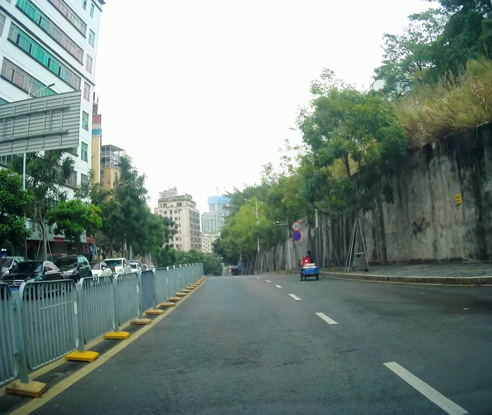
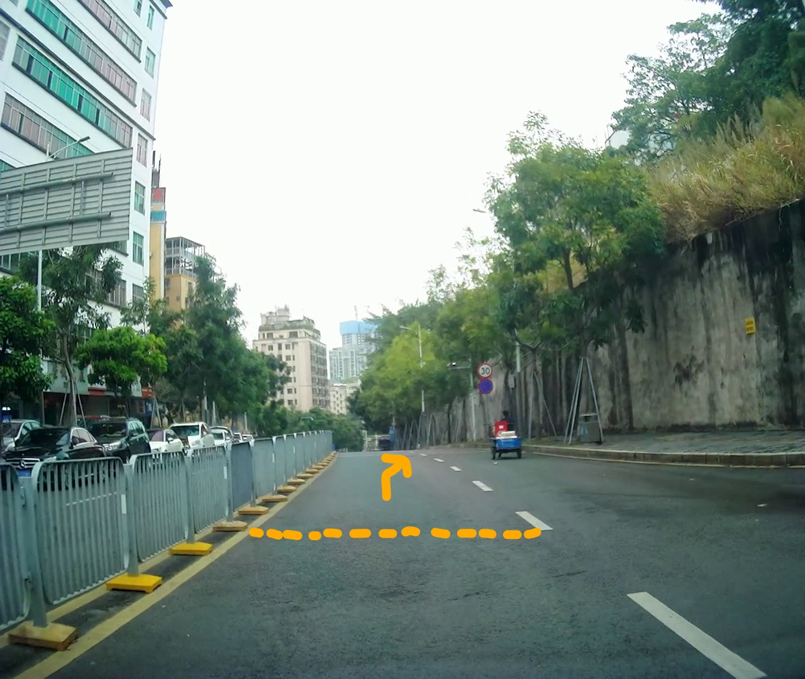
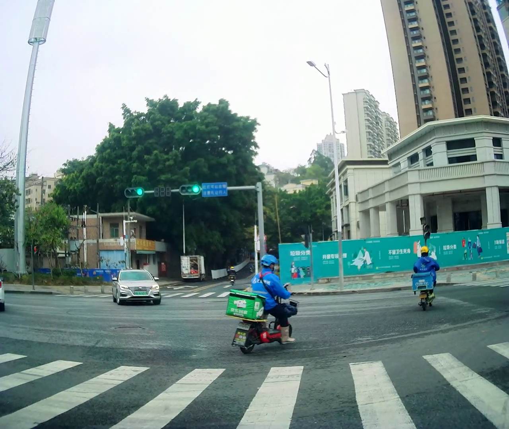
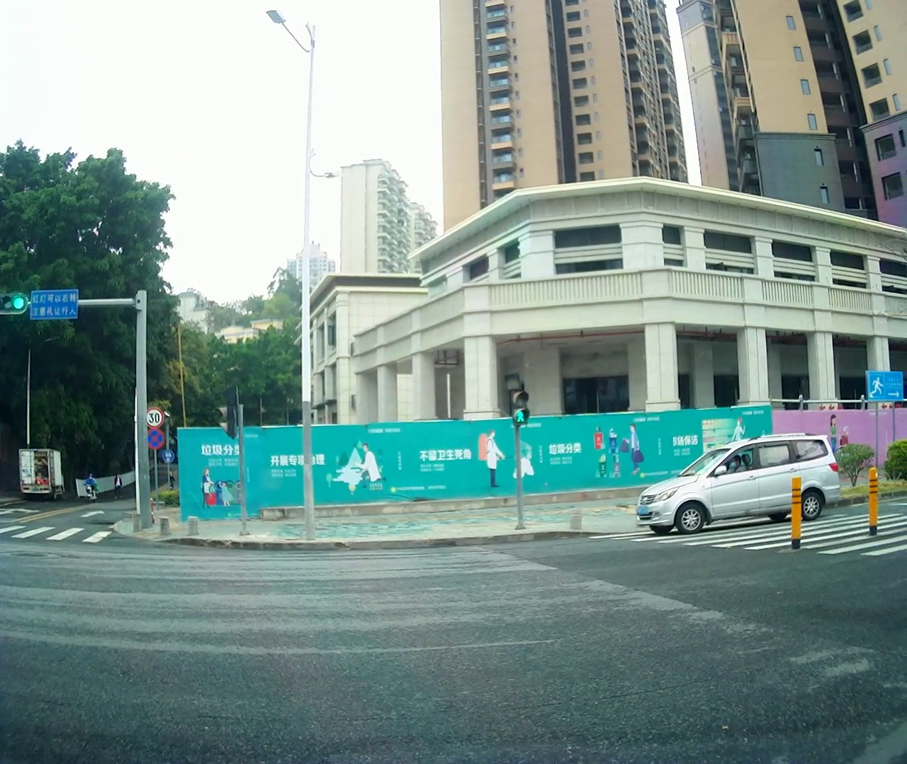
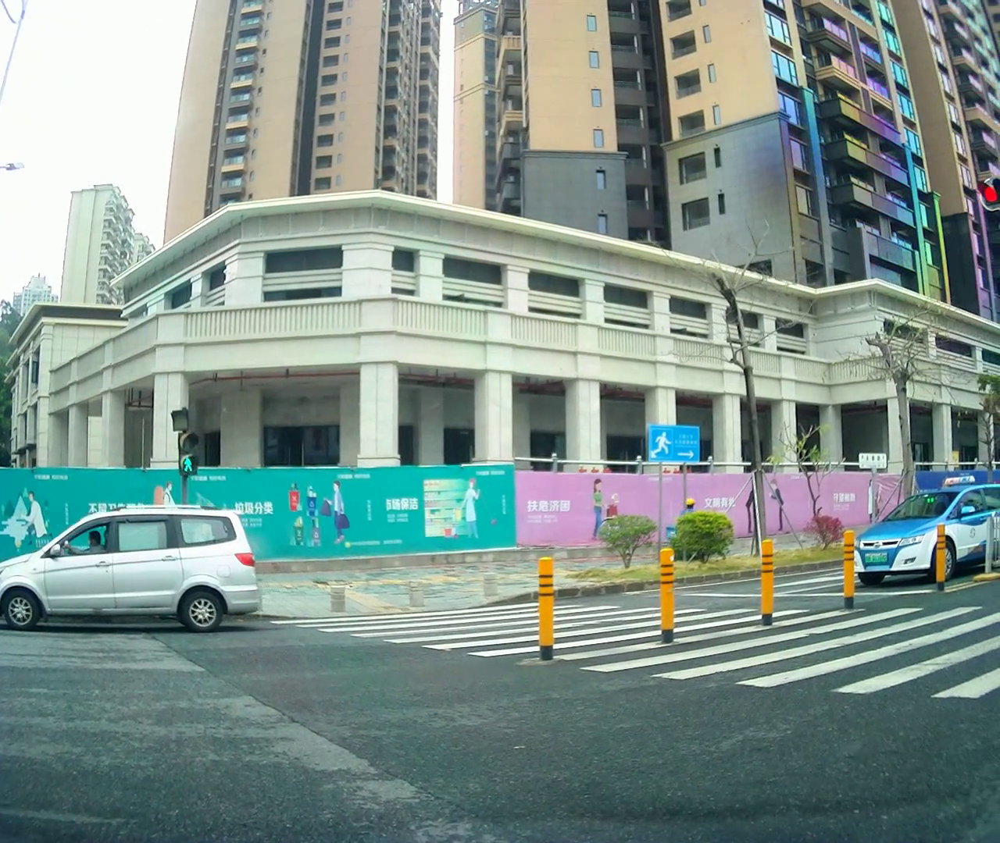
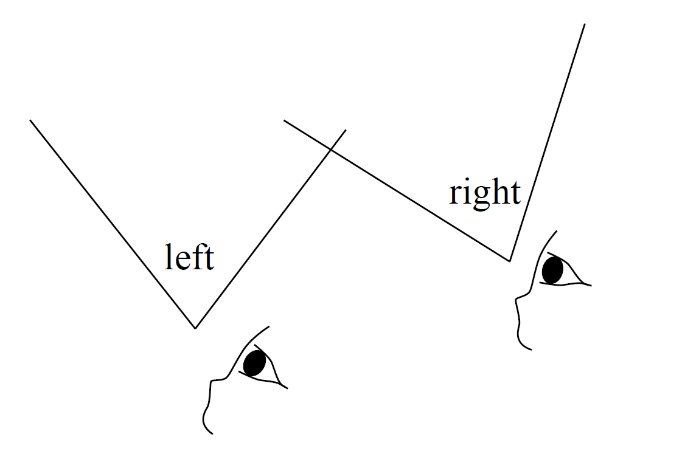
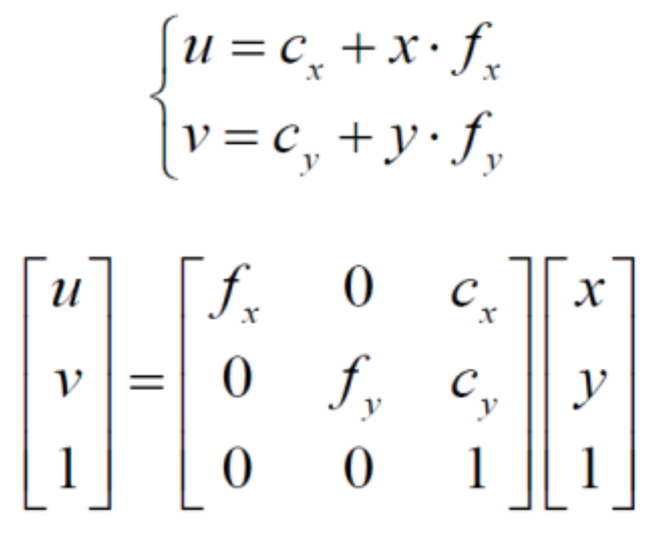

# VO原理串讲

- 草稿：右转箭头流程
- DF-VO属于vo论文中的哪一种

思路：方案是什么，遇到的问题是怎么产生的，如何解决的，解决效果如何

#### 为什么需要 vo？在我们的项目中 vo 能起到什么作用？

为了方便理解，我们举个例子，比如说导航 API 告诉我们“请走最右侧车道”，这时候如何生成右转的箭头呢？

要想生成右转的箭头的话，这个过程可以被分为几个步骤：（流程图）

1. 输入：单目摄像头采集到的图像（用一张采集图举例）
2. 识别图像，通过图像分割，找到最右侧车道，根据一定规则（比如说找到路边线、车道线）找到AR的图标应该创建在哪里，创建图标位置，并创建图标
3. 图标创建之后，在图标移动到视野之外之前，因为车在移动，所以需要不停的更新图标的位置。更新的时候，相对于地面来说，车的位置是动的，图标的位置是不动的，例如上面这张示意图，黄色的是右转图标。右转图标在创建的时候，创建在这个路标旁边的位置，那么当我们的车继续向前行驶的时候，比如从当前位置行驶到这条黄色虚线的这段距离，是要保持右转箭头的位置不变的，也就是说右转箭头始终相对地面静止，随着车的前进**看上去**会离车越来越近。那这个时候，车和图标它们有一个相对的运动，要计算出图标应该显示的位置。就需要我们重新建立视空间的坐标系，需要用到 vo。vo 用来估计车的相对运动，以及车的姿态。

下面来具体说一下 vo。

#### 什么是 vo？vo 的原理？

通过相邻的两帧，估计运动，获得位姿。

视觉里程计关心相邻图像之间的相机运动，最简单的情况当然是两张图像之间的运动关系。例如，当看到后两张图时，我们会自然地反应出右图应该是左图向→旋转一定角度的结果（在视频情况下感觉会更加自然）。我们不妨思考一下：自己是怎么知道“向左旋转”这件事情的呢？人类早已习惯于用眼睛探索世界，估计自己的位置，但又往往难以用理性的语言描述我们的直觉。看到图2-8时，我们会自然地认为，这个场景中离我们近的是人行道的红绿灯，远处是树和楼房。当相机向右转动时，红绿灯在图像中移到了左边，楼房离我们近的部分出现在视野中，而左侧远处的树则移出了视野。通过这些信息，我们判断相机应该是向右旋转了。

但是，如果进一步问：能否确定旋转了多少度，平移了多少厘米？我们就很难给出一个确切的答案了。因为我们的直觉对这些具体的数字并不敏感。但是，在计算机中，又必须精确地测量这段运动信息。所以我们要问：计算机是如何通过图像确定相机的运动的呢？

图像在计算机里只是一个数值矩阵。这个矩阵里表达着什么东西，计算机毫无概念（这也正是现在机器学习要解决的问题）。而在视觉SLAM 中，我们只能看到一个个像素，知道它们是某些空间点在相机的成像平面上投影的结果。

当我们已经能够估计了两张图像间的相机运动之后，只要把相邻时刻的运动“串”起来，就构成了相机的运动轨迹，从而解决了定位问题。

##### 传统的 vo 算法是什么样的

因为 vo 的核心是根据图像估计相机运动，但是图像本身是一个由亮度和色彩组成的矩阵，所以需要想办法根据图像中的一些特点来进行运动估计。实际上这种方法就是特征点法，我们从图像中选取比较有代表性的点，这些点在相机视角发生少量变化后会保持不变，于是我们能在各个图像中找到相同的点。我们将这些点称作图像的特征（feature）。特征法是我们传统的 vo 算法。

另外还有基于深度学习的智能 vo 算法。我们的 df-vo 是基于几何的方法和深度学习的单目视觉里程表(VO)算法。它自称优于纯基于深度学习和基于几何的方法，但是据我观察，在将我们采集的视频作为样本时，效果没有它说的那么好。

讲一下传统 vo 算法与 智能 vo 算法的区别 就可以结合论文了（不讲细 细节拆下周工作量）

#### df-vo 效果&进展

效果图待写

#### 相机内参

5.1 相机模型

相机将三维世界中的坐标点（单位为米）映射到二维图像平面（单位为像素），这个过程能够用一个几何模型进行描述。这个模型有很多种，其中最简单的称为针孔模型。针孔模型描述的是，当一束光线穿过针孔之后，在针孔背面投影成像的关系。我们举一个简单的例子。

比如这张图，在一个针孔的前方有一棵树，整棵树透过暗箱上的一个小孔投影到一个二维成像平面。我们可以用这个简单的模型来解释相机成像的过程。

O为摄像机的光心，也是针孔模型中的针孔。现实世界的空间点P，经过小孔O投影之后，落在物理成像平面O′x′y′ 上，成像点为P′。设物理成像平面到小孔的距离为f（焦距）。

我们说，计算机视觉的首要任务就是要通过拍摄到的图像信息获取到物体在真实三维世界里相对应的信息，于是，建立物体从三维世界映射到相机成像平面这一过程中的几何模型就显得尤为重要，而这一过程最关键的部分就是要得到相机的**内参和外参**。

世界坐标系到像素坐标系需要经过三次矩阵的连乘，矩阵里面的参数就是我们需要标定的东西。

- fx, fy 是两个方向上的焦距。
  - 我们的 adas 摄像头焦距（像素）是 1388.8，暂时将两个方向上的焦距都设置为这个值。

- cx, cy 是中心点，即光轴穿过的那个点，值约等于像素/2。例如，1280*1024 的 cx，cy 实测是 639，543
  - 相片的分辨率是 1280*1080，因此我们的 cx，cy 应该在 640, 540 左右。