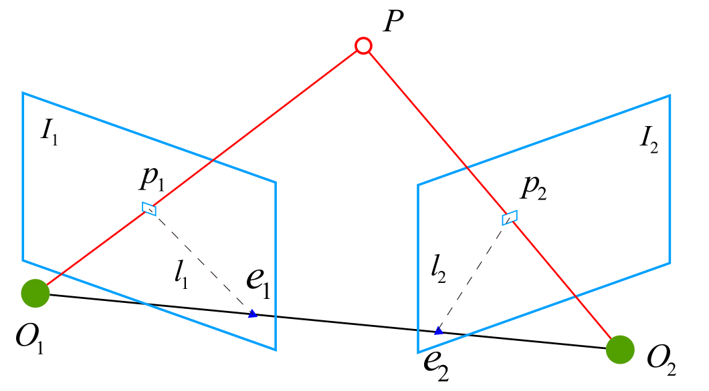
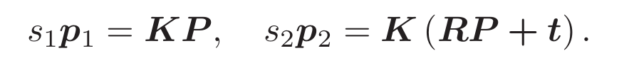

- 目标：计算相机的运动

- 前置知识：特征点、特征匹配

  - 特征点：是图像中一些有代表性的点，用于根据图像估计相机运动。从图像中选取有代表性的点，希望特征点在相机运动之后保持稳定。
  - 特征匹配：确定当前特征点与之前看到的特征点之间的对应关系。

- 计算相机运动的方法

  - 单目相机的情况：2D-2D，对极几何

  - 通过配对好的“特征点”的配对关系（同一个空间点在两个成像平面上的投影），恢复出两帧图像之间的运动。原理是对极几何。

    

  - 两个像素点 P1，P2 的像素位置关系可以用 R（旋转信息），t（平移信息）来表示

    

  - 对极约束

    - 基础矩阵 F
    - 本质矩阵 E

  - 相机运动的计算过程，要先根据配对点 P1, P2 的像素位置求出 E 或 F，然后根据 E 或 F 求出 R, t