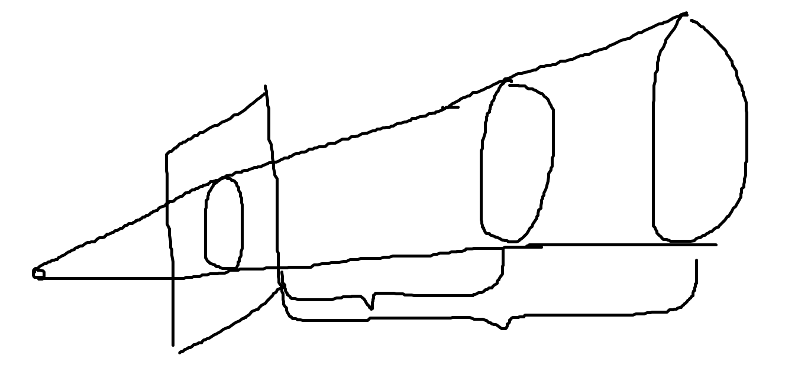
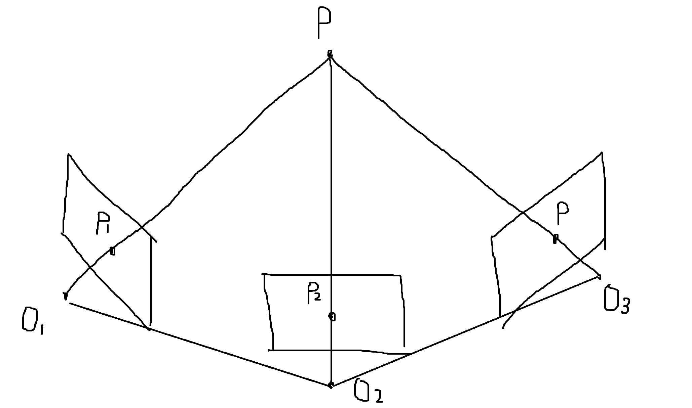
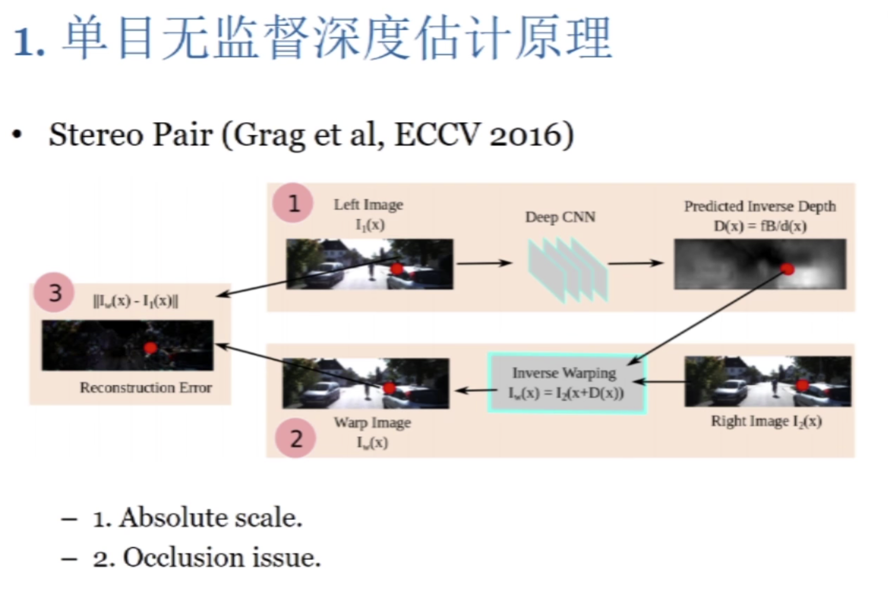

# DF-VO 如何解决尺度不一致问题

### scale 问题

- scale ambiguity 尺度不确定：A,B之间和现实之间的关系（除非用手工测量）。首先第一点，它没有绝对尺度，这就是尺度奇异问题，是指，我们但从照片上是无法恢复它到真实世界的大小关系的，所谓尺度，它其实就是一个单位。你如何把你计算出来的 depth 单位和真实世界中的单位统一起来？如果想要得到两个相机之间的相对距离，有一种方法是手动测量的，所以因为有了这个信息，神经网络输出的 depth 和真实世界是一样的，它输出的 1 代表的就是真实世界的 1，所以这是一种绝对尺度的方法，而后面的算法，由于没有 baseline，也就是说没有人手工去量两个摄像机移动之后他们两个的具体距离是多少，因为没有这个信息，他也没办法把他估计出来的 depth 跟世界坐标系统一起来，没有办法进行转换，所以这就是一个尺度未知的问题。

  

- scale inconsistency 尺度不一致：任意的相邻图片之间的尺度不一致，每个样本不能画到同一个坐标系下（例如，A,B之间和B,C之间的关系）。首先，第一点是因为尺度未知，每一个 depth 估计出来的尺度，它都是未知的，完了之后呢，它在每一个训练样本上都是单独训练的，最后训练出来在每一个训练样本下的 depth 都是未知的，而且训练样本之间没有关系，就是说虽然每相邻的两帧都能输出一个 depth，它们都是 depth，但是大家的单位不一样，那单位不一样的这些 depth，你就没有办法去对比，不能换到同一坐标系下，这样的话你去做 slam 那些东西肯定是不行的，就是没有办法集成起来。

  

？？DF-VO没有解决尺度不确定问题，它只解决了尺度不一致问题。

### DF-VO 如何解决尺度不一致问题

Solution 1：有一种办法是在做训练的时候，用双目摄像机做样本来训练，因为双目摄像机是可以引入已知的 baseline 信息的，也就是说两个摄像机之间的距离是可以通过测量得到的，这就建立了计算结果与真实世界之间的联系。然后可以用单目摄像机做 predictions。

Solution 2：利用不同的两两图片之间 depth predictions 不一致，而 depth 本身是一致的。通过用 geometry consistency regularizatoin，解决了尺度不一致的问题。

相当于将图像做了一个扭曲，我们希望在 view-i 预测的深度和在 view-j 预测的深度相同，这就像将图像从 view-i 正确的扭曲到 view-j。

为了避免 occlusions（在 view-i中出现的物体，在view-j中没有出现） 和出框，我们用取最小代替了取平均

### 参考

- [bilibli-无监督且尺度一致的深度估计与视觉SLAM](https://blog.csdn.net/weixin_40512640/article/details/103428080)
- https://arxiv.org/pdf/1903.00112.pdf
- https://papers.nips.cc/paper/2019/file/6364d3f0f495b6ab9dcf8d3b5c6e0b01-Paper.pdf [[中文笔记](https://zhuanlan.zhihu.com/p/212497013)] 注意，此论文只解决单目的尺度不一致性，但是对于真实的尺度因子（估计深度和真实世界深度的比值）是无法给出的，这是理论的限制（scale ambiguity）。

