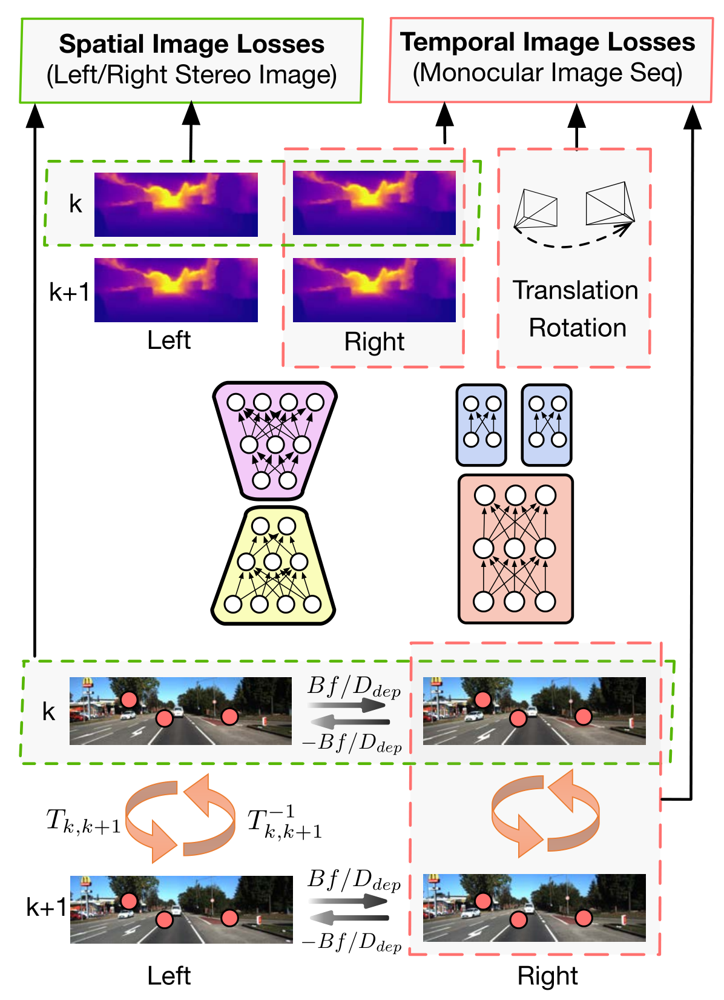

use deep neural networks to estimate **6-DOF pose**

特点：

- 无监督
- absolute scale recovery

train by using stereo image pairs to recover the scale, but test it by using consecutive monocular images

之前的有监督的学习需要 ground truth 的标准答案，但是带有标签的训练样本太少。

本文的 depth estimator 用的是 encoder-decoder architecture

本这篇文章提出的方法主要有2个突出的特点：一是非监督的深度学习策略，二是能得到绝对的尺度。它在训练的时候，用的是连续的双目摄像头采集到的图像，而在测试的时候，只需要连续的单目摄像机的图像就可以了。（在这里，它为什么用双目训练，是有原因的，因为这些有标注的ground-truth数据难以获得，数量少，所以用双目来恢复深度信息）所以我们说，UnDeepVo是一个单目的系统。它的loss function是基于spatial and temporal dense function的。

首先，如果想用单目视频预测出绝对的尺度，就要在训练的时候让使用的训练样本带有绝对的尺度。想让训练样本带有绝对尺度，有两种方法，一种是把带有真实相机姿态或者深度的图像用来做训练样本，来进行有监督的训练，但是因为现有的带标签的数据集较少，而且如果通过人工标注的方法来生成这种ground-truth的数据集的成本很高，所以这种有监督的学习在实践中是受到了一些限制的。因为有了这些困难，所以产生了另外一种训练方式：使用没有标注的双目视频来训练，因为没有标注的双目视频样本易于获取，所以训练起来更方便。

因为要预测 R 和 t，所以它设置了两个 estimator，一个是 pose estimator，一个是 depth estimator。我们主要想看它怎么解决 scale ambiguity 问题的，所以我们主要来关注下它的 depth estimator。

##### depth estimator 原理

depth estimator基于encoder-decoder架构，来生成dense depth maps（稠密的深度图像），直接预测深度地图。

训练的时候肯定要有一个训练目标，目标就是让损失函数的值最小。损失函数是根据geometric constraints来构建的，来取代之前的labeled data。在训练中，我们给神经网输入左右影像来分别得到左右序列的位姿值和深度值，然后用输入的立体像对，估计的深度图和位姿值，再利用立体影像序列的空间和时间上几何几何一致性来构建损失函数。

它的total loss分为两部分：

- spatial image loss，between left-right pairs，空间上的几何一致性，指左右影像对上同名点的重投影几何约束。用双目的图像对，知道两个相机之间的距离之后，可以得到一个预测出的深度图像，然后将左右两张图片进行合成，根据一种我没有看懂的 spatial transformer，定义了损失函数。另外，分别用左单目序列预测出来的结果和用右单目序列预测出来的结果在理论上应该是相同的，我们把这两个结果之间的 diff 也作为总的 loss function 的一部分。
- temporal image loss,  forward-backward, 时间上的几何一致性，指单目序列影像之间同名点的重投影几何约束。

最后一起最小化这些限制下的损失函数，UNDeepVO能以端到端的方法实现真实尺度的位姿和深度估计。

参考：

https://blog.csdn.net/weixin_37598106/article/details/90655000

https://cloud.tencent.com/developer/news/210831