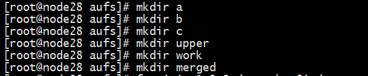
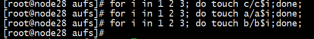
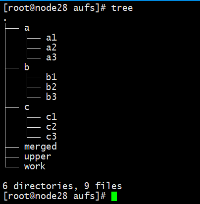
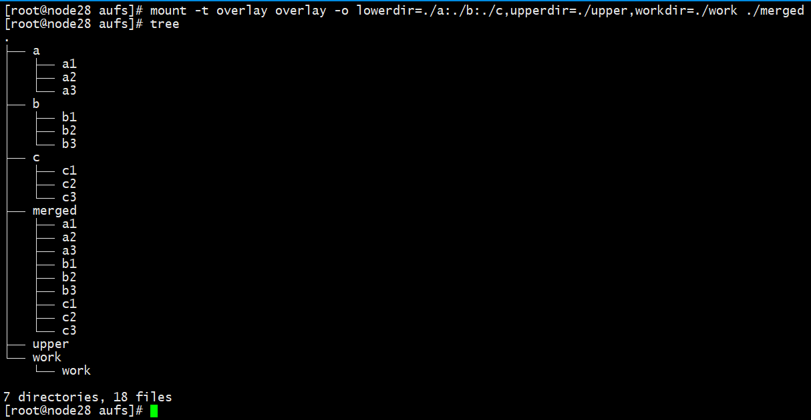
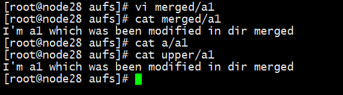

# docker

NVIDIA Container Toolkit 装好了怎么用？

需要装 containerd 吗？它不是安装docker的时候自带的吗？在文档中docker，containerd，podman为什么是并列的？

哦。因为NVIDIA Container Toolkit支持上述三种，我们只要装docker就够了。

下一步看下 user guide

```
docker run -p 8887:8887 -it -d nvidia/cuda:11.0-base
docker run --gpus all -it -d nvidia/cuda:11.0-base
# rm参数啥意思？运行之后立马结束？
docker run --rm --gpus all -it -d nvidia/cuda:11.0-base
docker run --rm --gpus all nvidia/cuda:11.0-base nvidia-smi

docker start 104
docker exec -it 104 /bin/bash
source ~/catkin_ws/devel/setup.bash
```

如果我们浏览Docker hub，能发现大多数镜像都不是从头开始制作，而是从一些base镜像基础上创建，比如debian基础镜像。而新镜像就是从基础镜像上一层层叠加新的逻辑构成的。

有没有 ros-kinetic 镜像？有。https://hub.docker.com/r/mjenz/ros-kinetic-desktop-full/

然后它的基础镜像是什么？还需要ubuntu吗？

写一个 dockerfile？

```
# ros镜像的linux版本
root@10487e6a796e:/# lsb_release -a
No LSB modules are available.
Distributor ID:	Ubuntu
Description:	Ubuntu 16.04.7 LTS
Release:	16.04
Codename:	xenial
```

他们两个，谁是基础镜像？看下doc

docker不能同时依赖多个基础镜像，只能依赖一个，那 NVIDIA Container Toolkit 有卵用？

https://github.com/craymichael/ros-kinetic-nvidia-docker

千言万语，不如看官方文档：https://docs.docker.com/get-started/

ceres-solver 下载不下来，github 搜了一个下到本地，然后传到了 gitee，才 clone 了下来 https://gitee.com/hanquanhq/ceres-solver-copy。然后需要安装 ceres-solver。

[unable to locate package install libatlas-base-dev](https://askubuntu.com/questions/507788/ubuntu-14-04-unable-to-locate-package-install-libatlas-base-dev)，apt update 更新一下试试

也有人说

```
sudo add-apt-repository universe
sudo add-apt-repository main
sudo apt-get update 
```

有时间改一下国内镜像吧，这 ros 的镜像和原始镜像不太一样，谨慎修改，提前备份。不过 不 install ros 内容的话，改了影响应该不大。

docker 镜像中没有 vim，但是是有nano的

2021-10-26

```
解决中：Eigen3 not found by cmake on Ubuntu
```

https://github.com/ceres-solver/ceres-solver/issues/541

 According to [this repo](https://github.com/gaoxiang12/slambook2/tree/master/3rdparty), the solution is to go back to an old version of ceres-solver. In other words, I just do `git reset --hard e51e9b46f6` and then (after installing dependencies) just cmake and make install.

gitee username=hanquanhq pwd=g6710xxxxx


```
解决中：cmake 没有找到 gflags, glog -> 文档看串行了 少装了软件 sudo apt-get install libgoogle-glog-dev libgflags-dev
```

```
make -j3 编译完成 有时间看一下cmake怎么写的，编译有哪些参数
make test & make install 又是在干啥？
```


docker 可以给镜像建立快照吗？

怎么把本地文件上传到docker上？

### 容器虚拟化怎么实现的？

##### linux namespace

##### OverlayFS

Docker 官方文档：https://docs.docker.com/storage/storagedriver/overlayfs-driver/

```
sudo apt-get install ros-kinetic-cv-bridge ros-kinetic-tf ros-kinetic-message-filters ros-kinetic-image-transport
```


找不到 launch 文件：https://zhuanlan.zhihu.com/p/94971196 解决方法：重新 source 一下。（尝试添加bashrc失败，执行了但是无效，不知道为啥）

【微信分享】林帆：Docker运行GUI软件的方法https://www.cnblogs.com/panpanwelcome/p/12877902.html

[Failed to connect to Mir: Failed to connect to server socket: No such file or directory](https://askubuntu.com/questions/871092/failed-to-connect-to-mir-failed-to-connect-to-server-socket-no-such-file-or-di)

`Docker`官方提供的`Ubuntu`镜像都是没有图形界面服务的。需要在容器中安装[X11(X Window System)](https://baike.baidu.com/item/X11/10166334?fr=aladdin)，然后将主机`DISPLAY`环境变量传入容器，即可实现容器`GUI`软件的显示


# [一篇文章带你吃透 Docker 原理](https://www.cnblogs.com/michael9/p/13039700.html)


# docker底层原理：overlayFS介绍与实践

> 参考：[docker底层原理——overlayFS介绍与实践](https://xdushepherd91.github.io/2019/11/05/overlayFS%E4%BB%8B%E7%BB%8D%E4%B8%8E%E5%AE%9E%E8%B7%B5/)

### 概述

在docker底层原理的学习过程中，接触到了UnionFS的概念。

UnionFS，顾名思义，是联合文件系统的意思。那怎么个联合法呢？举个简单的例子：
假设，我们有两个文件夹A和文件夹B，A文件夹下有文件a1,a2,a3,B文件夹下有文件b1，b2，b3。
我们通过创建一个文件夹C，并且使用UnionFS，使得我们可以再C文件夹下可以直接访问a1,a2,a3,b1,b2,b3。
这样我们就把A文件夹和B文件夹联合起来了。

当然，在实际的实现过程中，概念会更多。

UnionFS的实现是比较多的，目前docker中使用的UnionFS的实现是overlay2，而我在网上找到的相关资料并不多，处于好奇，专门对其进行了一些实际操作，并记录下来。


### 简介

overlayFS允许一个可读写的目录覆盖在多个只读的目录之上，这些目录就构成了多个层(layer)，而当我们在联合起来的目录中工作的时候，
我们所有的写入操作最终都进入了最上层的读写层目录中，这一点我后续会通过命令展示。

overlayFS与其他的unionFS的实现最终要的不同在于，当一个文件打开之后，所有的操作都直接和底层的文件系统打交道，这样可以保证操作的
性能。

在Linux kernel 3.18之后，overlayFS已经集成到内核中去了。我们在该版本之后的Linux内核中，不需要安装，就可以开始使用overlayFS了。

### 使用

#### 可读写的联合文件系统

我们使用如下命令来挂在一个overlay文件系统

mount -t overlay overlay -o lowerdir=/lower,upperdir=/upper,workdir=/work /merged

其中，

1. lowerdir的值可以是一些的文件夹列表，使用:分开,这些事只读层。
2. merged文件夹是最终联合起来的文件系统，我们可以在merged文件夹中访问所有lowerdir和upperdir中的内容
3. 在merged文件夹所做的所有修改，最终都会存储到upperdir目录中
4. workdir指定的目录需要和upperdir位于同一目录中
5. 文件的覆盖顺序，upperdir目录拥有最高覆盖权限，lowerdir按照mount时从左到右的顺序，权重依次降低，左边的覆盖右边的同名文件或者文件夹。
   注意，覆盖仅仅在mount时按照此顺序，一旦mount成功后，按照文件出现的早晚覆盖，出现早的会屏蔽出现晚的同名文件。除非修改是在merged目录中进行。

#### 开机自动挂载

在/etc/fstab中实现自动挂载的格式如下，本人暂未实践

overlay /merged overlay noauto,x-systemd.automount,lowerdir=/lower,upperdir=/upper,workdir=/work 0 0

#### 只读联合文件系统

mount -t overlay overlay -o lowerdir=/lower1:/lower2 /merged

### overlayFS相关演示











### 总结

overlayFS可以在多种应用场合中使用，我们这里关注在docker中的使用方式。
在docker中个，多个镜像可以看做是多个lowerdir，只读层，当我们启动一个容器的时候，使用overlayFS将多个镜像
联合挂载到一个目录，并使得容器中可以对目录中的文件进行读写操作，但读写操作仅仅会影响到当前容器的upperdir和
当前目录，并不会影响到镜像中的数据。

### 参考链接

[Docker技术三大要点：cgroup, namespace和unionFS的理解](https://www.jianshu.com/p/47c4a06a84a4)
[Overlay filesystem](https://wiki.archlinux.org/index.php/Overlay_filesystem)
[Docker技术原理之Linux UnionFS（容器镜像）](https://blog.csdn.net/songcf_faith/article/details/82787946)
