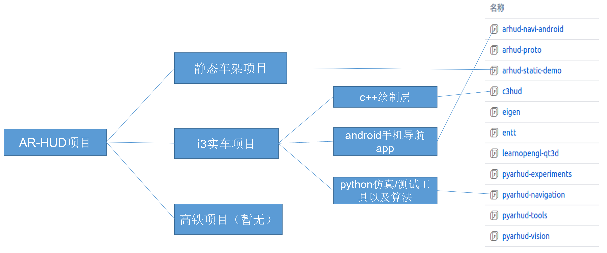
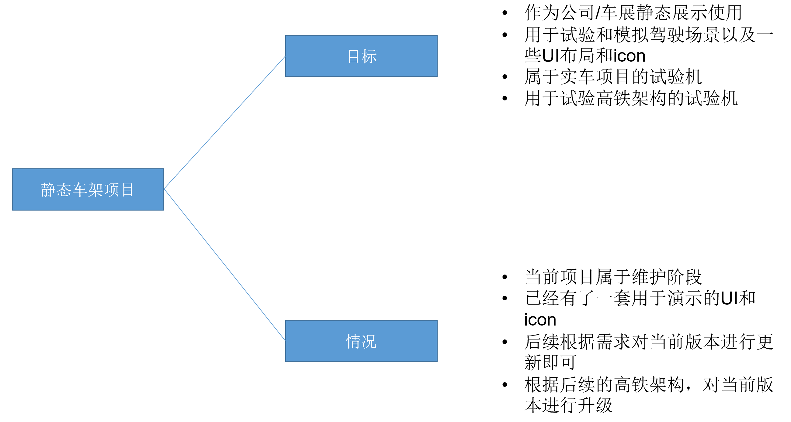
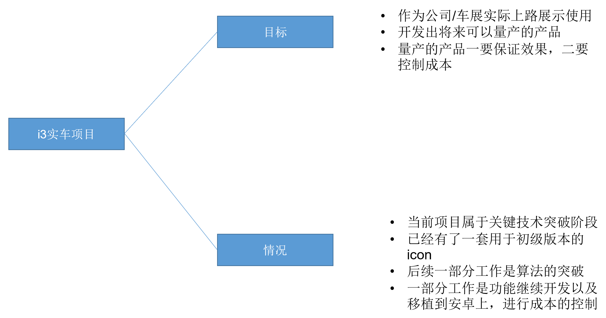
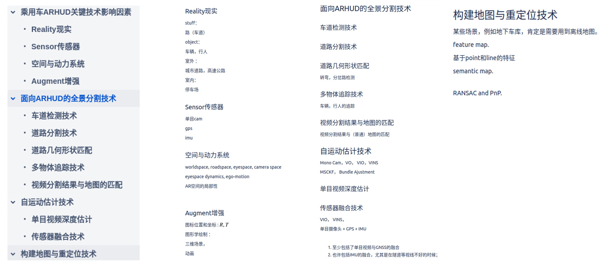
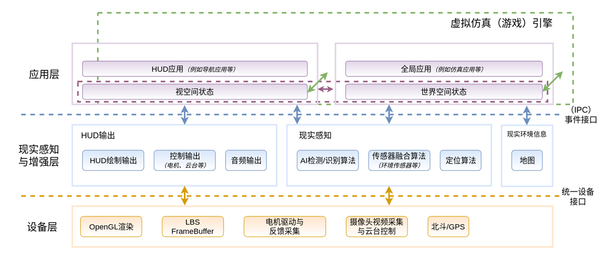

# ARHUD项目情况简介

### 术语定义

|      | 术语        | 缩写 | 术语解释                     |
| ---: | :---------- | :--- | :--------------------------- |
|    1 | AR          | AR   | 增强现实（Augment Reality）  |
|    2 | HUD         | HUD  | 抬头显示（Head Up Display）  |
|    3 | I3车载ARHUD | I3   | 宝马i3车载增强现实的抬头显示 |
|    4 | C3-ARHUD    | C3   | 高铁增强现实的抬头显示       |

### 项目总体情况简介

ARHUD 项目分为静态车架项目、i3 实车项目、高铁项目。

##### 静态车架项目

##### i3 实车项目

### 项目已完成情况介绍

##### 项目的几大关键技术

##### 项目总体技术架构

- 绘制准确度 和道路贴合
- 演示内容：直行、定点显示、人行横道，slowdown
  - 道路信息：需要识别车在哪个车道上 算法来解决 数据源（视频/传感器），变道信息。车架上可以静态展示，实车没有走通
  - 车辆、行人的识别和追踪
  - 例如，距离右转弯还有多远开始绘制图标

车怎么知道自己的速度-前装方案，后装方案

SFM SLAM是实时的

为什么**视觉里程计vo**单目摄像头是关键技术之一

- 希望准确知道位置
- 为什么要视觉里程计，要不要结合 gps，为什么
- 道路前进方向 横穿道路方向 竖直向上方向
- 基于三维重建 输出时二维的 输入是二维的

基于图像的全景分割技术

创建和更新的过程

- 转弯；前方的车和人（路，不动，人动，前景，背景）

- 转弯的时候能标识右转箭头的位置（用户看到的）
  - 右转箭头、执行图标在饰界空间是不动的
  - 显示的时机

无人驾驶为什么需要重建世界空间：考虑局部性，考察图标的生命周期

道路有其特殊之处：用户需求决定的 有其特殊挑战 识别道路信息

更新取决于vo，创建取决于分割

下周任务：基于仿真器

地图构建和重定位技术

- 走一样的路：闭环检测