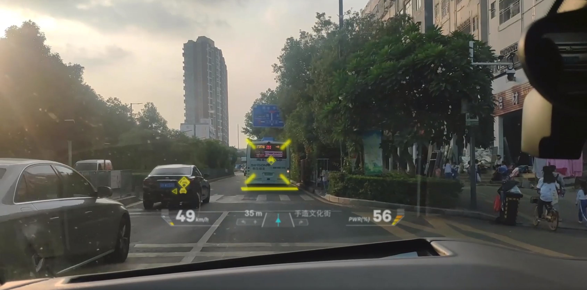

# 车载 ARHUD 项目概览

### 背景

[I3车载ARHUD的系统总体技术方案](http://140.143.45.184/wiki/pages/viewpage.action?pageId=23102464)

I3车载ARHUD要在12月底能演示部分效果，在明年3、4月份在指定路段进行稳定的路演。与此同时，设计思路以及软件架构要符合C3-HUD，达到同一套软件，只是应用场景不同，思路和架构要一致。

I3车载ARHUD的目标主要有以下三点：

1. 配合甲方在指定时间段完成演示效果（2020.12月底以及2021.3/4月全国路演）
2. 确定好软件架构，保证要兼容 C3-HUD （高铁）的场景，I3车载ARHUD下做好的架构和模块可以用来适配C3-HUD
3. 催生xconnect通讯中间件，使得xconnect向产品级进发，变得稳定可靠

##### 总体需求

I3车载ARHUD的系统总体需求如下：

1. 行人和车辆以及道路线的检测（ADAS算法）：能够检测和追踪行人和车辆，并在HUD上准确的进行绘制和显示
2. 直行和变道以及右转的指引（导航）：能够介入导航，根据导航信息或者车载传感器信息判断出车当前的即将进入的行驶状态，并在HUD上准确的进行绘制和显示，和当前真实的道路环境要匹配
3. 仪表盘的信息显示：HUD下放区域是仪表盘，仪表盘要显示部分导航信息（街道以及距离）、车辆本身的行驶信息（速度以及油耗/电耗）

针对上述总体需求，结合前期静态车架的软件系统的情况，对总体需求分析详见：[I3车载ARHUD的系统总体技术方案](http://140.143.45.184/wiki/pages/viewpage.action?pageId=23102464)