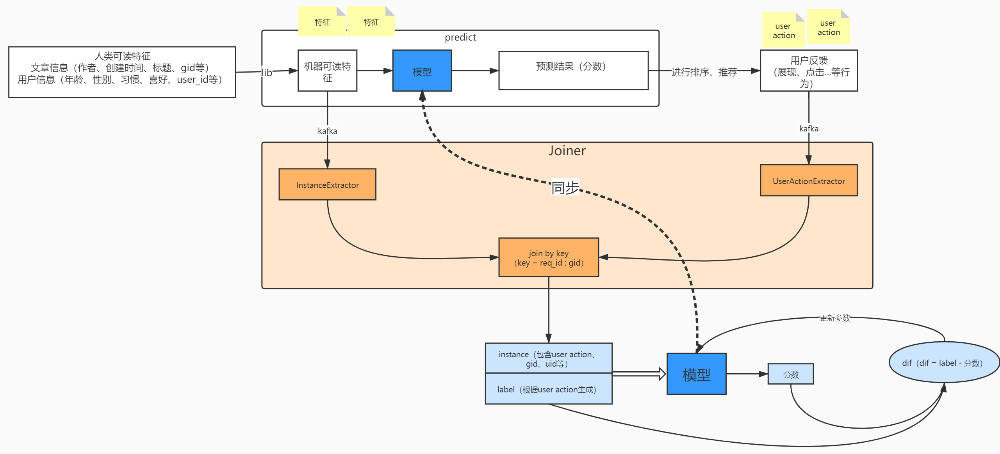
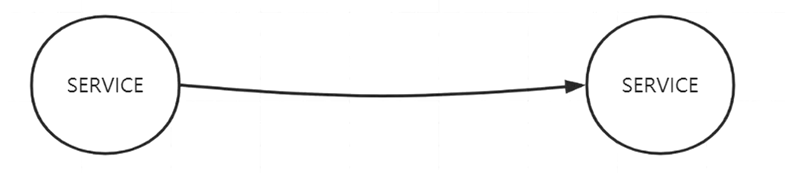
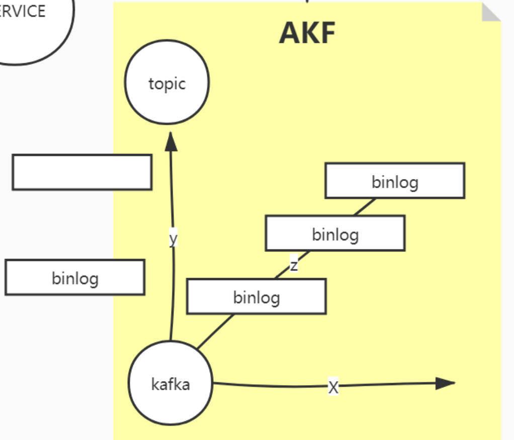
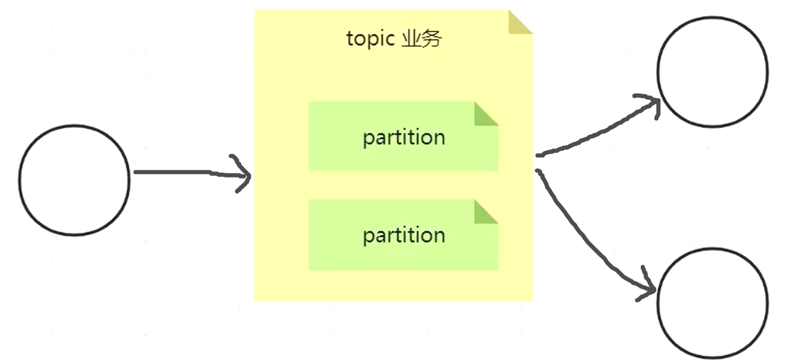
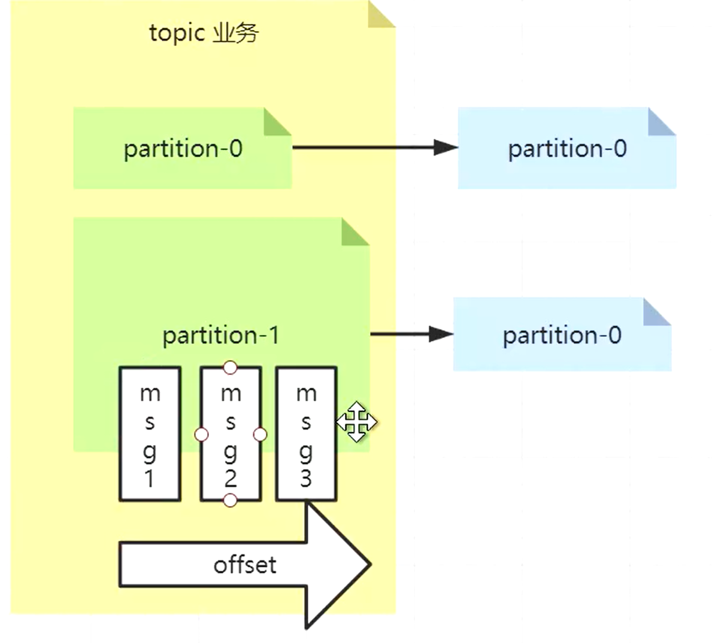
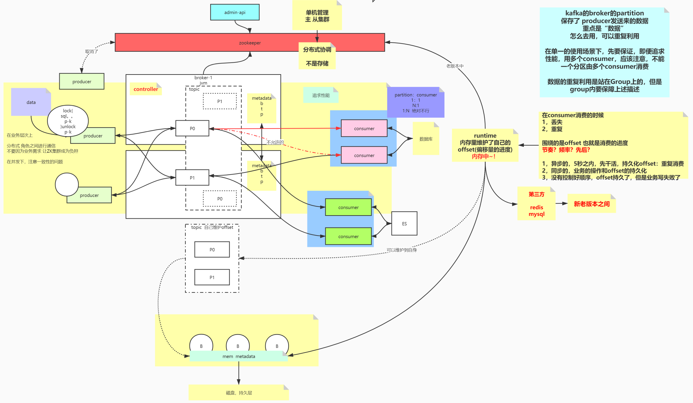

# Kafka串讲

今天很荣幸能有这样一个机会我们来做一个交流和分享，那今天我们主要的目标是想要跟大家分享一下 Kafka 在真实项目中的使用和原理方面的一些内容，还有后续的一些架构方面的思考。

那在开始之前呢，我给大家发了一个文档，相信大家已经有了一些简单的了解。如果没有时间听完的同学，可以简单地看一下这个概述。

今天我们分享的时间预计在 40 分钟左右。

### kafka 在推荐系统数据流中的作用

先对 kafka 有一个整体的概念（敏感信息已作处理），顺便分享一下推荐系统数据流。

我们来看这儿，首先推荐系统需要一些输入。那这些输入包括什么呢，主要分为三大类，分别是文章信息、用户信息，以及一些上下文信息。

上面我们说的这些信息都可以说是属于人类可读的特征。我们把这些信息输入到一个抽特征的库中，转化为机器可读的特征，然后输入给模型，之后会得到预测结果也就是分数。我们根据这个分数呢，对文章进行一些排序和推荐，然后把排序比较靠前的文章推送给用户，用户看到文章之后，如果比较感兴趣，就会点进去，然后也可能会写一些评论啊，点个赞，点个分享之类的，那这些用户行为我们都是可以拿得到的。所以我们会利用这些操作数据来进行模型的训练。这一块儿就是我们的推荐系统的整体流程。

那我们说，一个好的模型对于推荐系统是非常重要的，怎么才能得到一个好的模型呢，所以现在我们需要大量的样本来训练这个模型。我们知道，样本是由模型的输入以及标签组成的。

（双击大图）可以看到我们的推荐系统恰好就有这两个部分，所以我们可以直接的去复用它，不需要做重复的计算。我们把这两个部分放在队列中：模型的输入呢，它可以在存放特征的kafka队列中拿到，而标签呢，它可以通过对用户的行为进行转换之后拿到。

而我们这里的预测分数是可以通过机器可读特征这一个输入唯一确定的，所以它不需要独立作为一个输入。

现在我们我们有了模型的输入之后，需要对这两个输入，也就是**特征**和**标签**做一个拼接，让它成为完整的样本，才能发送给模型。所以我们需要一个服务，这个服务就是joiner。

但是我们会发现，**特征**是在处理用户请求的时候就可以拿到，而**用户反馈**呢**，**我们需要等用户做了操作之后才能拿到，也就是说这两个输入会有一个时间差。那正是因为特征和标签的到达时间不同，所以我们需要设置缓存对它们进行一个拼接。在这里，缓存的作用是，缓存先到达的部分，去等待后到达的部分。

有了缓存之后，我们自然而然地会引出一些新的问题。一个是由于内存的限制，我们不可能无限期的去等待一个用户。而且从另外一个角度，我们希望能够尽可能快的对用户的操作产生反馈，比如说用户刚才浏览了一些美食相关的内容，那后续我们给用户推送文章的时候就会比较倾向于用户的喜好，而不是说过了一个星期，或者说过了一个月之后，才开始给用户去推这些美食相关的文章。

那我们就想，怎么去设计这个缓存，才能解决这个问题呢，下面我们就来说一下。

首先我们说，在**理想**状态下，我们认为用户的所有行为都是在180s时间间隔内发生的（说白了就是用户一直在不停地点点点）。而从实际上来讲我们并不能提前预期用户的行为。比如说我们来假设一种情况，一个用户打开一篇文章之后，他去开会了，一个小时之后他开会回来，给这个文章写了一条评论。可能在我们这个例子里面一个小时不算太长，但是如果这个用户一天之后，甚至是一个月之后才回来呢，那怎么办，这种情况我们不可能无限地去等待这个用户。因为我们的内存是有限的，不能为每一个用户都去缓存无限长的时间，要不然内存会爆，所以我们有一个强制超时时间的机制，就是说从用户第一次请求开始，最多等30分钟，30分钟之内的操作，我们会收集到，30分钟以后的操作，我们就丢弃掉了。实际上这也是一个权衡的结果，我们是在**模型对于用户操作的反馈的及时性**和**数据的完整性**之间做出了一个权衡。那为什么把最长等待时间设置为30分钟呢，这是因为在实践中我们看到其实在等待时间为30分钟的时候已经可以完整地收集到绝大多数用户的全部操作了，如果再往后调整的话意义不是很大。

来举一个例子吧，可以帮助理解。

- （图：拖拽两个输入）我们回到这张图，这是文章的特征。在处理请求的时候，文章的特征就能拿到了，所以它会会先到达我们的joiner，作为一个样本。这边的user action是我们的用户操作，它作为另一个输入，到达我们的joiner。一个样本收到 user action 后，会等待 180s，如果没有继续收到新的 user action，那么它就会和已经接收到的 user action 一起被发送到下游；如果再等待期间我们收到了新的 user action，就会续期 180s 的等待过程。
- 前面我们也说过，我们的样本不可能无限期的去等待user action的到来，所以最长等待时间是30分钟，30分钟以后的user action会被丢弃掉。
- 这样我们既保证了能够及时将用户操作输入给模型拿到反馈，就是说模型可以快速地响应用户行为，又能尽可能高地保证了数据最终的完整性，收集到用户的所有操作。

（回文档 - 模型参数的更新）

上面的过程是在joiner中我们根据key对文章特征和用户反馈做了一个**聚合**的这么一个过程，聚合之后我们得到一个**样本**，我们把样本发送给模型。模型会计算出预测结果，然后后续的操作是：我们根据由userAction生成的label和预测结果之间的差别，去不断地更新模型的参数，并且把参数同步到线上的模型中，这样我们就让模型得到了更新。

**我们现在讲的是通用的解决方案。**还有一些具体的业务逻辑，这里就不详细讲了。下面我们开看一下 kafka，以及分布式架构模型的推导。

### kafka 初始：架构模型、角色功能梳理

kafka 的 what why how，先有一个粗略宏观的理解

rabbitmq、各种 mq 的技术选型、横向对比

首先，kafka 是一个消息中间件。我们从一个本质的点聊起，我们有一个系统 service，如果这两个服务之间直接调用的话，它们之间会相互约束，耦合性比较强，而且未来的拓展不好，一方有调整的时候，另一方会受到影响。

这时候我们加入一个消息系统，一方发送消息，另一方去取，就起到了我们所谓的消峰填谷以及解耦的效果。

现在我们聊的是消息的中间件，其实中间件包括很多，包括有存储的，有缓存的，他们的作用都有一个相通性，就是他们最终都会与分布式挂钩。

那说道中间件，会有几个词汇的需求：可靠的、可扩展的、高性能的等等，关于分布式对中间件大概有这么几个要求。在 redis 中，我们会有 AKF 微服务划分原则，那 kafka 和 AKF 划分有什么联系呢，等待会儿我讲完看一下效果吧，如果讲的不明白的话，后面排一个分布式系统划分分享。

我们先举一个简单的例子，然后去挑这个例子的毛病，把毛病挑出来之后，我们就知道为什么 kafka 会被设计成现在这个样子了。

现在我们假设，整家公司只有一个系统。所有消息被调用的时候，都被打到同一个单机队列中，这个时候确实能够达到我们常说的削峰填谷的作用，但是随着我们业务的增大，并发量的随之增大，这个单机的队列它会有**单点问题**，会有**性能问题**。这也是我们在使用很多技术的时候通常会遇到的两个问题。这是两个独立的问题，这两个问题我们可以独立的解决，解决方案也可以独立的应用，但很多时候我们会把他们整合应用。所以继续往下讲你们应该能找到这种感觉。

##### 性能问题

我们要先解决性能问题，因为 kafka 的关键词里面，先是 topic，然后是 partition，再是副本。

性能问题是怎么解决的？以 AKF 的角度来说，它有三个维度：

x 轴解决的是单点问题，是高可用的，y 轴解决的是业务划分的，z 轴解决的是分片、分治的。先把这个图放在这里，然后我们再细讲。

 

那我们如何把这三个轴对应到 kafka 的特性上，首先 y 轴将消息按业务划分，比如在一个电商系统，可以把订单拆出一个队列、用户行为拆成一个队列、广告推荐拆成一个队列。这样划分之后，不同业务的生产和消费都不会相互影响，业务之间的隔离性会比较好。而且按照业务划分之后，不同的业务数据会被部署在整个 kafka 集群中的不同的节点上，每个节点只关注自己的一套东西的话，资源的利用率会高。因此如果将我们上面说道的单机版的这个消息队列从逻辑上进行拆分的话，第一个拆出来的就是 topic，我们说的 y 轴其实就是 topic。你可以把 topic 就理解成是业务。

但是如果这么划分的话，假设说我的用户行为日志存在某个 topic 中，如果我的日志量太大了，如果全部存放在一个节点（中的一个进程）上的话，工作起来 IO 上会受限，而且单看自己它会有一个性能瓶颈。那怎么解决这个性能瓶颈，当我们已经进行过业务拆分之后，怎么再进行更细粒度的拆分，这时候就是我们的 partition。在一个 topic 下，会有多个 partition。

> 我们这个讲法可能会比较墨迹，是因为比较注重思路的推导这个过程，其实很多地方都有 AKF 这个思想，不仅是 kafka，还有 redis 也会涉及到 AKF，那在我们出去面试的时候，如果抓住这个内容的话，分布式和微服务都可以在这里面去聊。

那另外一个就是 partition，分区的概念。这个分区其实作用的就是我们的 z 轴，因为在业务使用的时候，假如说我们希望用 kafka 去存 用户行为日志，我们会期望把这些日志由一个变成多个，由多台机器，更大的能力去承载它。一般我们聊到 z 轴的时候，z 轴其实是对 y 轴一个细分，那细分的时候，可以使用的手段可以是 range，hash，或者是做一个映射，拆解的方案会有很多。

还是拿刚才推荐系统中收集用户行为的例子来说，我要把所有的用户行为日志打散到多台里面去，这个多台应该怎么打才合适？也就是说，当使用的数据从一个线性的队列散落到多个地方的时候，如何去保证前面的生产最后消费的数据的一致性？就是说，在以前没有分区的概念的时候，数据长什么样，我只需要按顺序一个一个推进来，这边取到的就是原有的样子。一旦一变多，会带来一致性的问题，那我们的生产方和消费方，如何组建这个先后关系，保证它仍然是有序的？

在 AKF z 轴划分的时候，如果你学过大数据，也可以引入分治这个概念了，大数据必然会有分治，也就是 map 阶段，map by key，也会有聚集 reduce，就是相同的数据要打到一起去，然后收集起来进行后续的处理，其实 kafka 中依然是这个原理。在生产用户行为日志的时候，有 展现，点击，收藏 三种不同的用户行为，只要他们各自有自己的顺序。也就是在分而治之的时候，将无关的打开，分散出去，将有关的放在一起，一定要保证顺序。

所以这时候，z 轴应该如何实现？要规划好整个数据路由，将无关的数据放在不同的 partition 中，这样我们就达到了一个后续无关数据的并行度。

无关的数据是可以并行计算的，如果有关的话，我们会需要在他们之间加上一个分布式锁，或者通过 log id 等方式去保证他们的顺序性，这样会变得很慢，所谓的并发最终还会退化为串行。所以我们希望将并行最大化，将无关的数据分散到不同的分区里，以追求并发、并行处理，有关联的数据，一定要按照原有顺序发送到同一个分区里。

> topic 是逻辑概念，partition 是最后物理的对应，一个 topic 下面有 partition 1,2,3...

然后我们看到还有一个 x 轴，这个 x 轴什么意思，x 轴做的是可靠性的保证。现在通过 y 轴和 z 轴，将这些消息打散到不同的分区了，实现的是计算的并行，提升了性能，但是这个时候，如果某一个分区消失了，挂掉了，这时候你堆积的消息会丢失，这时候需要我们给它做副本。在做副本的时候，我们横向走下这个过程。

无论 redis 也好，kafka 也好， 你像纯内存的 redis，它必须有一个持久化，他会认为磁盘是自己可靠性的来源，如果不在单机的维度，而是看**集群的维度**的话，单物理节点可能也会丢失，会挂，这时候为了解决节点的问题，我们还需要网络的维度提供可靠性，那 redis 就会有单机的持久化、网络的持久化，基于网络的主从复制集群。那他的主从复制集群就来自于它的 x 轴。其实 kafka 也一样，kafka 分区的数据会持久化到磁盘当中去，而且利用顺序读写这种高性能的磁盘 IO，x轴一般是出主机的、异地的备份，因为如果将全量备份放在同一个节点上意义不大。

x 轴的拆分会比较容易出现数据一致性、数据的同步问题，会有一系列分布式集群下的解决方案，比如 mysql 会有读写分离的策略，为了解决一致性和复杂性上的痛点，kafka 做了一个决策就是只允许在主片上增删改，从片只允许读。

**由单机到分布式，或者说由传统到中间件，基本都是按照这个思路来设计的。**我们用到的各种分布式中间件的实现，和 AKF 这一侧是有必然的这么一个参照和关联的关系的。

这些都是方法论，来推导出 kafka 中有 topic，partition，有序性的这些概念，然后我们再把有序性做一个延伸：下面我们来讲 offset

我们知道，分区内部是有序的（纯队列），分区外部是无序的，那这个顺序是怎么得到的？我们用 partition1 做一个简单的描述。假设我们的上游发来三个消息，msg 1,2,3，这三个消息会按照接收的顺序存在 kafka 队列中。当消费者来消费的时候，每个消费者会维护一个自己消费到的位置，也就是 offset。

> The **offset** is a simple integer number that is used by **Kafka** to maintain the current position of a consumer. That's it. The current **offset** is a pointer to the last record that **Kafka** has already sent to a consumer in the most recent poll. So, the consumer doesn't get the same record twice because of the current **offset**.
>
> **Offsets** in **Kafka** are stored as messages in a separate topic named '__consumer_offsets' . Each consumer commits a message into the topic at periodic intervals.

上面的例子中，只有一个 topic 和这个 topic 下的两个 partition，实际上企业中会有很多个 topic，每个业务下都会有很多 topic，每个 topic 下会有几百个 partition，如何去管理这些分布式的东西的一致性？在经验中，主从是管理成本最低的，它的协调成本会比主主要低，这样会引发一系列分布式协调的问题，包括选主，包括如何保证数据的一致性，常用的解决方案有 zookeeper，或者 etcd。那我们的 kafka 会依赖 zookeeper，主要是依赖它的分布式协调，不过要注意千万不要把 zookeeper 当做是分布式存储来使用。

##### kafka 对 zookeeper 的依赖

kafka 的 broker 依赖于 zookeeper

- 使用 zk 存储 broker 的元数据，将 broker 当做是一个进程。
- 使用到 zk 的选举机制

