# 环境搭建&仿真器运行

- 讨论记录：[2021-04-21-py仿真器如何运行](http://140.143.45.184/seafile/#group/5/lib/b487b4c0-fc2b-4a6e-8a48-ccc5f2f86503/项目讨论记录/2021-04-21-巩陆洋-py仿真器如何运行)

### ARHUD python 仿真器的作用？

因为实车测试的流程繁琐，测试周期长，且发现问题时不易复现，因此在我们的项目原型阶段，通常使用仿真器来测试模型的效果。仿真器是一个运行在 python 环境中的图形化界面，用来模拟实车上路时的输入（单目摄像头获取的实拍视频）和输出（司机视角摄像头拍摄的视频），方便我们进行帧级别细粒度的调试，从而快速测试和验证某个模型的效果。

测试数据由实车在某个路段上拍摄获得。

### 仿真器如何运行？

#### 1、添加测试数据

git 仅用来管理代码，不应该存放测试数据；测试数据被统一存放在 seafile 网盘 -> 仿真器数据 目录下，见下图。测试时，需要手动添加到项目对应目录，目录名称在 py 文件中指定。

在每一个日期目录下，均为一套完整的测试数据，包含不同视角下的视频文件和 json 数据文件，文件含义如下：

- adas.mp4 是向前的（单目）摄像头看到的视角
- hud.mp4 是司机的视角看到的，与模型的输出相结合，用来验证看到的实际效果
- mp4 文件对应的 json 保存的是每一帧的时间戳等信息
- navigation.json 是惯性导航提供的信息，目前没有用到
- 压缩包是将 hud 的视频解码成的一张张 hud 的图像。在验证的时候，会打一个调试窗口，先将司机视角显示出来，再将图标叠加，通过这种方式，验证图标是否显示在了正确的位置。

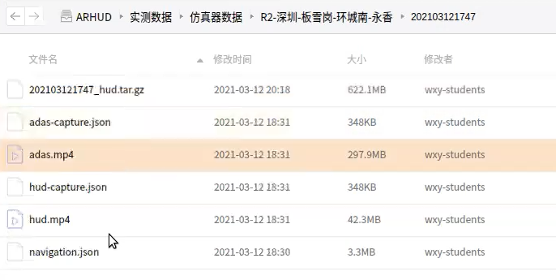

#### 2、仿真器的运行

首先切换到之前已经配置好的运行环境，`conda activate pyarhud`

直接运行 `run_simulation.py` 的话，会报错找不到 RouDi。RouDi 是我们的目前使用的数据总线，后面会迁移到我们自己开发的 xconnect。使用数据总线的目的是，当我们修改程序的一部分时，保证其他部分不受到影响。所以要先编译 ecal 生成 RouDi，顺便把 RouDi 放进环境变量中。

> ecal 是第三方提供的一个库，其编译产物 RouDi 用来进行消息发送
>
> - 官方文档：https://continental.github.io/ecal/development/building_ecal_from_source.html
> - 内网文档：http://140.143.45.184/wiki/pages/viewpage.action?pageId=23102976

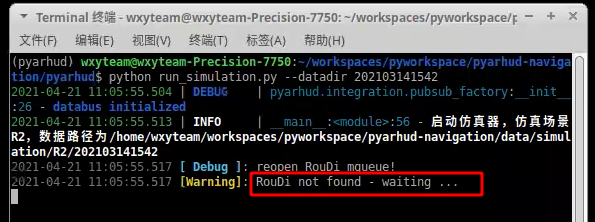

##### 为什么不通过多线程，而是通过跨进程的 IPC 形式实现？

因为整个系统是异构的，数据总线是 c++ 的，算法是 python 的（方便参考他人的实现）。由于我们的项目处于原型阶段，在关键技术研究清楚之前，我们不希望将大量精力投入在工程的实现和调整上，因此我们会希望在能够尽量减少对设备要求的情况下，快速的试验各种方案的效果。

我们希望验证的平台能做到：

1. 松耦合
2. 异构

另外，我们的导航目前是通过 tcp server-client 模式接入的，后面我们也会希望能够通过数据总线把它接进来。通信时，数据的格式通过 protobuf 3 定义。

我们追求通信的实时性，所以使用了共享内存，Roudi 就是我们的共享内存的数据总线。

运行方式是：直接运行 `RouDi`，它会分配一堆共享内存，等我们来接入其他模块。

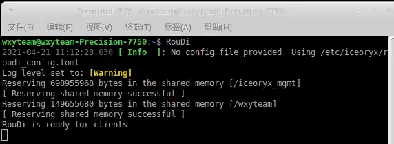

现在就可以运行我们的仿真器了。

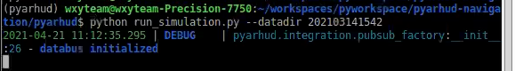

运行起来之后，仿真器的界面启动。

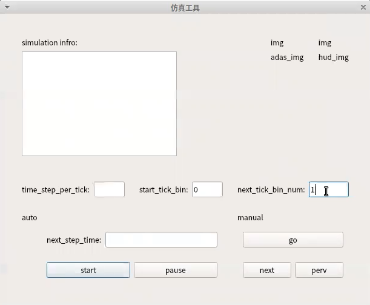

其中，time_step_per_tick 表示从哪个时刻开始，next_tick_bin_num 表示下一步跳多少个时刻。

后面一行的 auto 是自动模式，相当于一个时间暂停器。我们设置时间间隔为 30 ms，开始运行：

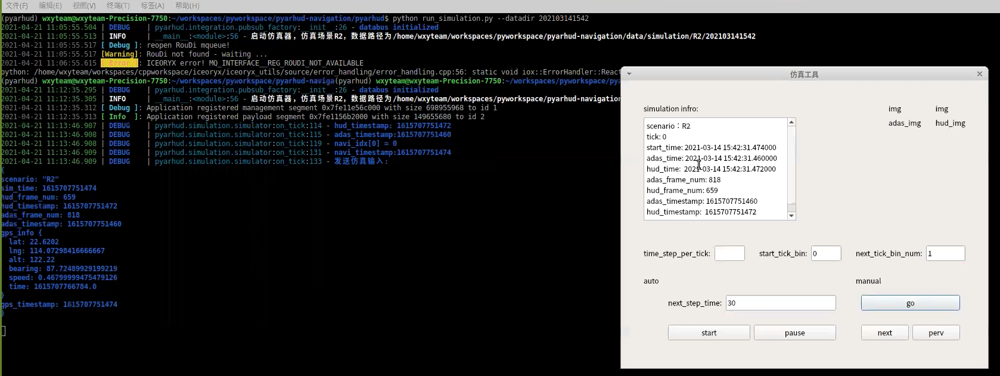

启动算法模块 run_vision_algorithms.py，其中 --sim 表示仿真模式。这个模块的作用是切割图片，由 adas 的输入，经过这个模块，可以知道车道线在哪儿。

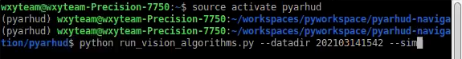

运行这个模块时，可以在命令行指定参数，除了 sim 之外，还有另外两种模式。

- sim：仿真
- video：不与环境配合，例如只看图像分割效果
- test ：路测

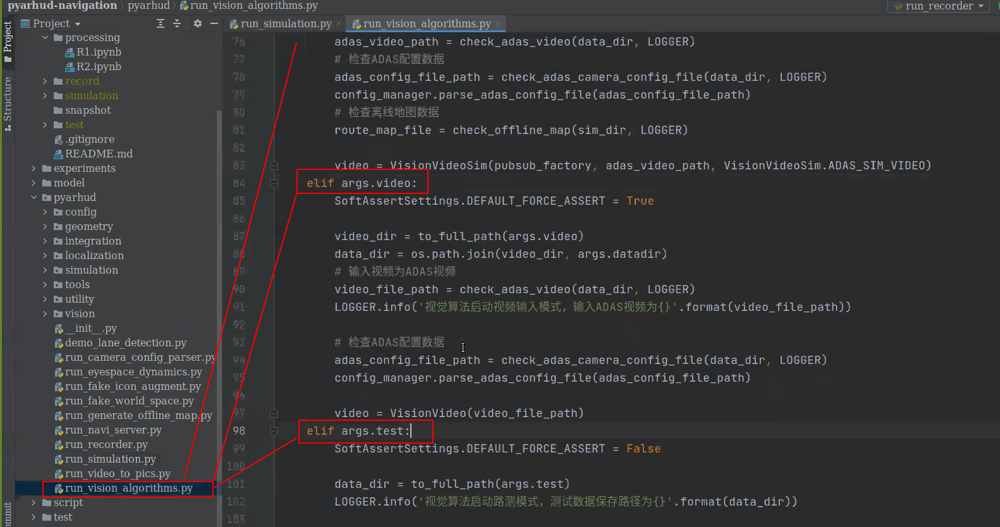

运行起来后，效果如下。仿真界面的 simulation info 输出了每一张图对应的的时间戳、帧数等信息。我们会希望 adas 的时间戳和 hud 的时间戳相同，但由于硬件的限制，无法保证其每一帧的时间戳都是完全相同的，会有微小的区别，并没有什么大的影响。

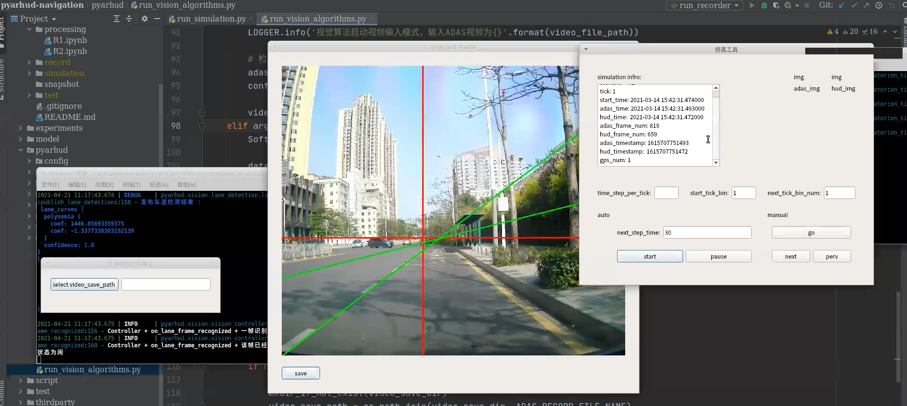

左下方的小图是切割出来的路提取出来的直线，通过计算得到直线的方程；上方的小图是映射到原来的输入的位置，是 adas 的输入。这样可以方便我们调试的时候停在某一帧，去查问题的原因（去分析：对为什么是对的，错为什么是错的）。

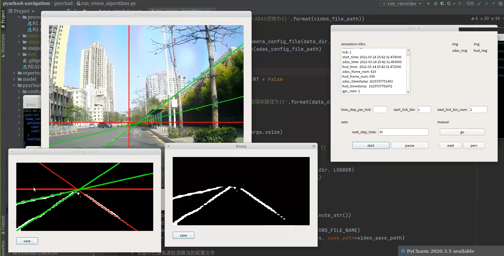

另外一个模块是司机视角的图像，启动方式如下。我们暂时用的是一个简单且凑活的算法，为的是能够快速看出效果，后续再迭代。

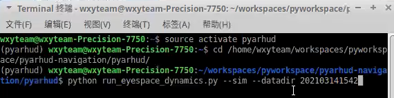

> GPS 给的是 LLA（经度、纬度、海拔）

图左是 adas 单目摄像头视角，图右是 hud 司机视角。adas 会比 hud 视野更开阔一些。红色的是灭点，绿色的是灭线。另外，受到投影设备的限制，我们可以投影到的区域大约是水平向上 20°角，不能更高了，而且在道路的无穷远点以上是天空，因此再向上移动图标意义不大。

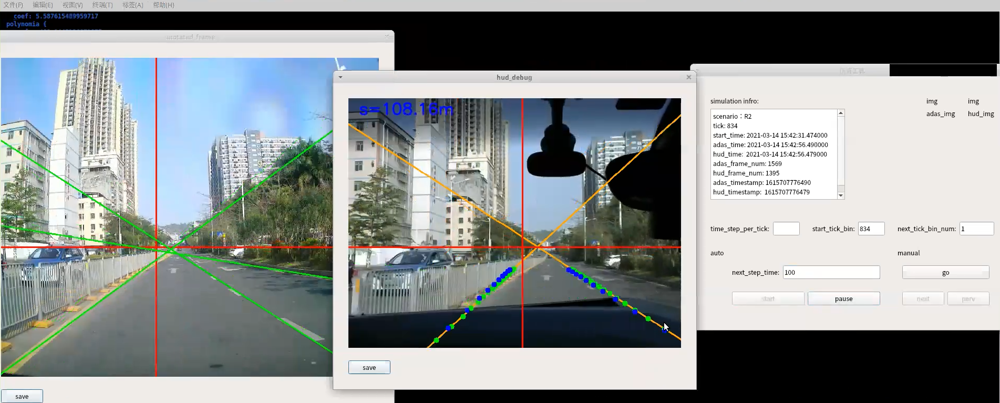

这些模型也需要训练，我们目前用的都是别人公开的训练好的模型。

至此，仿真器初步跑通了，后面我们可以用它来调试模型了。

## 其它

- debian 桌面放大/缩小：alt + 鼠标滚轮

- linux 下截图工具 flameshot
  - 安装：官方文档 https://snapcraft.io/flameshot
  - 配置系统快捷键：https://www.jianshu.com/p/1a0743bd7cea