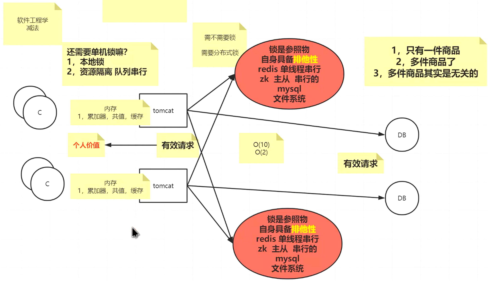
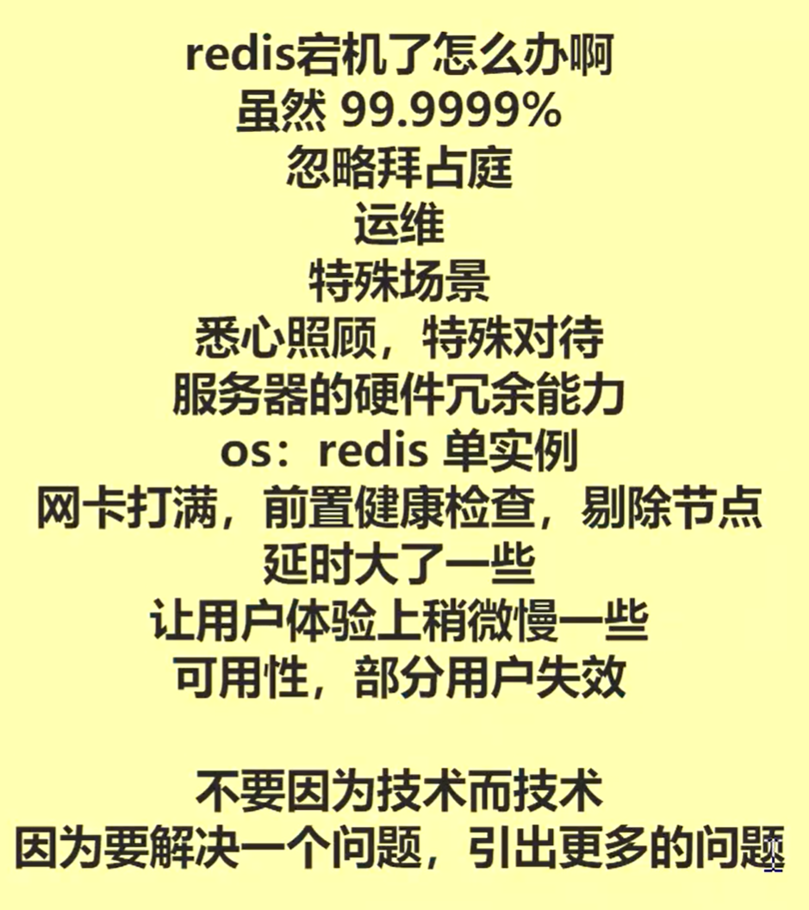

### 分布式锁，从单机到多机

#### 单机场景

单机能承受的 TPS

- tomcat 500~1000
- mysql 200~800

在单机状态下，tomcat 能接受的请求肯定比 mysql 更多，此时数据库成为系统瓶颈。为了解决这个问题，可以将自增的累加器（例如请求次数、商品剩余等等）等“公共值”缓存起来，放在 JVM 里面，仅让有效请求到达数据库，让 DB 的 TPS 有最大利用价值。

Tomcat 是多线程的，会产生并发问题。我们考虑不同商品数量的情况：

- 最小，只有一件商品供秒杀，此时多线程在扣减商品的时候，要排队串行，串行放进队列里，不需要加锁了
- 最大，很多件商品的时候，由于商品与商品之间是无关的，不同商品可以看做是并行的，同一个商品在同一个队列里，也不用加锁了

思考，如果第一件商品10件，第二件商品9999件，第三件商品500件，都在数据库里，如果没有前置判断的话，夹杂着的请求很快会让1件的商品卖光，后续还有很多对卖光商品的请求，白白占用了数据库的性能。所以我们需要前置的拦截，让最终进来的请求都是还有库存的商品。

目前来看，是不是不用锁了？是的，但是我们大多数人很少在开发的时候去做线程的资源隔离，而是直接把请求打出去，当所有请求是并发达到数据库的时候，我们控制不了请求的顺序性，所以才会有锁的概念。

#### 多机场景

场景：单机 1 个 tomcat -> 多机 2 个 tomcat

多机情况下，只有一件商品的时候，也需要加锁，防止超卖。锁是一个参照物，用来参照哪个线程取到了、哪个线程没取到。锁自身要具备排他性，即只能有一个线程取到。那么如何实现排他性？

- redis worker 线程是串行的

- zk 两阶段提交，主从，主是串行的

##### 在分布式场景下，有了分布式锁，还需要单机锁吗？

首先要理解的是，我们在数据库上目的是做有效请求的过滤，让没有意义的操作不去消耗它的资源和网络带宽。在微服务当中，在任何一个节点上，我们都要关注请求的有效性。虽然微服务是“不主动、不拒绝、不负责”，即使打过去的是无效请求，也会正确返回，但调用方必须考虑请求的“有效性”，不随便去浪费服务方的资源，这是调用方个人价值的体现。这是面试的时候你要强调的，可以区别于其他人的。

回到这个问题，在分布式场景下，有了分布式锁，还需要单机锁吗？

- 举一个例子，如果有两台机器一共10个线程去抢锁，在只有1件商品的情况下，最终只有1个线程能拿到锁，而服务方承受的I/O的负载是O(10)。

- 同样的情况，如果你对每个单机加锁，服务方承受的I/O的负载就只有O(2)，在整体的性能上会有提高。另外，如果不想用本地锁，也想达到O(2)的效率的话，你也可以在每个单机上用逻辑做资源隔离，通过队列实现串行。

##### 多件商品情况下，商品之间其实是无关的

商品之间无关，所以多件商品和一件商品的情况类似。在用户下单后，n 件商品经过过滤，最终每件商品只有有效请求到达数据库，大大减少了数据库的压力。

比如，限制每个用户只能买 3 种商品，每个商品限购 2 件，系统应该怎么设计？

根据“只能有效请求到达数据库”原则，多余秒杀的商品不应该到达数据库浪费I/O资源，因此应该做前置过滤。解决方法是将 redis 集群前移。在 redis 里面将售卖规则创建成 key，后续用业务逻辑判断此次用户请求是否能够生成订单。

比如，一个用户请求到达之后，去 redis 取商品种类、商品单品数量、用户 id，带着想要秒杀的商品的 itemid 一起返回到 tomcat，由业务逻辑判断这个用户能不能下单，从而识别“有效请求”。你也可以用 redis 事务来处理一个用户的多个减库存，防止超出限购数量。识别了有效请求（防止超卖）后，生成订单即可，因为第三方支付是异步的，后续订单可以走队列了，无需再加锁。队列的迁移到后续的分库分表，是后续调优要考虑的问题。

另外，商品数量足够大的话，不同商品可能放在 redis 不同的节点中，稍显复杂，这个是开发人员要考虑的逻辑。redis 分区后，就不能使用 LUA 脚本和事务实现上述多个判断逻辑了，需要自己写逻辑实现了。

##### 服务的无状态性：多机一定比单机快吗？都说秒杀场景一定要用分布式锁，真的是这样吗？

首先要理解一个概念，就是服务的状态性。累加器、公共值，属于状态数据。为了维护多机的状态，要保持数据的同步，去做事件传递，去做分布式协调。zk 是主从架构，性能并不高，仅应该用来维护核心且不经常发生变化的那些数据的一致性，并不是一个很好的用于数据同步的技术方案。正确的方式是做服务状态的迁出，而不是去多台机器上做数据的同步。

单机情况下，没有到达瓶颈的时候，单笔业务处理速度是最快的。加机器并不能提升速度，反而由于网络开销，让单笔请求变慢。而且单机是不需要外部锁的，而多机要做一致性、同步问题，反而加机器会让整个系统变慢。

那为什么常说多机会变快？这样说的前提是：不只有一件商品。如果只有一件商品，最终都要成为串行去扣这一件商品的库存，多机一定不会带来速度的提升。而在多件商品的情况下，多机可以让无关的商品之间并行，不同商品的减库存进入不同的机器并同时执行，而受制于一台机器的性能问题，虽然可能会排队，但最终的表现是，多机能够“让无关请求并行起来”，因此才会有所谓的“快”。

最后，无论你怎么变，（考虑到多机存在的数据同步问题和单机存在的CPU调度问题），在“没有资源瓶颈”的时候，并行总是会比串行慢。串行才是效率最高的方式。

##### 升华：从商家的角度，秒杀的目的是什么？

从商家的角度，不是每个人都能拿到秒杀的便宜。秒杀是为了引流，应该用更低的成本获得更多的用户使用这个平台，完成秒杀。在秒杀的同时，也应该做限购，即一个用户只能拿走一件商品。加了限购的秒杀才是完善的秒杀系统。

秒杀场景下，会有很多人刷单，因此才更应该仅让有效请求到达数据库。根据上面的方案，无效请求都让 redis 抗住了，保护了mysql。

那如果用户下单之后不付款，交易失败怎么办？你仍然要从商家的角度考虑，实际上，卖少了没关系，但不能超卖。况且，如果秒杀没有结束，你可以把库存加回去。这就是产品经理和程序员要换位思考。

##### 秒杀系统还需要分布式锁吗？

不需要了。redis 所有的操作是串行的，每一个操作拥有了原子性和排他性。分布式锁成本是很高的，上述解决方案将 redis 集群前移来做请求有效性识别、减库存这些事情，就不需要做分布式锁了。

所以，对于任何系统设计，不要上来就推导多机的架构模式。

##### redis 宕机了怎么办？

程序员代码不能解决所有问题，要在其他地方做补偿，例如你还是要靠运维、靠linux内核调优、靠监控系统、靠服务器硬件的冗余能力，在秒杀这样的特殊场景，你还是需要对服务器细心照顾、特殊对待。不要因为技术而技术，要从企业的角度其实追求可用性。

如果不断的追求某个问题的解决方案，很可能会引入其他的问题。也不要把平时的解决方案放进特殊场景中使用，可能会引起蝴蝶效应，风险很大。美团发布过一篇实战文章，在大量并发情况下关闭健康检查，避免一些节点被剔除。必要的时候，让一些用户的请求失效。

虽然可能会让用户体验上稍微慢一些，但保证整个服务的可用性才是最重要的。站在产品经理的角度来看，这个方案可以了。

##### 那分布式锁岂不是没用了？什么场景需要分布式锁呢？

分布式锁其实是在解决并发问题。未来很多公司采用响应式编程、流式编程模型（而且已经有公司落地了），无状态、无锁化将是趋势。

如果你学过大数据的话会更好理解，map reduce 计算框架，map 处理数据初始状态进行加工，同一数据做 reduce 的时候会有分区概念，最后分治汇总。

所以，在开发的时候，我们应该尽量去规避分布式锁。