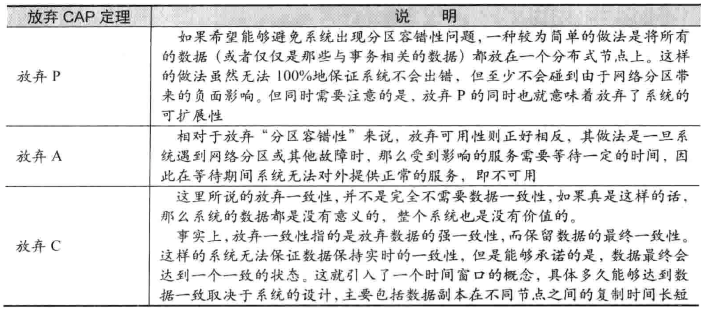

# 理解CAP与分布式一致性

### 永远绕不开的CAP定理

出于可用性及负载方面考虑，一个分布式系统中数据必然不会只存在于一台机器，一致性简单地说就是分布式系统中的各个部分保持数据一致

但让数据保持一致往往并不像看上去那么简单，假设我们有两台机器A与B，这时A更新了数据，A需要将更新的指令同步到B，如果A到B网络传输到B数据落地的总时间为500ms，那么这个500ms就是可能造成数据不一致的时间窗口，假如两台机器分属不同机房，甚至分属不同国家的机房，其时间窗口会更大，具体会造成什么影响呢？

举个栗子🌰，假如用户a进行转账操作，节点A更新了数据，他在转账后显示余额为0，但他刷新一下页面请求到了节点B发现自己的余额又回到了原来的余额，然而这只是显示不一致，但假设他又在节点B上进行在进行了转账操作，转账中的余额校验也依旧访问的是节点B，那么可能会造成的影响不言而喻。

#### CAP定理

在谈分布式一致性之前，我们首先了解一个定理，那就是CAP定理，请注意，CAP是定理而非理论，CAP定理证明了一个分布式系统只能同时满足一致性（Consistency）、可用性（Availability）和分区容错性（Partition tolerance）这三项中的两项。

- 一致性（Consistency）：指的就是整个集群的所有节点数据保持一致
- 可用性（Availability）：在数据同步过程中，集群是否是可用状态
- 分区容忍性（Partition tolerance）：是否能够容忍网络分区的发生：分布式系统在遇到任何网络分区的故障的时候，仍然需要能够对外提供满足一致性和可用性的服务，除非是整个网络环境都发生了故障

C和A相对好理解，这里着重说一下P（Partition tolerance）分区容忍性，听着比较拗口，说实话，刚开始看到他的时候也是一脸茫然，分区？什么是分区？其实分区（Partition）简单的说就是服务器之间的网络通信断了，两边的服务器变成两个独立的集群，这就是所谓的分区，断了的原因有很多比如交换机故障，路由器故障，扫地阿姨把网线拔了等等，然后什么是容忍性（tolerance），这个就很好理解了，是不是发生分区了我的服务就不再提供服务了呢，当然不是，否则也就没有高可用一说了，那么我们能否说不做网络故障可能发生的假设呢，答案必然是不能的，首先网络延迟是必然的，网络延迟的过程中也可以将其当做发生分区，另外网络故障也可以说是必然的，详见墨菲定律（滑稽脸）

其实P也不是完全不能抛弃的，很简单，我们干掉网线，只保留一台单机数据库，就只有一个区，何来分区一说，对啊，所以说我们常见的传统单机数据库（RDBMS）就是可以满足CA的，如：MySQL，Oracle等等，当然，前提是你没做主从之类的分布式方案。由此可见，在所有分布式系统中P几乎都是不可抛弃的，所以说我们的选择也就只剩两个了AP和CP。

如何理解 CP 与 AP？

举个简单例子，若我们集群有两台机器，而两台机器网络发生中断而导致出现分区:

- 如果我们在双发无法通信的情况下继续允许两边进行写入，则必然造成数据的不一致，这时我们实现了AP而抛弃了C。
- 但如果我们禁止其中一方进行写入，这样就可以保证系统的一致性了，但我们却因为将一中一个副本置为不可用而导致了A属性的丧失，也是说实现了CP。

这样CAP理论是否变得好理解了一些？当然现在对于CAP理论的争议也很大，但并不是怀疑CAP定理是否能被证伪，而是说CAP理论也许并不适用于我们通常对数据库系统的描述，有时我们并不能简单的将数据库划分为AP或CP。举个栗子🌰，如果我们有一个single master+multiple slaves的mysql数据库，当leader不可用时，用户则不能进行写入，也就丧失了A属性，但由于MySQL是通过binlog异步同步数据库的，用户也有可能读到的是旧数据，所以说该系统也许既不满足A也不满足C，仅仅满足了P属性。

> 关于CAP的争议讨论，推荐阅读 Martin Kleppmann 大佬写的：[Please stop calling databases CP or AP](https://martin.kleppmann.com/2015/05/11/please-stop-calling-databases-cp-or-ap.html) 
>
> 中文翻译：[请不要再称数据库是CP或者AP](https://blog.the-pans.com/cap/)

以下：《从Paxos到zookeeper分布式一致性原理与实践》

### 线性一致性与一致性级别

基于CAP理论的AP与CP互斥的原则，针对C的取舍，我们简单划分成了3个级别来描述（特殊场景下会更多）：

#### 强一致性（线性一致性）

强一致性可以理解为当写入操作完成后，任何客户端去访问任何存储节点的值都是最新的值，将分布式的一致性过程对客户端透明，客户端操作一个强一致性的数据库时感觉自己操作的是一个单机数据库，强一致性就是CAP定理中所描述的C（Consistency），同时下面的讲解的Raft算法就是实现线性一致性的一直

#### 弱一致性

弱一致性是与强一致性对立的一种一致性级别，弱一致性简单地说不去对一致性进行保证，客户端在写入成功后依旧可能会得到旧的值，这也就是舍弃C可能造成的问题，但某些系统下，对一致性的要求并不高，从而可以舍弃强一致策略可能带来的性能与可用性消耗。

#### 最终一致性

最终一致性也可以理解成弱一致性的一种，使用这种一致性级别，依旧可能在写入后读到旧值，但做出的改进是要求数据在有限的时间窗口内最终达到一致的状态。也就说就算现在不一致，也早晚会达到一致，但狭义上的弱一致性并不对一致性做出任何保证，也许某些节点永远不会达到一致，其实最终一致性的核心就是保证同步的请求不会丢失，在请求到达时节点的状态变为最新状态，而不考虑请求传输时的不一致窗口，DNS就是典型的最终一致性系统。