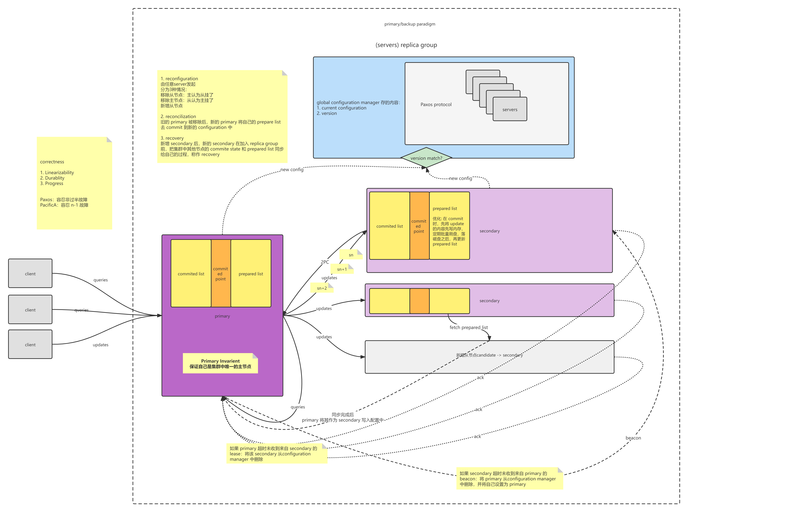
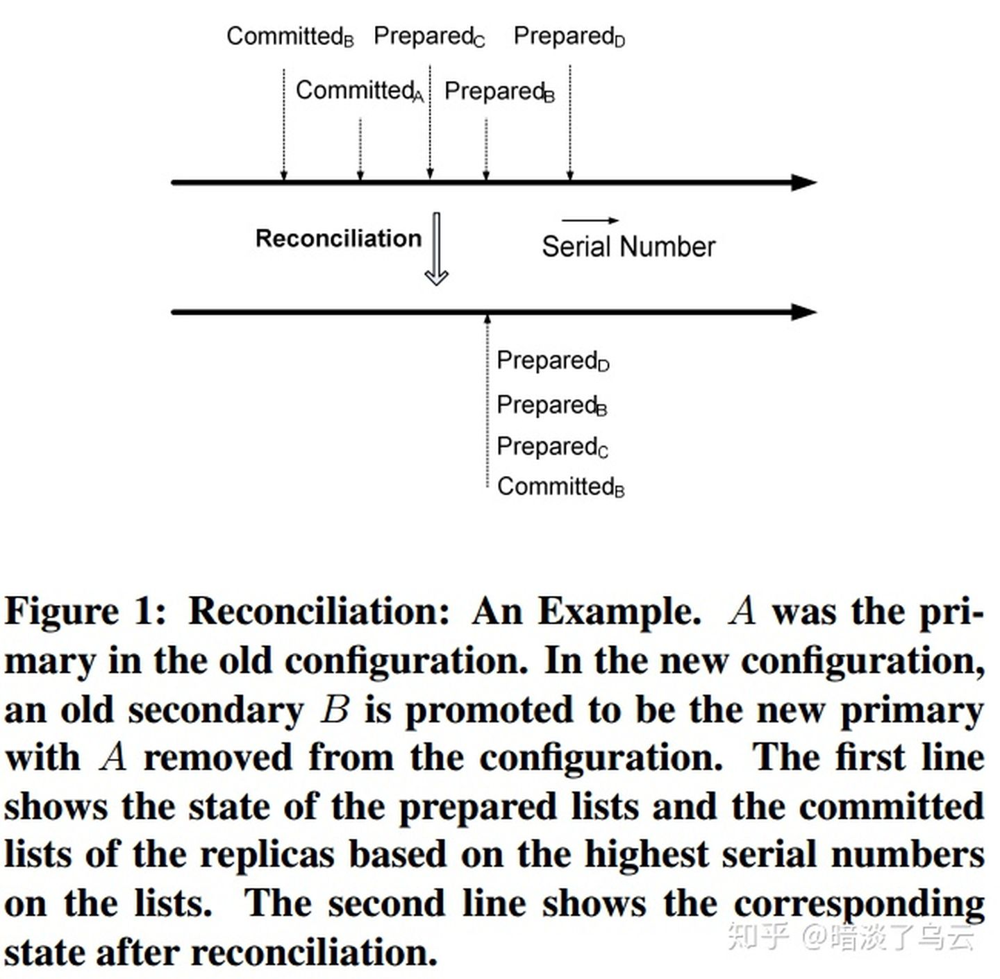
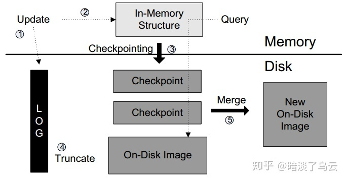

# PacificA-Replication in Log-Based DSS

### 一些我的理解

思考：论文有个结论说，相比 GFS 具有中心化的实体，PacificA 没有单点问题（指单点不可靠+单点有请求数量瓶颈）。它的配置中心不是单点的吗？

回答：PacificA 只有在拓扑结构发生改变的时候，才会和配置中心进行交互，普通的请求是不会打到 configuration manager 的。

思考：普通的请求为什么不会打到 configuration manager？强一致性情况下，primary 是如何不需要去 configuration manager 那里确认，就能知道自己是最新的主的？

回答：因为它有 Primary Invariant 的保证，不会同时有两个主存在。Primary Invariant 的意思是，只有当 configuration manager 记录了自己是主的时候，才会认为自己是主。这样保证了最多同时只有一个主存在。

思考：Primary Invariant 是如何保证不会同时有两个主存在的？

回答：通过让 primary 总是优先于 secondary 去 timeout，即 as long as the grace period is the same as or longer than the lease period, the lease is guaranteed to expire on the primary before it does on secondary.

思考：` When any lease from a secondary expires, the primary no longer considers itself a primary and stops processing queries or updates.` 在 expire 之后，Primary 除了剔除 Secondary 以外，为什么自己也要退位？有必要吗？**明明是别人挂了，为什么要伤害自己？**

回答：因为是强一致，一旦一个 Secondary 不在，那么复制就没有办法继续了，所以 Primary 需要剔除 Secondary。但是这里需要注意的，因为 Primary 的租约是由所有 Secondaries 来保证，**一旦 Primary 发现 Secondary 不在了，也就是自己的租约的过期了，自然必须停止服务，否则就可能产生双主，例如 Primary 发送给配置中心的配置变更消息由于网路延迟的原因，落后于 Secondary 发送配置变更信息给配置管理服务，那么将会出现双主**。不过通常由于 primary 的 grace period 比 secondary 要短一些，所以新的主可能还是它自己抢到。

>https://zhuanlan.zhihu.com/p/48347935

## 1. Introduce

Pacifica 是微软 2008 年发表的一个通用的复制框架，早于 raft（2014），其具有简单、实用和强一致（strong consistency）的特点。Pacifica 的出现主要就是为了解决一致性复制协议（Paxos）理论和工程实践之间的 gap，也就是基于 Paxos 的一致性复制协议难以被正确实现的问题。Pacifica 通过将数据复制和配置管理（配置管理通常是用 Paxos 实现）分离解耦开来，因为当前已经有一些配置管理服务的解决方案（例如 zookeepr ，chubby等，现在有 etcd 等），它们经过了大量的线上环境的测试，能够保证较好的正确性，从使得系统只需要关系数据一致性复制部分，大大简化了设计的复杂性，有利于快速和正确的构建分布式存储系统。

首先来整体的看看 Pacifica 的核心特性，后面再详细描述和体会：

1. 将复制组配置管理和数据复制分离，Paxos 集群负责配置管理，**主从复制（primary/backup ）**实现强一致的数据复制，简单，有利于快速构建正确的分布式存储系统
2. 实现了去中心化的错误检测（detecting failures ），扩展性更好，可用性更高，
3. 强一致的数据复制，使得异常恢复更加简单，例如 Primary 挂了，随便选择哪个节点为 leader 即可，因为任何一个副本上都有最新的数据。但是 write 由于需要复制给所有副本才能返回，（1）轻则因慢节点和网络抖动造成 latency 增加，（2）重则因节点下线造成 write 卡住；当然问题（1）在[局域网](https://www.zhihu.com/search?q=局域网&search_source=Entity&hybrid_search_source=Entity&hybrid_search_extra={"sourceType"%3A"article"%2C"sourceId"%3A48347935})一般网络环境可以认为比较稳定，但是慢节点导致的 latency 上去需要外面接入；问题（2）在微软另一个存储系统 window azure storage [3] 的 stream layer 有一个方案，在 azure storage stream layer 也是使用这种强一致复制，为了减少这种影响，[azure storage](https://www.zhihu.com/search?q=azure+storage&search_source=Entity&hybrid_search_source=Entity&hybrid_search_extra={"sourceType"%3A"article"%2C"sourceId"%3A48347935}) 的 stream layer 设计成 append only，一旦 write 写入 timeout，那么就会通过 new-seal 的方式来开辟新的复制组，提高可用性。通过 [1,3] 说明了实践中 Pacifica 这种强一致复制表现是不错的。

国内小米的开源分布式 key-value [pegasus](https://link.zhihu.com/?target=https%3A//github.com/XiaoMi/pegasus) 也是基于 Pacifica 构建。

## 2. Architecture

Pacifica 的基本框架主要有两部分组成：

- **配置管理集群**

负责管理复制组成员的信息，Primary/backup 信息，以及复制组配置 version，数据分片的位置信息

- **存储集群**

负责多副本数据的一致性复制

## 3. Log Replication

首先来看看存储集群的数据复制，相区别其它 quorum 机制，Pacifica 要求实现**强一致**的数据复制，也就是必须保证 Primary 上的数据复制给所有的 secondary 节点，才能返回给 client 端，这样可能会担心异常情况下 write 的 latency 会增加，但是在局域网中（非异地跨数据中心环境下）Primary 和 Secondary 之间的 latency 会比较稳定，而且作者也在论文指出了：

> we focus our attention on a local-area network based cluster environment

既然是 Primary/Secondary 复制，那么所有的 query/update（也就是 read/write） 都被发送给 Primary，query 简单，直接返回即可，update 则需要通过 Log Replication 将数据复制给所有的 Secondary，保证数据的可靠性。

下面我们来详细看下详细的 Log Replication 流程：

1. update Op 进入 Primary，Primary 为其分配一个单调递增的序号 sn，并将其按序插入到 prepare list 中
2. Primary 通过 prepare message 将其发送给 Secondary，并携带上 [configuration version](https://www.zhihu.com/search?q=configuration+version&search_source=Entity&hybrid_search_source=Entity&hybrid_search_extra={"sourceType"%3A"article"%2C"sourceId"%3A48347935})，当 Secondary 收到记录之后，会首先比较 configuration version，如果相同，则将其有序的插入到自己的 [prepare list](https://www.zhihu.com/search?q=prepare+list&search_source=Entity&hybrid_search_source=Entity&hybrid_search_extra={"sourceType"%3A"article"%2C"sourceId"%3A48347935})，并返回 acknowledgment 给 Primary；
3. 一旦 Primary **收到所有 Secondary 的响应**，那就将 commit list 中的 [committed point](https://www.zhihu.com/search?q=committed+point&search_source=Entity&hybrid_search_source=Entity&hybrid_search_extra={"sourceType"%3A"article"%2C"sourceId"%3A48347935}) 就可以向前移动，
4. Primary 返回 client，并给向 Secondary 发送 committed 消息，必要的时候 committed point 可以通过下一次的 prepare message 带过去

**Notes**

对于 Pacifica 来说，其通过 Primary 实现对所有的 Op 定序，实现的是强一致复制，实际上这里的”强一致“有两重意思：

1. 通过 Primary 定序实现 Op **全序广播（total order broadcast）或原子广播（atomic broadcast）**，也就是 CAP 中的 C，强一致，也是[线性一致](https://www.zhihu.com/search?q=线性一致&search_source=Entity&hybrid_search_source=Entity&hybrid_search_extra={"sourceType"%3A"article"%2C"sourceId"%3A48347935})（Linearizability）
2. Primary 只有收到所有的 Secondary 才返回

强一致的第 2 点也是由好处的，会让错误处理更加的容易，例如 Primary 挂掉之后，任意一个 Secondary 都可以成为 Leader，那么就可以不用选举，或者选举非常简单。

## 4. Leases and Failure Detection

类似 GFS 的 Leader 保持，也是通过 Lease 机制来实现，但是略有不同，Pacifica 的心跳方向是：Primary -> Secondary，相比 GFS 从 Master 续租，这种复制组内部维持 Lease（decentralized implementation eliminates loads and dependencies on a centralized entity），可以减小 Leader 的压力，而且在**一定程度上可以缩短租约的有效期，从而提高可用性**。

> grace_period > lease_period > beacon_interval * 2

其中 [beacon_interval](https://www.zhihu.com/search?q=beacon_interval&search_source=Entity&hybrid_search_source=Entity&hybrid_search_extra={"sourceType"%3A"article"%2C"sourceId"%3A48347935}) 就是 heartbeat，其中，[grace_period](https://www.zhihu.com/search?q=grace_period&search_source=Entity&hybrid_search_source=Entity&hybrid_search_extra={"sourceType"%3A"article"%2C"sourceId"%3A48347935})：Secondary timeout > lease_period：Primary timeout，可以保证 Primary 总会先于 Secondary timeout

## 5. Configuration change

一旦通过上面的Failure Detection 发现了错误，就会触发 Configuration change（配置变更），确保存储集群恢复服务，保证可用性。

- **（1）Removal of Secondaries**
- Primary 在一定时间内（lease period）未收到 Secondary 对心跳的回应，那 Primary 认为 Secondary异常
- 它也将自己降级不再作为 Primary，停止处理 new request
- 向配置管理服务汇报更新复制组，将该下线 Secondary 节点从复制组中移除
- Primary 把新的复制组修改到本地（拥有新的 configuration version），并重新变成 Primary，恢复服务

因为是强一致，一旦一个 Secondary 不在，那么复制就没有办法继续了。所以 Primary 需要剔除 Secondary。但是这里需要注意的，一旦 Primary 发现 Secondary 不在了，也就是自己的租约的过期了。**这里是因为 Primary 的租约是由所有 Secondaries 来保证，租约过期了，自然必须停止服务，否则就可能产生双主，例如步骤 3 Primary 发送给配置管理服务的配置变更消息由于网路延迟的原因，落后于 Secondary 发送配置变更信息给配置管理服务，那么将会出现双主**。实际上这种情况会有两种可能性：

1. 尽管 Primary 先于 Secondary timeout，但是 Primary 的配置变更信息由于网络延迟的原因，或者和配置管理服务局部的网络分区，导致这个消息未能尽快到达，且慢于 Secondary 的配置变更消息
2. 所谓的 timeout，在程序的实现中，都是基于[定时器](https://www.zhihu.com/search?q=定时器&search_source=Entity&hybrid_search_source=Entity&hybrid_search_extra={"sourceType"%3A"article"%2C"sourceId"%3A48347935})实现，但是定时器的精度本身是有限，而且可能在极端的负载的情况，导致定时器出现一个较大的 timeout 的偏差

实际上第 4 就是通过配置管理服务实现 Primary 续租，所以又可以开始提供服务了.

- **（2）Change of Primary**
- 如果 Secondary 节点在一定时间内（grace period）未收到 Primary 节点的心跳信息，那么其认为Primary 节点异常（lease period < grace period，保证从节点检测到[主节点](https://www.zhihu.com/search?q=主节点&search_source=Entity&hybrid_search_source=Entity&hybrid_search_extra={"sourceType"%3A"article"%2C"sourceId"%3A48347935})异常则是在主节点停止作为主以后，此时该副本集是不存在 Primary 了）
- 于是向配置管理服务汇报更新复制组配置变更，将 Primary 节点从复制组中移除
- 同时将自己提升为新的 Primary，但是并不开始 process new request
- 执行 reconciliation process（保持 Secondary 节点和 Primary 节点的数据一致性 ）
- 完成 reconciliation ，开始处理 new request
- **（3）Addition of New Secondaries**
- 新的 replica 以 candidate secondary （Learner）的身份加入，Primary 正常处理 update，并发 prepare message 给 candidata secondary
- Learner 同时恢复其他不在 [prepared list](https://www.zhihu.com/search?q=prepared+list&search_source=Entity&hybrid_search_source=Entity&hybrid_search_extra={"sourceType"%3A"article"%2C"sourceId"%3A48347935}) 中数据
- 一旦 Learner 追上其他 replica，并且没有发生任何异常，Primary 向配置管理服务汇报新 [Replica-group](https://www.zhihu.com/search?q=Replica-group&search_source=Entity&hybrid_search_source=Entity&hybrid_search_extra={"sourceType"%3A"article"%2C"sourceId"%3A48347935})，将 Learner 加入 Replica-group，Learner 转变成 Secondary，Recovery 完成

实际上 **Recovery** 一般就是通过（3）新增 Secondary 来实现的

**Notes**

配置变更每次都会携带上配置的版本号到配置管理服务，如果版本号小于配置管理服务上面的配置版本，那么自己配置变更就会失败，仅仅学习配置管理服务上面的最新配置

## 6. Reconciliation

在 Change of Primary 的时候，会执行一次 Reconciliation process，来保持 Primary/Secondary 数据的一致，大致的过程是 Primary 将自己的 prepare list 上 uncommited 的 request 通过 prepare message 发送从节点，直到这些 request 全部提交，其中落后的补齐，领先的截断，保证 Primary-secondary 的数据一致。下图给出一个例子：

实际上这里和 Raft 类似，因为 new Primary (Leader) 并不知道当前的 commit point 在哪里，所以需要将当前的 prepare list 上的所有 Op log entry 都提交掉，保证不会丢数据，也保证了不会出现类似 raft 的 [stale read](https://www.zhihu.com/search?q=stale+read&search_source=Entity&hybrid_search_source=Entity&hybrid_search_extra={"sourceType"%3A"article"%2C"sourceId"%3A48347935})，这里其实有两个目的：

1. 保证已经 committed 的数据不会被删除
2. 给未被的提交的数据，也就是未决的数据做一个决定，提交或者删除（截断），不要一个模拟两可的状态，详细的分析可以参考文献 [4]。

## 7. Recovery

Pacifica 通过 **Addition of New Secondaries** ，然后再通过 **Removal of Secondaries** 删除下线从节点，来实现下线节点的数据 recovery。实际上还可以通过 [window azure storage](https://www.zhihu.com/search?q=window+azure+storage&search_source=Entity&hybrid_search_source=Entity&hybrid_search_extra={"sourceType"%3A"article"%2C"sourceId"%3A48347935}) 的 new-seal 的方式新开复制组，但是在 window azure storage stream layer append-only 的场景下，new-seal 相对处理起来简单，对于一些随机 read/write 的场景 new-seal 相对复杂，因为还涉及到 read 的 merge，和后期复制组的 merge，逻辑上复杂很多，但是对于解决由于慢盘、节点下线等造成系统的抖动效果会比较好。

## 8. Log-Based Storage

论文在最后还给出了基于 Log-based storage system 的体系结构，以及如何基于这种架构来实现数据一致性复制，一共有三种解决方案：

1. [Log replication](https://www.zhihu.com/search?q=Log+replication&search_source=Entity&hybrid_search_source=Entity&hybrid_search_extra={"sourceType"%3A"article"%2C"sourceId"%3A48347935})：也就是 Raft 中描述的 RSM，通过 Primary Secondary 之间复制 Log，来保证副本之间的数据一致
2. Log merge：Primary 维护所有数据，Secondary 不维护内存结构，仅接受 chunkpoint，log 复制，Primary 挂了，Secondary 通过加载回放恢复内存结构
3. Layered Replication：分层的设计，类似 bigtable 和 window azure 的 Partation layer，数据的一致性复制分别交给底层 GFS 和 Stream Layer 处理

## 参考文献

[1]. PacificA: Replication in Log-Based Distributed Storage Systems. [https://www.microsoft.com/en-us/research/wp-content/uploads/2008/02/tr-2008-25.pdf](https://link.zhihu.com/?target=https%3A//www.microsoft.com/en-us/research/wp-content/uploads/2008/02/tr-2008-25.pdf)

[2]. PacificA：微软设计的分布式存储框架. https://zhuanlan.zhihu.com/p/27582424

[3]. Calder B, Wang J, Ogus A, et al. Windows Azure Storage: a highly available cloud storage service with strong consistency[C]//Proceedings of the Twenty-Third ACM Symposium on Operating Systems Principles. ACM, 2011: 143-157.

[4]. 一致性协议中的“幽灵复现”. https://zhuanlan.zhihu.com/p/47025699.

# 一致性协议总结与对比

>https://levy5307.github.io/blog/consensus-protocol-summary/

### PacificA

该协议由Manager指定一个Replication Group中的primary，写入和读取请求都发往Primary，以此来保证强一致性。 对于写入，要求必须所有副本都写入成功才能提交。对于读取，则只需要从Primary本地读取就可以了。

**优点**：可用性高。对于拥有2N+1个节点的集群，PacificA可以容忍2N个节点挂掉（对于挂掉的节点，manager会及时将其移除，不会影响写入可用性）

**缺点**：容易抖动。由于写入需要所有节点都成功写入，所以只要有一个节点写入较慢，就会影响写入的延迟。

Ref: https://levy5307.github.io/blog/PacificA/

### Raft

同PacificA一样，读写都是发往Primary。与PacificA不同的是，其不用依赖额外的Manager制定primary，而是通过选举的方式选出primary。 另外，Raft要求所有写入只要有超过一半的副本写入成功就可以了。 所以相较于PacificA:

- PacificA对延迟抖动更敏感。少数的慢节点基本不会影响Raft协议的写入，该节点可以写入完成后再同步追赶日志。
- Raft可用性不如PacificA。对于拥有2N+1个节点的集群，PacificA可以容忍2N个节点挂掉。而Raft则只能容忍N个节点挂掉（其实可以通过增加副本数来一定弥补）
- 在PacificA实现的大集群中，manager由于需要和每个server都维持心跳等通讯，其可能成为集群的瓶颈。Raft协议中不需要使用manager所以不存在这样的困惑

Ref: https://levy5307.github.io/blog/raft/