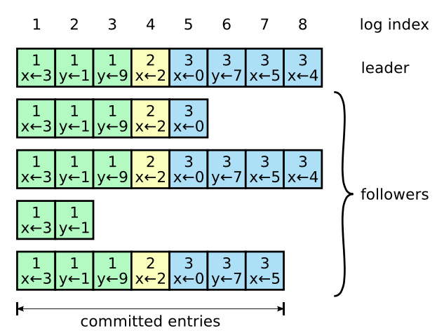
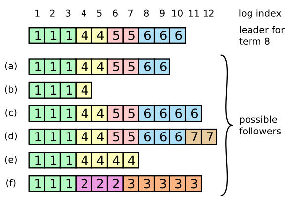
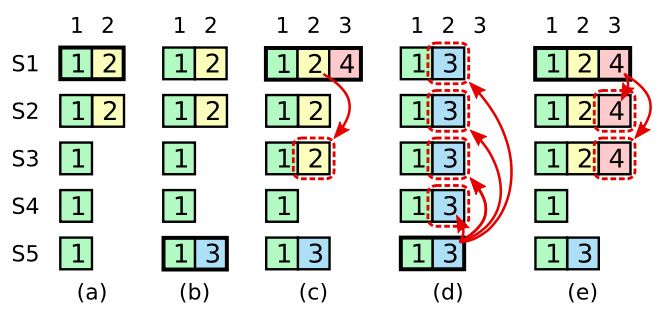
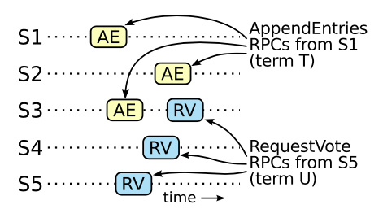
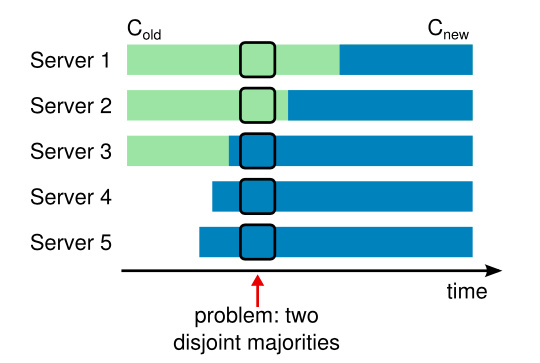
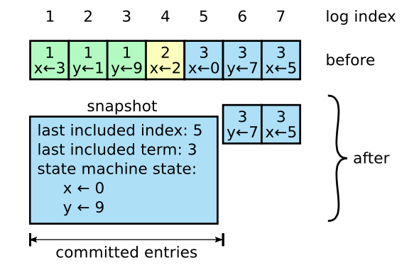
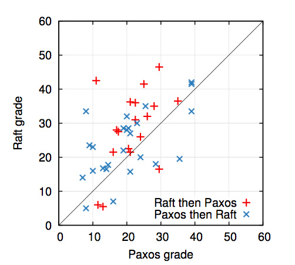
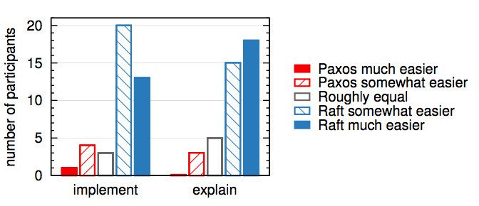
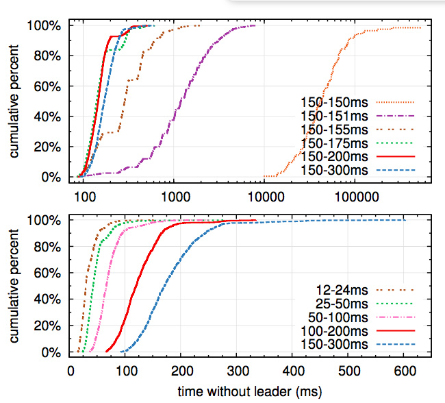

### 寻找一种易于理解的一致性算法(扩展版)

https://xiaochai.github.io/2018/09/26/raft/

Diego Ongaro and John Ousterhout

Stanford University

#### 摘要

Raft是用来管理日志复制(replicated log)的一种一致性算法。他和(multi-)Paxos算法在结果和效率上一致，但整体结构不同，这使得Raft更容易理解，也更容易构建实际的系统。为了增强理解性，Raft将一致性算法分成了几个关键的部分，例如领导者选举(leader election)，日志复制(log replication)，安全性(satety)，并且他强制实行了一些更严格的一致性策略来减少需要考虑的状态。从学生学习调研的结果上显示Raft比Paxos更容易学习。Raft同时还提供了修改集群成员配置的机制，他使用了一种重叠多数(overlapping majorities)成员的算法来保证安全性。

#### 1. 介绍

一致性算法可以保证由一组机器组成的集群，在其中某些机器出现不可用时可以照常提供服务。这种算法在构建大型软件系统中扮演重要角色。在过去十年中，Paxos[15，16]一直主导着有关一致算法的讨论，大多数一致性算法实现都是基于Paxos，或者是受其影响。而且Paxos也成为提供给学生学习一致性算法的主要工具。

不幸的是，尽管很多人尝试降低Paxos的复杂性，但他还是很难理解。另外，Paxos需要经过复杂的变化才能在现实中应用起来。所以不管是系统构建者还是学生都深受其折磨。

我们在被Paxos困扰许久之后，决定寻找一种新的一致性算法，这种算法在实现和学习上都更加容易。我们的首要目标是可理解性(understandability): 我们是否能为实际系统定义这样一种一致算法，使用非常容易理解的方式来描述他呢？并且，我们希望这种算法凭直觉就能明白，这对于一个系统构建者来说是十分必要的。对于一个算法，除了让算法工作起来，更重要的是让其他人更容易理解他为什么能工作。

Raft就是这个工作的成果。在提升Raft的可理解性上面，我们使用了诸如分解(decomposition)(领导者选举，日志复制，安全性)和减少状态空间(state space reduction)(相对于Paxos，减少了非确定性的、并且使服务节点出现不一致的那些状态)等多种方式。来自两所学校的43名学生在学完两种算法之后 ，对于Raft的问题回答得相对于Paxos会好很多，这显示了Raft更容易被理解。

Raft与现存的大部分一致算法(如Oki，Liskov的Viewstamped Replication[29，22]算法)有很多类似的地方，但也有一些自己的特性:

- **强领导性(strong leader)**: Raft中的领导者具有更强的领导性。比如日志记录只会从领导者流向其他服务节点。这简化了复制日志的管理，也使得Raft更容易理解。
- **领导者选举(leader election)**: Raft使用一种随机定时器来选举领导者。这只是在现存的心跳机制上添加一些小修改，就可以快速简单地解决冲突。
- **角色转变(membership changes)**: Raft使用一种称之为共同一致(joint consensus)的方法来保证整个集群在配置变更过程中还处于可用的状态。

我们相信Raft不管是在教学还是在作为实际实现的基础方面，都比其他诸如Paxos之类的算法更优秀、更简单、也更容易理解，而且对具体的实现细节上有完整的描述。目前已经有多个开源的实现，而且很多公司都已经在使用了。他的安全性也被指出以及证明，而且他的运行效率也与其他算法相当。

论文接下来的内容介绍了复制状态机(replicated state machine)问题(第二节)，Paxos的优缺点(第三节)，介绍我们提高算法可理解性的一些方法(第三节)，完整描述了Raft一致性算法(第5-8节)， 评价Raft算法(第9节)，并且讨论了与之相关的工作(第10节)。

#### 2. 复制状态机(Replicated state machine)

一致性算法是在复制状态机[37]的背景下产生的。这种方法可以使多台服务器间相同的状态计算出完全一致的副本，所以在某些机器宕机的情况下仍然可以提供服务。复制状态机可以用于解决出现在分布式系统中的各种失败容忍性问题(fault tolerance problems)。例如只有一个领导者的大规模系统，像GFS[8]、HDFS[38]、RAMClound[33]这些系统都使用了分开的复制状态机来管理领导者选举、存储配置信息，以防止在领导者出问题的情况下可用。像Chubby[2]和ZooKeeper[11]这些都包含了复制状态机。

复制状态机一般使用复制日志来实现，如图1。每台服务器都有一个存储着一系列指令的日志(log)，而复制状态机会按顺序地执行这些指令。每台服务器的日志都保存着相同的指令序列，复制状态机也按顺序执行这些指令，所以每一个状态机根据这些指令算出来的内容都是一致的。

图1: 复制状态机架构。一致性算法管理这些由客户端请求来的指令组成的复制日志。而状态机按顺序执行这些完全相同的指令序列，产生相同的结果。

保持复制日志的一致是一致性算法的工作。服务器的一致性模块接收来自客户端的指令，并将其添加到日志中去。并且通过与其他服务器的一致性模块沟通来保证每一台服务器的每一条日志记录(entry)最终包含有相同的指令并且顺序一致，即使其中的某些机器宕机。一旦指令被正确地复制到各个机器上，则状态机按顺序地处理这些指令，并对客户端返回相同的结果。最终，这些服务器看上去就像是一台可靠的状态机。

实际系统中的一致性算法一般都有如下特性:

- 保证在所有非拜占庭(non-Byzantine)情况下的安全性(safety)(即不会返回非正确的结果)，包括网络延迟，分区，丢包，重放，乱序等情况。
- 只要大多数节点还能正常运行、可以与客户端通信，这个集群就能正常动作(可用性)。因此，一个包含有5台机器的集群，可以容忍2台机器失败(failure)。当一台服务停止服务(stopping)我们认为他失败了。后续还可以通过从存储状态中恢复，并重新加入到集群中。
- 日志的一致性不依赖于时序(timing): 在时钟出错(faulty clocks)和极端的消息延迟情况下，最坏会导致不可用。
- 一般情况下，一个指令只要集群中大多数机器响应RPC(remote procedure calls)请求即可完成; 少数较慢的服务器不会影响整个系统的性能。

#### 3. Paxos的问题

过去的10年间，Leslie Lamport的Paxos协议[15]基本上已经成为了一致性的同义词: 大部分的课程中教授一致性算法使用此协议，而且大部分实现也是以此协议做为实现的出发点。Paxos首先定义了能达到某一个单独决策一致性的协议，例如一条单独的复制日志记录。我们把这一协议的集称之为单一决策Paxos(single-decree Paxos)。然后通过结合多个这种协议来完成一系列的决策，例如一系列日志(multi-Paxos)。Paxos保证了安全性和活跃性(liveness)，同时支持集群成员角色的转换。他的正确性已经被证明，而且在一般情况下他也是高效的。

但是Paxos有两个重大的缺点。首先Paxos太难以理解了。完整的解释[15]晦涩难懂，只有少数人花了大量的努力才能弄懂他。由此出现了大量用简单的方式来尝试解释清楚Paxos[16，20，21]。这些解释重点放在单一决策Paxos上，但依然很难。在NSDI 2012会议上的一项非正式调查显示只有少数人对Paxos感到满意，甚至那些富有经验的研究员(seasoned researcher)也有是一样。我们也深陷其中，直到我们阅读了大量的简单Paxos解释，并通过自己定义的协议算法才完全弄明白了Paxos，这花了我们大概一年的时间。

我们认为Paxos晦涩难懂是由于他以单一决策Paxos做为实现基础导致的。而单一决策Paxos是繁杂微妙的: 他被分成两个阶段，但这两个阶段都无法通过直觉解释并且无法独立理解。鉴于此，我们就无法从直觉上很容易理解为什么单一决策Paxos能工作。而为multi-Paxos设计的规则又添加了复杂性和灵巧性。我们相信多决策的一致性(例如众多日志记录集合)可以分解成其他更直观更明显的方式来解决。

Paxos的第二个问题是没有提供一个可供实际实现的完整基础。一个原因是由于没有对multi-Paxos达成广泛一致的算法。Lamport的描述基本上都是关于单个决策Paxos的。他描绘了多决策Paxos的可行性，但大部分的细节没有具体给出。已经有许多尝试对Paxos进行详细化、简单化，例如[26]，[39]，[13]。但这些算法之间都完全不同，并且与Lamport的描述也不一致。像Chubby[4]这样的系统已经实现了类Paxos的协议算法，但许多情况下的细节并没有被公布。

另外，Paxos的结构也不容易建立一个实际应用的系统; 这也是单一决策Paxos分解带来的问题。例如，独立地选出日志记录集合然后再组合成序列化日志并没有带来啥好处，反而增加了复杂性。使用日志序列，新日志严格有序地追加到末尾，这样的系统更加简单高效。另外一个问题是Paxos使用了一个点对点对称方法做为他的核心(虽然他最终建议了一个弱领导者作为性能优化方案)。这在只有一个决策进行的简单情况下可以工作，但实际系统中很少有使用这种方法。如果有多个决策，选举一个领导者并且所有决定通过这个领导者的方法会更加简单高效。

这些原因导致了实际实现的系统中与Paxos算法差别很大。每个实现从paxos出发，发现实现的困难性之后，开发出了另外一个完全不同的架构。这是一个浪费时间而且容易出错的过程，而paxos的难以理解加剧了这些问题。Paxos算法的正确性在理论上证明是很好的，但是真正实现却非常困难，证明也无济于事。以下这条来Chubby实现者的评论说明了这点:

> Paxos的算法描述和现实系统中的真正需要之间存在着一条鸿沟… 最终系统的实现将基于一个未被证明的协议[4]。

鉴于这些问题，我们觉得Paxos没有为真正实现一致性系统和教授一致性算法提供一个好的基础。但大型逻辑系统中一致性算法又非常重要，我们决定设计另外一套优于Paxos的一致性算法。Raft就是实验的成果。

#### 4. 易于理解的设计

我们设计Raft有许多目标: 必须提供可供实际系统搭建使用的完整基础，这样可以省去开发者的大量架构设计工作; 必须保证在任何情况下的安全性和特定场景下的可用性; 对于常用操作必须高效。但我们最重要的目标 —— 也是最具有挑战性的目标 —— 是可理解性。这个算法必须对大部分人都能够很容易理解。更进一步，必须让开发者有一个直观的理解，这样才能让开发者在真正实现上进行扩展。

我们必须在多个不同的方法中选择一个来设计Raft。选择哪种方法评估指标就是可理解性: 解释这个方法有多难(例如，他的状态空间复杂吗？是否有一些微妙的影响(subtle implications)，读者完整读懂整个方法和他的实现有多难？

我们意识到这种分析很大程度上由主观意识决定; 尽管如此，我们使用了两个一般适用的方法。第一个是众所周知的将问题分解的方法: 只要有可能，我们就将问题分解成几个可以相对独立解决、解释、理解的子问题。例如，我们将Raft分解成领导者选举(leader election)、日志复制(log replication)、安全性(safety)、成员角色变化(membership changes)这几部分。

第二个方法是通过减少需要考虑的状态数量来简化状态转化，使得系统更加一致，并尽可能地消除不确定性。特别说明，日志不允许出现空洞，Raft也限制了日志出现不一致性的可能性。虽然我们在大部分情况下消除不确定性，但在一些场景中不确定性实际上可以提高可理解性，尤其是随机的引入，他虽然增加了不确定性，但在众多可选择的相似节点中选择一个时，可以减少状态空间(选哪个不重要)。我们在领导者选举算法中引入随机数来简化算法。

#### 5. Raft一致性算法

Raft是用来管理我们在第二节中描述的复制日志的算法。图2汇总了算法的简要说明以供引用参考，图三列出了算法的关键特性。这些表格的内容将在后续章节中分开讨论。

| 状态                                                      |                                                              |
| --------------------------------------------------------- | ------------------------------------------------------------ |
| 所有服务器上保存的持久状态(在回复RPC请求之前写入持久存储) |                                                              |
| currentTerm                                               | 服务器接收到的最近的任期号(term)(启动时初使化为0，单调递增)  |
| voteFor                                                   | 当前任期内收到的候选者Id(candidateId)(如果没有就是null)      |
| log[]                                                     | 日志条目，每一条包括可供状态机执行的命令，收到时的任期号(第一个任期号为1) |
| 所有服务器上的不稳定状态                                  |                                                              |
| commitIndex                                               | 已知的被提交的最大日志记录索引值(初始为0，单调递增)          |
| lastAppid                                                 | 被状态机执行的最大日志索引号(初始为0，单调递增)              |
| 领导者上的不稳定状态(在重新选举后重新初使化)              |                                                              |
| nextIndex[]                                               | 每一个服务器下一个日志索引号(初使化为领导者的最后一条日志索引号+1) |
| matchIndex[]                                              | 每一个服务器已经复制到该服务器的最大索引号(初始化为0，单调递增) |

| AppendEntries RPC                                            |                                                              |
| ------------------------------------------------------------ | ------------------------------------------------------------ |
| 由领导者(leader)调用，用来复制日志记录(5.3节)，也用作心跳(5.2节) |                                                              |
| 参数                                                         |                                                              |
| term                                                         | 领导者的任期号                                               |
| leaderId                                                     | 领导者的id，跟随者可以重定向客户端请求到这个id的地址上       |
| prevLogIndex                                                 | 之前处理的日志索引值                                         |
| prevLogTerm                                                  | prevLogIndex日志的任期号                                     |
| entries[]                                                    | 需要保存的日志条目(心跳包时为空，为了提交效率，可包含多条日志条目) |
| leaderCommit                                                 | 领导者已经提交的日志索引值                                   |
| 返回值                                                       |                                                              |
| term                                                         | 当前任期号，为了让领导者更新任期号值                         |
| success                                                      | 如果跟随者包含有匹配的prevLogIndex和prevLogTerm，则返回true  |
| 接收者实现                                                   |                                                              |
| 1. 如果term < curentTerm(5.1节)返回false                     |                                                              |
| 2. 如果日志中不包含prevLogIndex的日志，或者prevLogTerm不匹配，刚返回false(5.3节) |                                                              |
| 3. 如果与已经存在的日志条目冲突(相同的日志索引，但是任期不一样)，则删除此条目以及之后的所有条目(5.3节) |                                                              |
| 4. 将不在日志里的记录追加入日志中                            |                                                              |
| 5. 如果leaderCommit > commitIndex，则设置commitIndex为leaderCommit和最新条目索引这两个中较小的一个 |                                                              |

| RequestVote RPC                                              |                                       |
| ------------------------------------------------------------ | ------------------------------------- |
| 由候选者(candidate)调用，用来收集选票                        |                                       |
| 参数                                                         |                                       |
| term                                                         | 领导者的任期号                        |
| candidateId                                                  | 索要投票的候选者Id                    |
| lastLogIndex                                                 | 候选者最新一条日志记录索引值(5.4节)   |
| lastLogTerm                                                  | 候选者最新一条日志记录的任期号(5.4节) |
| 返回值                                                       |                                       |
| term                                                         | 当前任期号，为了让候选者更新任期值    |
| voteGranted                                                  | 当投给此候选者时返回true              |
| 接收者实现                                                   |                                       |
| 1. 如果term < currentTerm 返回false(5.1节)                   |                                       |
| 2. 如果voteFor是空值或者是candidateId，并且候选者的日志至少与接收者日志一样新，则投票给这个候选者 |                                       |

| 服务器需要遵守的规则                                         |
| ------------------------------------------------------------ |
| 所有服务器                                                   |
| 1. 如果 commitIndex > lastApplied: 增加lastApplied，将log[lastApplied]应用于状态机执行 |
| 2. 如果RPC请求或者返回值包含的任期号 T > currentTerm: 设置currentTerm = T， 将自己变成跟随者(5.3节) |
| 跟随者(follower)(5.2节)                                      |
| 1. 响应来自领导者和候选人的RPC请求                           |
| 2. 在选举超时时间内没有收到来自领导者的AppendEntries RPC或者来自候选人的投票请求RequestVote RPC，刚将自己转化成候选者 |
| 候选者(candidate)(5.2节)                                     |
| 1. 将自己转化成候选者之后，开始选举                          |
| 增加currentTerm                                              |
| 投票给自己                                                   |
| 重置投票超时时间                                             |
| 发送RequestVote RPC到所有的其他服务器                        |
| 2. 如果收到大多数的选票，则成为领导者                        |
| 3. 如果收到一个新的领导者的AppendEntries RPC，转变成跟随者   |
| 4. 如果选举过期时间到，开始新一轮选举                        |
| 领导者                                                       |
| 1. 一旦成为领导者，发送初始空AppendEntries RPC(心跳)到各个服务器，在空闲期内持续发送，以防止其他节点在选举超时时间内无心跳(5.2节) |
| 2. 如果收到客户端请求指令，将记录追加到本地日志中，在日志应用到状态机之后返回客户端(5.3节) |
| 3. 如果最后一条日志索引 index 大于 等于某个跟随者的nextIndex: 将nextIndex开始的日志内容通过AppendEntries RPC发送给此跟随者 |
| 如果成功: 更新这个跟随者的nextIndex和matchIndex(5.3节)       |
| 如果由于日志不一致失败了，则减小nextIndex并重试(5.3节)       |
| 4. 如果存在一个N值 ，N > commitIndex，并且大多数的matchIndex[i] 大于等于 N，并且log[N].term == currentTerm，将commmitIndex设置成N(5.3节，5.4节) |

图2: 算法的简要汇总(不包括成员角色变化和日志压缩)。第一个格子描述了一系列独立重复触发的服务器行为规则。表中的章节表示对应的特性将在此章节进行讨论。算法的更精确描述参考[31]。

Raft通过先选举一个领导者，然后由这个领导者统一完成复制日志的所有操作来实现一致性。领导者接收客户端请求转成日志记录，然后将这些日志复制到其他的服务器上，并告诉其他服务器啥时候可以安全地将这些日志应用到状态机中。通过领导者简化了复制日志的管理。例如领导者不需要与其他服务器协商就可以决定将新日志记录放在哪，数据的流向也简化成始终是由领导者流向其他服务器。领导者失败或者与其他服务器断开连接时，新的领导者将被选举出来。

使用领导者，Raft将一致性问题分解成以下三个相对独立的子问题，我们将在后面小节中分别讨论:

- **领导者选举**: 当旧领导者不可用时，新的领导者将被选举(5.2节);
- **日志复制**: 领导者接受客户端来的日志记录，并将其复制到集群的其他机器 ，并要求其他机器的日志与自己保持 一致(5.3节);
- **安全性**: Raft中的安全性属性，最关键的就是图三中给出的状态机安全性: 任何服务器已经将某一个日志记录应用到他的状态机中，则其他的服务器不能在此索引中应用其他的日志。5.4节描述了Raft如何通过在选举中添加一项额外限制(5.2节)来保证这个属性。

在说明完一致性算法之后，还会讨论可用性问题和系统中的各种时间问题。

| **选举安全性(Election Safety):**在一个任期内，只有一个领导者(5.2节) |
| ------------------------------------------------------------ |
| **领导者只追加日志(Leader Append-Only):**领导者从来不会删除或者重写日志，他只追加日志(5.3节) |
| **日志匹配(Log Matching):** 如果两个日志中某一条索引和任期都相同，则这两日志在此条目之前的所有条目都相同(5.3节) |
| **领导者完整性(Leader Completeness):** 如果某一日志条目在某一任期被提交，则在之后任期的所有领导者日志中都有这个条目 |
| **状态机安全性(State Machine Safety):** 一旦某一服务器将某一日志条目应用于状态机，则其他机器不可能在此日志索引上应用其他不同的日志条目 |

图3: Raft保证了这些特性在所有条件下成立。将在对应的章节讨论对应的特性。

##### 5.1 Raft基础

Raft集群中有多台服务器，一般是5台，这样就可以容忍2台机器失败。在任意时刻，服务器处于以下三种状态之一: 领导者(leader)，跟随者(follower)，候选者(candidate)。一般情况中，集群中有一个领导者，其他的成员都是跟随者。跟随者只能被动响应领导者和候选者的RPC请求，而不能处理客户端的请求。领导者处理所有客户端请求(如果跟随者收到了客户端请求，将转到领导者)。第三个角色候选者是用来选举产生新领导者(5.3节)，图4给出我们接下来要讨论的状态变化情况。

图4: 服务器状态。跟随者只会响应其他服务器的请求。如果一个跟随者在一定周期内没有收到其他服务器的信息(领导者的心跳)，则将自己转成候选者并开始选举。候选者收到超过半数的选票之后将变成一个新的领导者。领导者将持续到自己本身不可用。

Raft的时间由任意长度的任期组成，如图5所示。任期是一个连续的整数。每一个任期都是从选举开始的，某一个候选者希望变成领导者(5.2节)。如果候选者赢得选举，则将在这个任期的剩余时间内充当领导者。有时候，选举结果将分裂成多个结果(任一候选者的选票都不超过半数)。这种情况下，这个任期就没有领导者，并立即开始下一任期，并开始选举。Raft保证了同一个任期内只能有一个领导者。

图5: 时间被分成一个个任期，每一个任期都从选举开始。选举成功后，一个领导者将管理整个集群直到任期结束。某些选举失败了，则此任期内就没有领导者。任期之间的转换是在不同的时间点被各个服务器观察到。

不同的服务器可能在不同的时间节点观察到这些状态转换，在某些情况下，某个服务器也可能没有观察到选举过程甚至整个任期。在Raft中，任期是做为逻辑上的时钟[14]，他能让服务器检测某个信息是否是一个废弃的数据，比如来自一个老领导者。每一个服务器保存着一个单调递增的current term。在服务器之间进行通信时会交换彼此的任期号; 如果服务器的current term小于另外一个服务器的，则将自己的current term更新成更大的那个任期号。当一个领导者或者候选者发现自己的任期号不是最新的，则立即将自己转化成跟随者。如果服务器收到一个信息里含有的任期号不是最新的，则将拒绝这个请求。

Raft服务器间通信使用的是远程过程调用(RPC)，基本的Raft一致性算法只要用到两类RPC。一类是RequestVote RPC用于候选者发起投票(5.2节)，另一类AppendEntries RPC是用于领导者复制日志并提供心跳(5.3节)。第7节添加了第三种RPC用于服务器间传输快照(snapshot)。如果没有收到对应RPC响应，则重试此RPC请求，并通过并行化请求达到最佳性能。

##### 5.2 领导者选举

Raft使用心跳机制来触发领导者选举。当服务器启动时，初始为跟随者。只要这个服务器能一直收到领导者或者候选者的RPC请求，则一直保持跟随者状态。领导者会周期性地向所有其他服务器发送心跳包(没有日志记录的AppendEntries RPC)来维持自己的领导者身份。如果跟随者在一个被称为选举超时(election timeout)的时间内没有收到信息，那这个跟随者就会假设领导者已经不可用了，则开始选举产生新的领导者。

开始选举时，跟随者增加当前的任期号并切换成候选者状态。然后投给自己一票，并向集群中的其他服务器并行发送RequestVote RPC。候选者在以下任意事件发生前保持候选者状态: (a) 赢得选举; (b) 其他服务器声称自己是领导者; (c)一段时间过去了，没人赢得选举。下面将分开讨论这些情况。

候选者只有在收到集群中多数服务器的选票时才能赢得选举。任意一台服务器在同一个任期号只能投给最多一个候选者，基于先到先得的原则(注意: 5.4节在投票时添加了额外一项约束)。大多数选票规则保证了在同一个任期号内，只会有一个领导者产生(图3中的选举安全性)。一旦赢得选举，则变成领导者。然后向所有其他服务器发送心跳包通知大家防止新的选举产生。

在等候选举结果时，候选者可能会收到其他声称自己为领导者的服务器发来的AppendEntries RPC消息。如果RPC中包含的领导者任期大于等于候选者的当前任期，则会把这个领导者当成合法的领导者，并将自己转化为跟随者状态。如果比自己的任期小，则拒绝这个RPC消息，并继续维持候选者状态。

第三种情况是候选者既没有赢得选举，也没有输掉选举: 如果多个跟随者变成候选者，则选举结果可能分裂成多个，这样就没有候选者获取多数选票。这种情况发生时，所有的候选者将会超时，然后增加自己的任期号开始新一轮的选举投票。如果没有额外的机制，这种情况将会一直发生，无限重复下去。

Raft使用随机选举超时时间来保证选举分裂这种情况不常发生，并且即使发生了，也能很快解决。为了解决这个问题，首先第一步，选举超时是从一个时长范围内(例如150-300ms)随机选取的。这将服务器的超时时间都分散开来，所在大大多数情况下只会有一个服务器出现超时; 他就会赢得选举，并在其他其他服务器超时前发送心跳。在处理选举分裂时也使用了同样的机制。所有的候选者使用一个随机的选举超时重新计时，最先超时的那个候选者开始新一轮选举，这减少了选举分裂情况的发生。在9.3节中展示了这种方法能够快速选出领导者。

选举这个例子显示了我们如何根据易理解性来选择设计方案的。开始的时候我们准备使用一种排名系统(ranking system): 每一个候选者被分配一个排名，在多个候选者竞争时使用。如果一个候选者比另外一个候选者排名低，则他将返回到跟随者状态，这样较高排名的候选者将会更容易赢得选举。但是我们发现这种方法在可用性方面会有一点问题(如果高排名的服务器宕机了，那么低排名的服务器可能会超时并再次进入候选人状态。而且如果这个行为发生得足够快，则可能会导致整个选举过程都被重置掉)。我们针对此算法进行了多次调整，但是每次调整之后都会有新的问题。最终我们认为随机重试的方法更加明显且易于理解。

##### 5.3 日志复制

一旦领导者产生，他将开始处理客户端请求。每一个请求都包含有一条供复制状态机执行的指令。领导者将这条指令做为新的日志条目追加到自己的日志中，然后并行地向所有服务器发送AppendEntries RPC来复制这条日志记录。当这条记录被安全地复制(后面将描述这个概念)，领导者就会将这条记录应用于状态机并返回结果给客户端。如果跟随者出现崩溃(crash)或者运行缓慢或者出现丢包，领导者将一直重试AppendEntries RPC请求(即使在响应了客户端请求之后)直到所有的跟随者都保存了所有的日志记录。

日志组织方式如图6。每一日志记录保存了状态机指令和领导者接收到这个指令时的任期号。日志条目中的任期号是用途检测日志中的不致性的，从而保证了图3中的一些特性。每一条日志记录也有一个整数索引标识他在日志中的位置。

图6: 日志是由有序编号的日志条目组成。每一条日志条目包括了创建他时的任期值(框中的数字)和给状态机执行的指令。当一条日志被状态机安全地执行了，那么称这条日志条目为已经提交(committed)。

领导者决定了何时可以将某条日志条目应用于状态机，应用于状态机的这条记录被称之为已提交(committed)。Raft保证了所有已经提交的日志条目将被持久化，并且最终会被所有的可用的状态机执行。一条日志条目一旦被创建他的领导者复制到多数服务器上(如图6只的日志记录7)，则这条日志条目将被提交。这也会将此条日志之前的所有日志记录都提交，包括之前任期的日志记录。5.4节将讨论这个规则在领导者更换之后的一些细节情况，并说明这种提交方式的安全性。领导者跟踪记录他所知道的已经提交的最大索引，并包含在后续发送的AppendEntries RPC(包括心跳)，其他的服务器就能了解到这个信息。一旦跟随者收到某条日志记录已经提交，则将此记录应用于本地的状态机中(按照日志顺序)。

我们设计了这一套日志机制来保障不同服务器日志之间的高一致性。这不仅简化了系统的行为使得更加容易预测，而且更重要的是他是保障安全性的一个重要组成部分。Raft保证了以下特性，并且也保证了表3中提到的日志匹配特性:

- 如果不同服务器上的两条日志记录具有相同的索引号和任期号，那么他们保存的指令也是相同的。
- 如果不同服务器上的两条日志记录具有相同的索引号和任期号，那么这两台服务器在这个索引之前的所有日志都相同。

第一条特性是由于领导者在一个任期内只会在对应的索引位置创建一条日志记录，并且一旦创建就再也不会改变。第二条我则是由AppendEntries RPC的一项简单一致性校验所保证的。当发送AppendEntries RPC时，除了带上新的日志条目外，还会将领导者日志里的索引和任期号带上。跟随者如果在日志中没有找到此索引和任期号对应的日志记录，则拒绝这条新记录。这个一致检查是使用归纳的方法: 开始时是日志都是空的，此时一定是满足日志匹配特性，而后续的日志追加一致性检查都会保证日志匹配特性。因此，当AppendEntries返回成功时，领导者就知道了跟随者的日志和自己的日志在新条目之前都是一致的。

在正常情况下，领导者和跟随者的日志是一致的，所以AppendEntries一致性检查不会失败。但在领导者崩溃会导致日志不一致性(老的领导者并不一定将所有的日志复制到其他服务器)。领导者和跟随者如果都相继崩溃会加剧这种不一致性。图7显示了跟随者的日志可能和新领导者的日志不一致。跟随者可能没有领导者中的日志记录，也可能包含领导者中没有的条目，或者这两者都发生。这种不一致可能延续多个任期。

图7: 当最上面的节点变成领导者之后，跟随者中的日志情况可能是a-f中的各种情况。每一个格子是一条日志记录，格子中的数字是任期号。一些跟随者会丢失一些记录(a-b)，也可能多出某些未提交的记录(c-d)，或者两种情况都出现(e-f).例如场景f会在如下情况下出现: 这台服务器是任期号为2的领导者，添加了多条记录，但在提交之前就崩溃了; 他很快地重启，并成为任期号为3的领导者，又添加了几条日志记录，在任期2和3里的这些记录都没有提交之前，这台服务器以崩溃了，并持续了接下来的好几个任期。

Raft处理不一致性的方法是强制跟随者复制领导者的日志。这意味着跟随者中冲突的日志将被领导者的日志覆盖。5.4节我们将介绍当加上一个限制时，这种操作方式是安全的。

为了让跟随者的日志与自己的一致，领导者必须找出两个日志间不一致开始的日志索引，跟随者将这个索引之后的日志记录全部删除，而领导者将这个索引之后的日志发送给跟随者。所有的这些东西都在AppendEntries RPC的一致性检查步骤里发生的。领导者维护各个跟随者节点的nextIndex，表示领导者发送给跟随者的下一个日志索引。在领导者刚选举出来的时候，他将各个其他节点的nextIndex置成紧随自己最后一条索引之后的那个索引值(图上7中索引11)。如果某一个跟随者日志与此不一致，则AppendEntries的一致性检查将会失败。在领导者收到AppendEntries的拒绝回复后，领导者将减少nextIndex的值，并重试AppendEntries RPC。最终nextIndex将会到达之前提到的两个日志一致的那个索引点。这时，AppendEntries将会成功，跟随者移除这个索引之后的所有日志，并追加领导者发过来的日志记录(如果有的话)。一但AppendEntries成功，跟随者与领导者的日志将达成一致，并且在这个任期内都将保持同步。

如果愿意的话，可以优化协议来减少AppendEntries失败的数量。例如，在跟随者拒绝AppendEntries请求的时候，可以带上冲突的任期号和这个任期号的第一个索引值。有了这个信息，领导者可以跳过这个任期内冲突的日志索引; 这样任何冲突任期只需要一次AppendEntries RPC请求，而非原来的每一条日志记录一条RPC请求。但在实际中，这种做法的必要性我们持怀疑态度，因为失败很少发生，并且一般也不会有很多不一致的日志条目。

有了这个机制，领导者在一开始的时候就不需要做一些特殊的行为来恢复一致性。只需要进行正常的操作流程，日志将在AppendEntries一致性检查失败之后的重试中自动收敛成一致。领导者从来不会重写或者删除自己的日志(这就是图3中的领导者只追加日志特性)。

这个日志复制机制显示出了另人满意的属性(第2节): 只要大多数节点还工作，Raft就可以接受、复制、提交日志记录; 一般情况下一个新的记录可以在一次RPC请求回合中复制到集群大多数服务器中; 单个较慢的节点，不影响整体集群的性能。

##### 5.4 安全性

前面小节介绍了Raft如何选举领导者，如何复制日志记录。但是目前为止的机制还无法保证所有状态机按同样顺序执行相同的指令。例如，在领导者提交多条日志记录的时候，某一个跟随者可能处理不可用的状态。然后他被选举成领导者，并使用新记录重写这些索引; 最终不同的状态机可能执行不一样的指令序列。

本节中将在哪些服务器可以选举成为领导者上添加一些限制来完善Raft算法。这个限制保证了对于给定的任期号，领导者包含所有之前任期提交的日志记录(领导者完整性特性)。增加了这个选举限制之后，使得提交的规则更加严格。最后我们给出一份领导者完整性特性的证明，以及他是如何使复制状态机正确的工作的。

##### 5.4.1 选举限制

在所有基于领导者的一致性算法中，领导者都最终存储了所有了已经提交的日志。有一些一致性算法，即使没有包含所有的已提交日志，这个服务器也能被选举为领导者，例如Viewstamped一致性算法[22]。这些算法使用额外的机制来找出这些缺少的日志，在选举的时候或者在选举完成之后的一小段时间里传送给新的领导者。这个额外的机制增加了复杂性。Raft使用一个更加简单的方法来保证了新的领导者在选举出来的时候包含有之前任期所有的日志，而不需要通过其他节点传输给他。这意味着日志记录只会从领导者传输给跟随者，领导者不可能从跟随者里获取日志记录。

Raft限制了只有包含所有已经提交的日志的候选人才能赢得选举。候选人需要得到超过半数的选票，意味这些选票中至少有一个人包含了所有已经提交的日志记录。如果候选人的日志都比这些投票给他的服务器新，或者至少一样新(up-to-date)，那么说明这个候选人已经包含了所有的日志。RequestVote RPC实现了这种限制: RPC请求中包含了候选人的日志信息，其他服务如果发现自己的日志比候选人更新，则拒绝投票给这个候选人。

Raft通过比较两条日志的索引和任期来确认谁更新。如果两条日志记录含有不一样的任期号，则大的任期号更新。如果任期号相同，则日志更多的那一方更新。

##### 5.4.2 提交之前任期的记录

正如5.3节所描述的，在当前任期内，领导者能够通过某条记录是否已经被大多数服务器保存，来确认这条日志是否可以提交。当领导者在提交记录之前崩溃了，后面的领导者将会尝试完成复制这些日志记录的任务。然而，一个领导人不能断定一个之前任期里的日志条目被保存到大多数服务器上的时候就一定已经提交了。图8给出了一种情况，即使旧时的日志已经被大多数服务器存储了，仍然有可能被新的领导者改写。

图8: 用一个时间序列展示了为什么领导者无法确认来自之前任期的日志记录的提交状态。(a)时刻中S1是领导者，并且部分复制了索引为2的日志。在(b)时S1崩溃了; S5由于获取了他自己、S3、S4的投票成为了任期为3的领导者，并且在索引2的位置接收了一条完全不一样的日志记录。(c)时S5崩溃了，S1又重新启动，并被选举成为领导者。在这个时间节点，来自任期2的日志已经被复制到多数服务器上了，但他不能被认为是提交了。如果S1在(d)时刻崩溃了，S5可能被选成领导者(因为S2，S3，S4都会投票给他)，然后使用任期3的日志记录重写。然而，如果S1将一条当前任期内的日志复制给大多数服务器，那即使他崩溃了，如(e)，这些记录还是会被认为是提交的(S5不再可以被选成领导者)。这样所有之前任期的日志记录也将被提交。

为了消除图8中的问题，Raft不会通过计算副本数来提交对应的记录。只有当前任期的记录才通过计算副本的数量来确认提交状态; 一旦有一个当前任期的记录通过这种方式提交了，所有之前的记录也将被提交，这可以从日志匹配特性中得出。有其他方式可以安全地得出旧的日志是否被提交，比这条日志记录被复制到所有机器上。但Raft使用一种更保守的方式来保持 他的简单。

Raft在提交规则中增加了一定的复杂性，因为需要保留之前任期日志记录的原始任期号。在其他的一致性算法中，如果新领导者将之前任期的日志复制下去，则需要将这些日志的任期号改成当前任期。Raft使用这种方法对于日志记录来说更加合理，因为日志记录在不同日志、不同时间之间始终保持着一样的任期号。而且Raft中的新领导者只需要发送更少日志条目来同步之前任期的数据(其他算法必须在日志被提交之前发送冗余的日志记录来重新编号)。

##### 5.4.3 安全性论证

给出了完整的Raft之后，我们就能精确地讨论领导者完整性特性了(这个论证基于安全性证明，9.2节)。我们通过反证如果领导者完整性不具备，就会产生矛盾来间接证明其存在性。假设有一个任期为T的领导者(leaderT)在他的任期提交 了一条日志记录，但是此记录没有被之后的任期内的领导者所存储。考虑最小没有存储这条记录的任期号U，其他领导者为leaderU，其中U > T。

- 1. leaderU在选举之时就没有这条日志了(领导者不删除也不覆盖日志记录)。
- 1. leaderT将这条日志记录复制集群中的大多数节点了，leaderU也收到了集群中大多数节点的投票了。因此至少有一台服务器(称之为投票者(voter))即投票给了leaderU，也存储了leaderT的这条日志，如图9，这个投票者是产生矛盾的关键。

图9: 如果S1(任期T中的领导者)在他的任期内提交了一条新记录，并且S5在任期U中被选举成领导者，那么至少有一个节点(S3)即接收了日志记录，又给S5投票了。

- 1. 投票者必须在投票给leaderU之前接受那条日志，否则他将拒绝leaderT的AppendEntries(当前任期号大于T)。
- 1. 投票者在给leaderU投票时依然保有这条日志条目，因为任何中间的领导人都包含该日志条目(根据上述的假设)，领导人从不会删除条目，并且跟随者只有和领导人冲突的时候才会删除条目。
- 1. 投票者投票给了leaderU，所以leaderU的日志至少与投票者一样新。这引出了两个矛盾中的一个。
- 1. 首先如果投票者和leaderU的最后一条日志记录的任期号是一样的，那么leaderU的日志必须至少和投票者是一样的，也就是leaderU要包含所有的投票者的日志。这与之前说的投票者包含有对应日志，而leaderU不含有此日志矛盾。
- 1. 除此之后，leaderU的最后一个日志记录的任期号一定要比投票者大。更进一步，他必须大于T，而投票者最后一条日志记录的任期号是T(他包含了任期T内的一条记录)。创建了leaderU 最后一条日志的之前领导人一定已经包含了那条被提交的日志(根据上述假设，leaderU是第一个不包含该日志条目的领导人)。所以，根据日志匹配特性，leaderU一定也包含那条被提交当然日志，这就是产生的另外一个矛盾。
- 1. 这就完成了反正法。因此所有大于T的领导者都包含有任期T内已经提交的日志记录。
- 1. 日志匹配性保证了之后的领导者都会包含有那些被间接提交的日志，如图8中索引为2的日志记录(d)

通过领导者完整性属性，可以证明如果某一服务器的状态机执行了某一条日志记录，则其他服务器的状态机在此日志索引位置不可能执行其他的日志，这就是图3中的状态机安全性特性。在服务器状态机执行一条记录，则这条记录及之前的日志记录一定与他的领导者一致，并且都是提交状态的。现在我们来考虑在任何一个服务器应用一个指定索引位置的日志的最小任期; 日志完整性特性保证拥有更高任期号的领导人会存储相同的日志条目，所以之后的任期里应用某个索引位置的日志条目也会是相同的值。因此，状态机安全特性是成立的。

最后Raft要求所有的服务器按日志索引顺序执行。结合状态机安全特性，这意味着所有的服务器都会将完全的日志记录应用于他们的状态机，而且顺序也一样。

##### 5.5 跟随者和候选者崩溃

到目前为止，我们只关注了领导者的失败。跟随者和候选者失败可以使用相同的方式来处理，处理的方式也比领导者失败更简单。如果跟随者或者候选者崩溃，那么后续的RequestVote和AppendEntries将会失败。Raft会在这些失败后不断地重试，如果失败的机器重启了，那么RPC就会成功了。如果一台服务器已经处理完了RPC请求，但在回复的时候崩溃了，那么他将在重启成功后重复收到这个包。Raft的RPC请求是幂等的，所以不会产生问题。例如，如果一个跟随者收到一条已经在自己日志里的AppendEntries请求，他将忽略这些记录。

##### 5.6 时序和可用性

对于Raft的其中之一要求是安全性不依赖与时序: 一些事件的较快发生或者较慢发生，不会引发系统产生不正确的结果。然而，可用性(系统可以在规定时间内响应客户端请求)不可避免地需要依赖于时序。例如，消息交换在服务器崩溃时所需要的时间比平时长得多，而候选者不可能一直等很长时间来赢得选举; 因为如果没有一个稳定的领导者，Raft就不工作了。

领导者选举的时序问题更加严格。不过只要以下的时序需求满足，Raft可以选举并维持一个稳定的领导者:

broadcastTime << electionTimeout << MTBF

不等式中，broadcastTime是一台服务器并行向集群中所有其他服务器发送RPC请求并且收到他们回复的平均时间; electionTimeout就是5.2节里所介绍的选举超时; MTBF是服务器崩溃的平均时长。为了保证领导者发送的心跳能被 跟随者收到，使得跟随者不会开始选举，broadcastTime的的量级必须比electionTimeout小; 加上我们之前的随机选举超时方法，这两个时间的大小关系也使得选举分裂的情况不会发生。选举超时的量级也必须比平均崩溃时长小，这样才能稳定运行。当领导者崩溃时，系统在选举超时之前都不可用，我们希望这个时长只占全部时间的很小一部分。

broadcastTime和MTBF是底层系统的属性，electionTimeout则是我们人为选择的一个值。Raft的RPC需要将信息或者日志记录持久化到存储中，所以一般broadcastTime大概会在0.5ms到20ms不等，取决于存储技术。所以electionTimeout一般是介于10ms到500ms之间的一个值。一般服务器的MTBF为几个月或者更长，所以很容易满足时序要求。

#### 6 集群成员变化

到目前为止，我们都假设集群的配置都是固定不变的(参与一致性算法的服务器列表)。但实际上偶尔也需要修改这个配置，例如将失败的机器替换下去或者更改复制级别。虽然我们可以通过将整个集群离线，修改配置后重新启动来达到目的，但这将导致整个集群在这段时间内不可用。而且如果是手工操作的话，很容易出现操作错误。为了避免这些问题，我们决定将自动切换配置添加进一致性算法中来。为了让整个修改配置机制安全，在变换过程中的任何时间都不能在同一个任期内产生两个领导者。不幸的是，任何直接将旧配置切换成新配置的方法都不是安全的。不可能一次性切换所有服务器的配置，所以集群在转化期间都有可能分裂成两个都含有多数部分的独立集群(如图10)。

图10: 直接将旧配置升级成新配置是不安全的，因为不同机器转换的时间是不同的。在这个例子中，集群服务器数量由3变成5。不幸的是，会存在同一个任期内同时有两个领导者情况，一个领导者是由旧配置(Cold)的大多数产生的，而另外是由于新配置(Cnew)的大多数产生的

为了确保安全性，配置变更必须使用两阶段(two-phase)方法。有很多方法可以实现两阶段提交。例如一些系统(如[22])使用第一阶段来禁用旧配置，此时无法处理客户端请求，然后第二阶段启用新配置。在Raft中集群首先转变成一个过度配置，我们称之为共同一致(joint consensus); 一旦共同一致被提交，整个集群就开始转变成新的配置。共同一致状态结合了新老的配置:

- 日志将复制到两个配置中的所有服务器中。
- 来自两个集群的服务器都可以被选举成领导者。
- 只有新配置中的多数机器和老配置中的多数机器都认同，才能被认为达成一致(选举和提交记录)。

共同一致允许各个服务器在不同的时间点切换配置而依然保证安全性。而且共同一致还使得整个集群在配置变更过程中依然可以提供服务。

集群配置的存储和通信使用的是复制日志中特殊的日志记录; 图11展示了整个配置变更过程。当领导者收到配置由Cold变成Cnew的请求时，首先将共同一致所需要的配置(图中的Cold,new)做为一条日志记录，并使用我们之前说过的机制复制到其他机器上。一旦某台服务将这条新配置存储到他的日志中，则此服务器在未来处理中都以此配置为准(服务器总是以最新的配置为准，不管是否被提交)。这意味着领导者将使用Cold,new的配置规则 来决定这条Cold,new的变更记录是否被提交。如果此时领导者崩溃，则新的领导者有可能是配置Cold，也有可能是Cold,new，取决于当选的候选人是否已经收到了Cold,new变更信息。在任何情况下，其他Cnew的服务器不能做单边的决策。

图11: 配置变更的时间线。虚线表示配置被创建，但还没有提交，实线表示最近提交的配置日志记录。领导者首先在自己的日志中创建Cold,new配置记录，然后提交此记录(Cold中的大多数和Cnew中的大多数同意)。然后他再创建 Cnew记录，然后只要Cnew中的大多数同意即可提交Cnew记录。在此切换过程中，没有任何时间点是Cold和Cnew同时做独立决策。

一旦Cold,new被提交，不管是Cnew还是Cold都不可能独立地做决策了; 由于领导者的完整性特性，后续被选举出来的领导者必须也含有有Cold,new。此时，领导者就可以安全地创建Cnew记录，并在集群中复制了。服务器只要收到这个配置，就直接以此配置为准。当新的配置在Cnew配置下提交后，旧的配置就不用了，不在新配置中的机器就可以下线了。如图11所求，在此切换过程中，没有任何时间点是Cold和Cnew同时做独立的决策，这保证了安全性。

对于重新配置，还有三个问题。首先，新的服务器没有存储任何日志记录。如果在这个状态被添加到集群里，将花相当长的时间来同步日志，在此期间可能无法提交任何日志记录。为了避免**可用性的空洞**，Raft在日志变更之前添加了一个额外的阶段，新的服务器是以非投票成员(non-voting members)的身份加入集群(领导者将日志复制给他们，但在计算大多数时，不考虑他们)。一旦新机器都追上领导者的日志，则就可以使用之前的方法变更配置。

第二个问题，**领导者可能不在新的配置中**。这种情况下，领导者在提交完Cnew之后就直接转变成跟随者状态。这意味着有一段时间(提交Cnew之前的这一段时间)管理集群的领导者本身不在集群中，在复制日志计算大多数时，不把自己记录在内。这个领导者在Cnew提交的时候转为跟随者，因为这是Cnew可以独立运作的第一个时间点(总是可以从Cnew中选举出来领导者)。在此之前，只能从Cold里选 出领导者。

第三个问题是被移除的服务器(不在Cnew中的服务器)可能会打断集群。这些服务器不会收到心跳，所以将在超时之后开始选举。他们将使用新的任期号发送RequestVOte RPC。这将导致领导者转化为跟随者。一个新的领导者将最终被选出来，但被移除的机器又会再一次心跳超时，不断重复，最终导致服务不可用。

为了防止这种问题，服务器在相信目前领导者存在的情况下，会忽略RequestVote RPC。也就是说，如果一个服务器在最小选举超时过期期间，他不会更新自己的任期号，也不会投票给候选人。这不影响正常的选举，因为任何服务器都会在最小选举超时过期之后才会开始选举。但这可以避免已经移除服务器对集群的影响: 如果一个领导者可以将心跳传达到整个集群，则他不会被一个更大的任期号所免职。

#### 7. 日志压缩

Raft的日志随着客户端的请求操作而增长，但在实际系统中，日志不能无限地增长。随着日志的增长，他将使用更多的空间，花更多的时间来重放(replay)日志。如果没有其他机制移除废弃的日志，将最终导致可用性问题。

快照(snapshotting)是压缩的简单方法。使用快照技术，可以将整个系统的当前状态写入快照存储起来。在此之前的所有日志都将被抛弃掉。Chubby和ZooKeeper都使用了快照技术，本节剩下的部分将讨论Raft中使用的快照。

也可以使用增量压缩的方法，例如日志清理[36]，日志结构合并树(log-structured merge trees)[30，5]来实现。这些方法每一次只操作一小部分数据，所以可以将压缩操作带来的负载分散开来。首先选出累计了大量删除或者重复写覆盖多次的对象数据，然后重新将活跃的对象数据紧密排列存储，并释放之前那一块数据空间。这比起快照技术 需要额外的机制和复杂度，因为快照总是在整个数据集合上操作。日志清除方法需要修改现有的Raft，但状态机可以使用与快照一致的接口实现LSM树。

图12展示了Raft中快照的基本思路。任何服务器都独立建立镜像，包含自己日志中已经提交的日志。主要的工作是状态机将当前的的状态写入快照。Raft也在快照里包含有少量的元信息: 最后索引是指被放入镜像中最后一条日志记录的索引，而最后任期是这条日志记录的任期号。这是为了AppendEntries一致性检查时使用，因为这个RPC请求需要上一条日志索引和任期号。为了使第6节中讨论的成员变化可用，快照元信息也记录了快照中的日志计算出的集群最新配置。一旦一台服务器完成了快照的创建，他可能会删除所有包含到此快照中的日志条目和之前创建的快照。

图12: 服务器使用新快照替换已经提交的日志记录(索引1~5)，这个快照只包含了当前状态(例子中的x和y的值)。快照中的最后包含索引值和任期值是为了定位到快照结束指向的索引，即图中索引6前一条日志记录。

虽然各个服务器各自独立地创建快照，领导者偶尔也需要给落后太多的跟随者发送快照。这通常发生在领导者已经将要发送给跟随者的日志条目打入快照的情况下。幸运的是这不太常发生: 能够追得上领导者的跟随者都已经包含有此记录了。然而，一个异常缓慢的跟随者，或者一个新加入的服务器并不是都能追得上服务器的日志。将这些服务器更新到最新的办法就是领导者将快照发送给他们。

领导者使用新的RPC(InstallSnapshot)来给落后太多的跟随者发送快照，如图13。当一个跟随者收到这个RPC请求，需要处理本地已经存在的日志记录与这个快照。一般情况下快照会包含那些跟随者没有的信息。这种情况下，跟随者将他的日志记录全部丢弃，使用快照来取代，其中可能与未提交的日志记录冲突。如果跟随者收到的快照只包含了日志的前半部分记录(可能由于重传或者出错)，则从快照包含的最后一个索引开始，跟随者将删除此条和之前的记录，而这条之后的记录将保留下来。

| InstallSnapshot RPC                                          |                                                              |
| ------------------------------------------------------------ | ------------------------------------------------------------ |
| 领导者调用，用于给跟随者发送快照的分片。领导者总是按顺序发送分片 |                                                              |
| 参数                                                         |                                                              |
| term                                                         | 领导者的任期                                                 |
| leaderId                                                     | 领导者Id，这样跟随者就知道要将客户端请求转到哪了             |
| lastIncludedIndex                                            | 快照包含的最后一条索引，所以快照会替换掉此条索引之前的所有日志记录，包括这条索引所指向的日志 |
| lastIncludedTerm                                             | lastIncludeIndex索引下的日志的任期号                         |
| offset                                                       | 这个分片在整个快照中的字节偏移量                             |
| data[]                                                       | 分片数据，从offset开始                                       |
| done                                                         | 如果是最后一个分片，值为true                                 |
| 返回值                                                       |                                                              |
| term                                                         | 当前任期，为了让领导者更新任期值                             |
| 接收者实现                                                   |                                                              |
| 1. 如果term < currentTerm直接返回                            |                                                              |
| 2. 如果是快照的第一个分片，创建快照文件(offset为0)           |                                                              |
| 3. 在给定的偏移量之后写入数据                                |                                                              |
| 4. 返回，并等待最后一个分片数据(done为true)                  |                                                              |
| 5. 保存快照文件，删除索引比他小的其他快照文件                |                                                              |
| 6. 如果日志中存在快照的最后一条索引的记录，并且任期相同，则删除这个索引及之前的日志记录，并回复 |                                                              |
| 7. 删除所有日志                                              |                                                              |
| 8. 使用快照内容重置状态机(并从快照中更新集群配置)            |                                                              |

图13: InstallSnapshot RPC的简单介绍。快照为了传输方便会分成多个分片; 这使得跟随者在收到每一个分片时都相当于收到领导者存活的信号，可以重置选举超时定时器。

这种快照机制违背了Raft的强领导性原则，因为跟随者可以在没有告知领导者的情况下创建快照。然而我们觉得这种做法是合理的。我们有一个领导者可以避免冲突的决策导致不一致性，所以在创建快照的时候，一致性已经达成，没有决策 是冲突的。数据还是只会从领导者流向跟随者，只是现在跟随者可以重新组织自己的数据了。

我们再来考虑一下另外一种基于领导者的方法，那就是只有领导者可以创建快照，然后将此快照传送给跟随者。这种方法有两个缺点。首先发送快照给所有的跟随者会造成带宽的浪费，并减慢建立快照的速度。跟随者都已经包含了产生快照所需要的数据，所以从本地数据创建快照比通过网络传输快照成本小很多。第二，这也会增加领导者实现的复杂度。例如，领导者需要在发送快照的同时并行的复制新的日志记录，而且同时还不能阻塞客户端的请求。

还有两个问题影响快照的性能。首先，服务器需要知道何时创建快照。如果创建太频繁，浪费磁盘的读写性能，如果创建的频率太低，则存在耗尽磁盘容量的风险，而且在重启时，重放日志也会花费很多时间。一个简单的策略就是在日志达到某个固定字节数时创建快照。如果这个字节数大小远大于预期创建出来的快照大小，则创建快照带来的磁盘性能的影响就很小。

第二个影响性能的问题是创建快照肯定会花费一定的时间，我们不想影响正常的客户端请求。这个解决办法使用了写时复制(copy-on-write)技术，这样在在创建快照的时候正常的更新还能照常执行。例如，具有函数式数据结构的状态机天然支持这样的功能。另外，操作系统的copy-on-write(如linux里的fork)可以创建整个状态机的内存快照(我们使用这种办法实现)。

#### 8 客户端交互

本节介绍了客户端如何与Raft服务交互，包括客户端如何找到集群的领导者，如何支持线性化语义(linearizable semantics)[10]，所有的一致性系统都有这个问题，Raft的解决办法与其他系统类似。

Raft的客户端发送所有的请求到领导者那里。当一个客户端启动时，随机与一台服务建立连接。**如果选择的服务器不是领导者，则这台服务器就会拒绝这个客户端的请求，并返回他所知道的领导者信息(ApeendEntries会带有领导者的地址**)。如果领导者崩溃了，客户端的请求将会超时; 然后重新随机选择一台服务器发起重试。

Raft的目标是要实现线性化语义(任何操作都在客户端开始调用到返回给客户端结果这一段时间内执行，而且只执行一次)。然而，到目前的描述为止，Raft可能将一个指令执行多次: 比如，一个领导者在提交日志之后返回客户端结果之前崩溃，客户端将重试这个请求指令，新的领导者就会再次执行这个指令。这个问题的解决方案是在客户端请求时带上一个唯一的序列号。状态机会跟踪最新的已经处理的序列号和他对应的响应结果。如果收到一条包含有已经执行过的序列号的指令，则不再重复执行，而是直接返回结果。

只读操作的处理不包含任何日志写入。但是如果没有额外的衡量机制，这就有返回旧数据的风险，因为领导者可能在自己还没有感知到的情况下被其他的新领导者替换下台了。线性读取不应该返回旧的数据，Raft在不使用日志的情况下，需要两项措施来保证线性读取。**首先，领导者必须包含有集群中最新提交的记录**。领导者完整性特性保证了领导者包含有所有已经提交的记录，但是在任期开始的时候，领导者可能无法知道哪些是已经提交的。为了找出这些记录，领导者需要提交一条自己任期内的记录。Raft算法会让领导者在任期开始时提交一条空的无操作记录来处理这个问题。**另外，一个领导者在处理只读请求时必须检查自己是否已经不再是领导者了(领导者的信息可能已经过期，其他新的领导者可能已经被选举出来)**。Raft让领导者在处理只读请求之前先与大多数其他节点交换心跳信息来解决这个问题。另外一种实现方法，可以使用心跳机制来提供租约协议[9]，但这样做的安全性就需要依赖于时序了(假设有限的时间偏差)。

#### 9 实现与评估

我们实现Raf做为RAMCloud[33]存储配置信息的复制状态机，并且帮助协调RAMClound故障时的转移。Raft的实现使用了2000行左右的C++代码，不包括测试，注释和空行。源代码可以自由获取[23]。也有大概25个基于这篇论文的第三方开源实现[34]，用于不同的开发场景。另外，也有很多公司[34]开始部署基于Raft的系统.

本节剩下部分将基于三个标准来评估一下Raft算法: 可理解性，正确性，以及性能。

##### 9.1 可理解性

为了衡量Raft相对于Paxos的可理解性，我们在斯坦福大学的高级操作系统课程和加州大学伯克利分校的分布式计算课程上进行一次针对本科生和研究生的调查研究。我们分别录制了Raft的教学视频和Paxos的教学视频，然后设置了相应的问题。Raft的教学视频包括了这篇论文中除了日志压缩外的所有内容; Paxos的教学视频也包含创建复制状态机(包括单一决策Paxos和多决策Paxos)，变更配置，以及一些在实际开发中需要做的优化工作(例如领导者选举)。而问题涉及到对算法的基本理解和也包含了需要学生们解释清楚的边界情况这类的问题。每一个学生都观看视频，然后拿到对应的问题，再一次观看视频，再答一次问题。大概有一半的参与者首先被分配给了Paxos，其他一半首先被分配Raft算法，这是为了减少第一个算法处学来的经验对第二个算法这一问题对结果的影响。我们通过比较参与者回答问题的分数来评判是否Raft更容易理解。

我们尽量使两者的比较结果公正公平。实现本来就更倾向于Paxos，因为43人中有15已经对Paxos有一些经验了，而且Paxos的教学视频比Raft长了14%。如表1中的总结，我们为了减少结果的误差采取了一些步骤。我们所使用的所有材料都可以下载到，供大家查阅[28，31]。结果是Raft的问题平均得分比Paxos的问题得分高出4.9分(总分一共60分，Raft的平均得分是25.7，Paxos的平均得分是20.8); 图14显示每个人的分数。一对t-检测(t-test)结果表明，Raft分数的分布比Paxos高出2.5，这个结果具有95%的可信度。

| 因素           | 消除误差的步骤                                               | 材料[28，31] |
| -------------- | ------------------------------------------------------------ | ------------ |
| 相同的教学质量 | 相同的讲师，Paxos的课程是基于许多大学所使用的材料，并进行了改进。Paxos的课程比Raft长14%。 | 视频         |
| 相同的问题难度 | 问题按难度分组，不同难度的问题交替出现                       | 问题         |
| 公平的打分标准 | 使用rubric，打分顺序随机，问题交替进行                       | rubric       |

表1: 在研究中可能产生误差的因素，为减少这些误差采取的步骤，以及一些材料

图14: 43位参与者中Raft和Paxos答题分数的分布点图，在对角线之上的点表示在Raft测验中有更好的分数

我们还基于以下三个因素建立了可以预测学生分数的线性回归模型: 问题类型，对于Paxos之前的经验，学习算法的顺序。模型预测选择Raft问题的分数会高出12.5分，这比之前的4.9分高出很多，因为很多测试学生都有一些Paxos的经验帮助回答Paxos的问题，但对Raft却没有用。但奇怪的是模型预测已经答过Paxos问题的人，Raft答题分数会低6.3分。虽然我们不知道这是为什么，但统计上确实是这样子的。

在参与者回答完问题之后 ，我们还就哪一种算法更容易实现或者更容易解释进行调查，结果如图15所示。大部分的参与者认为Raft更容易实现和解释(41人中有33人这样认为)。然而，这个个人主观的感觉没有参与者答题分数可靠，而且参与者会被我们假设的Raft更容易理解所影响。

图15: 使用5分打分制，参与者在被问起在可运行，正确性和高效系统这几个方面，哪个算法更容易实现(左边)，哪个算法更容易向学生解释明白(右边)时的回答

关于用户学习Raft更详细的讨论见[31]。

##### 9.2 正确性

我们已经开发了一份正式的说明，并且在第5节已经对一致性算法的安全性进行证明。使用特殊语言TLA+[17]的正式说明[31]使得表2所汇总的内容更加准确。这个说明大概有400行，证明了我们讨论的主题。他对于实现Raft也有很重要的作用。我们也非常机械地使用TLA证明了日志完整性[7]。然而，这个证明所依赖的条件还没有被证明(例如，我们还没有证明说明中的类型安全性(type safety))。另外，我们也写了一份对于状态机安全性的完整和准确性的非正式证明[31](他只依赖于说明)(大概3500个单词)。

##### 9.3 性能

Raft的性能与其他的一致算法(如Paxos)类似。体现性能最重要的场景是领导者复制新的日志记录。Raft使用最小消息数量来实现(领导者到半数服务器的一次来回消息)。也可以进一步提高Raft的性能。例如，很容易通过支持批量和管道请求来提高吞吐量，并减少延迟。其他的一致性算法已经有许多优化的提案，这些优化中的大多数都适用于Raft，但我们把这些优化留给以后再做。

我们使用我们的Raft实现来衡量领导者选举算法的性能，并回答两个问题。首先，选举过程的收敛是否足够快？第二，在领导者崩溃之后，最短的宕机时间能达到多少？

为了衡量领导者选举的性能，我们搭建了一个5台机器的集群，并反复使领导者崩溃，观察多久之后集群能检测到崩溃，多久选举出一个新领导者(如图16)。为了产生一个最坏情况下的场景，试验中的每一台服务器都有不一样的日志长度，所以有一些候选人就不会被选举成为领导者。另外，为了产生分裂选举的场景，测试脚本在领导者结束之前发送一条同步的心跳RPC广播(这近似于领导者在崩溃时复制一条新日志记录)。领导者的崩溃时间点随机分布在发送心跳间隔内，心跳发送间隔是最小选举超时的一半。所以集群的最小不可用时间是选举超时的一半。

图16: 检测并替换崩溃的领导者所花的时间图。上部分是选举超时的随机幅度大小不同时的情况，下面部分是不同选举超时时间时的情况。每一条曲线都是选取对应的选举超时时间进行1000次以上试验的结果(除了150-150ms只测试了100多次); 例如"150-155ms"表示选举超时是随机从150ms到155ms之间随机选取的值。测量结果使用一个广播时延在15ms的5台机器的集群。对于9台机器的集群，结果也类似。

图16上面一部分显示了选举超时的小范围随机就足够避免选举中的分裂选举。如果去掉随机，在我们测试中由于分裂选举的发生，领导者选举可能花10秒以上时间。添加了5ms的随机就可以显著改善结果，大概在宕机时间在287ms。加大随机值会改善最坏情况: 使用了50ms的随机值，最坏情况下花了513ms(超过1000次测试)。

图16的下半部分显示可以通过减少选举超时时间来减少集群的宕机时间。选举超时在12-24ms时，平均只共了35ms就选出领导者(最长时间是152ms)。然而，再小于这个超时时间就违反了Raft的时序要求: 领导者在广播到达各个服务器时，可能其他服务器已经超时并开始选举了。这将导致不必要的领导者轮换，降低系统整体的可用性。我们建议使用一个保守的超时时间，例如150ms-300ms; 这样的超时时间不容易引起不必要的领导者更换，而且提供了很好的可用性。

#### 10 相关工作

已经有很多关于一致性算法的工作被发表出来，大多数都可以归为以下某一类:

- Lamport对于Poxos的原始描述[15]，试图更清晰地描述Paxos[16，20，21]。
- 关于Paxos的更详细的说明，补充细节，修改算法，提供更好的实现基础[26，39，13]。
- 实现一致性算法的系统，如Chubby[2，4]，ZooKeeper11，12]，Spanner[6]。虽然Chubby和Spanner都声称基于Paxos，但具体的算法细节并没有发布。ZooKeeper的算法已经公开，但实现与Paxos有很大不同。
- 能够应用于Paxos的性能优化[18，19，3，25，1，27]。
- Oki和Liskov的Viewstamped Replicaion(VR)，与Paxos同一时间被开发出来的一致性算法。原始的描述[29]与分布式事务协议耦合在一起，但核心算法协议近期被分离出来[22]。VR使用了基于领导者的方法，与Raft有很多的相似之处。

Raft和Paxos最大的不同之处在于Raft的强领导性: Raft把领导者选举做为算法的基本部分，而且尽可能多的将功能集中在领导者中。这也使得算法更加简单，也更容易理解。例如，在Paxos中，领导者选举与基本的一致性协议是正交的: 他只是被做为性能优化部分，对于达成一致并不是必要的部分。所以就需要添加了一个额外的机制: Paxos中的基本一致性使用的两阶段提交协议，而使用另外一个机制来实现了领导者选举。与此相反，Raft将领导者选举并入了一致性算法，做为一致性两阶段的第一个阶段。比起Paxos来，Raft使用更少的机制。

与Raft一样，VR和ZooKeeper也是基于领导者的，所以与Raft一样比起Paxos有许多优点。然而，由于Raft减少了非领导者的功能，所以比起VR和ZooKeeper来，Raft使用的机制更少。例如Raft中的日志记录流向只有通过领导者的AppendEntries流出这一种。而VR在选举阶段，领导者可以从其他节点接收日志记录，这使得VR多了很多额外的机制，并且添加了复杂性。ZooKeeper披露的说明中也描述日志记录既可以传向领导者也可以从领导者传出来，但实际实现看上去与Raft有点类似[35]。

Raft使用的消息比起其他我们知道的一致性日志复制算法要少很多。例如，我们计算了VR和ZooKeeper在基本一致性算法和成员变化(除了日志压缩和客户端交互相关的，这些都是独立于算法)时使用的消息类型。VR和ZooKeeper都定义了10多种不同的消息类型，而Raft只使用了4种消息类型(两个RPC请求，两个回复消息)。Raft的消息信息量会更大一点，但是都很简单。另外VR和ZooKeeper在领导者变更时需要传输整个日志，使用额外的消息来优化这个机制就显得很重要了。

Raft的强领导性方法简化了算法，但也阻碍了一些性能优化。例如Egalitarian Paxos(EPaxos)在某些情况下使用无领导者方法[27]可以实现更高的性能。EPaxos充分利用了状态机中指令的交换性。任何服务器在其他服务器没有并发提出提案的情况下，可以只通过一次来回通信就可以提交一条指令。然而，如果指令是并发提出的，而且互相之间没有交流，EPaxos需要额外的通信回合。由于任何服务器都可能提交指令，Epaxos可以实现负载均衡，而且在WAN配置中可以实现更低的时延。然而这大大增加了Paxos的复杂性。

处理集群成员变更也有许多方法被提出并被实现，包括Lamport的原始提案[15]，VR[22]，SMART[25]。Raft选择共同一致(joint consensus)方法，是因为他利用已经有的一致性协议，所以只要添加很少的机制。Lamport的α-based方法由于是基于没有领导者就能达到一致的假设，所以Raft不能使用。与VR和SMART比起来，Raft的重新配置算法具有集群不间断提供服务的优点; 事实上，VR在配置变换期间停止处理所有正常的请求，而SMART在变换期间强加了一个类似于α方法的请求数量限制。Raft使用的方法也比VR和SMART使用更少的机制。

#### 11 结论

算法通常将正确性，高效性和简洁作为设计的主要目标。虽然这些都是很有意义的目标，但我们认为可理解性也是一个重要的目标。只有开发者将具体的算法实现之后这些目标才能被达成，而且最终的实现不可避免地偏离并扩展了算法发表时的形式。只有开发者深刻地理解了算法，形成对算法的直觉理解，才能在实现中保留原有期望的特性。

这篇论文中我们解决了一个广泛接受，但却令人费解的分布式一致性算法问题。Paxos已经困扰了学生和开发者好多年了。我们开发了Raft新算法，正如我们之前所描述的，他比Paxos更容易理解。我们也相信Raft提供了一个更好的构建实际系统的基础。把可理解性做为我们的首要设计目标改变了我们设计Raft的方式。这个过程是我们发现最终很少有技术上的重复，例如问题分解和简化状态空间。这些技术不仅提升了Raft的可理解性，同时也使我们坚信其正确性。

#### 12 感谢

用户调研的顺利进行离不开Ali Ghodsi， David Mazi`eres的支持，当然还有伯克利和斯坦福的同学们。在用户调研上，感谢Scott Klemmer的帮助，也感谢 Nelson Ray在统计分析上的建议。Paxos的幻灯片很大部分是从Lorenzo Alvisi那里借鉴来的。特别感谢David Mazi`eres和Ezra Hoch指出了Raft中存在的问题。许多人对论文提供了非常有用的反馈，也提供了用户调研的材料，这其中包括Ed Bugnion， Michael Chan， Hugues Evrard， Daniel Giffin， Arjun Gopalan， Jon Howell， Vimalkumar Jeyakumar， Ankita Kejriwal， Aleksandar Kracun， Amit Levy， Joel Martin， Satoshi Matsushita， Oleg Pesok， David Ramos， Robbert van Renesse， Mendel Rosenblum， Nicolas Schiper， Deian Stefan， Andrew Stone， Ryan Stutsman， David Terei， Stephen Yang， Matei Zaharia，还有24位匿名的会议评审(可能重复)，以及我们的指导Eddie Kohler。 Werner Vogels早期转发的草案链接，给Raft带来了极大的关注。这项工作也得到了以下机构的支持: Gigascale Systems Research Center，Multiscale Systems Center(Focus Center Research Program提供资金支持的6个研究中心中的两个)，Semiconductor Research Corporation项目(StARnet)， Semiconductor Research Corporation项目(由MARCO和DARPA赞助，由National Science Foundation授权，编号0963859，受到Facebook，Google，Mellanox，NEC，NetApp， SAP， Samsung支持)。Diego Ongaro得到The Junglee Corporation Stanford Graduate Fellowship的帮助。

#### 引用

[1] BOLOSKY, W. J., BRADSHAW, D., HAAGENS, R. B., KUSTERS, N. P., AND LI, P. Paxos replicated state machines as the basis of a high-performance data store. In Proc. NSDI’11, USENIX Conference on Networked Systems Design and Implementation (2011), USENIX, pp. 141–154.

[2] BURROWS, M. The Chubby lock service for looselycoupled distributed systems. In Proc. OSDI’06, Symposium on Operating Systems Design and Implementation (2006), USENIX, pp. 335–350.

[3] CAMARGOS, L. J., SCHMIDT, R. M., AND PEDONE, F. Multicoordinated Paxos. In Proc. PODC’07, ACM Symposium on Principles of Distributed Computing (2007), ACM, pp. 316–317.

[4] CHANDRA, T. D., GRIESEMER, R., AND REDSTONE, J. Paxos made live: an engineering perspective. In Proc. PODC’07, ACM Symposium on Principles of Distributed Computing (2007), ACM, pp. 398–407.

[5] CHANG, F., DEAN, J., GHEMAWAT, S., HSIEH, W. C., WALLACH, D. A., BURROWS, M., CHANDRA, T., FIKES, A., AND GRUBER, R. E. Bigtable: a distributed storage system for structured data. In Proc. OSDI’06, USENIX Symposium on Operating Systems Design and Implementation (2006), USENIX, pp. 205–218.

[6] CORBETT, J. C., DEAN, J., EPSTEIN, M., FIKES, A., FROST, C., FURMAN, J. J., GHEMAWAT, S., GUBAREV, A., HEISER, C., HOCHSCHILD, P., HSIEH, W., KANTHAK, S., KOGAN, E., LI, H., LLOYD, A., MELNIK, S., MWAURA, D., NAGLE, D., QUINLAN, S., RAO, R., ROLIG, L., SAITO, Y., SZYMANIAK, M., TAYLOR, C., WANG, R., AND WOODFORD, D. Spanner: Google’s globally-distributed database. In Proc. OSDI’12, USENIX Conference on Operating Systems Design and Implementation (2012), USENIX, pp. 251–264.

[7] COUSINEAU, D., DOLIGEZ, D., LAMPORT, L., MERZ, S., RICKETTS, D., AND VANZETTO, H. TLA+ proofs. In Proc. FM’12, Symposium on Formal Methods (2012), D. Giannakopoulou and D. M´ery, Eds., vol. 7436 of Lecture Notes in Computer Science, Springer, pp. 147–154.

[8] GHEMAWAT, S., GOBIOFF, H., AND LEUNG, S.-T. The Google file system. In Proc. SOSP’03, ACM Symposium on Operating Systems Principles (2003), ACM, pp. 29–43.

[9] GRAY, C., AND CHERITON, D. Leases: An efficient faulttolerant mechanism for distributed file cache consistency. In Proceedings of the 12th ACM Ssymposium on Operating Systems Principles (1989), pp. 202–210.

[10] HERLIHY, M. P., AND WING, J. M. Linearizability: a correctness condition for concurrent objects. ACM Transactions on Programming Languages and Systems 12 (July 1990), 463–492.

[11] HUNT, P., KONAR, M., JUNQUEIRA, F. P., AND REED, B. ZooKeeper: wait-free coordination for internet-scale systems. In Proc ATC’10, USENIX Annual Technical Conference (2010), USENIX, pp. 145–158.

[12] JUNQUEIRA, F. P., REED, B. C., AND SERAFINI, M. Zab: High-performance broadcast for primary-backup systems. In Proc. DSN’11, IEEE/IFIP Int’l Conf. on Dependable Systems & Networks (2011), IEEE Computer Society, pp. 245–256.

[13] KIRSCH, J., AND AMIR, Y. Paxos for system builders. Tech. Rep. CNDS-2008-2, Johns Hopkins University, 2008.

[14] LAMPORT, L. Time, clocks, and the ordering of events in a distributed system. Commununications of the ACM 21, 7 (July 1978), 558–565.

[15] LAMPORT, L. The part-time parliament. ACM Transactions on Computer Systems 16, 2 (May 1998), 133–169.

[16] LAMPORT, L. Paxos made simple. ACM SIGACT News 32, 4 (Dec. 2001), 18–25.

[17] LAMPORT, L. Specifying Systems, The TLA+ Language and Tools for Hardware and Software Engineers. AddisonWesley, 2002.

[18] LAMPORT, L. Generalized consensus and Paxos. Tech. Rep. MSR-TR-2005-33, Microsoft Research, 2005.

[19] LAMPORT, L. Fast paxos. Distributed Computing 19, 2 (2006), 79–103.

[20] LAMPSON, B. W. How to build a highly available system using consensus. In Distributed Algorithms, O. Baboaglu and K. Marzullo, Eds. Springer-Verlag, 1996, pp. 1–17.

[21] LAMPSON, B. W. The ABCD’s of Paxos. In Proc. PODC’01, ACM Symposium on Principles of Distributed Computing (2001), ACM, pp. 13–13.

[22] LISKOV, B., AND COWLING, J. Viewstamped replication revisited. Tech. Rep. MIT-CSAIL-TR-2012-021, MIT, July 2012.

[23] LogCabin source code. http://github.com/logcabin/logcabin. 17

[24] LORCH, J. R., ADYA, A., BOLOSKY, W. J., CHAIKEN, R., DOUCEUR, J. R., AND HOWELL, J. The SMART way to migrate replicated stateful services. In Proc. EuroSys’06, ACM SIGOPS/EuroSys European Conference on Computer Systems (2006), ACM, pp. 103–115.

[25] MAO, Y., JUNQUEIRA, F. P., AND MARZULLO, K. Mencius: building efficient replicated state machines for WANs. In Proc. OSDI’08, USENIX Conference on Operating Systems Design and Implementation (2008), USENIX, pp. 369–384.

[26] MAZIERES ` , D. Paxos made practical. http://www.scs.stanford.edu/˜dm/home/papers/paxos.pdf, Jan. 2007.

[27] MORARU, I., ANDERSEN, D. G., AND KAMINSKY, M. There is more consensus in egalitarian parliaments. In Proc. SOSP’13, ACM Symposium on Operating System Principles (2013), ACM.

[28] Raft user study. http://ramcloud.stanford.edu/˜ongaro/userstudy/.

[29] OKI, B. M., AND LISKOV, B. H. Viewstamped replication: A new primary copy method to support highly-available distributed systems. In Proc. PODC’88, ACM Symposium on Principles of Distributed Computing (1988), ACM, pp. 8–17.

[30] O’NEIL, P., CHENG, E., GAWLICK, D., AND ONEIL, E. The log-structured merge-tree (LSM-tree). Acta Informatica 33, 4 (1996), 351–385.

[31] ONGARO, D. Consensus: Bridging Theory and Practice. PhD thesis, Stanford University, 2014 (work in progress). http://ramcloud.stanford.edu/˜ongaro/thesis.pdf.

[32] ONGARO, D., AND OUSTERHOUT, J. In search of an understandable consensus algorithm. In Proc ATC’14, USENIX Annual Technical Conference (2014), USENIX.

[33] OUSTERHOUT, J., AGRAWAL, P., ERICKSON, D., KOZYRAKIS, C., LEVERICH, J., MAZIERES ` , D., MITRA, S., NARAYANAN, A., ONGARO, D., PARULKAR, G., ROSENBLUM, M., RUMBLE, S. M., STRATMANN, E., AND STUTSMAN, R. The case for RAMCloud. Communications of the ACM 54 (July 2011), 121–130.

[34] Raft consensus algorithm website. [http://raftconsensus.github.io](http://raftconsensus.github.io/).

[35] REED, B. Personal communications, May 17, 2013.

[36] ROSENBLUM, M., AND OUSTERHOUT, J. K. The design and implementation of a log-structured file system. ACM Trans. Comput. Syst. 10 (February 1992), 26–52.

[37] SCHNEIDER, F. B. Implementing fault-tolerant services using the state machine approach: a tutorial. ACM Computing Surveys 22, 4 (Dec. 1990), 299–319.

[38] SHVACHKO, K., KUANG, H., RADIA, S., AND CHANSLER, R. The Hadoop distributed file system. In Proc. MSST’10, Symposium on Mass Storage Systems and Technologies (2010), IEEE Computer Society, pp. 1–10.

[39] VAN RENESSE, R. Paxos made moderately complex. Tech. rep., Cornell University, 2012.

### 翻译参考

[论文原文](https://raft.github.io/raft.pdf)

[其他中文译文](https://github.com/maemual/raft-zh_cn/blob/master/raft-zh_cn.md)

[其他中文译文](http://www.infoq.com/cn/articles/raft-paper)

[Raft动画演示](http://thesecretlivesofdata.com/raft/)

[Raft在etcd中的实现](https://www.jianshu.com/p/27329f87c104)

[Etcd Raft Libary 源码阅读: Core](https://xiaochai.github.io/2018/09/26/raft/Etcd Raft Libary 源码阅读: Core)

[Raft一致性算法原理与实现————日志压缩快照技术](http://www.hawkers.cc/2016/11/raft-snapshot.html)

[Raft](https://raft.github.io/)