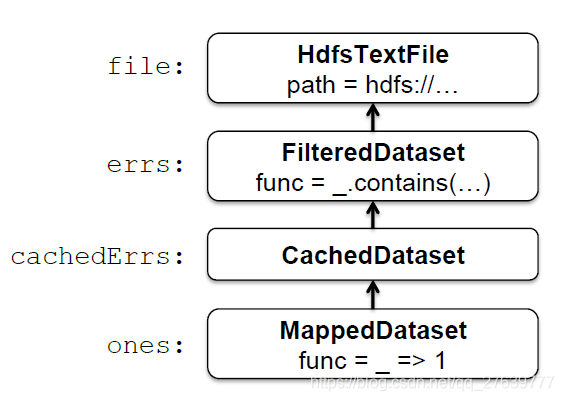
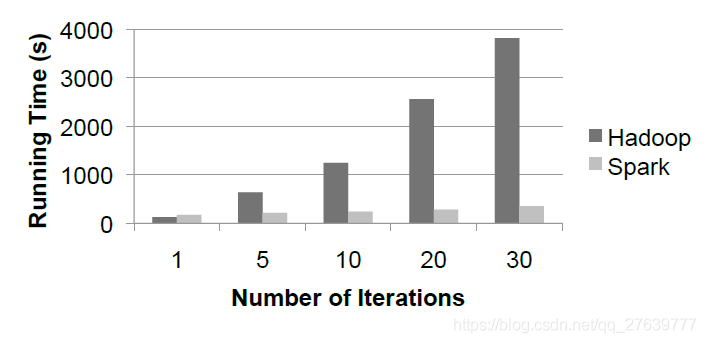

# Spark：使用工作集的集群计算

> https://blog.csdn.net/qq_27639777/article/details/98943695

# 摘要

MapReduce及其变体在商业集群上实现大规模数据密集型应用方面非常成功。但是，大多数这些系统都是围绕非迭代数据流模型构建的，而这种模型不适合其他流行的应用程序。本文重点介绍这样一类应用：在多个并行操作中复用一个工作集数据的应用。这包括许多迭代机器学习算法，以及交互式数据分析工具。我们提出了一个支持这类应用的名为Spark的新框架，同时保留MapReduce的可伸缩性和容错性。为了实现这些目标，Spark引入了一种称为弹性分布式数据集（RDD）的抽象。RDD是分区分布在一组机器上的一个只读对象的集合，如果一个分区数据丢失后可以重建。在迭代机器学习任务中，Spark的性能超过Hadoop 10倍，并且交互式查询39 GB数据集可以亚秒响应时间。

# 1. 简介

一种新的集群计算模型已经变得广泛流行，该模型中数据并行计算由不可靠机器组成的集群通过自动提供位置感知调度，容错和负载平衡的系统执行。MapReduce[11]开创了这个模型，而像Dryad[17]和Map-Reduce-Merge[24]这样的系统推广了所支持的数据流类型。这些系统通过提供一个可编程模型来实现其可扩展性和容错性，用户在其中创建非循环数据流图，来通过一组操作运算符传递输入数据。这允许底层系统管理调度并在没有用户干预的情况下对故障做出反应。虽然此数据流可编程模型对于一大类应用都很有用，但有些应用无法有效地表示为非迭代数据流。在本文中，我们关注这样一类应用：那些在多个并行操作中复用一组工作数据的应用。这是两个Hadoop用户报告MapReduce不足的用例：

- **迭代任务**：许多常见的机器学习算法将函数重复应用于同一数据集以优化参数（例如，梯度下降法）。虽然每次迭代都可以表示为MapReduce/Dryad任务，但每个任务都必须从磁盘重新加载数据，从而导致显着的性能损失。
- **交互分析**：Hadoop通常用于通过诸如Pig[21]和Hive[1]之类的SQL接口在大规模数据集上运行临时探索性查询。理想情况下，用户可以在多台机器上将感兴趣的数据集加载到内存中并重复查询。但是，对于Hadoop，每个查询都会产生很长的延迟（几十秒），因为它作为单独的MapReduce任务运行并从磁盘读取数据。

本文提出了一个名为Spark的新集群计算框架，它支持使用工作集的应用，同时提供类似MapReduce的可伸缩性和容错性。

Spark中的主要抽象是弹性分布式数据集（RDD），它表示分区分布在一组机器上的只读对象的集合，如果分区数据丢失则可以重建。用户可以显式在多台机器内存中缓存RDD，并在多个类似MapReduce的并行操作中复用它。RDD通过一个血缘的概念实现容错：如果RDD的一个分区数据丢失，则RDD具有关于其如何来自其他RDD的足够信息以重建该分区数据。尽管RDD不是一般的共享内存抽象，但它们代表了表达性方面与可扩展性、可靠性方面之间的最有效平衡点，并且我们发现它们非常适合各种各样的应用。

Spark使用Scala[5]语言实现，Scala是Java VM的静态类型高级编程语言，并且暴露了类似于DryadLINQ[25]的函数编程接口。此外，Spark可以在一个修订版本的Scala解释器中交互使用，它允许用户定义RDD，函数，变量和类，并在集群上的并行操作中使用它们。我们相信Spark是第一个允许以交互方式使用的、高效且多用途的编程语言来处理集群上的大规模数据集的系统。

虽然我们的Spark实现仍然是原型，但早期的系统体验令人鼓舞。我们证明了Spark在迭代机器学习工作负载中的性能优于Hadoop 10倍，并且可以交互式使用以亚秒级延迟扫描39 GB数据集。

本文的结构如下。第2节描述了Spark的编程模型和RDD。第3节展示了一些示例任务。第4节描述了我们的实现，包括我们与Scala及其解释器的集成。第5节介绍了早期成果。我们在第6节中介绍相关研究工作，并在第7节中以讨论结束。

# 2. 编程模型

为了使用Spark，开发者编写一个驱动程序来实现其应用的高级控制流以及并行启动各种操作。Spark为并行编程提供了两个主要的抽象：弹性分布式数据集和对这些数据集的并行操作（通过传递应用于数据集上的函数）。此外，Spark支持两种受限类型的共享变量，可以在集群上运行的函数中使用，我们将在后面解释。

## 2.1 弹性分布式数据集（RDD）

弹性分布式数据集（RDD）是分区分布在一组机器上的只读对象的集合，如果分区数据丢失则可以重建。RDD的元素不需要存在于物理存储中；相反，RDD的句柄包含足够的信息来从可靠存储中的数据开始计算得到该RDD。这意味着如果节点发生故障，始终可以重建RDD。

在Spark中，每个RDD都由一个Scala对象表示。Spark允许开发者通过四种方式构建RDD：

- 来自共享文件系统中的文件，例如Hadoop分布式文件系统（HDFS）。
- 通过在Driver程序中“并行化”Scala集合（例如，数组），这意味着将其划分成多个分片，并被发送到多个节点。
- 通过现有RDD的转换。具有类型A的元素的数据集可以使用名为flatMap的操作转换为具有类型B的元素的数据集，该操作将每个元素传递通过用户提供的类型函数：`A => List[B]`。其他转换也可以使用flatMap表示，包括map（将每个元素传递通过类型函数：`A => B`）和filter（筛选与条件匹配的元素）。
- 通过更改现有RDD的持久性。默认情况下，RDD是懒加载的和短暂存在的。也就是说，当数据集的分区在并行操作中使用时（例如，通过将文件的块传递通过map函数），数据集的分区是按需实现的，并且在使用之后从存储器中丢弃。但是，用户可以通过两个操作来更改RDD的持久性：
  - 缓存操作让数据集仍保持懒加载，但暗示它应在第一次计算后保留在内存中，因为它将被重用。
  - save操作会计算数据集并将其写入分布式文件系统（如HDFS）。保存的数据版本将在以后的操作中使用。

我们提示到我们的缓存操作只是一个暗示：如果集群中没有足够的内存来缓存数据集的所有分区，Spark会在使用它们时重新计算它们。我们选择了这种设计，以便在节点发生故障或数据集太大时Spark程序继续工作（降低性能）。这个想法与虚拟内存大致相似。我们还计划扩展Spark以支持其他级别的持久化（例如，跨多个节点的内存复制）。我们的目标是让用户在存储RDD的成本、访问RDD的速度、丢失RDD部分数据的可能性以及重新计算成本之间进行权衡。

## 2.2 并行操作

可以在RDD上执行的几个并行操作：

- reduce：使用关联函数合并数据集元素，以在Driver程序中生成结果。
- collect：将数据集的所有元素发送到Driver程序。例如，并行更新数组的简单方法是并行化、映射并收集数组。
- foreach：将每个元素传递通过用户提供的函数。这仅适用于函数的副作用（这可能是将数据复制到另一个系统或如下所述的更新共享变量）。

我们提示Spark目前不支持MapReduce中的分组reduce操作；reduce的结果只在一个进程（Driver程序）收集。我们计划未来在分布式数据集上使用“shuffle”转换来支持分组聚合，如第7节所述。但是，即使使用单个reducer也足以表达各种有用的算法。例如，最近一篇关于用于多核系统机器学习的MapReduce论文[10]在不支持并行聚合的情况下实现了数十种学习算法。

## 2.3 共享变量

开发者通过将闭包（函数）传递给Spark来调用map，filter和reduce之类的操作。正如函数式编程中的典型情况一样，这些闭包可以引用创建它们时可见范围中的变量。通常，当Spark在worker节点上运行闭包时，这些变量将复制到worker。但是，Spark还允许开发者创建两种受限类型的共享变量，以支持两种简单但常见的使用模式：

- Broadcast variables（广播变量）：如果在多个并行操作中使用一个大的只读数据（例如，查找表），则最好将其仅分发给worker一次，而不是将其与每个闭包一起打包。Spark允许开发者创建一个“广播变量”对象，该对象包装该数据并确保它只被复制到每个worker一次。
- Accumulators（累加器）：这些变量是worker只能使用关联操作“增加”，并且只有Driver程序才能读取。它们可用于实现MapReduce中的计数器，并为并行求和提供更强制的语法。可以为具有“增加”操作和“零”值的任何类型定义累加器。由于它们的“只加”语义，它们很容易实现容错。

# 3. 示例

我们现在展示一些Spark示例程序。请注意，我们省略了变量类型，因为Scala支持类型推断。

## 3.1 文本搜索

假设我们希望计算存储在HDFS中的大型日志文件中包含错误的行。这可以通过从文件数据集对象开始实现，如下所示：

```
val file = spark.textFile("hdfs://...")
val errs = file.filter(_.contains("ERROR"))
val ones = errs.map(_ => 1)
val count = ones.reduce(_+_)
1234
```

我们首先创建一个名为file的分布式数据集，它将HDFS文件表示为行集合。我们转换此数据集以创建包含“ERROR”（错误）的行集，然后将每行映射到1并使用reduce将这些1相加。filter、map和reduce的参数是Scala语法中的函数字面量。

请注意，errs和ones是从未物化的惰性RDD。相反，当调用reduce时，每个worker节点以流方式扫描输入block块以计算ones，将这些ones累加以执行本地聚合，并将其本地计数发送给Driver驱动程序。当以这种方式与惰性数据集一起使用时，Spark会紧密地模拟MapReduce。

Spark与其他框架的不同之处在于它可以使一些中间数据集在多操作间保存。例如，如果想复用errs数据集，我们可以从中创建一个缓存的RDD，如下所示：

```
val cachedErrs = errs.cache()
1
```

我们现在可以像平常一样在cachedErrs或从它派生的数据集上调用并行操作，但是节点会在第一次计算它们之后将cachedErrs的分区缓存在内存中，从而大大加快了对它的后续操作。

## 3.2 逻辑回归

以下程序实现了逻辑回归[3]，一种迭代分类算法，试图找到最佳分隔两组点的超平面w。该算法利用梯度下降法实现：它以随机值开始w，并且在每次迭代时，它在数据上将w的函数相加以沿着改善它的方向移动w。因此，跨迭代操作可以从缓存内存中的数据中极大地受益。我们没有详细解释逻辑回归，但我们用它来展示一些新的Spark功能。

```
// Read points from a text file and cache them
val points = spark.textFile(...).map(parsePoint).cache()
// Initialize w to random D-dimensional vector
var w = Vector.random(D)
// Run multiple iterations to update w
for (i <- 1 to ITERATIONS) {
  val grad = spark.accumulator(new Vector(D))
  for (p <- points) { // Runs in parallel
    val s = (1/(1+exp(-p.y*(w dot p.x)))-1)*p.y
    grad += s * p.x
  }
  w -= grad.value
}
12345678910111213
```

首先，虽然我们创建了一个名为points的RDD，但我们通过在它上面运行for循环来处理它。Scala中的for关键字相当于集合的foreach方法语法糖，循环体作为闭包。也就是说，`for(p <- points){body}`的代码等同于`points.foreach(p => {body})`。因此，我们正在调用Spark的并行操作foreach。

其次，为了加总梯度，我们使用一个名为gradient的累加器变量（值为Vector类型）。请注意，循环使用重载的`+=`运算符增加gradient值。累加器和语法的组合使Spark程序看起来很像命令式串行程序。实际上，这个例子与仅有三行的逻辑回归的串行版本不同。

## 3.3 交替的最小二乘

我们的最后一个例子是一种称为交替最小二乘法（ALS）的算法。ALS用于协同过滤问题，例如根据电影评级历史记录（例如Netflix挑战赛）预测用户对未看电影的评级。与前面的示例不同，ALS是CPU密集型而不是数据密集型。

我们简要地描述了ALS，读者可以参考[27]以获取详细信息。假设我们想要预测u个用户对m个电影的评级，并且我们有一个部分填充的矩阵R包含一些用户对电影的已知评级。ALS模型R为两个矩阵M和U的乘积，M和U的维数分别为m×k和k×u；也就是说，每个用户和每个电影具有描述其特征的k维“特征向量”，并且用户对电影的评级是其特征向量和电影的点积。ALS使用已知的等级求解M和U，然后计算M×U来预测未知的等级。这是利用以下迭代过程完成的：

1. 将M初始化为随机值。
2. 在给定M基础上优化U以最小化R上的误差。
3. 在给定U的基础上优化M以最小化R上的误差。
4. 重复步骤2和3直到收敛。

ALS可以通过在步骤2和3中更新每个节点上的不同用户/电影来并行化。但是，因为所有步骤都使用R，所以使R成为广播变量以使其不会被每次重新发送到每个节点是有帮助的。ALS的Spark实现如下所示。请注意，我们将0到u的集合（一个Scala范围对象）并行化，并收集它以更新每个数组：

```
val Rb = spark.broadcast(R)
for (i <- 1 to ITERATIONS) {
  U = spark.parallelize(0 until u)
           .map(j => updateUser(j, Rb, M))
		   .collect()
  M = spark.parallelize(0 until m)
		   .map(j => updateUser(j, Rb, U))
		   .collect()
}
123456789
```

# 4. 实现

Spark建立在Mesos[16,15]之上，这是一个“集群操作系统”，它允许多个并行应用程序以细粒度的方式共享集群，并为应用程序提供API以在集群上启动任务。这使得Spark可以与现有的集群计算框架（如Hadoop和MPI的Mesos端口）一起运行，并与它们共享数据。此外，在Mesos上构建大大减少了使用Spark必须的编程工作。

Spark的核心是弹性分布式数据集的实现。例如，假设我们定义一个名为cachedErrs的缓存数据集，表示日志文件中的错误消息，并使用map和reduce统计其元素，如第3.1节所述：

```
val file = spark.textFile("hdfs://...")
val errs = file.filter(_.contains("ERROR"))
val cachedErrs = errs.cache()
val ones = cachedErrs.map(_ => 1)
val count = ones.reduce(_+_)
12345
```

这些数据集将存储为保存有每个RDD血缘关系的对象链，如图1所示。每个数据集对象都包含指向其父级的指针以及有关如何转换得到父级的信息。

在内部，每个RDD对象实现相同的简单接口，该接口由三个操作组成：

- getPartitions，返回分区ID列表。
- getIterator(partition)，它遍历一个分区。
- getPreferredLocations(partition)，用于任务调度以实现数据局部性。



在数据集上调用并行操作时，Spark会创建一个任务来处理数据集的每个分区，并将这些任务发送到worker节点。我们尝试使用称为延迟调度的技术将每个任务发送到其首选位置之一[26]。一旦在worker上启动，每个任务都会调用getIterator来开始读取它的分区。

不同类型的RDD仅在它们实现RDD接口的方式上有所不同。例如，对于Hdfs-TextFile，分区是HDFS中block ID，它们的首选位置是块位置，getIterator打开一个流来读取块。在MappedDataset中，分区和首选位置与父级相同，但迭代器将map函数应用于父级每个元素。最后，在CachedDataset中，getIterator方法查找已转换分区的本地缓存副本，并且每个分区的首选位置开始等于父级的首选位置，但在某个节点缓存分区后更新，以便优先重新使用该节点。此设计使故障易于处理：如果节点出现故障，则会从其父数据集中重新读取其分区，并最终将其缓存在其他节点上。

最后，向worker发送任务需要向他们发送闭包 - 用于定义分布式数据集的闭包和传递的诸如reduce之类的操作闭包。为了实现这一点，我们依赖的Scala闭包是Java对象并且可以使用Java序列化进行序列化的事实; 这是Scala的一个功能，它使得将计算发送到另一台机器相对简单。但是，Scala的内置闭包实现并不理想，因为我们已经发现了一个闭包对象引用闭包外部作用域中的但实际未在闭包内使用的变量的情况。我们已经提交了一个关于此的错误报告，但与此同时，我们通过对闭包类的字节码执行静态分析来检测这些未使用的变量并将闭包对象中的相应字段设置为null来解决该问题。由于篇幅有限，我们省略了对此分析的细节。

## 4.1 共享变量

Spark中两种类型的共享变量，广播变量和累加器，是使用具有自定义序列化格式的类实现的。当使用值v创建广播变量b时，v将保存到共享文件系统中的文件中。b的序列化形式是此文件的路径。当在worker节点上查询b的值时，Spark首先检查v是否在本地缓存中，如果不在，则从文件系统中读取它。我们最初使用HDFS来广播变量，但我们正在开发一种更高效的流媒体广播系统。

累加器是使用不同的“序列化技巧”实现的。每个累加器在创建时都被赋予唯一的ID。保存累加器时，其序列化形式包含其ID和类型的“零”值。在worker上，为使用线程局部变量运行任务的每个线程创建累加器的单独副本，并在任务开始时重置为零。每个任务运行完成后，worker向Driver程序发送一条消息，其中包含对各累加器所做的更新。Driver程序仅对每个操作的每个分区应用一次更新，以防止在由于故障而重新执行任务时进行重复计数。

## 4.2 编译器集成

由于篇幅有限，我们只描述了如何将Spark集成到Scala编译器中。Scala编译器通常通过为用户键入的每一行编译一个类来操作。该类包含一个单例对象，该对象包含该行上的变量或函数，并在其构造函数中运行该行的代码。例如，如果用户输入`var x = 5`后跟`println(x)`，则编译器定义一个包含x的类（比如`Line1`），并使第二行编译为`println(Line1.getInstance().x)`。这些类被加载到JVM中以运行每一行。为了使编译器与Spark一起工作，我们进行了两项更改：

1. 我们使编译器输出它为共享文件系统定义的类，worker可以使用自定义Java类加载器从中加载它们。
2. 我们更改了生成的代码，以便每行的单例对象直接引用前一行的单例对象，而不是通过静态getInstance方法。这允许闭包捕获它们被序列化以发送给worker时所引用的单例的当前状态。如果我们没有这样做，那么对单例对象的更新（例如，上面示例中的行设置`x = 7`）将不会传播给worker。

## 5. 成果

尽管我们对Spark的实现仍处于早期阶段，但我们将三个实验的结果联系起来，这些实验表明了它作为集群计算框架的前景。

## 5.1 逻辑回归

我们将3.2节中逻辑回归任务的性能与Hadoop的逻辑回归实现进行了比较，在20个“m1.xlarge”EC2节点上使用29 GB数据集测试，每个节点有4个核。结果如图2所示。对于Hadoop，每次迭代需要127s，因为它作为独立的MapReduce作业运行。对于Spark，第一次迭代需要174s（可能是因为使用Scala而不是Java），但后续迭代只需要6s，因为每次迭代都会复用缓存数据。这使任务运行速度提高了10倍。



我们还尝试在任务运行时使某个节点崩溃。在10次迭代的情况下，这会使任务平均变慢50s（21％）。失败节点上的数据分区在其他节点上重新计算并缓存，但在当前实验中恢复时间相当高，因为我们使用了较大的HDFS块大小（128 MB），因此每个节点只有12个块， 恢复过程无法利用集群中的所有核。较小的块大小将产生更快的恢复时间。

## 5.2 交替的最小二乘

我们在3.3节中实现了交替最小二乘任务，以测试在迭代任务中将共享数据集复制到多个节点的广播变量的好处。我们发现，在不使用广播变量的情况下，每次迭代重新发送评级矩阵R的时间占据了大部分的任务运行时间。此外，通过简单的广播实现（使用HDFS或NFS），广播时间随着节点数量的增长而线性增长，从而限制了任务的可扩展性。我们实现了应用级多播系统来缓解这种情况。然而，即使使用快速广播，在每次迭代时重新发送R也是昂贵的。使用广播变量在worker的内存中缓存R，在30个节点EC2集群上的5000个电影和15000个用户的实验中将性能提高了2.8倍。

## 5.3 交互式Spark

我们使用Spark编译器在15个“m1.xlarge”EC2机器的内存中加载39 GB的维基百科数据，并以交互方式查询。第一次查询数据集时，大约需要35秒，与在其上运行Hadoop作业相当。但是，后续查询只需0.5到1秒，即使它们扫描所有数据也是如此。

# 6. 相关工作

## 6.1 分布式共享内存

Spark的弹性分布式数据集可以被视为分布式共享内存（DSM）的抽象，其已经被进行过广泛的研究[20]。RDD与DSM接口的区别有两方面。首先，RDD提供了一个更受限制的编程模型，但是如果集群节点发生故障，则可以有效地重建数据集。虽然一些DSM系统通过检查点[18]实现容错，但Spark使用RDD对象中保存的血缘关系信息重建丢失的RDD分区。这意味着只需要重新计算丢失的分区，并且可以在不同节点上并行重新计算它们，而无需程序恢复到检查点。此外，如果没有节点失败，则不会有日常开销。其次，和MapReduce[11]一样，RDD将计算推送到的数据侧，而不是让任意节点访问全局地址空间。

其他系统也限制了DSM编程模型提高性能、可靠性和可编程性。Munin[8]让开发者使用他们需要的访问模式来注解变量，以便为它们选择最佳一致性协议。Linda[13]提供了一种可以以容错方式实现的元组空间编程模型。Thor[19]提供了持久共享对象的接口。

## 6.2 集群计算框架

Spark的并行操作适合MapReduce模型[11]。但是，它们可以在能跨多个操作的RDD上运行。

Twister[6,12]也意识到扩展MapReduce以支持迭代作业的必要，即一个允许长时间的map任务能在作业之间将静态数据保存在内存中的MapReduce框架。但是，Twister目前没有实现容错。Spark对弹性分布式数据集的抽象既支持容错又比迭代MapReduce更通用。Spark程序可以定义多个RDD并在它们运行的操作之间交换操作，而Twister程序只有一个map函数和一个reduce函数。这也使Spark对交互式数据分析很有用，用户可以在其中定义多个数据集然后查询它们。

Spark的广播变量提供了类似Hadoop的分布式缓存的功能[2]，它可以将文件传播到运行特定作业的所有节点。但是，广播变量可以在多个并行操作中复用。

## 6.3 语言集成

Spark的语言集成类似于DryadLINQ[25]，它使用.NET对语言集成查询的支持来获取定义查询的表达式树并在集群上运行它。与DryadLINQ不同，Spark允许RDD在并行操作间保留在内存中。此外，Spark通过支持共享变量（广播变量和累加器）来丰富语言集成模型，使用具有自定义序列化形式的类实现。

我们使用Scala进行语言集成是受到SMR[14]的启发，它是一个用于Hadoop的使用闭包来定义map和reduce任务的Scala接口。我们对SMR的贡献是共享变量和更健壮的闭包序列化实现（如第4节中描述）。

最后，IPython[22]是为科学计算提供的Python解释器，它允许用户在集群上使用容错任务队列接口或底层消息传递接口启动计算。Spark提供了类似的交互式界面，但侧重于数据密集型计算。

## 6.4 血缘

获取数据集的血缘或起源信息长期以来一直是科学计算数据库领域的研究课题，用于解释结果等应用，允许其他人复制，如果在工作流程步骤中发现错误或数据集丢失了，则重新计算数据。读者可以参考[7]、[23]和[9]对这项工作的研究。Spark提供了一种受限制的并行编程模型，其中细粒度的血缘获取成本低廉，因此该信息可用于重新计算丢失的数据集元素。

# 7. 讨论及未来的工作

Spark为编程集群提供了三种简单的数据抽象：弹性分布式数据集（RDD）和两种受限类型的共享变量：广播变量和累加器。虽然这些抽象是有限的，但我们发现它们足够强大，可以表达几个对现有集群计算框架构成挑战的应用，包括迭代和交互式计算。此外，我们认为RDD背后的核心思想是数据集句柄，它具有足够的信息来（重新）从可靠存储中可用的数据构建数据集，可能在开发编程集群的其他抽象时非常有用。

在未来的工作中，我们计划关注以下四个方面：

1. 正式地表征RDD的属性和Spark的其他抽象，以及它们对各类应用程序和工作负载的适用性。
2. 增强RDD抽象，允许开发者在存储成本和重建成本之间进行权衡。
3. 定义转换RDD的新操作，包括通过给定键重新分区RDD的“shuffle”操作。这样的操作将允许我们实现分组和连接。
4. 在Spark解释器之上提供更高级别的交互式接口，例如SQL和R[4] shell。

# 8. 致谢

我们感谢Ali Ghodsi对本文的反馈。这项研究得到California MICRO, California Discovery, the Natural Sciences和Engineering Research Council of Canada以及以下Berkeley RAD Lab赞助商的支持：Sun Microsystems, Google, Microsoft, Amazon, Cisco, Cloudera, eBay, Facebook, Fujitsu, HP, Intel, NetApp, SAP, VMware, and Yahoo!。

# 参考文章

1. Apache Hive. http://hadoop.apache.org/hive.
2. Hadoop Map/Reduce tutorial. http://hadoop.apache.org/common/docs/r0.20.0/mapred tutorial.html.
3. Logistic regression – Wikipedia. http://en.wikipedia.org/wiki/Logistic regression.
4. The R project for statistical computing. [http://www.r-project.org](http://www.r-project.org/).
5. Scala programming language. [http://www.scala-lang.org](http://www.scala-lang.org/).
6. Twister: Iterative MapReduce. [http://iterativemapreduce.org](http://iterativemapreduce.org/).
7. R. Bose and J. Frew. Lineage retrieval for scientific data processing: a survey. ACM Computing Surveys, 37:1–28, 2005.
8. J. B. Carter, J. K. Bennett, and W. Zwaenepoel. Implementation and performance of Munin. In SOSP ’91. ACM, 1991.
9. J. Cheney, L. Chiticariu, and W.-C. Tan. Provenance in databases: Why, how, and where. Foundations and Trends in Databases, 1(4):379–474, 2009.
10. C. T. Chu, S. K. Kim, Y. A. Lin, Y. Yu, G. R. Bradski, A. Y. Ng, and K. Olukotun. Map-reduce for machine learning on multicore. In NIPS ’06, pages 281–288. MITPress, 2006.
11. J. Dean and S. Ghemawat. MapReduce: Simplified data processing on large clusters. Commun. ACM, 51(1):107–113, 2008.
12. J. Ekanayake, S. Pallickara, and G. Fox. MapReduce for data intensive scientific analyses. In ESCIENCE ’08, pages 277–284, Washington, DC, USA, 2008. IEEE Computer Society.
13. D. Gelernter. Generative communication in linda. ACM Trans. Program. Lang. Syst., 7(1):80–112, 1985.
14. D. Hall. A scalable language, and a scalable framework. http://www.scala-blogs.org/2008/09/scalable-languageand-scalable.html.
15. B. Hindman, A. Konwinski, M. Zaharia, A. Ghodsi, A. D. Joseph, R. H. Katz, S. Shenker, and I. Stoica. Mesos: A platform for fine-grained resource sharing in the data center. Technical Report UCB/EECS-2010-87, EECS Department, University of California, Berkeley, May 2010.
16. B. Hindman, A. Konwinski, M. Zaharia, and I. Stoica. A common substrate for cluster computing. In Workshop on Hot Topics in Cloud Computing (HotCloud) 2009, 2009.
17. M. Isard, M. Budiu, Y. Yu, A. Birrell, and D. Fetterly. Dryad: Distributed data-parallel programs from sequential building blocks. In EuroSys 2007, pages 59–72, 2007.
18. A.-M. Kermarrec, G. Cabillic, A. Gefflaut, C. Morin, and I. Puaut. A recoverable distributed shared memory integrating coherence and recoverability. In FTCS ’95. IEEE Computer Society, 1995.
19. B. Liskov, A. Adya, M. Castro, S. Ghemawat, R. Gruber, U. Maheshwari, A. C. Myers, M. Day, and L. Shrira. Safe and efficient sharing of persistent objects in thor. In SIGMOD ’96, pages 318–329. ACM, 1996.
20. B. Nitzberg and V. Lo. Distributed shared memory: a survey of issues and algorithms. Computer, 24(8):52 –60, aug 1991.
21. C. Olston, B. Reed, U. Srivastava, R. Kumar, and A. Tomkins. Pig latin: a not-so-foreign language for data processing. In SIGMOD ’08. ACM, 2008.
22. F. P´erez and B. E. Granger. IPython: a system for interactive scientific computing. Comput. Sci. Eng., 9(3):21–29, May 2007.
23. Y. L. Simmhan, B. Plale, and D. Gannon. A survey of data provenance in e-science. SIGMOD Rec., 34(3):31–36, 2005.
24. H.-c. Yang, A. Dasdan, R.-L. Hsiao, and D. S. Parker. Map-reduce-merge: simplified relational data processing on large clusters. In SIGMOD ’07, pages 1029–1040. ACM, 2007.
25. Y. Yu, M. Isard, D. Fetterly, M. Budiu, U´ . Erlingsson, P. K. Gunda, and J. Currey. DryadLINQ: A system for general-purpose distributed data-parallel computing using a high-level language. In OSDI ’08, San Diego, CA, 2008.
26. M. Zaharia, D. Borthakur, J. Sen Sarma, K. Elmeleegy, S. Shenker, and I. Stoica. Delay scheduling: A simple technique for achieving locality and fairness in cluster scheduling. In EuroSys 2010, April 2010.
27. Y. Zhou, D. Wilkinson, R. Schreiber, and R. Pan. Large-scale parallel collaborative filtering for the Netflix prize. In AAIM ’08, pages 337–348, Berlin, Heidelberg, 2008. Springer-Verlag.