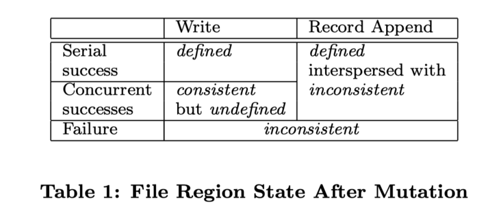
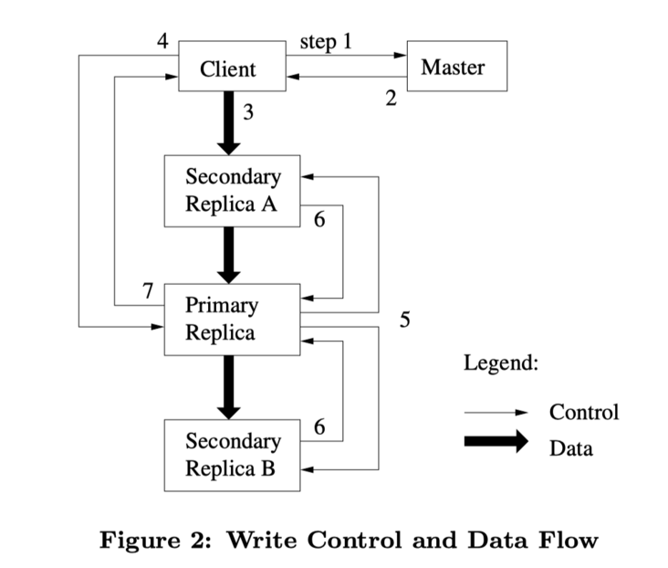
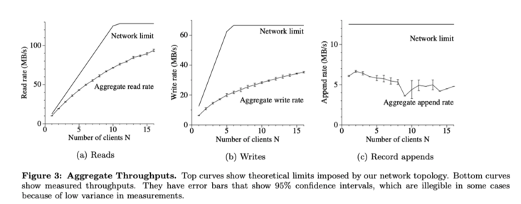
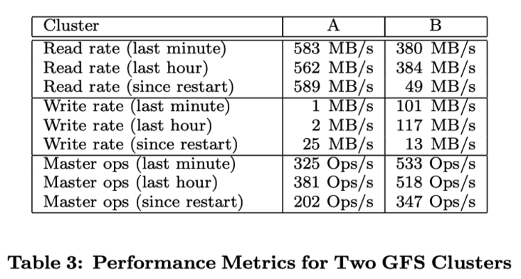
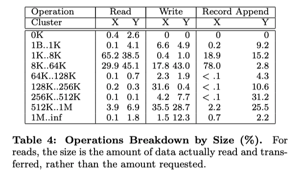
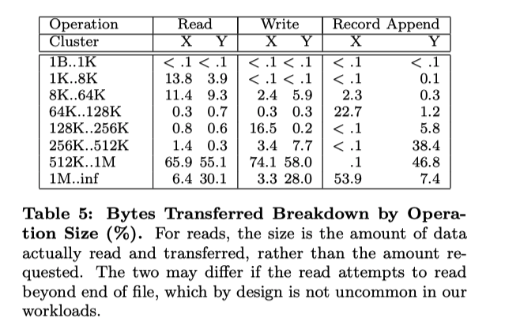
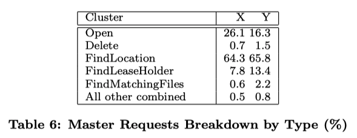

# [The Google File System（个人翻译）](https://segmentfault.com/a/1190000023309479)

该paper是2003年Google发表在SOSP（Symposium on Operating Systems Principles-计算机系统领域的顶会）的论文《The Google File System》个人翻译。作为Hadoop时代的三架马车之一，对当前分布式系统诸多问题的解决方案具有很重要的意义。

> 个人翻译不易，转载请备注！

# **谷歌文件系统**

Sanjay Ghemawat, Howard Gobioff, and Shun-Tak Leung （谷歌）~~~~

## **摘要**

 我们已经设计并实现了google文件系统，它是一个适用于有着大量数据的数据密集型应用的文件系统。它提供了在低成本硬件设备上的运行的容错功能，以及可以在大量客户端面前呈现出高的整体性能。

 尽管它与之前的一些分布式文件系统有着许多共同目标，但是通过对我们程序负载情况以及当前和未来的技术环境的考察，发现我们想要的设计和一些早期的文件系统所设想是不一样的，这让我们不得重新审视传统的设计选择，并探索出一些从根本上不同的设计观点。

 目前这个文件系统成功的满足了我们的存储需求，他已经广泛的被应用部署于我们的一些存储平台（那些需要大数据集的研究和开发）服务上用于数据的生产和处理。迄今为止我们最大的集群已经在超过一千台的机器及数千块硬盘上提供上百TB的数据存储服务，同时可以被数百个客户端并发去访问。

 在本论文中，我们将提供为了支持分布式应用程序的文件系统扩展接口设计，并对我们设计的许多方面展开讨论，展示微基准（微基准是一个旨在衡量非常小以及特定代码性能的基准，基准测试是实现对一类测试对象的某项性能指标进行定量的和可对比的测试）和现实中使用的一些测量数据报告。

## **1.简介**

 我们已经设计和实现了GFS（谷歌文件系统）去满足谷歌飞速增长的数据处理需求，GFS和之前的许多分布式系统有许多共同的目标，比如：性能，可扩展，可靠性，可用性。但是，驱动GFS的设计的还有对我们程序的工作负载和技术环境的观察，所以说现在包括可预见的将来，GFS都和早期分布式系统所设计的设想有显著的不同。我们重新审视了传统的一些设计选择，并探索了一些从根本上不同的设计点。

 第一，**组件的失效应该是常态的而不是意外事件。**文件系统是建立在由成百上千的廉价机器构成的存储介质，并被成百上千的机器访问着。这些机器的组件无论数量还是质量都很难保证在任意时间都能提供功能，以及一些组件可以自动从失败状态恢复过来。我们已经见过很多问题：比如程序的bug，人为的错误以及磁盘的错误，操作系统的bug，内存，连接器，网络，以及电力供应。因此，持续的监控，错误检测，容错，以及自动恢复这些特性必须集成在整个文件系统里面。

 第二，以传统的标准来看，我们的**文件十分的大**，数GB的文件是家常便饭。每个文件通常包含许多的程序对象如web文档，当我们定期操作由数十亿数据对象快速增长构成的数TB的数据集时候，即使文件系统支持，操作数十亿的kb大小的文件也是很慢的很笨重的。所以，**设计的假设条件和某些模块的参数，比如IO的操作，数据块大小这些设计元素都需要被重新考虑**。

 第三，**大部分文件变更都是通过追加文件内容而不是重新写入的**。对一个文件随机写这种事件几乎不会发生！一旦写入，这个文件就是只读的，并且通常是顺序读（大量的数据其实都符合这种特性）。 这些数据文件可能是大量的数据分析和程序扫描的仓库组成，可能是运行中的应用程序不断产生的数据流，可能是一些打包归档的文件，也可能是一些由一个机器生成的结果（该结果需要立刻实时或者稍有延迟的被另一个机器处理）。如果针对这些大数据都具备这样的访问模式（append模式），那么当对客户端请求的数据块缓存失效了，数据的append操作就是性能优化和操作原子性的关键。

 第四，应用程序和文件系统API的协同设计，提高了整个系统的灵活性。比如我们通宽松GFS的一致性模型从而极大的简化的文件系统并且没有给应用程序带来繁重的负担。我们也**引进了一个原子性的append操作**，这样多个客户端就可以并发的对文件append数据而不需要额外的同步。这些都会在论文的后面做详细的讨论。

 大量的GFS集群目前已经部署并服务于不同的目的任务。其中最大的一个集群有超过1000个存储节点，超过300T的磁盘。并且被数百个客户端在不同的机器上大量的持续不断的访问着。

## **2.设计概述**

### **2.1设计概述**

 为了设计一个满足我们需求的文件系统，我们需要以前面提到的那些具有挑战和机遇的假设为指南。上面我们已经提到了一些关键的关注点，现在我们将更加详细的描述我们的假设。

- 首先，这个文件系统**应该是建立在大量廉价的机器组件上的**，当然这些组件也经常会失败。所以就必须不停的自我监控从而能在日常基本工作中可以快速的对组件失败进行检测->容错->恢复。
- 该文件系统**只存储适量的大文件**，我们希望有数百万个文件，每个基本在100M或者更大点。对于上GB的文件也会是一个普遍的情况应该可以被高效的管理，小文件当然也必须支持，只不过我们不需要去优化他们。
- 文件系统的主要负载主要包含这两种读请求：**大的顺序流式读取和小的随机读取**。在大的流式读取中，单个操作一般读取几百KB或者上M的数据。来自同一个客户端的连续请求通常是通过不断读取一个文件的临近区域。而一个小的随机读取一般是读取某个任意偏移位置上几KB数据。一个具有性能意识的程序会将这些小的读取批化，并且重新编排这些读取操作使得读取可以高效稳定的顺序穿过文件，而不是来回跳跃的读取。
- 文件的系统的负载还有一部分来自于很多大量的、顺序的对文件进行追加写。通常这些写操作的数据量大小和读类似。**一旦写入，文件就很少被修改。**我们需要支持随机写请求但是不需要保证其效率性能。
- 系统必须对**多个客户端同时并发的追加同一个文件提供良好的实现**。我们的文件经常被用于如生产者-消费者队列或者做**多路归并**。数百个生产者，一人一个机器，将会并发的对一个文件进行追加。所以**最小化的同步机制的原子性是很有必要的**。文件应该稍后可以被读取，或者消费者同时的进行读取到文件。
- **高持久的带宽比低延迟更加重要**，我们大多数程序的目的是能够高速率的批量处理数据，很少对单个读写操作的响应时间有严格的要求。

### **2.2接口**

 GFS提供了给人很熟悉一个的文件系统接口，尽管他并没有实现一个像POSIX那样的统一标准的API 【Portable Operating System Interface of UNIX（可移植操作系统接口），POSIX标准定义了不同操作系统对应上层应用程序统一标准的接口】。GFS中文件是按照目录分层级组织的，并通过文件路径名来标识。我们支持文件的常用操作如：创建，删除，打开，关闭，读取，写入操作。

 此外，GFS有快照和操作记录追加机制。**快照是一个以最低开销创建一个文件和目录树的拷贝。记录追加允许多个客户端同时向同一个文件并发的追加数据，并能保证每个客户端追加操作的原子性。**对于实现一个多路合并结果及生产者消费者队列这很有用，客户端可以并发的添加数据而不需要做额外的加锁操作。我们发现GFS所设计的这种文件类型，对于构建大型的分布式应用程序有无法估计的价值。快照 和 记录追加 将会在3.4和3.3节分别作详细讨论。

### **2.3架构**

 一个GFS集群包含一个master，多个chunkservers服务，可以被多个客户端访问。如图一所示：

 这上面每一个服务通常都运行在一个单独的Linux机器的用户级进程中。当然我们也可以运行客户端和chunkserver在一个机器上面，只要机器的资源允许以及可以接受运行可能不稳定的应用程序代码所带来的低可靠性。（意思就是部署的程序可能可靠性差，把机子搞崩了就连带chunkserver也炸了）。

 **文件被划分成固定大小的chunk**。每个chunk是由master在该chunk被创建时分配的一个不可变的、全局唯一的64bit句柄（chunk handle）来标识。Chunkserver将chunk作为linux文件存储在本地，对于chunk数据的读写通过chunk handle和指定字节范围来确定。为了可靠性，每个chunk将会被备份到多个chunkserver上，默认的我们存储三个备份。当然用户也可以对文件不同的命名空间区域自定义不同的备份级别。

 **Master维护所有文件系统的元数据**。包括：名字空间，访问控制信息，文件与chunks的映射信息，chunks的当前位置。它也控制系统范围内的一些活动，比如chunk租赁管理，孤立无引用的chunk的垃圾回收，chunkserver间chunk的迁移。Master与chunkserver通过周期性的心跳进行通信，从而发送指令和获取chunkserver的状态。

 实现了文件系统API的应用程序通过**GFS客户端**和GFS的master和chunkserver进行连接进行通信进行数据读写操作。客户端如果需要操作元数据则需要与master通信，其他的所有的纯数据的通信直接与chunksever通信。我们没有提供POSIX API，因此也就不需要与linux vnode layer关联【unix文件节点】。

 **客户端和chunkserver都不会进行文件数据缓存。**客户端做缓存只能提供很小的好处，因为大部分的应用需要流式读取整个文件或者工作的数据集太大了根本没法缓存。没有这些缓存简化了客户端和整个系统，消除缓存一致性的问题(但实际上客户端会缓存元数据)。Chunkserver也不需要缓存文件数据，是因为chunk是作为本地存储文件，Linux自带机制已经帮我们把那些经常访问的数据缓存在内存中了。

### **2.4 单Master**

 一个单独的master极大的简化了我们的设计，使得master可以通过它对集群全局的理解来合理的安排chunks和副本位置的选择。但是我们必须最小化master在读写操作中的相关性，使得master不会成为一个性能的瓶颈。 客户端不会从master节点来读取和写入文件而是向master询问它应该联系哪一个chunkservers。并且这个交互的关联信息会被在一个限定的时间内缓存以用于随后的许多操作可以直接使用缓存的关联信息。

根据图1我们来描述一次简单的读流程是怎么进行交互的：

- 首先，通过固定大小的chunk size，客户端从程序中指定的文件名和偏移的字节量解析出文件的chunk index。
- 然后，他会向master发送一个包含文件名和chunk index的请求。master会返回请求对应的chunk句柄（后面都翻译为chunk handle）和chunk副本的位置信息。客户端会缓存这些信息，以文件名和chunk index为key。
- 随后，客户端会向其中一个副本节点发送请求（通常是离客户端最近的那个）。该请求指定了chunk handle和一个该chunk的字节范围。后面的所有对该chunk的请求就不在需要和master再进行交互了直到缓存过期或者该chunk的文件被重新打开过。

实际上，客户端通常一次性请求多个chunks的信息，master也能将这些chunks信息一并返回回来。这些额外的信息几乎没有任何额外消耗，但可以很好的免除将来master和client许多次通信。

### **2.5 Chunk大小**

 Chunk 大小是设计参数中一个关键点。我们选择了**64M为默认大小**，它远远大于通常的文件系统块。每一个chunk的副本是一个简单的Linux文件被存在chunkserver上，并只有在需要的时候才扩展。这种惰性空间分配（lazy space allocation）避免了因为内部空间碎片造成的空间的浪费，碎片最大可能有一个chunk size那么大。

**大的chunk size具有几个很重要的优点：**

 第一点，他减少了客户端和master通信的次数。因为在一个chunk上的读和写只需要最初的一次和master请求的chunk位置信息【chunk越大，那么包含的内容也就越多，需要的chunk location信息也就越少】，这种交互的减少对我们系统负载来说是十分的重要的。因为我们的上层程序一般操作都是顺序读取大文件。即使是对那些少量的随机读，客户端也可以很轻松的缓存一个几TB的工作数据集的所有的chunk位置信息。

 第二点，因为chunk很大，一个客户端就很大可能只会在一个chunk上执行全部的操作了，这样可以通过保持一个持久的TCP长连接从而减少网络的开销。

 第三点，他减少了在master中存储的元数据的体积，这样可以运行我们保持所有的元数据在内存中，这所带来的好处我们会在2.6.1节作讨论。

 另一方面，一个大的chunk size，即便采用了lazy space allocation也有着他的缺点。比如对于一个小文件只有几个chunk，或者只有一个chunk的，如果有大量的客户端需要访问这个文件那么这个chunk所在的servers就会成为热点。但实际实操中，热点并不是我们一个主要的问题毕竟我们的程序大部分都是顺序读大的多chunk的文件。

 但是，**热点问题**在GFS在第一次被一个批处理队列系统使用的时候确实暴露出来了：一个可执行文件被写入GFS的一个单chunk文件中，随后同时启动了上百台机器，那个存储了这个执行文件的chunkserver很快就被数百个同时请求给整超载了。我们当时通过给该执行文件提高更高的副本数量并将那批处理队列系统的启动时间进行错开解决了这个问题。但是长远的解决方法应该是在这种情况下，允许客户端从其他的客户端读取数据【而不是一窝蜂的压力都给在chunkserver上】。

### **2.6 元数据**

 **master节点主要存储三种类型的元数据：文件和chunk的命名空间（namespace），文件和chunk的映射关系（mapping），每个chunk副本的位置（location）。**所有的元数据都存在master的内存中的。前两中（namespace和mapping）还被被持久化到一个记录了变更操作的操作日志中并存储在master的本地磁盘上同时备份到远程机子上去。使用这样的一个日志允许我们更新master的状态简单、可信赖、并且不需要担心master宕机后状态的不一致【得益于log副本】。master节点并不持久化chunk的位置信息而是在启动的时候主动去询问每一个chunk，以及每个chunkserver加入集群的时候获取。

#### **2.6.1 内存数据结构**

 因为元数据是存在内存中的，所以master的操作是十分快的。因此，master可以很容易并且高效的在后天对他整个状态做周期性的扫描，这个周期性一般是做chunk的垃圾回收，chunkserver失败时候重新备份，以及为平衡负载和磁盘空间在chunkserver之间chunk的迁移。在4.3，4.4节我们会进一步讨论这些活动。

 这种纯内存方式的设计存在一个潜在的限制就是chunk的数量，因此整个集群的的容量受限于master有多大的内存。但实际上这并不是一个严重的限制，**master对每个64M的chunk保存的元数据小于64KB**。大部分的的chunk是满的，因为大部分的文件都包含多个chunk，所以也就只有最后一个chunk可能是不满的。类似的，每个文件所对应的namespace也通常小于64KB因为他保存时候会采用前缀压缩算法进行压缩。

 如果需要支持更大的文件系统，只需要对master添加额外的内存就行了，这点开销和元数据全部存在到内存所带来的简单，可靠，性能和灵活性比起来只是一笔很小的代价。

#### **2.6.2 chunk位置**

 master并不会对一个给定的chunk有哪些chunkserver保存了他的一个副本的信息保存一个持久化的记录。他只会在他启动的时候，简单的从chunkserver拉取过来这些信息。master通过周期性的心跳检测来监控chunkserver从而控制所有chunk的放置，并且master可以保证自己信息是更新了的。

 一开始我们也尝试了把chunk的位置信息给持久化到master上去，但是我们发现如果在启动的时候以及后面周期性的去获取这些信息这样更加简单，因为这样避免了当chunkserver在加入和离开集群，改名，失败，重启等情况下master和chunkserver之间的需要进行同步。在一个数百台服务器的集群中，这些事故太经常了发生了。

 理解这个设计决定的另一个方式是明白一个chunkserver对他磁盘上的chunks是否有最终的发言权，在master去维护一套这些信息的一致性视图是没有意义的：因为一个chunkserver上的发生的错误可能会让他上面的chunk不可见（比如一个磁盘可能损坏了或者不可用了），又或者是一个操作可能重新命名了一个chunkserver。【这段比较难以理解：主要阐述了为什么不在master上持久化位置信息？主要因为这些信息不稳定，不像之前提的那两种那么稳定，对每个chunkserver自己的状态依赖太大，一旦chunkserver出了故障，master没法及时或者自动的感知到哪些chunk有问题了，这时候按照持久化记录的那个再去获取chunk就有问题了。所以持久化没有太大意义，不如定时去获取最新的】

#### **2.6.3 操作日志**

 **操作日志包含了关键的元数据变更的历史记录，这是GFS的核心**。他不止是元数据变化的唯一持久化记录，他也定义了那些并发操作在逻辑时间上的时间线。文件，chunks以及他们的版本（见4.5节）这些都在他们被创建时唯一且永久的被对应的逻辑时间所标识。

 所以操作日志是十分关键的，我们必须可靠的保存。不能在元数据变更还没有被持久化之前对客户端可见。否则，我们将会丢失整个文件系统或者客户端最近的操作，即使chunkserver还保存着。所以我们将其备份到多个远程的机器上并且在对一个客户端作回应前必须保证该操作的日志已经被刷写到本地和远程磁盘上了。master在刷写前会批处理多个日志记录一起进行刷写，从而减少刷写和复制对整个系统吞吐量的影响。

 Master通过重放操作日志来恢复文件系统。为了最小化启动时间 ，我们必须保持log在很小的规模。**master会在日志增长超过一定的大小的时候对当前状态设置一个检查点（checkpoints）**，master就可以从本地磁盘上最近的那一次checkpoint进行恢复，这样读取的日志记录就在一个被限制的范围内了。**checkpoint是一个压缩的类B-Tree结构**，可以被直接映射到内存中并用于namespace的查找，都不需要额外的解析。这个大大的提高了GFS的恢复速度和可用性。

 因为创建一个checkpoint需要消耗一些时间，所以master内部状态的结构是按这么样的一个设计来的：可以既无延时接受不断的变化又可以去创建一个新的检查点。master会启动一个新的线程切到一个新的日志文件去创建检查点。这个检查点包含了系统所有的变更，对一个包含了百万文件的集群只要几分钟就能完成。在创建结束后，它会被同时写到本地和远程磁盘上。

 恢复只需要最新的检查点和之后的日志文件。更老的检查点和日志文件可以随便删除，尽管我们会保存一些来预防一些事故灾难。在创建检查点的时候发生失败并不会影响系统的准确性，因为恢复的代码会检查并跳过不完整的检查点。

### **2.7 一致性模型**

 GFS使用了一个**宽松的一致性模型**来支持我们高分布式的应用程序，但实现起来也相对于简单和高效。现在我们讨论下GFS的一致性保证，以及这对程序来说意味着什么。我们也会着重讲GFS是如何维护这些保证的，但是这些细节会留在论文的其他部分。

#### **2.7.1 GFS的保证**

 文件的namespace的变更（比如文件的创建）是原子性的。他们只被master处理：命名空间锁保证了原子性和准确性（4.1节）；master的操作日志定义了全局全部操作的顺序（2.6.3节）。

 在一个数据变更后，文件区域的状态取决于该变更操作的类型。不管他是成功还是失败，或者是并发的变更的。表1是对结果的一个概述。如果所有的客户端总是看见同样的数据，不管他们是从哪一个副本读取的数据那么该文件区域便是一致的。一个文件数据变更后是一致的那么所有的客户端应该都能看到该变更的写入，这时候该文件区域就已定义的。当一个变更成功并没有被其他的并发写操作影响，那么这个被影响的区域就是已定义的（也就是一致的）：所有的客户端会看到变更的写入。**并发的成功更改会让区域处于未定义但是是一致的，**所有的客户端看见的是同样的数据，但这不意味着任何一个变更已经写入了(如果变更是针对相同的数据写这样有的变更就会被新的变更所覆盖，这样用户就无法看到最先的变更了，同时发生在跨chunk的操作会被拆分成两个操作，这样这个操作的一部分可能会被其他操作覆盖，而另一部分则保留下来，如3.1节末尾所述)。通常的，他看到的是多个变更组合后的结果。一个失败的变更会使区域在一个非一致状态（因此也是未定义）：不同的客户端可能会看见不同的数据。我们下面会描述我们的程序如何已定义的区域和未定义的区域。应用程序不需要进一步去区分未定义区域的不同种类。

 数据的变更可能是写入或者记录的追加。一个写操作的数据会写入到程序指定的偏移位置上。一个记录的追加会将数据原子的追加，即使是并发的变更也会至少被追加一次，但是偏移位置由GFS来选择（见3.3节）。（而客户端会认为一个通常的追加是在当前文件的尾部写入一个偏移量位置的数据）偏移会返回给客户端，来标记包含了那条记录的已定义区域的开始位置。另外，GFS可能会在他们之间插入一些padding或者记录的副本。他们会占据被认为是不一致的区域，并且通常比用户数据小的多。

 在一系列成功变更后，变更的文件区域可以被保证是已定义的并包含了最后一次变更记录的写入。GFS通过两步来实现：a.将这些变更以相同的顺序应用到该chunk的所有副本上（见3.2节），b. 使用chunk的版本号来检测所有已经变旧的副本（可能是因为chunkserver挂了的时候导致chunk丢失了变更信息，见4.5节）。旧的副本永远都不会参与任何变更以及客户端向master询问chunk位置的信息的返回。他们会被优先进行垃圾回收掉。

 因为客户端缓存了chunk的位置信息，他们可能会在本地信息更新前读到旧的副本上去。这个本地缓存信息（原文window）由缓存的超时时间和文件下一次打开的时间所限制，文件打开会清除该文件在缓存中所有的chunk信息。此外，我们的大部分操作都是only-append操作，一个旧的副本通常会返回一个chunk早期append结束位置的数据而不是一个已经发生更新过时的数据。当读方重试和master联系的时候，可以理解得到当前chunk的位置信息。

 在一个变更成功很久之后，组件失败仍然可能污染和损坏数据。GFS通过周期性的在master和所有的chunkserver间握手来找到那些失败的chunkserver，并且通过校验和（checksum）来检测数据的污染（见5.2节）。一旦问题暴露，数据会尽可能快的从正确的副本中恢复（4.3节）。只有当一个chunk在GFS对污染做出反应之前该chunk的所有副本数据已经全部丢失，这个chunk的丢失才是不可逆的，而通常GFS的反应时间在分钟内的。即便是在这种情况下：chunk已经不可用，但是没有被污染：应用程序还是可以收到清楚的错误信息而不是污染了的数据。

#### **2.7.2 应用程序的影响**

 GFS应用程序可以通过使用一些简单的技术来适应这种宽松的一致性模型，这些技术点都是为了某些目的：依赖append而不是覆盖写，checkpoints，自我写校验，自我记录标识。

 事实上，所有我们的程序修改文件都是通过append而不是overwrite。在一个典型的使用场景：一个writer会从头到尾生成一个文件。当它写完所有的数据的时候会对该文件原子性的重命名为一个永久的名字，或者周期性的通过检查点来检查有多少数据已经被成功写入。checkpoints可能会也包含应用级的校验和。reader只验证和处理最后一个checkpoints之前的文件区域，因为这些区域是处于已定义的状态了。尽管存在一致性和并发性问题，但这种方法对我们很有用。与随机写入相比，append要高效得多，对应用程序故障的响应能力也更强。checkpoints允许writer增量性地重新启动写（不需要每次都从头开始），并防止reader处理虽然成功写入了但是从应用程序的角度来看仍然不完整的文件数据。

 在另一种典型用法中，许多writer并发的append到一个文件以合并结果或作为生产者 - 消费者队列。 记录append操作的append-at-least-once语义保证了每个writer的输出。reader处理偶尔的填充和重复，如下所示。 writer为每条记录准备了比如校验和等额外的信息，以便验证其准确性。 reader可以使用校验和来识别和丢弃额外的填充和记录片段。 如果它不能容忍偶然的重复数据（例如，如它们可能触发非幂等操作），可以使用记录中的唯一标识符来过滤它们，这通常需要命名相应的应用程序实体（例如一个web文档）。 这些记录的I/O功能函数（除了重复删除）都在我们的应用程序共享的库代码中，并适用于Google的其他文件接口的实现。 有了这个，相同的记录序列，加上罕见的重复记录，总是会被传递给reader。

 在以上的描述中，存在一个基本的假定：数据是以record形式存储的，而且通常这些record都是可以重复的，比如一个网页文档我们可以重复存，这对于数百亿的网页文档来说，存储少数多余的很正常，也就是说这些数据通常是文本，而不是二进制，所以我们才可以在append或者写时用记录的副本来覆盖非一致的区域，所以提供了append的append-at-least-once语义，因为append二次也是可以的。如果我们要保证唯一性，可以在应用层增加逻辑。*【这一段基本没看懂】*

## **3. 系统交互**

我们设计这个系统的目的是为了最小化master在所有操作中的相关度。在这个前提下，我们现在来讨论下client，master以及chunkservers 是如何交互来实现数据的变更，record的原子append，以及快照的。

### **3.1 租约（Lease）和变更顺序**

一个变更就是一个修改chunk的内容或者让元数据的操作，比如一个写或者append操作。每个变更都需要在所有的副本上执行。我们使用租约来维持多个副本间变更顺序的一致性。Master授权给其中一个chunk租约，我们叫做主副本（primary）。主副本会对该chunk的所有变更选择一个顺序，然后所有的副本就会按照这个顺序去应用这些变更。因此，全局的变更顺序首先由master来选择租约授权的顺序来确定的（如果多个chunk修改，master顺序对给他们进行租约授权，授权其实就是选一个primary来进一步处理），然后在一个租约里面的是交给primary副本来定义操作顺序的。

这个授权机制是为了最小化master的管理开销所设计的。一个租约有60s的超时时间设置。但是只要这个chunk正在发生变更，主副本就可以和master请求延长租约。这些扩展的请求和授权通常是通过master和chunkserver的心跳信息一起发送的。master有时候可能想在租约到期前撤销租约（比如master想要停止对一个被重命名的文件进行变更操作）。即使master和主副本失去通信，该机制可以让master安全的在旧的租约过期后，授权一个新的租约给新的副本。

在图2中，我们按照下面的顺序步骤来阐述一个写操作的过程。

\1. 客户端会请求master哪一个chunkserver持有当前的租约，以及其他的副本位置。如果没有副本持有租约，master会选一个副本授权租约给它（这里没有展示）。

\2. master返回该主副本的标识一起其他副本的位置信息。客户端缓存这些数据用于未来的变更。只有当主副本没有了响应或者发现租约已经到期了，client才会和master联系。

\3. 客户端向所有的副本推送数据。客户端可以按照任意的顺序推送数据，么个chunkserver会将数据缓存在内部的LRU的buffer里面直到数据需要被使用或者过期。 通过控制流和数据流的解耦，我们可以将重要的数据流基于网络拓扑来进行调度，而不是去考虑哪一个是主副本，从而提高性能。这在3.2节我们会深入讨论。

\4. 一旦副本确认收到了数据，客户端会发一个写请求给主副本。该请求标识了之前推送给所有副本的数据。然后主副本会分配一个连续的序列号给所有她接受到的变更（可能来自于多个client）。然后主副本会将按照前面的序列好将变更应用爱本地的副本上。

\5. 主副本将写请求发送给所有的其他副本，每个副本都按主副本分配的序列号应用这些变更。

\6. 等其他副本都写入完成了，会返回给主副本操作完成。

\7. 主副本会响应给客户端。任何副本碰到的错误信息都会返回给client。出现错误时，写操作可能已经在主副本以及部分副本上执行成功了（如果是主副本失败了，就不会有变更的序列号分配给其他的副本也就是不会有后面的操作了）。如果遇到错误，那么客户端的请求会被认为是失败的，修改的region认为是处于不一致的状态。我们客户端的代码代码会通过重试这些变更来处理这样的错误。它会先在3-7步骤进行一些尝试后再从头重试写操作。

如果app的一个写操作是很大的操作或者跨chunk边界的，GFS客户端代码会将他们分为多个写操作。这些操作都遵循上面的控制流，但是可能会被其他client的并发操作插入或者覆盖。因此共享的文件区域最终可能会包含了来自不同clinet的片段，虽然这些副本之间是一致的（因为他们所有的操作都是按照相同的顺序执行的），但是文件区域会处于一种一致但是未定义的状态，如2.7提到的那样。【这个黄东旭好像提到过】

### **3.2数据流**

为了高效的使用网络，我们将数据流和控制流分离。当控制流从client到主副本再到其他的所有次副本节点时，数据流则是通过一个仔细选择出来的chunkserver链，将数据线性的流水线的方式进行推送。我们的目的是充分利用每个机器的带宽，避免网络瓶颈和高延迟的连接，最小化推送数据的延迟。

为了充分利用每个机器的网络带宽，数据是在一个chunkserver链线性的推送的，而不是以其他的拓扑结构进行分布的（比如：树结构）。因此，每个机器的带宽可以全部用来发送数据，而不是被多个接收者所切分。

为了避免网络瓶颈和搞延迟的连接（比如：交换机的网络链路就经常会这样），每个机器都会将数据传输到在网络拓扑中距离最近的，并且没有收到数据的那个机器推送数据。我们假设客户端要推送数据到chunkserver S1到S4。他先推送给最近的机器S1，然后S1推送给最近的S2，类似的S2给S3或者S4（距它最近的那个就行），以此类推。我们的网络拓扑很简单，所以距离可以通过IP地址精确的被估算出来。

最后，为了最小化延迟，我们将数据通过TCP进行连接。一旦一个chunckserver收到一些数据，它就会立刻开始推进这些数据。流水线对我们来说十分有用，因为我们使用了一个全双工链路的交换网络，这样在接受的时候立刻进行发送数据不会影响到我们接受数据的速度。如果没有网络拥塞，理想化的向R个副本传输B字节的数据需要的时间是B/T+RL（T代表网络吞吐率，L是机器间的网络延迟）。我们网络的链路通常是100Mbps（T）的吞吐，L也远远低于1ms，因此1M的数据在理想情况下80ms就可以分发完成。

### **3.3原子性的记录append**

GFS提供一个原子性的append操作叫做record append(注意这与传统的append操作也是不同的)。在一个传统的写操作中，client来指定数据需要写的偏移位置。对于相同区域的并行写操作是无法串行的：该区域最终可能包含来自多个client的数据片段。但在一个record append操作中，client只需要指定数据。GFS会将它至少一次的原子性地append到文件中（比如：像一个持续不断的字节流一样），数据偏移的位置由GFS确定，同时将该偏移位置返回给client。这很类似于unix文件打开模式中的O_APPEND模式，当多个writer并发写操作时不会产生竞争条件。

Record append在我们分布式应用程序中被重度使用，很多在不同机器的client会并发地向同一个文件进行append。如果使用传统的写操作，client就会需要进行复杂而又昂贵的同步化操作，比如通过一个分布式锁管理器。在我们的工作中，这样的文件通常是被用来服务于一个多生产者/单消费者队列或者保存来自多个不同client的归并结果。

Record append是一种变更操作，除了一点在主副本上的额外的逻辑外依然遵循3.1节的控制流逻辑。Client先将所有的数据推送给所有的副本后，再向主副本发送请求，主副本会检查将记录append到该chunk是否会导致该chunk超过它的最大值(64MB)。如果超过了，它就将该chunk填充到最大值，并告诉次副本做同样的工作，然后通知Client下面的操作应该在下一个trunk上重试了。(append的record大小需要控制在trunk最大值的四分之一以内，以保证最坏情况下的碎片在一个可以被接受的等级)。如果append后chunk没有超过最大值，那就是通常的情况，主副本会将数据append到它的副本上，然后告诉次副本将数据写在相同的偏移位置上，最后向client返回成功响应。

如果record append在任何一个副本上操作失败，client会重试这个操作。那么相同chunk的多个副本就有可能包含不同的数据，这些数据可能包含了相同记录的整个或者部分的重复值。GFS并不保证所有的副本在比特级别上的一致性，它只保证数据作为一个原子单元最少被写入了一次。这个属性可以很容易地从一个简单的观察中得出：为了让操作返回成功，数据肯定要被写入到某个trunk的所有副本的并在相同偏移位置上了。此外，所有的副本都应该达到了记录尾部，因此未来的记录将会被放置在更高的偏移位置，或者是另一个不同的chunk，即使以后另一个副本变成了主副本。在我们的一致性保证里，record append操作成功的数据区域就是已定义的(因此肯定是一致的)，而介于其间的数据则是不一致的(因此也是未定义的)。我们的应用程序可以处理这样的不一致区域，如我们在2.7.2里讨论的那样。【这里看的也是一脸懵逼】

### **3.4快照**

快照操作可以几乎实时的制作文件或者目录树的一个拷贝，同时可以最小化对于正在执行的变更操作的中断。我们的用户用它来创建大数据集的分支拷贝(以及拷贝的拷贝)，或者用来创建当前状态的checkpoint，在试验以后可以轻松提交修改或着回滚的更改之前的状态。

像AFS[5]，我们使用标准的写时拷贝技术来实现快照。当master收到一个快照请求时，它首先撤销那些要进行快照的的文件对应的chunks所有已发出的租约。这让这些chunk的后续写操作需要与master交互来得到租约持有者。这样就可以给master一个优先的机会创建该chunk的新的拷贝。

当这些租约被撤销或者过期后，master会将这些操作以日志形式写入磁盘。然后复制源文件或者目录树的元数据到内存中，再将这些日志记录应用到这些元数据上去，新创建的快照文件与源文件一样指向相同的chunk。

当client在快照操作后第一次要对一个chunk C进行写入时，它会发送请求给master找到当前租约拥有者。Master发现到对chunk C的引用计数大于1。它会推迟响应客户端的请求，并选择一个新的chunk我们称为handle C'。然后让每个拥有C的那些chunkserver创建一个新的叫做C'的chunk。通过在相同的chunkserver上根据原始的chunk创建新chunk，就保证了数据拷贝是本地的，而不是通过网络传输来的(我们的硬盘比100Mbps网络快大概三倍)。从这一点来看，对于任何chunk的请求处理都没有什么不同：master为新创建的chunk C'的副本中的一个授权租约，然后返回给client，这样client就可以正常的写这个chunk了，而不知道该chunk实际上是从一个现有的chunk刚刚被创建出来的。

## **4. master操作**

master执行所有的namespace操作，另外他还管理着整个系统的chunk副本：如决定如何放置，创建一个新的chunk以及其副本，协调整个系统的活动来保证chunk都被完整的备份的，对所以的chunkserver负载均衡，以及回收未使用的存储空间。现在我们将分别讨论这些主题。

### **4.1 namespace管理和锁**

master的很多操作都十分的耗时间：比如，一个快照操作需要撤销所有的该快照相关的chunkserver的租约。我们不想在运行这个的时候耽误到别的master操作。因此，我们通过在namespace的region上使用锁来保证正确的串行化来允许多个操作可以同时运行。

不同于很多传统的文件系统，GFS没有一个用于列出该目录下所有文件的一种目录数据结构。也不支持对同一个文件或者目录起别名（比如unix系统里面的硬链接和软链接）。GFS将文件的全路径到元数据的映射作为一个查找表逻辑上表示namespace。通过前缀压缩，这个表可以在内存中高效的表示出来。每个在namespace树下的节点（要么是一个文件的绝对路径要么是一个目录的绝对路径）都有一个相关联的读写锁。

每个master的操作在其运行前都需要一系列锁来配合。比如，如果要操作/d1/d2/.../dn/leaf（叶子），那么他就需要从/d1，/d1/d2，... 到/d1/d2/.../dn这些目录的读锁，以及d1到叶子leaf节点的全路径的读锁或者写锁。说明下leaf可能是个文件或者目录，这取决于是什么操作。

我们现在来说明下该锁机制是如何防止在/home/user正在被快照到/save/user时，/home/user/foo被创建。首先快照操作获取/home和/save上的read-lock，/home/user和 /save/user上的写锁。而文件创建操作需要/home和/home/user上的读锁，在/home/user/foo上的写锁。这两个操作将会被准确的串行化执行，因为他们都要获取/home/user上的锁。文件创建操作并不需要父级目录的写锁，是因为我们没有目录或者类似于inode的数据结构来防止被修改，使用读锁已经足够有效防止父级目录被删除了。

这种锁模式的一个好处就是它允许对同一个目录进行并发的变更操作。比如多个文件创建操作可以并发的在同一个目录里面执行。每个操作需要一个目录的读锁和一个文件名的写锁。在目录上的读锁可以防止目录被删除，重命名或者快照。针对文件的写锁可以保证相同文件名的只会被创建一次。

因为namespace有很多节点，读写锁对象是懒加载分配的并且一旦不再使用了就会被删除。并且，这些锁需要一个全局一致的获取顺序来避免死锁：这个顺序先按namespace树的等级来排，同一个等级按照字典序来排。

### **4.2 备份放置**

一个GFS集群在很多层面上都是高度分布式的。他一般有数百个chunkserver分布在若干个机架上。这些chunkserver可能被来自于相同或者不同的机架上的很多个客户端访问。在不同机架上的两个机器通信可能会跨一个或多个网络交换。另外，进出一个机架的带宽可能会小于机架内所有机器的宽带总和。多级的分布式对数据的分布发出了扩展性，可靠性和可用性的挑战。

chunk副本的放置策略出于练歌目的：最大化数据的可靠和可用性，最小化网络带宽的使用。出于这两个目的，不仅仅只是把副本分散到不同的机器上，这只能应对机器或者磁盘的失败，以及最大化利用每个机器的网络带宽。我们必须将这些副本分散在这些机架上（而不是机器上）。这样可以保证当一个机架整个损坏或者离线的时候（比如因为网络交换机故障或者电路问题）chunk的某些副本依然是存活的可用的。这也意味着对于一个chunk的流量，尤其是读操作可以充分利用多个不同机架的带宽。另一方面，写操作流量得需要经过多个机架间进行，但权衡下我们是可以接受的。

### **4.3 创建、重备份、重平衡**

创建chunk副本有三个原因：chunk的创建，重备份，重平衡。

当master创建一个chunk时，需要选择哪里去存放这些空的副本。会考虑下面几个因素：（1）我们要将新的副本存放在那些磁盘使用率低于平均水平的磁盘上，这样随着时间的推移整个chunkservers上的磁盘使用率会大致相同（2）我们要限制每个chunkserver上的最近创建的次数，尽管创建它本身是个廉价操作，但是创建后往往跟随的大量的写操作，因为创建就是为了去写副本数据的嘛，在我们 一次append-多次读的工作负载下，一旦数据被写入，那么这些数据都是只读的。（3）如上面提到的，我们要将chunk的副本分布在整个机架群上。

一旦可用的chunk备份数量低于用户指定的数量，master就需要重新备份一个chunk。这个可能有多个原因导致：一个chunkserver变得不可用了，chunkserver报告他的备份已经破坏了，磁盘因为某些错误变得不可用了，或者副本的目标数量被用户提高了。每个需要被重备份的chunk的优先级由下面几个因素决定：一个是它与目标的备份的目标值差多少，比如相对于丢失了1个副本的chunk我们会给一个丢失了2个副本的chunk更高的优先级。另外，我们会率先重备份那些仍然活着的chunk而不是那些最近已经被删除的文件（见4.4节）。最后，我们为了最小化对运行中的程序的影响，我们会提升任何阻塞了用户进程的chunk的优先级。

master挑选优先级最高的chunk并且通过通知一些chunkserver去直接从一个有效的副本上复制chunk数据来进行clone。这些新副本的存放和前面新创建的有相似的目标：平均磁盘使用率，限制单台chunkserver上的clone操作数量，跨机架副本分布。为了避免clone的流量淹没client的流量，master同时限制集群和每个chunkserver的clone操作数量。另外，每个chunkserver会通过限制源chunkserver的读请求来限制它们在每个clone操作上花费的带宽（我的理解是：clone需要从源chunk复制数据，他控制该读来控制带宽使用）。

最后，master会周期性的对副本进行重平衡：它会检查当前的副本分布，然后移动副本到更好的磁盘空间来进行负载平衡。这个过程是一步步的填充一个新的chunkserver的，而不是一下子大量的写入这些新的chunk。对于一个新的副本的存放标准和上面讨论的相似。另外，master必须还要选择移除哪个已经存在的副本。总的来说，master更倾向于移动这些chunk到低于磁盘平均利用率的chunkserver上来平衡磁盘使用率。

### **4.4 垃圾回收**

在一个文件被删除后，GFS不会立即释放可用的物理存储，而是会延迟处理等替代文件和chunk级别的垃圾回收的时候来操作。我们发现这种方式可以让系统变的更加简单和可靠。

#### **4.4.1 机制**

当一个文件被应用程序删除后，master会立刻将该删除记录计入日志，就和其他的一些更变操作一样。但是却不会立刻释放资源，该删除的文件只是被重命名为一个包含了删除时间戳的隐藏文件名。在master对namesoace进行常规扫描的时候，如果发现这中隐藏的文件已经存在了3天以上了就才会被移除（这个时间间隔是可以配置的）。在这个之前，该文件仍然是可以通过这个新的被重命名的特殊名字读取的，也可以通过重新命名它为正常名字来撤销删除操作。当那些隐藏文件名的文件被从namespace中删除后，他在内存中的元数据就会被擦除了。这样就有效的切断了所有和他的chunk的关联了。

在master对namespace的一次常规扫描中，master会标识出那些孤立的chunk（那些无法从任何文件可以引用到达的）并在元数据中擦除这些chunks。在chunkserver和master的每次心跳中，chunkserver会向master报告一个集合，该集合是该chunkserver包含了那些孤立chunks的子集（是吗？还是说就是该chunkservers有的chunks的一个任意子集？）。然后master会返回给哪些已经不存在master元数据中的chunks的标识。然后chunkserver就可以自由的删除这些chunk的副本了。

#### **4.4.2 讨论**

尽管分布式垃圾回收是一个很难的问题，它对于程序语言上下文需要复杂的解决方案。但是在我们的例子中就十分简单了。我们可以很容易标识chunk的所有的引用：他们在由master维护的一个文件-chunk的映射表上。我们也能很容易的标识所有的chunk副本：他们都是一些在chunkserver上指定目录的linux文件。任何对于master来说是未知的chunk的副本就认为是“垃圾”。

使用垃圾回收的方式来回收存储空间比直接删除有几个优点：第一，这对于组件失败很常见的大规模的分布式系统来说十分的简单和可信赖。chunk的创建可能在一些chunkserver上已经成功创建了，但是在另外一些失败，这样就有master不知道的存在的副本了（没懂这什么意思啊，两者有什么关联吗）。副本的删除信息也可能在通信中丢失，master需要能够记住信息并重新发送给这些失败的节点。不管是master还是chunkserver的垃圾回收都要提供一种统一的方式去清理那些不知道有没有用的副本。第二，master会将这些垃圾回收活动和其他的常规后台活动合并，比如常规的namespace扫描和chunkservers的握手。所以这些活动是批处理的并且开销是分摊的。此外，这些活动只会在master相对空闲的时候执行，master需要能够迅速的响应客户端的请求。第三，这种垃圾回收延迟删除的方式给那些不可逆转的删除操作提供了一个安全的保护网。

根据我们的经验，这种延迟删除的主要坏处就是会有时候阻碍用户在磁盘紧张的时候对磁盘使用调整。那些不断创建和删除的临时文件的程序可能不能立刻就能重新利用磁盘空间。我们通过当已删除的文件再次被删除的时候加速他的垃圾回收来解决这个问题。我们也允许用户在不同的命名空间使用不同的重备份和垃圾回收策略。例如，用户可以指定某些目录树下的所有chunk文件不存储备份，任何删除文件的操作都是即时的并会永久的从文件系统状态中移除。

### **4.5 过期副本检测**

当一个chunkserver失败了或者停机下，该机的chunk的副本可能就丢失了一些变更从而变的过期。对于每个chunk，master维护了一个chunk的版本号来区分最新的和过期的副本。

一旦master对一个chunk授权一个新的租约，就会增加该chunk的版本号并通知所有的副本更新。master和这些副本都会在他们持久化的状态中记录这个新的版本号。这发生在任何客户端被通知前，也就是客户端可以开始往chunk写数据前。如果另一个副本当前是不可用的，他的chunk的版本号就不会被更新。当该chunkserver重新启动并报告他的chunk集合和他们的版本号信息的时候，master会检测到这个chunkserver有一个过期的副本。如果master发现有些版本号大于他记录的，master就认为他授权租约的时候失败了，就会用这个更公告的版本号来进行更新。

master通过周期性的垃圾回收来移除这些过期的副本，在这之前，客户端请求有关该过期的chunk的信息都会直接被认为不存在来回应。作为另外一种保护措施，当通知客户端哪一个chunkserver持有租约的时或者指示某个chunkserver执行clone操作，从另一个chunkserver读取chunk数据时候，master会包含这些chunk的版本号信息。客户端和chunkserver在执行这些操作的时候会验证这些版本号来保证他们所操作的chunk是最新的数据。

## **5. 容错和诊断**

我们在设计这个系统时其中一个最大的挑战就是处理频繁的组件失败。组件的数量和质量使得这些问题成为一个常态而不是异常：我们不能完全的信任机器，也不能完全相信磁盘。组件的失败会导致系统不可用，更糟糕的话会损坏数据。我们现在就来讨论下我们遇到的这些挑战，以及我们为系统构建的一些工具来诊断那些不能避免发生的失败情况。

### **5.1 高可用**

在GFS数百台的服务器中，任意给定时间总是会有一些机器变得不可用。我们使用两个简单但是有效的策略来保证整个系统的高可用：快速回复和备份。

**5.1.1 快速恢复**

master和chunkserver两者都设计成无论他们如何被终止都可以在几秒内恢复他们的状态并启动。事实上，我们并不区分正常和不正常的终止；服务器通常都是通过杀死进程来关闭的。客户端和其他的服务器在其未完成的请求超时的时候会有一个小的停顿，然后去重新连接那个重启后的服务器并重试。6.2.2节会给出观测时间的报告。

#### **5.1.2 chunk备份**

正如之前所讨论的，每个chunk会备份在不同的机架的多个chunkserver上。用户可以对不同的namespace指定不同的备份等级，默认值是3。master会根据需要克隆已经存在的副本来保持每个chunk在一些chunkserver掉线或者发现备份数据已经损坏情况下（通过校验和，见5.2节）这些chunk的完全备份。尽管副本已经很好的满足了我们需求，我们依然探索其他形式的一些跨机器的冗余方案，比如使用**同等或者更少的代码【原文就没看懂**parity or erasure codes**】**来满足我们不断增长的只读存储请求。我们认为在我们松耦合的系统中实现这些更复杂的冗余模式是很有挑战，但是需要可以被管理的，因为我们的流量主要是append操作和读操作而不是随机写操作。

#### **5.1.3 master备份**

为了可靠，master的状态也会被备份。master的操作日志和检查点都被备份在多台机器上。一个对master状态的变更只有在日志记录已经完全刷写到本地磁盘和其他所有的副本之后才会认为是变更提交了。为了简单起见，master依然掌控着所有的变更操作和后台活动比如垃圾回收这些内部修改着系统的活动。当这些活动或者变更失败了，几乎可以立即重启。如果master所在的机器或者磁盘失败了，在GFS外部的一个监控基础设施就会在别的地方通过备份的操作日志重新开启一个新的master进程。客户端可以使用master的一个权威的名字（其实就是别名，比如 gfs-test）来访问，这个名字应该一个DNS别名，如果master被重新分配到别的机器上了，我们可以修改DNS别名的映射来重定向。

此外，甚至在主master已经挂掉了的情况下，“影子”master依然可以为这个文件系统提供只读访问。他们是影子，并不是镜像，所以他们可能会比主master稍微落后一些，通常是几秒。对于那些不经常变更文件或者应用程序不介意获取到的是有点旧的结果，这提高了读的可用性。实际上，因为文件内容是从chunkserver上读的，程序并不能看到过期文件的内容。真正可能在短时间内过期的是文件的元数据，如目录内容或者访问控制信息。

影子master为了保证自身的实时性，一个影子master会读取一个不断增长的操作日志的副本，然后将这些操作序列应用在自己的数据结构上，这就和主master做的一样。和主master一样，它在启动后会轮询chunkserver（之后很少轮询）来定位chunk的副本位置，并通过频繁的握手交换信息来监控他们的状态。只有在master决定创建或者删除一个副本导致副本位置更新时候，影子master才会依赖主master。

### **5.2 数据完整性【整个这章我对校验和这个东西都不是清楚，到底是怎么个形式】**

每个chunkserver使用校验和来检测存储的数据是否被破坏了，一个GFS集群经常有数千台磁盘在数百台机器，这就很容易发生磁盘损坏从而在读和写路径上发生数据的损坏或者丢失（见第7节的一个原因）。我们可以通过其他的chunk的副本来恢复损坏的数据，但是通过跨chunkserver的副本比较来检测chunk的损坏是不切实际的。另外，有分歧的副本仍然可能是合法的：GFS语义的变更特别是前面讨论过的原子性的append记录操作，并不能保证所有的副本是完全一致的。因此，每个chunkserver必须要通过维持一个校验和来独立验证他和自己的拷贝的完整性。

一个chunk被分割成64KB大小的块，每个块相应的有32bit的校验和。和其他的元数据一样，校验和被和用户数据分离保存在内存中，并被持久化存储。

对于读操作，chunkserver 在返回任何数据给请求者之前，会校验那些读取边界重叠的数据块的校验和。不管请求者是client还是其他的一个chunkserver。因此chunkserver就不会传播损坏的数据给其他的机器。如果一个块记录的校验和和记录的不一致，chunkserver会返回一个错误给请求者，并报告这个错误给master。作为回应，请求者就会从其他的副本来读取，同时master会从其他的副本clone这个chunk。让一个有效的新的副本创建好了，master会指示那个报告失败的chunkserver删除那个失败的副本。

校验和对于读的性能影响很小，有下面几个原因：因为大部分我们的读操作至少跨了几个块，我们只需要读取相对很少的额外数据来验证。GFS客户端通过尝试在块校验和边界上排序这些读操作来大大减少开销（是不是就是让读操作对于块来说更加的顺序性，而不是太随机）。此外，在chunkserver上查找和比较校验和不需要通过任何IO就可以完成，校验和的计算操作也可以和IO操作同时的进行。

对于一个chunk尾部append操作（而不是写覆盖已存在的文件）的校验和计算经过了深度的优化，因为他们在我们的工作负载中占有统治地位。我们只要增量的更新最后一部分校验块的校验和，并为那些append在尾部已经填充好了的新的校验块计算校验值。即使最后一部分的校验块已经损坏了并且我们当前没有检测到他，这个新的校验值也不会和存储的数据匹配，当下一次这个块被读的时候就会检测到这个损坏【就是说我们只是增量计算新块的校验值，但是不会验证其准确性，坏的数据会保存在数据校验和里面，下次读的时候验证就会发现不匹配--这块没咋懂，好像就是这么个意思：我们只是增量的更新append操作满了而新生成的块的校验和，即使有损坏我们也不管也不检测，而是在下次读这个块的时候和存储的数据对比（这个数据是不是master的元数据？），一对比就能发现数据损坏了】。

相对的，如果一个写操作覆盖了一个已经存在的chunk范围区域，我们必须读取和验证这个范围的第一个块和最后一个块。然后执行写操作，最后再计算和记录新的校验和。如果我们在覆写这些chunk前不验证第一个和最后一个块，那么新的校验和可能会隐藏那些没有被复写区域的数据的损坏。【因为这里没有采用增量计算方式，因为它是覆盖不是append所以现有的检验和就是整个块的没法从中取出部分数据的校验和，必须重新计算】

在空间的时期，chunkserver可以扫描并验证那些没有在活动状态的chunk。这让我们可以检测那些很少被读取的文件的是否有损坏。一旦发现了损坏，master可以创建一个新的没有损坏的副本并删除了已经损坏的副本。这就避免了一个不活跃但是损坏了的trunk骗过master，让master认为该chunk有足够的好的副本。

### **5.3诊断工具**

全面而详细的诊断性的日志以最低的成本来帮助我们对问题分解，调试和性能分析。没有日志，我们就很难清楚那些机器间短暂的，不可重复的交互。GFS生成诊断日志记录了很多珍贵的时间（比如chunkserver的启动和关闭）以及所有的RPC请求和响应。这些诊断日志可以自由的删除而不会影响系统的准确性。但是我们在空间允许的情况下应该尽可能的保存这些日志。

RPC的日志包含了线路上所有的请求和响应的信息，除了读写文件的数据。通过匹配响应的请求和整理在不同机器上的RPC记录，我们可以重新构建出整个交互历史过程来诊断一个问题。这些日志也可以用来跟踪负载测试和性能分析。

日志带来的性能影响是很小的（和他带来的好处比这些性能的损耗不算什么），因为日志是异步并顺序的被写出的。那些最近发生的事件依然保留在内存中，用于持续的在线监控。

## **6.测量**

在这节，我们将展示一些小规模基准测试来说明GFS的架构和实现的固有瓶颈，有些实验数据来自原google实际在使用的集群。

### **6.1小规模基准测试**

我们在一个包含1个master节点，2个master备份，16个chunkserver，16个client组成的GFS集群来测试GFS的性能。需要说明下，这个配置是为了方便测试，实际情况中集群通常会有数百个chunkserver和数百个client。

所有的机器都配备双核1.4GHz PIII处理器，2G的内存，2个80G5400转的硬盘，和一个100兆的全双工以太网带宽连接到HP2524交换机上。所有的19台GFS服务器都连接到了一个交换机上，其他16台客户端连接到另一个上。这两个交换机之间使用1G的线路连接。

#### **6.1.1读操作**

N个客户端同时从文件系统读。每个客户端随机的在320G的文件集合中选择一个4M的region区。每个客户端最后要读到1个G的数据，所以需要重复该步骤256次。chunkservers一共就32G的内存，所以我们预计至少有10%的命中率到了linux缓存。我们的结果应该跟接近一个无缓存的结果。

图3展示了展示了该N个客户端的读取速率的聚合结果和理论上的极限值。125M/s是在1GB的交换机连接下的峰值，类似的，所以客户端100M带宽的情况下饱和时候每个客户端的流量应该是12.5M/s。观测的结果是如果只有单个client在读时候，读取速度在10M/s，在客户端极限的80%左右。对于16个客户端一起在读的时候，读取速度在94M/s。在125M的峰值下大概利用率在75%左右，也就是单台6M/s左右。因为reader个数的增加效率从80%降低到75%。多个客户端同时访问同一个chunkserver的概率也同时变大。

#### **6.1.2写操作**

N个客户端同时想N个不同的文件写数据。每个客户端以单次1M的一系列写操作向一个新文件写入1GB的数据。这统计的写速度和他的理论极限值如图3-b。这个极限值为67M/s，因为我们需要把每个字节写入到16个chunkserver中的3个，并且每个只有12.5M/s的输入网络连接。

单个客户端的写速度是6.3M/s差不多是极限值的一半，主要是因为我们的网络协议栈，他不能很好的利用我们用于chunkserver副本推送所有设计的流水线模型。在传输数据从一个副本到另一个的时候的延迟降低了整体的写性能。

16台客户端整体的写速度达到了35M/s（大概每个2.2M/s），大概也是理论值的一半。和读操作一样，我们在并发读取的客户端增多的时候就增大了读到同一个chunkserver的可能性，此外，比起16个reader，16个writer的还会增大冲突，因为每个写操作都需要关联三个不同的副本。

写操作比我们想要的要慢，但在实际中这还没有成为一个主要的问题，因为尽管它增加了每个客户端的延迟，但是他并不会显著影响系统对大量客户端的写入总带宽。

#### **6.1.3记录追加**

图3-c展示了record的append性能。N个客户端同时append到一个文件上。性能取决于保存该文件最后那个chunk的chunkserver的网络带宽，和客户端的的数量无关。该性能从一个客户端的6M/s降低到16个客户端的4.8M/s，大部分是因为网络拥塞和不同客户端的不同的网络传输速率导致的。

我们程序倾向于冰箱的创建多个这样的文件。或者说，N个客户端并行的向M个分片append，并且这个N和M都是数百个的级别。因此我们实验中网路的拥塞不是一个主要的问题，因为客户端可以让自己在让自己处理流程，在一个chunkserver比较忙的时候去append另一个。

### **6.2现实世界的集群**

我们现在检查谷歌内部的两个正在使用中，具有相似集群代表性的集群。集群A被上百个工程师正常来用作研究和开发使用。一个典型的任务就是被一个真人用户初始化然后运行数个小时。它读取从几M到几个TB的数据，并转换和分析这些数据，然后将这些结果写回到集群。集群B主要用于生产环境，任务时间通常更加长，并且是不断的生成和处理数TB的数据集，但是很少有认为的参与。在这两个案例下，一个任务包括了很多在许多机器上并行读和写的很多文件的处理流程。

#### **6.2.1存储**

如上面表格展示的5个条目的第一个，两个集群都有数百个chunkserver，拥有数TB的磁盘空间并且使用率都是相对的平等而不是完全满了的。“已使用空间”包含所有的chunk的副本。事实上所有的文件都被备份3次，因此这两个集群分别存储了18T和52T的数据。

这两个集群有很相似数量的文件，尽管B集群有大量的死文件，那些已经被删除或者被新版本文件替换，但是还没有被回收的文件。但是他有更多的chunk，因为他的文件一般都很大。

#### **6.2.2元数据**

chunkserver总共存储了数十GB的元数据，大部分都是对那64KB的用户使用块的校验和。chunkserver上唯一的其他的元数据就是4.5节讨论过的那些chunk的版本号。

保存在master中的元数据要更小，只有数十M。或者每个文件平均大概100字节。这刚好满足我们实际中master的内存大小不会限制系统的容量的设想。大部分的文件元数据都是以前缀压缩形式存储的。其他的元数据包括文件的所有者，权限，到chunk的映射，以及chunk的当期版本。另外对于每个chunk我们存储了当前副本的位置以及用户实现写时拷贝的引用计数。

每个独立的服务器，包括chunkserver和master，只有50M到100M的元数据。因此恢复是十分快的，在服务器可以回应请求之前只需要几秒钟时间从磁盘中读取这些元数据。但是master有时可能会有点慢-通常30到60s，知道他从所有的chunkserver上拉取到chunk的位置信息。

#### **6.2.3读写速率**

表3显示了在各个时期的读写速度。在测量之前，所有集群都已经启动1周的时间。（集群最近被重启以升级新版本的GFS）

自从从起后，平均的写速度小于30M/s。当我们拿到这些测量值时候，集群B正在处于一个密集的写操作活动中：大概100/s的数据生成速度，因为又要写副本这又造成了300M/s的网络负载。

读的速度远高于写的速度。集群的整体负载和写操作比起来包含了更多读操作这和我们预测的一样。所有的集群都在一个很重的读活动中。尤其是，A已经在之前的一个星期中一直维持着580MB/s的读速率。它配置的网络可以支持750MB/s，所以它已经充分利用了资源。B集群可支持1300 MB/s的峰值读速率，但是应用只使用了380 MB/s。

#### **6.2.4 master负载**

表3同时也展示了操作被发送到master的速率，大概200-500个/s。master可以很容易的保持这个速率，所以这些对系统负载来说不是一个瓶颈。

在GFS的早些版本，master偶尔对一些工作负载产生瓶颈。master花费大量的时间在巨大的目录(包含上千万的文件)中进行线性扫描。因此，我们改进了master的数据结构使其可以通过namespace来进行二分搜索。现在他可以很容易的支持每妙数千个文件访问请求。如果必要的话，我们可以再namespace数据结构前加一个name查找缓存来进一步加速。

#### **6.2.5 恢复时间**

在一个chunkserver失败了，在该server上的chunk的副本数就会低于要求，这时候就必须clone来位置正常副本数量。恢复这些chunk的时候取决于资源的数量。在一个实验中，我们在集群B杀死了一个chunkserver。这个chunkserver包含了15000个chunks差不多600G的数据。为了减少恢复对运行的应用的影响和为调度决策提供余地。我们默认的参数限制集群并发的clone操作在91个（是chunkserver数据量的40%左右）。并且每个clone操作只允许消费最多6.25M/s(50Mbps)。所有的chunk在23.2分钟才被恢复，备份速度在440M/s。

在另一个实验中，我们杀死了两个chunkserver，每个有大概16000个chunk和660G数据。这个双失败让266个chunk变的只有一个副本了。所以这266个chunk在clone的时候有一个更高的优先级。我们在两分钟内恢复了这些副本至少2份。从而让集群可以容忍另外一个chunkserver如果也失败了不会有数据丢失。

### **6.3 工作负载剖析**

这一节，我们详细介绍了两个GFS群集上的工作负载细分，这两个集群与6.2节中相当但不完全相同。群集X用于研发，而群集Y用于生产数据处理。

#### **6.3.1 方法和说明**

这些结果只包含客户端发起的请求，因为他们可以反映由我们应用程序对整个文件系统产生的工作负载。他们不包括为了执行客户端的请求或者服务器内部的后台活动（比如写推送或者重平衡）而在服务器内部的请求。

IO操作的统计数据是从我们在GFS上真实的RPC请求日志记录信息重新构建而来的。比如，GFS客户端的代码可能将一个读请求拆分了多个RPC请求来提高并行度，我们就通过日志推断出他的原始请求。因为我们的访问模式是程式化的，我们希望任何的错误都可以出现在日志中。应用程序显式的日志可能可以提供更精准的数据，但是重新编译和启动数千个在运行的客户端来做这个日志统计操作在逻辑上是不可能的，从那么多机器上搜集信息是十分的笨重的。

需要注意的一点是，不要去过度的概括我们的工作负载。因为GFS和应用程序都是由google完全控制的，应用程序倾向于为GFS调整自己，而相反的GFS是为这些应用程序设计的。这种相互的作用可能也存在一些广泛的文件系统和应用程序中，但是这种影响在我们的case中可能更加明显。

#### **6.3.2 chunkserver负载**

 表4展示根据操作的大小的分布数据。读操作展现出了一个双峰分布。小量的读（低于64kb的）来自于那些大量文件中查找一些小片数据的随机读的客户端。大量读的操作（超过512kb）来自于那些需要长时间线性读取整个文件的程序。

对于集群Y有大量的读操作没有返回任何数据。我们的程序，特别是那些生产系统，经常使用文件来作为生产者和消费者队列。生产者并发的向一个文件append数据而消费者从文件的地步读取文件。有时候，消费者的消费超过了生产者就不会返回数据。集群X显示其很少出现这种情况，因为他通常是用来做短期的数据分析任务而不是长期的分布式应用程序。

写的规模也显示出双峰分布。大的写操作（大于256K）通常是来自于写操作者的缓冲。那些缓冲很少数据的写操作者，通常是检查点或者是同步操作，也或者是那些占用较小写入量（小于64Kb）的产生较少数据的写操作者。

随着记录的append，可以发现集群Y比X有更大的record append比率。因为我们使用Y的那个生产系统针对GFS做了更多的优化。

表5显示了数据在各种操作规模下的数据传输总量。对于所有种类的操作，大的操作（超过256KB）通常占传输的大多数字节。由于随机查找工作量需要，小读取（小于64 KB）的确只传输小量数据，但占了读操作的一大部分。

#### **6.3.3 append与write**

记录的append操作在我们生产系统中被大量使用。对于集群X，按字节传输来算write和append的比例是108:1，按照操作次数计算他们比例是8:1。对于集群Y，比例分别是3.7:1和2.5:1。一次，这些比例告诉我们两个集群他们的append操作都会比write操作要大。对于X，测量期间记录append操作整体要低，这可能是由于一两个有特殊缓冲大小设置的程序导致的结果倾斜。

正如期望的，我们数据的变更操作的负载是由append操作控制的而不是重写控制的。我们测量了在主副本上的数据重写数量，这个数量很接近那些客户端特地去重写先前写入的数据而不是追加新数据的小部分案例数量。对于集群X，以字节大小计算的话重写大概占了整个数据变更的0.0001%，以操作个数计算，大概小于0.0003%。对于Y集群，这两个比例都是0.05%，尽管这也不算大，但是还是要高于我们的期望。结果发现大部分重写的操作都是来因为错误或者超时客户端的重试操作。他们不算是工作负载的一部分，而是重试机制的结果。

#### **6.3.4 master负载**

~~~~

表6展示对master各种请求类型的拆分。大部分的请求都是为了读查询chunk的位置以及数据变更来获取租约持有信息的。（找chunk位置和获取租约锁）

集群X和集群Y可以看见在删除数量上的明显差别，因为集群Y存储的生产数据会定期的重新生产并替换为更新的版本。其中还有一些差异隐藏在open请求中，因为老版本的文件可能在被重新打开的时候给隐式删除（unix打开模式的'w'操作）。

findMatchingFiles是一个支持ls和类似文件系统操作的匹配模式。不同于其他的master的请求，他可能要处理大部分的命名空间，所以他的操作是很昂贵的。集群Y更经常出现这种请求因为自动处理数据的任务更倾向于检查文件系统的各个部分以了解应用程序全局的状态。相反，集群X的程序更明显处于用户的控制下，所以很多操作都预先知道了所需要的文件的名字（用户自己决定的）。

## **7.经验**

在构建和部署GFS的过程中，我们经历了大量的问题，一些是操作性的和一些是技术性的。

起初，GFS只是被构思用于我们的生产系统的后台文件系统。随着时间的推移，该用途进化为研究和开发任务所使用。开始的他还不支持如权限，配额等这些东西，但是现在他们已经基本都包含了。但是生产系统是可以被很好的控制和训练的，但是用户的操作就不是了，所以我们需要跟多的基础设置来避免用户和用户间的互相干扰。

我们一些最大的问题是磁盘和linux相关的。很多我们的硬盘都声称支持一定范围的IDE协议版本的linux驱动，但实际上根据反馈来看他们是在最新的一些版本上是可以信赖的。因为协议的版本都很相似，所以这些驱动大部分是可以正常工作的，但是某些场合下，这种不匹配会让驱动和内核在硬盘驱动状态下产生分歧。这会因为内核的错误导致数据默默地被污染了。这个问题激发了我们使用校验和来检测数据污染，当发生这种情况，我们就需要去修改内核来处理这种协议不匹配的问题。

早先，我们使用linux2.2内核的时候发现了一些由于fsync()函数的花费导致的问题。他的花费是和文件的大小而不是被修改的部分成比例增加的。这对于我们大量的操作日志是一个问题，特别是在我们实现检查点之前。我们当时通过使用同步写来绕过这个问题，最后迁移到linux2.4解决了这个问题。

另一个linux问题是：对于一个读写锁，在一个地址空间的任意线程在从磁盘中读页数据（读锁）或者在mmap()方法调用中修改地址空间（写锁）都必须持有一个读写锁。我们发现在系统在系统在轻负载下短暂超时，并曾努力寻找是否是资源瓶颈或零星的硬件故障。最终，我们发现这个读写锁在读磁盘线程在处理前面map的数据的时候，会阻塞主网络线程将新的数据映射到内存中。由于我们的工作瓶颈主要在于网络带宽而不是内存拷贝带宽，我们多花费一额外的copy操作使用pread()替换了mmap来绕过这个问题。

尽管有一些问题，linux的可用性有助于我们探索和理解系统的行为。在恰当的时候，我们也会改进内核并和开源社区分享这些变化。

## **8.相关工作**

像其他的大型分布式文件系统比如AFS[5]，GFS提供了一个本地独立的namespace，让数据可以为了负载平衡或者容错而透明的移动。不同于AFS，为了提升整体的性能和容错能力，GFS将文件数据在多个存储服务器上存储，这点更类似于xFS[1]或者Swift[3]。

由于硬盘相对便宜，且与复杂的RAID策略相比，使用副本策略更简单就可以。由于GFS当前采用副本只是进行冗余因此它会比xFS或者Swift消耗更多的原始存储。

与AFS,xFS,Frangipani,Intermezzo这些系统相比，GFS在文件系统接口下并不提供任何缓存。我们的目标工作的负载类型对于单应用程序运行很少是可重用的，因为他们要么流式的读取大量数据集或者在里面进行随机的seek，而每次只读少量的数据。

一些如xFS,Frangipani,Minnesota’s GFS和GPFS的分布式文件系统删除了中央服务节点，依赖于分布式的算法来实现一致性和管理。我们选择中央化这个方法是为了简化设计，增加可靠性，获取灵活性。尤其是，一个中央化的master更容易实现复杂的chunk放置和备份策略，因为master已经具有大部分的相关信息来控制了它们如何改变。我们通过让master状态很小以及在其他机器上进行备份来处理容错。我们的影子master机制当期提供了可扩展性和可用性（对于读）。对于master状态的更新，会append到write-ahead这样的日志里来进行持久化。因此我们可以通过类似于Harp里的primary-copy模式来提供一个比我们当前模式具有更强一致性的高可用性保证。

我们未来将处理类似于Lustre的一个问题：向大量客户端提供整体性能。然而我们通过注重于我们自己的需求而不是构建一个POSIX兼容文件系统来简化了这个问题。另外，GFS假设大量的组件都是不可靠的，因此容错是我们设计的中心。

GFS十分类似于NASD架构。只是NASD是基于网络连接的硬盘驱动器，而GFS则使用普通机器作为chunkserver，就像在NASD原型中所做的那样。与NASD工作不同的是，我们的chunkserver在需要时分配固定大小的chunk而不是变长的对象。此外，GFS还实现了诸如重平衡，副本，快速恢复这些在生产环境需要的机制。

不像Minnesota’s GFS和NASD，我们并没有寻求改变存储设备的模型。我们更专注使用现有商品化组件来组成的复杂分布式系统去解决日常的数据处理需求。

生产者消费者队列使用原子record append操作解决了与分布式队列-River一个相似的问题。River使用跨多机器基于内存的分布式队列以及仔细的数据流控制来解决这个问题，而GFS只使用了一个可以被很多生产者并发地进行append的持久化文件。River模型支持m对n的分布式队列，但缺乏持久化存储带来的容错力，而GFS只能高效地支持m-对-1队列。多个消费者可以读取相同文件，但是它们必须协调来划分传进的负载。

## **9.总结**

谷歌文件系统展示了在普通硬件上支持大规模数据处理工作负载的要素。尽管一些设计决定是针对我们特殊设置的，但是大部分可以应用在一个类似规模和成本意识的数据处理任务。

根据我们当前和预期的应用程序工作负载和技术环境，我们重新审视传统的文件系统的一些假设。通过观察我们的在设计中有一些与传统设计根本上不同的观点：我们将组件失败看做常态而不是异常，为经常进行的在大文件上的append进行优化（可能是并发的），然后是读(通常是顺序的)，扩展并且放松了标准文件系统接口来改进整个系统。

我们通过不断的监控，备份关键数据，快速和自动恢复来提供系统的容错。Chunk备份让我们可以容忍chunkserver的失败发生。这些经常性的失败，驱动了一个优雅的在线修复机制的产生，它尽可能快的周期性透明的修复那些丢失的副本。另外，我们通过使用校验和来检测磁盘或者IDE子系统级别的数据损坏，对于系统中硬盘数目很大的时候，这种损坏就变得很正常。

我们的设计对于很多执行大量任务的并发读者和写者实现了高的整体吞吐率。我们这是通过分离文件系统控制实现的，这个控制让master直接来处理，对于数据传输则在chunkserver和客户端之间进行。通过增大chunk的大小以及chunk的租约机制，减少master在普通操作中的参与度。这让一个简单的，中央化的的master不会成为瓶颈成为可能。我们相信网络协议栈的改进将解除当前对单个客户端看到的写入吞吐量的限制。

GFS成功地满足了我们的存储需求，并广泛的被作为一个数据存储平台用于google的研究和开发以及生产数据的处理。它是一个重要的工具，使我们能够在整个互联网继续创新和解决问题。

## **致谢**

We wish to thank the following people for their contributions to the system or the paper. Brain Bershad (our shepherd) and the anonymous reviewers gave us valuable comments and suggestions. Anurag Acharya, Jeff Dean, and David des- Jardins contributed to the early design. Fay Chang worked on comparison of replicas across chunkservers. Guy Ed- jlali worked on storage quota. Markus Gutschke worked on a testing framework and security enhancements. David Kramer worked on performance enhancements. Fay Chang, Urs Hoelzle, Max Ibel, Sharon Perl, Rob Pike, and Debby Wallach commented on earlier drafts of the paper. Many of our colleagues at Google bravely trusted their data to a new file system and gave us useful feedback. Yoshka helped with early testing.

## **引用**

[1] Thomas Anderson, Michael Dahlin, Jeanna Neefe, David Patterson, Drew Roselli, and Randolph Wang. Serverless network file systems. In Proceedings of the 15th ACM Symposium on Operating System Principles, pages 109–126, Copper Mountain Resort, Colorado, December 1995.

[2] Remzi H. Arpaci-Dusseau, Eric Anderson, Noah Treuhaft, David E. Culler, Joseph M. Hellerstein, David Patterson, and Kathy Yelick. Cluster I/O with River: Making the fast case common. In Proceedings of the Sixth Workshop on Input/Output in Parallel and Distributed Systems (IOPADS ’99), pages 10–22, Atlanta, Georgia, May 1999.

[3] Luis-Felipe Cabrera and Darrell D. E. Long. Swift: Using distributed disk striping to provide high I/O data rates. Computer Systems, 4(4):405–436, 1991.

[4] Garth A. Gibson, David F. Nagle, Khalil Amiri, Jeff Butler, Fay W. Chang, Howard Gobioff, Charles Hardin, Erik Riedel, David Rochberg, and Jim Zelenka. A cost-effective, high-bandwidth storage architecture. In Proceedings of the 8th Architectural Support for Programming Languages and Operating Systems, pages 92–103, San Jose, California, October 1998.

[5] John Howard, Michael Kazar, Sherri Menees, David Nichols, Mahadev Satyanarayanan, Robert Sidebotham, and Michael West. Scale and performance in a distributed file system. ACM Transactions on Computer Systems, 6(1):51–81, February 1988.

[6] InterMezzo. [http://www.inter-mezzo.org,](https://link.segmentfault.com/?enc=qeof9AZ9oOEt4Z9JeqRk3Q%3D%3D.E5fus7G8AnWLQfrQfpzFFd0Z1miPim9d5xmOrBFqYxQ%3D) 2003.

[7] Barbara Liskov, Sanjay Ghemawat, Robert Gruber, Paul Johnson, Liuba Shrira, and Michael Williams.

Replication in the Harp file system. In 13th Symposium on Operating System Principles, pages 226–238, Pacific Grove, CA, October 1991.

[8] Lustre. [http://www.lustreorg,](https://link.segmentfault.com/?enc=AkNkEjGmqjkMP8lhGMfWPw%3D%3D.R28GvYCSjtxZln1d9nWE8quWyw58x2zaygssak2ntnQ%3D) 2003.

[9] David A. Patterson, Garth A. Gibson, and Randy H.

Katz. A case for redundant arrays of inexpensive disks (RAID). In Proceedings of the 1988 ACM SIGMOD International Conference on Management of Data, pages 109–116, Chicago, Illinois, September 1988.

[10] Frank Schmuck and Roger Haskin. GPFS: A shared-disk file system for large computing clusters. In Proceedings of the First USENIX Conference on File and Storage Technologies, pages 231–244, Monterey, California, January 2002.

[11] Steven R. Soltis, Thomas M. Ruwart, and Matthew T. O’Keefe. The Gobal File System. In Proceedings of the Fifth NASA Goddard Space Flight Center Conference on Mass Storage Systems and Technologies, College Park, Maryland, September 1996.

[12] Chandramohan A. Thekkath, Timothy Mann, and Edward K. Lee. Frangipani: A scalable distributed file system. In Proceedings of the 16th ACM Symposium on Operating System Principles, pages 224–237, Saint-Malo, France, October 1997.