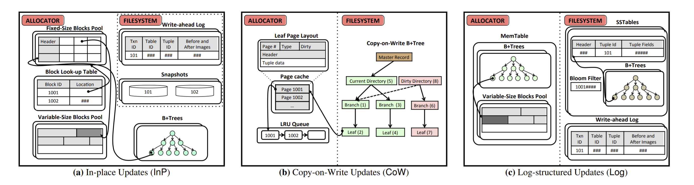

# DDIA读书笔记

本书主要关注数据处理系统架构方面以及如何集成到数据密集型应用系统中。而关于部署、运营、安全、管理等相关方面，当然也非常重要和自购复杂，不过它们并非本书的重点，也无意做些肤浅的、聊胜于无的介绍，我们认为它们值得单独成书。


分布式系统主要解决两个问题：高可用、性能


当初我学习《计算机组成原理》这本书的时候，我印象最深刻的就是里面对于计算机“虚拟化”的描述：只看计算机的硬件部分，其本质就是多层虚拟化：用逻辑电路、加法电路、积分电路、微分电路等模拟出算数逻辑单元、再和寄存器一起虚拟出运算器和控制器，配合由六个三极管组成一位的 SRAM 虚拟出的 L1、L2、L3 缓存，再配合由电容构成的 DRAM 虚拟出的“线性数组”内存，再由各种总线相互连接，实现了一个可以被操作系统软件控制的基础硬件平台。之后，这个基础硬件平台和操作系统一起虚拟出提供基本计算和逻辑判断服务的 CPU 以及可以被 C 指针读取的一个又一个内存存储单元。

计算机本身就是一层有一层虚拟化的产物，其复杂性远超我们日常生活中的复杂机械设备如汽车。**计算机是一个纯粹的“人造”产物，是人类智能的集中体现。**计算机从最底层的电路到最上层浏览器中显示出一个字，这背后正是虚拟化思想降低了复杂度，让人脑这个超低内存的计算机能够建造出如此纷繁复杂的计算机大厦。

这些抽象机制使得不同的人群可以高效合作，例如数据厂商的工程师和使用数据库的应用程序挨罚人员一起合作。再上升便是明确的社会分工。

高级编程语言作为一种抽象，可以隐藏机器汇编代码、CPU寄存器和系统调用等细节和复杂性。SQL作为一种抽象，隐藏了内部复杂的磁盘和内存数据结构，以及来自多客户端的并发请求，系统崩溃之后的不一致等问题。当然，使用高级编程语言最终没有脱离机器汇编代码，只是并非直接使用，与汇编代码打交道的事情已经由编程语言抽象为高效接口替我们完成。


[如何学习逆向工程？作为过来人，有什么可以嘱咐晚辈的？](https://www.zhihu.com/question/23999930/answer/1227443512)

从理论上看，你为了理解系统，你读代码，无论是源码还是汇编，甚至[二进制机械指令](https://www.zhihu.com/search?q=二进制机械指令&search_source=Entity&hybrid_search_source=Entity&hybrid_search_extra={"sourceType"%3A"answer"%2C"sourceId"%3A1227443512})，都是一个逆向过程，其结果就是建立了一个模糊的心理模型，用于理解系统的运作过程，然而系统代码是复杂的，庞大的，只凭脑力难以定位底层细节，需要借助工具，如反汇编器，调试器，模拟器。有人认为学好了[汇编语言](https://www.zhihu.com/search?q=汇编语言&search_source=Entity&hybrid_search_source=Entity&hybrid_search_extra={"sourceType"%3A"answer"%2C"sourceId"%3A1227443512})，就相当于可以阅读任何闭源软件了，这显然是错误的思想，没有理论上的清晰认识，容易进入这个思维误区，给定一个逆向的目标，不去搜索背景信息，已有成果，而是一头扎进汇编独自探索，是愚蠢的行为。**因为人类的临时记忆是非常可怜的，靠脑力仅能推演很短的代码量，通过纯汇编去推演高层逻辑，是人脑不可承受的（而且人脑不应该被用来做这种无意义推演工作），即便理论是可能的，但时间也是不可承受的**。所以推演必须要让cpu来执行，人脑只负责在特定的条件下让系统停下来，读取推演的结果。于是就有了[调试器](https://www.zhihu.com/search?q=调试器&search_source=Entity&hybrid_search_source=Entity&hybrid_search_extra={"sourceType"%3A"answer"%2C"sourceId"%3A1227443512})。用了调试器，人脑只需判断并控制条件逼近底层细节，具体的就是操作软件，并结合条件断点来定位底层代码，这样在效率上比[人肉调试器](https://www.zhihu.com/search?q=人肉调试器&search_source=Entity&hybrid_search_source=Entity&hybrid_search_extra={"sourceType"%3A"answer"%2C"sourceId"%3A1227443512})就有了质的提高。


#### 普通的业务逻辑是否能改写成SQL？Flink能够改写成FlinkSQL的理论依据是什么？

当关系模型最初被引入时，就包含了查询数据的不同方法：SQL 是一种声明式查询语言，而 IMS 和 CODASYL 则是命令式。这种差别意味着什么呢？

##### 命令式代码 vs 声明式代码

例如，我有一个动物物种的列表，想要查询列表中的鲨鱼：

1、命令式代码：

```js
function getSharks() {
    var sharks = [];
    for (var i = 0; i < animals.length; i++) {
        if (animals[i].family === "Sharks") {
        	sharks.push(animals[i]);
        }
    }
    return sharks;
}
```

2、声明式代码：

```sql
SELECT * FROM animals WHERE family = 'Sharks';
```

**命令式语言** 告诉计算机以特定顺序执行某些操作，而对于 **声明式的查询语言**，则只需要指定所需的数据格式，结果需要满足什么条件，以及如何转换数据（例如，排序、分组和聚合），而不需要指明如何实现这一目标。

**命令式代码** 由于指定了特定的执行顺序，很难在多核和多台机器上并行化，**声明式语言** 则对于并行执行更为友好。

例如，对于 Web 浏览器来说，使用声明式 CSS 样式表比用 JavaScript 命令式地操作样式好得多。类似地，在数据库中，像 SQL 这样的声明式查询语言比命令式查询 APIs 要好得多。

##### MapReduce 查询

MapReduce 是一个相当底层的编程模型，用于在许多机器上批量处理海量数据。

MapReduce 既不是声明式查询语言， 也不是一个完全命令式的查询 API, 而是介于两者之间： 查询的逻辑用代码片段来表示， 这些代码片段可以被处理框架重复地调用。它主要基于许多函数式编程语言中的 map (也称为 collect) 和 reduce (也称为 fold 或inject) 函数。

map 和 reduce 函数对于可执行的操作有所限制。 它们必须是纯函数， 这意味着只能使用传递进去的数据作为输入， 而不能执行额外的数据库查询， 也不能有任何副作用。**这些限制** 使得数据库能够在任何位置、 以任意顺序来运行函数， 并在失败时重新运行这些函数。 不管怎样， 该功能非常强大， 可以通过它来解析字符串、 调用库函数、 执行计算等。

> 读者注：**这些限制**能够让代码在多台机器上并行执行，更贴近 SQL 这样的声明式查询语言。也正是因为这些限制，让 Flink 任务改写为 FlinkSQL 从理论上是可行的。


# 杂项

### 日志结构

P102日志结构的存储引擎是一个相对较新的方案。 其关键思想是系统地将磁盘上随机访问写入转为顺序写入， 由千硬盘驱动器和SSD的性能特性， 可以实现更高的写入吞吐量。

### SSD 顺序写入优化

P85：在许多SSD上，固件内部使用日志结构化算法将随机写入转换为底层存储芯片上的顺序写入，所以存储引擎写入模式的影响不那么明显。

### 非易失性存储

如果将来非易失性存储 (non-volatile memory, NVM) 技术得到更广泛普及， 可能还需要进一步改变存储引擎设计https://www.pdl.cmu.edu/PDL-FTP/NVM/storage.pdf。目前这是一个新的研究领域，但值得密切关注。

different storage management architectures: (1) in-place updates, (2) copy-on-write updates, and (3) log-structured updates. 



> ##### 固态硬盘的普及，是否影响到了存储引擎的设计？
>
> 思考：DBMSs have always dealt with the trade-off between volatile and non-volatile storage devices. In order to retain data after a loss of power, the DBMS must write that data to a non-volatile device, such as a SSD or HDD. Such devices only support slow, bulk data transfers as blocks. Contrast this with volatile DRAM, where a DBMS can quickly read and write a single byte from these devices, but all data is lost once power is lost.

在设计数据库系统的时候，通常要在“易失性存储”和“非易失性存储”之间做权衡。为了在掉电之后仍然能够保存数据，人们将内存数据写入持久化存储中，然后用 Write-ahead log 来保持内存和磁盘刷写一致。在早期，持久化存储通常是一些 HDD 设备，相比 DRAM，它们读写缓慢，且数据传输粒度通常比较大。**为了平衡内存和磁盘的读写速度差异，人们做出了很多努力。**比如在磁盘上维护有序结构时采用 B-tree （将树的高度降下来，减少磁盘 I/O 次数。3~4 层的 B-tree 已经可以适合大多数数据库，degree 为 500 的 4 KB 页的四级树可以存储高达 256 TB）。比如在写磁盘时，为了减少直接的原地更新（In-place Updates）带来的效率问题，采用一些“懒”方案（例如 Copy-on-Write Updates，Log-structured Updates）。另外，在 SSD 上，固件内部使用 Log-structured 算法将“随机写入”转换为底层存储芯片上的“顺序写入”，也是为了加快写磁盘的速度。

flash translation layer？

近年来，**固态硬盘的普及，一定程度上减少了内存与磁盘之间的读写速度差异，它是否会对原有的存储引擎的设计产生影响？**

以及，**未来如果非易失性存储普及，又会对存储引擎的设计产生哪些影响？**

#### 附：B+ tree 的选型原因

完整说一下吧，无论 B/B+，RB，AVL，还是 skiplist，在最开始都实际上面临同一个问题，在数据有序的情况下，都会成为一个链表。最后导致查询复杂度 O(N)， B/B+/RB/AVL 的采用的策略是 self adjust ，就是所谓的 rebalance。跳表的策略是做 randomize，他假定了一个概率 P，有一个“退化”描述，即，当 P =1/2 时，有百分之50%的数据在第一层，百分之25的数据在第二层，百分之12.5的数据在第三层 etc. 通过这样让数据分层明显，避免全局退化。所以在这种情况下 skiplist 在期望复杂度上做到了查询 O(logn)（实际上这也是一个统计上的期望计算）。skiplist 的优势也很明显，实现简单，性能不错，但是缺陷也很明显，在内存的情况下，**由于其是个 randomize 的数据结构，导致其 CPU cache的利用率并不是很明显**，所以可能要考虑这块的场合还是需要去用 RB 这种数据结构。在磁盘 I/O 的情况下，**由于其 randomize 的特性，导致你没法去做 Sequential reading ，而 randomize reading 对于磁盘来说一直是个大问题**。在这个问题上 RB 这种数据结构实际上面临的问题也是一样的，所以 B/B+ 树用适当的数据聚合的方式，将树的高度降下来，方面我们做 page read，避免 randomize reading

稳定这话实际上也没说错，，因为 skiplist 毕竟是个 randomize 的数据结构，他复杂度取还是概率上的描述23333（并不保障严格的平衡性 lol


### 计算机科学中的“边际效益递减”理论

边际效益递减，不仅仅是一个经济学词汇，在计算机硬件领域，也是这样的。

在经济学中，边际效益递减受人的心理影响，当消费某种物品时，开始的刺激一定大，从而人的满足程度就高，但不断的消费同一种物品，即同一刺激不断反复时，人在心理上的兴奋程度或满足必然减少。

在计算机科学中，不管是单机还是分布式集群，都存在一个问题：规模越大，维护成本越高。

在经济学中，导致这个结果的原因是人的心理。在计算机科学中，导致这个结果的原因是一些瓶颈。

经济学中的“不断消费同一种物品”，是物品的增加。对应到计算机科学中，是系统的扩展。

#### 系统扩展能力 

##### 共享结构

当负载增加需要更强的处理能力时，最简单的办法就是购买更强大的机器（有时称为垂直扩展）。由一个操作系统管理更多的 CPU, 内存和磁盘， 通过高速内部总线使每个 CPU 都可以访问所有的存储器或磁盘。 在这样一个共享内存架构中， 所有这些组件的集合可看作一台大机器。

**共享内存架构** 的问题在千，成本增长过快甚至超过了线性：即如果把一台机器内的 CPU 数量增加一倍，内存扩容一倍，磁盘容僵加大一倍，则最终总成本增加不止一倍。并且由千性能瓶颈因素，这样一台机器尽管拥有了两倍的硬件指标但却不一定能处理两倍的负载。
共享内存架构能够提供有限的容错能力，例如高端的服务器可以热插拔很多组件（在不关闭机器的情况下更换磁盘，内存模块，甚至是CPU) 。但很显然，它仍局限于某个特定的地理位置， 无法提供异地容错能力。

另一种方法是 **共享磁盘架构**，它拥有多台服务器，每个服务器各自拥有独立的 CPU 和内存，然后将数据存储在可共享访问的磁盘阵列上， 服务器与磁盘阵列之间往往通过高速网络连接。这种架构多适用千数据仓库等负载，然而通常由千资源竞争以及锁的开销等限制了其进一步的扩展能力。

##### 无共享结构

相比之下， 无共享架构（也称为水平扩展） 则获得了很大的关注度。 当采用这种架构时， 运行数据库软件的机器或者虚拟机称为节点。 每个节点独立使用本地的 CPU,内存和磁盘。 节点之间的所有协调通信等任务全部运行在传统网络（以太网）之上且核心逻辑主要依靠软件来实现。

无共享系统不需要专门的硬件， 具有较高的性价比。 它可以跨多个地理区域分发数据， 从而减少用户的访问延迟， 甚至当整个数据中心发生灾难时仍能继续工作。 通过云计算虚拟机的部署方式， 即便是没有 Google 级别规模的小公司， 也可以轻松拥有跨区域的分布式架构和服务能力。

##### 共享结构 vs 无共享结构

> 几千台节点同时做一件事情的时候，它总要去共享一些东西，去协调一些东西。共享的方式可以是上述的内存/磁盘，也可以是网络。但我们通常将基于网络共享的架构称为“无共享架构”。

虽然分布式无共享体系架构具有很多优点， 但也会给应用程序带来更多的复杂性， 有时甚至会限制实际可用的数据模型。 例如在某些极端情况下，一个简单的单线程程序可能比一个拥有100多个CPU核的集群性能更好。 而另一方面， 无共享系统也可以做到性能非常强大。

#### 从另一个角度理解分布式系统与CAP

> 参考：https://lvwenhan.com/%E6%93%8D%E4%BD%9C%E7%B3%BB%E7%BB%9F/498.html

##### 分布式计算的本质

分布式系统的产生，来源于源于人们日益增长的性能需求与落后的x86架构之间的矛盾。

人们想办法利用网络和一大票便宜的PC机，通过一顿猛如虎的数学操作，来自己构建一个宏观上更强性能、更高负载能力的计算机，去替换掉昂贵的小型机、大型机。 

##### 单体服务器 VS 分布式计算：系统规模问题

分布式系统的设计，摆脱了单机昂贵的x86服务器，但没有摆脱冯诺依曼结构。原有的单机瓶颈，在分布式系统中仍然会存在。具体来看，

- 单体的计算机使用总线通信，总线成为数据传输速率的瓶颈。 
- 基于网络的分布式计算，其本质是把网络当做总线，仍然不能摆脱节点间通信和协调时的数据传输瓶颈。 
  - 每一台机器相当于一个运算器加一个存储器
  - master 节点就是控制器加输入输出设备

##### 分布式计算的瓶颈

无论主从还是主备，整个系统的流量最终还是要落到一个特定的资源上。当然这个资源可能是多台机器，但是依旧无法解决一个严重的问题：系统规模越大，其本底性能损失就越大。因为要涉及到节点之间的通信和协调，要想让数百万节点一起运算，传递命令和数据的工作占据了绝大多数的运行时间。

分布式系统的性能问题可能表现为很多方面，但归根到底，是人们日益增长的性能需求和数据一致性之间的矛盾。一旦需要强数据一致性（Consistency），那就必然存在一个限制性能的瓶颈，这个瓶颈就是信息传递的速度（Availability）。 

##### 那么，信息传递速度的瓶颈在哪里呢？

所以说，当应用规模由单体拓展到分布式系统的时候，数据密集型应用设计的基本矛盾已经由“人们日益增长的性能需求与落后的x86架构之间的矛盾”转化成“人们日益增长的性能需求和数据一致性之间的矛盾”了。 

但（就像CAP定理所说）新的矛盾是无解的。为什么说它是无解的呢？个人认为，信息传递的瓶颈最表层是人类的硬件制造水平决定的，再往底层去是冯·诺依曼架构决定的，再往底层去是图灵机的逻辑模型决定的。可是图灵机是计算机可行的理论基础呀，所以，还是怪这个熵增宇宙吧，既然我们这个宇宙是一个熵增宇宙，那么这个问题就无法解决。为什么规模越大维护成本越高呢，你也是个成熟的宇宙了，该学会自己把自己变成熵减宇宙了（狗头）。
