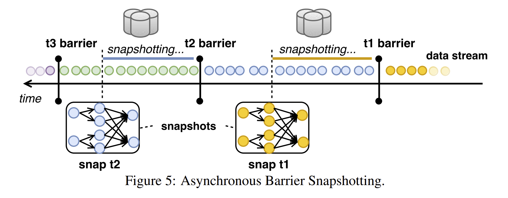
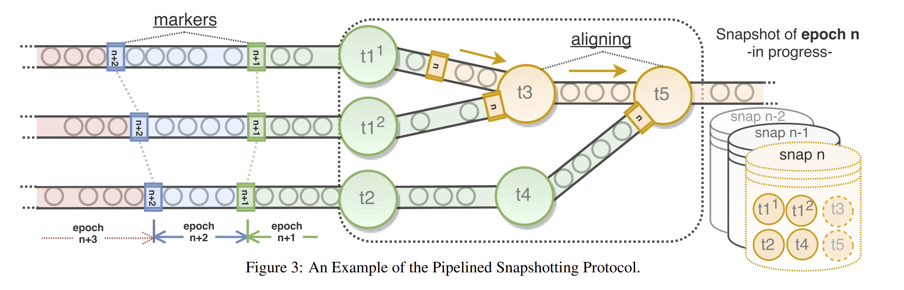
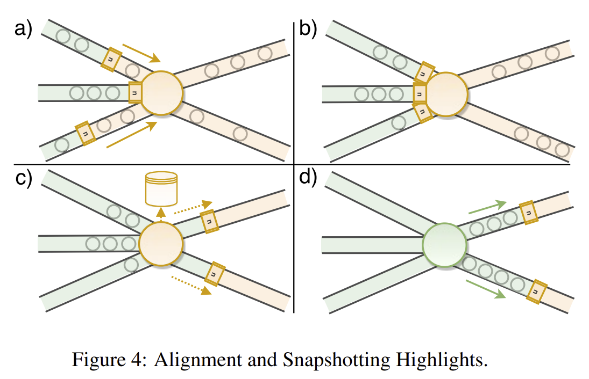

# Flink Checkpoint 机制：如何保证 barrier 和数据之间不乱序？

### 1 前言

#### 1.1 什么是 state？

要说 checkpoint，首先要从 state 聊起。之前有被问到对于 Flink state 的理解，state 的字面含义就是状态。所谓状态，它本身不难理解，简单的说，**state 就是你在处理事件的时候需要保存的状态信息。**

举个例子，如果你要计时，就要保存开始时间，然后用结束时间减去开始时间，这里的“开始时间”就是先前的状态。

Flink 官方对 state 也有准确的解释：

> [State in Streaming Applications](https://flink.apache.org/2020/10/15/from-aligned-to-unaligned-checkpoints-part-1.html)
>
> Simply put, **state is the information that you need to remember across events**. Even the most trivial streaming applications are typically stateful because of their need to “remember” the exact position they are processing data from, for example in the form of a Kafka Partition Offset or a File Offset. In addition, many applications hold state internally as a way to support their internal operations, such as windows, aggregations, joins, or state machines.

#### 1.2 为什么要有 checkpoint？

理解了 state 之后，checkpoint 是什么呢？

Flink 作为一个运行在成百上千台机器上的分布式计算引擎，当初被设计的初衷，就是**人们想办法利用一大票便宜的PC机，通过一顿猛如虎的数学操作，来自己构建一个宏观上更强性能、更高计算能力的计算机，去替换掉昂贵的小型机、大型机**。

正如众多分布式系统的共同点那样，**组件失效 / 机器故障应该被视为常态，而不是意外事件**。成百上千的廉价机器构成的节点相互访问、交换数据，无论从数量还是质量上，都很难保证时刻的正常运转，所以需要一种机制，让它们可以自动从失败状态恢复过来。因此，持续备份，容错，以及自动恢复这些特性，必须集成到这个计算引擎当中。

实际上，早在 MapReduce 模型被提出的时候，就已经设计了它自己的容错机制，后来随着数据特点的变化（批/流），以及理论和技术的不断发展，到了 Flink 时期，它在现有容错机制的基础上进行改进，提出了 checkpoint 机制以及一些针对不同场景的优化版本（取决于你选择 at least once 还是 exactly once 语义）。

说人话就是，**通过在不同时点以快照的形式保存当前的状态，来方便故障时的快速恢复，避免了全量的重新计算带来的巨大成本。**

在 [Apache Flink™: Stream and Batch Processing in a Single Engine](http://asterios.katsifodimos.com/assets/publications/flink-deb.pdf) 中，有提到过它 checkpoint 的实现：

> 3.3 Fault Tolerance
>
> The mechanism used in Flink is called Asynchronous Barrier Snapshotting (ABS [7]). **Barriers are control records injected into the input streams** that correspond to a logical time and logically separate the stream to the part whose effects will be included in the current snapshot and the part that will be snapshotted later. An operator receives barriers from upstream and first performs an alignment phase, making sure that the barriers from all inputs have been received. Then, the operator writes its state (e.g., contents of a sliding window, or custom data structures) to durable storage (e.g., the storage backend can be an external system such as HDFS). Once the state has been backed up, the operator forwards the barrier downstream. Eventually, all operators wil register a snapshot of their state and a global snapshot will be complete. 
>
> For example, in Figure 5 we show that snapshot t2 contains all operator states that are the result of consuming all records before t2 barrier. ABS bears resemblances to the **Chandy-Lamport** algorithm for asynchronous distributed snapshots [11]. However, because of the DAG structure of a Flink program, ABS does not need to checkpoint in-flight records, but solely relies on the aligning phase to apply all their effects to the operator states. This guarantees that the data that needs to be written to reliable storage is kept to the theoretical minimum (i.e., only the current state of the operators).

翻译过来就是，Flink 中使用的机制被称为异步障碍快照（ Asynchronous Barrier Snapshotting）。障碍是注入进输入流的控制记录，它对应逻辑时间，然后逻辑上区分两个部分：影响到当前快照的一部分流和其他部分。

一个算子从上游数据接收到 barrier，然后先执行一次 alignment，确保所有输入到 barrier 的数据都被接收到。接下来，算子将它的状态（滑动窗口的内容 / 自定义的数据结构）到持久化存储（可以是一个外部系统，如 HDFS）。状态备份好了之后，算子则继续将 barrier 转发到下游。最终，所有的算子都会注册它们的状态快照，这样，一个全部的快照则完成了。

读到这里，我有一个疑问了：**我们知道，Flink 无法保证数据之间的顺序。那么有没有可能在 barrier 之前的数据，在传输的过程中，由于顺序被打乱，来到了 barrier 之后？例如，`1 2 3 barrier a b c` 在传输的过程中，会不会变成 `1 2 3 a barrier b c`？这种情况下，barrier 不就无法正确地确定 checkpoint 的时机了吗？**

后来有同学在公司内部分享 Flink 的时候，我提出了这个疑问，分享人也表示没有考虑过这个问题。于是，我打算一探究竟，搞它！

### 2 在 Flink 中，数据数据乱序的原因是什么？

#### 2.1 首先，数据为什么会乱序？

所谓数据的乱序，是对业务上来说的。在业务开发人员看来，在一个算子中，会出现这样一种现象：用户的上车记录先于用户的下车记录到达。这个结果看起来使人疑惑，但如果了解背景的话就可以很快想到，这是由 **kafka 的多 partition** 以及 **Flink 的多 parallelism** 带来的，这也是当我们想要保证数据顺序的时候面临的两个困难。

#### 2.2 那么在业务中，怎么解决乱序问题呢？

**实际上，在很多情况下，我们并不是想给数据做一个严格的“排序”——数据顺序不是最终目的，而是达成目的的方式。既然是方式，就不具有唯一性。我们想要保证顺序，是因为顺序隐含了因果（causual）关系，而因果关系才是我们想要的。**因此，为了保证顺序，我们引入了 timestamp 的概念，所以有了所谓的 Flink 的三种时间（发生时间、到达时间、摄入时间），开发人员可以通过这些时间戳，来推理出事件之间的真正因果关系，和 barrier 关系不大，在这里就不展开讨论了。

### 3 checkpoint 被触发的时机会受数据乱序的影响吗？

同样地，在 barrier 场景下，我们**没有必要去花费大力气来得到具有严格顺序的数据**。因为每一个 barrier 的作用，仅仅是把数据流切分为两部分：**barrier 之前、barrier 之后。**

回到原来的问题，`1 2 3 barrier a b c` 在传输的过程中，会不会变成 `1 2 3 a barrier b c`？

要想回答这个问题，要知道 barrier 的运行机制。可以参考 [State Management in Apache Flink®: Consistent Stateful Distributed Stream Processing](https://www.semanticscholar.org/paper/State-Management-in-Apache-Flink%C2%AE%3A-Consistent-Carbone-Ewen/6fa0917417d3c213b0e130ae01b7b440b1868dde) ，比较长，里面有一些数学推理，没太看懂，我就用大白话说一下我的理解吧。

首先，这个算法有一系列的假设，其中很重要的一条是 **data channel 的 FIFO 特性**：

> 3.2.2 Main Assumptions
>
> Directional data channels between tasks are reliable, respect **FIFO delivery** and can be blocked or unblocked. When a channel is blocked, in-transit messages are internally buffered (and possibly spilled to disk) and can be delivered on that end once it unblocks.

意思是说，算法有个基本假设，即我们在数据传输时的管道是 FIFO 的。你也许会想，这和前面说的“乱序”不是矛盾了吗？

再一想，并没有矛盾，因为 FIFO 指的是两个节点（一个发送方，一个接收方）之间的传输过程，而乱序现象是由多个节点（多个发送方，一个接收方）造成的。

好，现在 FIFO 的假设是成立的。那么这个算法是如何解决多个节点导致的乱序问题呢？

用下面的 Figure 3 举个例子，在图中，不同的 barrier（图上称为 markers） 将整个数据流分成了不同的颜色。可以看到有 t1 t2 t3 t4 t5 节点，我们可以想象成 5 个 TaskManager。这些 TaskManager 通过一种 **alignment 机制**，当收到一种类型的 barrier 时，会等待所有上游数据源的 barrier 都到达自己，相当于进行了一个同步的过程，之后才进行持久化存储 state，然后将 barrier 发送给下游。

至于 alignment 机制，可以看下面这张图，我把它简单的理解为一种对齐机制。因为对于每个 TaskManager 来说，可能有多个数据源，所以在进行下一步操作之前，我们需要存储这一步的状态，而所谓对齐，就是等待所有的数据源都发来当前 term 的 barrier，这时候由于我们之前有过 FIFO 的保证，所以拿到所有数据源的 barrier 之后，我们可以认为当前我们处于一个完整的 state，下一步就是存储当前 state 的快照，即 checkpoint。

所以说，此乱序非彼乱序。由于存在 FIFO 的保证，barrier 之前的数据不会在传输的过程中跑到 barrier 之后去；而由多输入源带来的数据的乱序，因为有 alignment 机制的保证，并不会影响通过 barrier 实现的 checkpoint 的准确性。

### 4 Reference

[State Management in Apache Flink®: Consistent Stateful Distributed Stream Processing](https://www.semanticscholar.org/paper/State-Management-in-Apache-Flink%C2%AE%3A-Consistent-Carbone-Ewen/6fa0917417d3c213b0e130ae01b7b440b1868dde)

[Apache Flink™: Stream and Batch Processing in a Single Engine](http://asterios.katsifodimos.com/assets/publications/flink-deb.pdf)

[Stateful Stream Processing](https://nightlies.apache.org/flink/flink-docs-release-1.11/concepts/stateful-stream-processing.html)

[From Aligned to Unaligned Checkpoints - Part 1: Checkpoints, Alignment, and Backpressure](https://flink.apache.org/2020/10/15/from-aligned-to-unaligned-checkpoints-part-1.html)

最后，笔者才疏学浅，各位如果有任何想说的，或者觉得有疏漏以及一些不严谨的地方，欢迎留言一起探讨！
