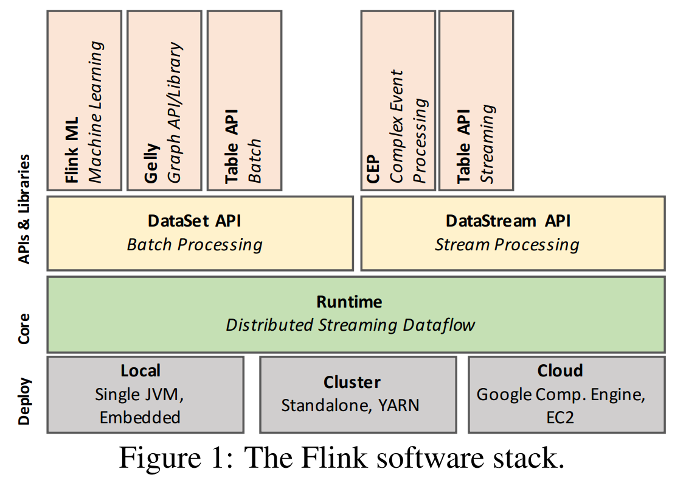
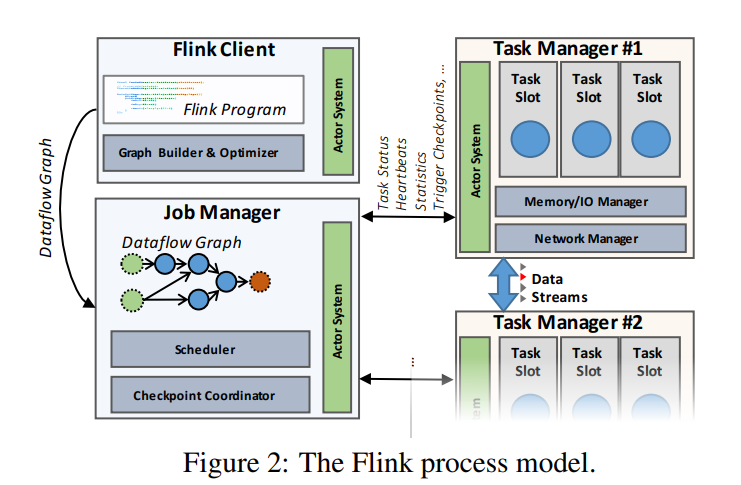
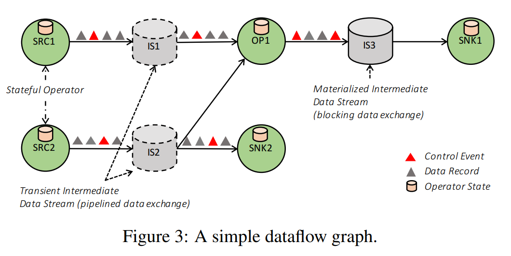
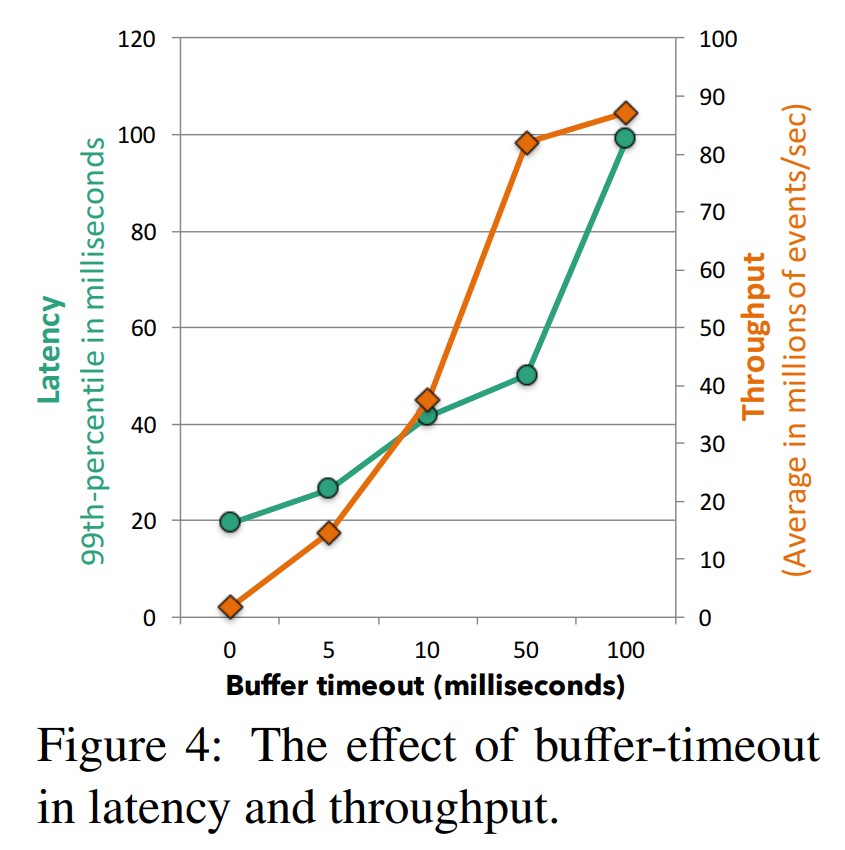
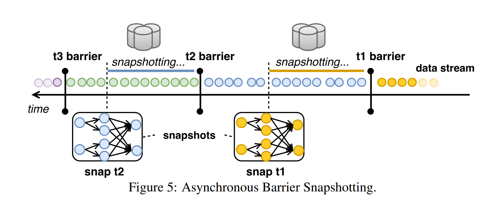
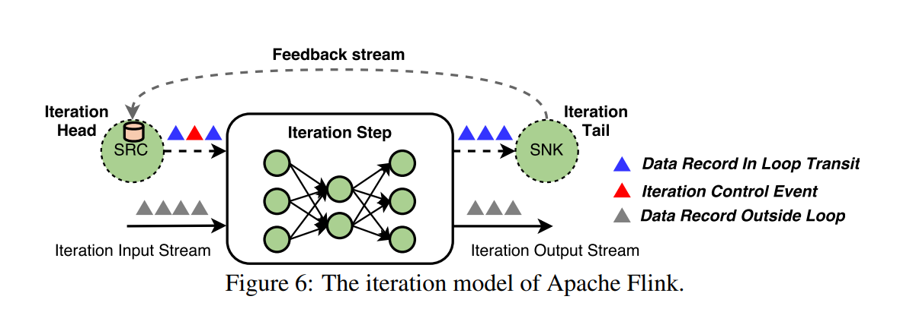

# Apache Flink: Stream and Batch Processing in a Single Engine 论文翻译

> https://zeahoo.com/2021/apache-flink-translation

本问是[Apache Flink 论文](http://asterios.katsifodimos.com/assets/publications/flink-deb.pdf)的简单翻译，如有翻译错误，请联系我，欢迎交流！

## 摘要

Apache Flink 是一个处理流式与批处理数据的开源系统。Flink 以用于处理非常多的数据应用上的建立理念，包括实时分析、持续数据流管道、历史数据处理（批处理）和迭代算法（机器学习、图分析）等都可以被表达和执行以管道为形式、具有容错的工作流。在本文，我们介绍了 Flink 的架构，阐述了如何将一组看似不同的用例在一个统一的执行模型上运行。

## 1. 介绍

流数据处理（举例：复杂事件处理系统）和静态（批）数据处理（举例：大规模并行处理数据库和Hadoop）传统上视为这两个类型为非常不同的应用。他们会用不同的编程模型和 API 来编写代码，而且他们会在不同的系统上执行（举例：专门处理流式的系统比如 Apache Storm、IBM Infoshpere Streams、Microsoft StreamInsight 或 Streambase。与之对应的关系数据库或者 Hadoop 执行引擎，包括 Apache Spark 和 Apache Drill）。一般来说批处理分析在用例、数据规模和市场上占用大量的份额，而流式数据分析主要服务于特定的应用。

然而，现在越来越明显的是，今天大规模的数据处理用例实际上是根据时间不间断产生的。这些连续的数据流是从网络日志、应用日志、传感器、或者数据库应用的状态的变化（事务日志记录）。目前没有将这些数据流当作数据流，而是忽略数据产生的连续性和时效性。相反，数据的记录（通常是认为的）被打成静态的数据集（例如按小时、按天或者按月份）然后以时间无关的方式进行处理。数据收集工具、工作流管理、和调度协调编排批次的创建和处理，实际上是一个连续的数据处理管道。像“Lambda 架构”的架构模式组合了批和流式处理系统来实现多种计算路径：一种流式的快速路径用于及时获得近似的结果，另一种离线路径用于获取较晚的精确结果。所有这些方法都存在高延迟（由批处理强加），高复杂度（连接和编排几个不同的系统，并且实现相同的业务逻辑两次），以及带来不精确性，因为时间维度没有被应用明确的处理。

Flink 遵循一个范式，在编程模型和执行引擎中将流数据处理作为实时处理、连续流和批处理的统一模型。结合允许对数据流进行准任意重放的持久化消息队列（像Apache Kafka 或 Amazon Kinesis），流处理程序对处理最新实时事件数据、处理持续定期聚合的大窗口处理数据或处理 TB 级别的历史数据不做区分。相反，这些不同类型的计算只是从持续流的不同的位置开始，且在计算中维护不同的形式的状态。通过一个高度灵活的窗口化机制，Flink 程序可以在同一个操作中计算早期和近似的结果，以及有延迟和精确的结果，避免了使用不同的系统来适应这两个用例。Flink 支持不同的时间概念（事件时间、摄取时间、处理时间），以便让开发者有高度的灵活性来定义事件该如何关联。

与此同时，Flink 知道现在和将来都会有针对于专门批处理（处理静态数据集）的需求。静态数据的复杂查询依旧是对于批处理抽象的良好匹配。此外，批处理对于遗留的实现还是有需求的，因为在这些应用中还没有有效的算法可以对流数据进行这种处理。批程序是流程序的特例，其中流是有限的，记录的顺序和事件是不重要的（所有的记录隐式的属于一个窗口）。然而，为了支持有竞争性的和有性能的批用例，Flink 有一个特殊的 API 用于处理静态数据集，使用特殊的数据结构和算法来处理批操作，像是链接（join）、分组（grouping），且使用专门的调度策略。其结果是，Flink 在流式运行时的基础上将自己表现为一个成熟且高效的批处理程序，包括图计算库和机器学习。Flink 起源于 Stratosphere 项目，Flink 是Apache 软件基金会的顶级项目，有一个大型且具有生命力的社区来开发和支持（目前截稿为止有超过180个开源软件贡献者），而且在几个公司都在生产环境运行。

本问的贡献有以下几点：

- 我们提供了流式和批处理的统一架构，包括对静态数据集有关的特殊优化。
- 我们展示了流式、批、迭代和交互分析如何被表现在一个容错的流式工作流（在第3节）。
- 我们讨论如何构建一个成熟的流分析系统，且带有灵活的窗口机制（在第3节），也包括成熟的批处理程序（在第4.1节）。通过展示流、批、迭代、交互分析如何被展现为流式数据流。

## 2. 系统架构

在本节我们以 Flink 的软件栈和分布式系统进行阐述。虽然 Flink 的 API 在持续增长，我们可以区分四个主要层面：部署，核心，API 和库。

**Flink 的运行时与 API**。图1展示了 Flink 的软件栈。Flink 的核心是一个分布式数据流引擎，它用来执行数据流程序。Flink 的运行时程序是一个连接数据流的有状态的有向无环图（DAG）。Flink 有两个核心 API： DataSet API 用来处理有限的数据集（通常称作批处理）和 DataStream API 用来处理无边界的数据流（通常称为流处理）。Flink 的核心运行时引擎可以被视作流数据流引擎，DataSet 和 DataStream API 都可以创建可以由该引擎执行的程序。因此，它是为有界（批）和无界（流）处理的通用结构。在核心 API 的基础之上，Flink 捆绑了特定领域库和生成 DataSet 和 DataStream API 的程序，目前 FlinkML 用于机器学习，Gelly 用于图形处理，Table 用于类-SQL操作。



如图2所示，一个 Flink 的集群包括了三种类型的进程：客户端（Client）、工作管理器（JobManager）和至少一个任务管理器（TaskManager）。客户端获取程序代码，转化成数据流图，然后提交到工作管理器。这个转换阶段还检查了算子之间的交换数据的数据类型（schema）并且创建了序列化器和其他类型或 schema 的特殊代码。DataSet 程序还经历一遍查询优化阶段，类似于关系型查询优化器的物理优化（更多详细信息查看4.1节）。



工作管理器协调数据流的分布式计算。它跟踪每个算子和数据流的状态和进度，调度新的算子，协调检查点和恢复。在高可用的设置中，任务管理器在每一个检查点上持久化了一个最小的元数据到一个容错存储中。这样一个备用的任务管理器可以从检查点那重新恢复数据流的执行。实际上的数据处理是在任务管理器中进行的。任务管理器执行一个或者更多的算子来产生流，它还报告他们的状态给任务管理器。任务管理器维护缓冲池去缓冲或实现数据流，并维护网络连接在算子之间进行交换数据流。

## 3. 共同结构 - 流式数据流

尽管用户可以使用多维度的 API 来写 Flink 程序，所有的 Flink 程序最终会编译到公共的表达方式：数据流图。数据流图由 Flink 的运行时引擎执行，它是批处理（DataSet）和流处理（DataStream） API的公共层。

### 3.1. 数据流图

数据流图如图3所示，它是一个有向无环图（DAG），包括了：1. 状态算子 2. 数据流，代表由算子产生的数据，可用于算子来消费。由于数据流图是以数据并行的方式执行，算子被并行化为一个或多个称为子任务的并行实例。数据流则被分为一个或者多个的流分区（每个分区对应一个产生子任务）。有状态，作为一个特殊情况则可以是无状态的，实现了所有的处理逻辑（例如，过滤、哈希连接、流窗口函数）。许多的这些算子是众所周知教科书上的实现。在第4节，我们提供窗口化算子的实现细节。流以各种模式分配数据到生产和消费的算子，例如点对点、广播、重分区、扇出和合并。



### 3.2. 根据中间数据流的数据交换

Flink 的中间数据流是算子之间数据交换的核心抽象。一个中间数据流代表了一个算子产生的数据的逻辑句柄 ，可以被一个或多个算子消费。中间流是有逻辑的，他们的数据可能在或者不在磁盘，具体的行为是由更高层的Flink参数指定的（例：程序优化器是由DataSet API来使用）。

**管道式和堵塞式数据交换。**管道式中间流通过在同时运行的生产者和消费者之间交换数据。因此，管道流从消费者到生产者传播反压。使用中间缓冲池来调解一些弹性，以补偿短期吞吐量的波动。Flink在连续流程序上使用管道流，也用于批数据流的许多部分，来避免不必要的数据落地。另一方面，堵塞式数据流可以认为是有边界的数据流。在数据可以消费前堵塞流缓冲所有的生产者算子的数据，因此将生产和消费的算子分隔到不同的执行阶段。自然地，堵塞流需要更多的内存、频繁地溢出到二级存储，且不会产生反压。他们将用来互相隔离连续的算子（在需要的时候）以及一些破环管道执行的算子的情况，比如排序-合并的连接可能会导致分布式死锁。

**平衡延迟和吞吐量。**Flink 的数据交换机制是由缓冲数据的交换实现。当一个数据记录在生产者端准备好了，它被序列化后然后溢出到一个或者多个缓冲（一个缓冲也可以包含多条记录）然后再转发给消费者。缓冲区会以以下两种方式发送给消费端：1. 当它满了；2. 达到超时条件。这可以让 Flink 通过设置缓冲区的大小为一个大值（比如几kb）来实现高吞吐，也可以通过设置超时（比如几毫秒）来实现低延迟。图4展示了设置30台机器（120核）中缓冲-超时影响吞吐量和延迟数据的关系图。Flink 可以达到99%的20毫秒的延迟，相应的吞吐量是每秒150万事件。当我们增加缓冲的超时时间，我们可以看到增加了延迟和吞吐量，直到最高的吞吐量到达（举例：缓冲区填满的速度比超时过期的速度要快）。当缓存超时时间设置为50毫秒，集群的吞吐量达到了每秒8000多万个事件，其中99%的延迟在50毫秒。



控制事件。除了交换数据，Flink 中的流与不同类型的控制事件进行沟通。这些是由算子注入的特殊事件，并于其他流分区的记录和事件一起按顺序执行。接受到的算子根据它们的到达做出特定的操作。Flink 使用很多特殊类型的控制事件，包括：

- 检查点障碍，通过划分流到预检查点和后检查点来协调检查点（在3.3节讨论）。
- 水位线，标志着一个流分区的事件事件进展。（在4.1节讨论）。
- 迭代障碍，标志着一个流分区到达了一个在循环数据流的基础上的、基于 Bulk/StaleSynchronous-Parallel 迭代算法的超级步骤。

如上所述，控制事件设定了一个流分区保留记录的顺序。为此，Flink 中消耗了一个单一流分区的单项算子，保证了记录是先进先出（FIFO）的顺序。然而，算子接收到不止一个流分区会以到达的顺序合并流，以便跟上流的速度和避免反压。作为结果，Flink 中流的数据流在任何形式的重分区或者广播不会提供顺序的保证，而处理乱序的记录则留给算子来实现。我们发现这个安排可以提供非常有效的设计，大多数算子不要求确定的顺序（例如哈希join，映射），而且需要补偿失去顺序到达的算子，比如事件事件窗口可以更加有效的作为算子逻辑的一部分。

## 3.3 容错

Flink 提供了可靠的执行，具有严格的精确一次一致性保证，并通过检查点和部分重新执行来处理故障。通常假定系统能做出这些有效的保证是数据源是持久化的且可以回放的。举例来说这些数据源可以是文件和持久的消息队列（比如Apache Kafka）。在实践中，非持久化的数据源可以通过在源算子的状态中保存一个写前日志被纳入。

Flink 的检查点机制构建在分布式一致性快照上，以实现精确一次运行的保证。数据流的无边界本质让恢复的重新计算变得不切实际，因为对于一个长期运行的任务来说，可能需要回放数个月的数据。为了约束恢复时间，Flink 对算子的状态做了一个快照，包括每隔一定时间对输入流当前的位置。

核心挑战是不停止拓扑执行的情况下对所有并行的算子进行一致性快照。从本质上来说，所有算子的快照应该指向计算中同一个逻辑时间。Flink 中使用的机制被称为异步障碍快照（ Asynchronous Barrier Snapshotting）。障碍是注入进输入流的控制记录，它对应逻辑时间，然后逻辑上区分两个部分：影响到当前快照的一部分流和其他部分。

一个算子从上层流数据接受到障碍，然后先执行一次对齐阶段，确保所有输入到屏障的数据都被收到。接下来，算子写入它的状态（例如滑动窗口的内容，或者自定义的数据结构）到持久化的存储（例如持久化后端可以是一个外部系统，比如HDFS）。一旦状态已经备份，算子则继续转发屏障到下游。最终，所有的算子将会注册他们的状态快照，一个全部的快照则完成了。举个例子，图5所示展示了快照t2包含了所有的算子状态，这些状态是消耗t2障碍之前的消费的所有记录的结果。ABS 与 Chandy-Lamport 算法在分布式异步快照有相似之处。然而，由于 Flink 程序的有向无环图的结构，ABS 不需要时刻对记录进行检查，而仅仅依靠在对齐阶段来将他们的所有效果应用于算子的状态。这个保证了需要写入到可靠的存储数据维持在理论的最小值（即，只有算子的当前状态）。



故障恢复将所有算子的状态恢复到最后一次成功快照的各自状态，并重启他们的输入流到最后一次有快照的屏障。重新计算最大的量取决于两个连续屏障之间输入的记录量。此外，而外重放直接上游子任务缓存的未处理的记录，可以恢复一个失败的子任务。

ABS 提供了几个好处：1. 它保证了精确一次状态更新而不去暂停计算；2. 它完全地与其他形式的控制信息解耦（例如，事件触发窗口的计算，从而不会限制窗口检查点间隔的倍数）；3. 它与可靠性存储完全解耦，允许状态备份到文件系统、数据库等，取决于 Flink 使用的大环境。

## 3.4 迭代数据流

增量处理和迭代对于应用来说是至关重要的，比如图形处理和机器学习。数据并行计算平台对于迭代计算的支持，通常依靠对各自迭代运算提交一个新的任务，或者在有向无环图添加额外的节点或者反馈边界。Flink 中的迭代运算是由迭代步骤实现的，特殊的算子本身包含了一个执行图（图6）。为了维护基于有向无环图运行时和调度器，Flink 允许迭代的“头”和“尾”任务隐式地与反馈边缘连接。这些任务用是建立一个开启状态的反馈通道，为处理反馈通道中的数据记录提供协调。协调对于实现任何形式的结构化并行迭代模型都是需要的，录入批量同步并行（Bulk Synchronous Parallel）模型，并且使用控制事件来实现。我们在4.4节和5.3节分别解释了如何在DataStream和DataSet API中实现迭代。



## 4. 数据流之上的流分析

Flink 的 DataStream API 在 Flink 运行时上实现了完整的流分析框架，包括了管理事件的机制，例如失序的事件处理、定义的窗口、维护和更新用户定义的状态。Streaming API 是建立在 DataStream 的概念，是一个（可能是无界的）不可改变的特定类型的元素集合。由于 Flink 运行时对于一致性状态的更新早就支持流水线式数据传输、连续的有状态算子和容错机制，基本上归结于实现一个窗口系统和状态接口。如前所述，这些对运行时是不可见的，它认为窗口只是一个状态算子的实现。

### 4.1. 时间的概念

Flink 将时间的概念区分成两个：1. 事件事件，标志着事件的起源事件（例如手机传感器信号的时间戳）2. 处理事件，是机器指处理数据的时间。

在分布式系统中，事件时间和处理时间存在着任意的偏移。这种偏移可能意味着根据事件时间语义获取的结果有着随意的延迟。为了避免任意的延迟，这些系统定期地插入被称之为低水印的特殊事件，来标记全局的进展。以时间进度作为例子，水印包括了时间的属性t，表示所有低于t的时间都已经进入了算子。水印有助于执行引擎按照正确的顺序处理时间，并且序列化操作，例如一个统一的进度衡量的窗口计算。

水印起源于拓扑的源，在这里我们可以决定未来元素的内在时间。水印从源头传播到其他数据流的操作符。算子决定他们怎么对水印做出反应。简单的操作，比如map或者filter只是转发了他们接受到的水印，而更加复杂的算子做计算会根据水位（例如 事件时间窗口）计算，首先计算水印触发的结果，然后转发它。如果一个操作符有不止一个输入源，系统只会转发输入水印的最小值给操作符，从而保证正确的结果。

基于处理时间的 Flink 程序依赖于本地机器的时间，因此有一个不太可靠的时间概念，这可能会导致恢复时有不一致的回放效果。然而，他们表现出较低的延迟。程序是建议在事件时间提供了最可靠的语义，但是可能因为事件时间的滞后表现出了延迟。Flink 包括时间的第三个概念，是作为事件事件的特列-摄取事件，它是事件进入 Flink 的时间。这比事件事件带来更低的延迟，并且与处理时间相比，会有更加精确的结果。

### 4.2. 状态化的流式处理

虽然 Flink 的 DataStream API 的大多数算子看起来像是函数式的、无副作用的，但是他们提供了高效的状态化的计算。状态对于许多应用都至关重要，比如机器学习的模型建立、图分析、用户会话处理和窗口据合。根据用例也有不同形态的状态。比如，状态可以简单得如计数器或者求和，或者可以复杂得像分类树或者机器学习中经常使用到的大型稀疏矩阵。流窗口是有状态的算子，它将记录分配给作为算子状态的一部分保存在内存中持续更新的桶。

在 Flink 中，状态是显式的，并通过提供以下方式的API： 1. 算子接口或者注解，在算子的域内静态的注册器显式的局部变量；2. 一个算子-状态的抽象，用于声明分区的键值状态和他们关联的操作。用户也可以通过系统提供的状态后端（StateBackend）来配置状态在哪里存储和检查点在哪里存储，从而允许高灵活自定义状态管理。Flink 的检查点机制（在3.3节讨论过）保证了任何注册的状态是持久的，并具有精确一次的更新语义。

### 4.3. 流窗口

无界流的增量计算是经常在持续发展的逻辑视图中评估的，这个视图叫做窗口。Flink 加入了有状态的窗口，这个窗口通过一个灵活的声明进行配置，该声明由三个核心函数组成：一个窗口分配器，可选的一个触发器和可选的一个驱逐器。所有这三个函数都可以在一个公共预定义实现中进行选择（例如，滑动时间窗口），也可以显式地由用户定义（例如，用户定义函数）。

更加详细地说，分配器负责分配每一条记录到逻辑窗口。例如，如果是事件时间窗口时，这个决定可以基于记录的时间戳。注意在滑动窗口的情况下，一条记录可以属于多个逻辑窗口。一个可选的触发器定义何时执行与窗口定义相关的操作。最后，一个可选的驱逐器决定每个窗口保留了哪些记录。Flink 的窗口分配过程是独特的，能够覆盖所有已知的窗口类型，比如周期性的时间和计数的窗口、标点符号窗口、地标窗口、会话窗口和delta窗口。注意，Flink 的窗口处理能力无缝地加入了无序的处理，与Google Cloud Dataflow 类似，且从原则上来说，加入了这些处理模型。例如，下面是一个窗口定义，它定义了6秒的窗口按照每2秒秒滑动（分配器）。一旦水印通过这个窗口的末端（触发器），窗口的结果将被计算出来。

```
stream
.window(SlidingTimeWindows.of(Time.of(6, SECONDS), Time.of(2, SECONDS))
.trigger(EventTimeTrigger.create())
```

一个全局窗口创建了一个单一的逻辑组。接下来的例子定义了一个全局窗口（分配器），对每1000个时间（触发器）调用操作，同时保留最后的100个元素（即驱逐器）。

```
stream
.window(GlobalWindow.create())
.trigger(Count.of(1000))
.evict(Count.of(100))
```

注意一旦流在窗口化之前以一个键分区了，那么上面的窗口化操作就是本地的，因此不需要workers的协调。这个机制可以用来实现各种各样的窗口化函数。

### 4.4. 异步流迭代

流内的循环对于一些应用是必不可少的，比如增量构建和训练机器学习模型，强化下也许个图的近似计算。在大多数这样的情况下，反馈循环不需要协调。异步迭代循环覆盖了流式应用的通信需求，与基于有限数据结构化迭代的并行优化的问题不同。如第3.4和第6节，当没有启动迭代控制机制时，Flink 的执行模型覆盖了异步迭代。此外，为了遵守容错保证，反馈流被视作隐式迭代头运算器内的算子状态，是全局快照的一部分。DataStream API 允许显式地定义回馈流，并且可以琐碎地支持流上结构化循环以进度的跟踪。

## 5 数据流之上的批处理分析

一个有界数据集是无界数据流的特例。因此，一个在窗口插入所有输入数据流的流程序可以作为一个批处理程序，批处理应该完全被 Flink 上面的特性覆盖。但是：1. 语法（即批处理的计算 API）可以被简化（例如，不需要人为的全局窗口定义）；2. 处理有界数据集可以接受额外的优化，为容错提供更有效的记录，已经分阶段调度。

Flink采用了如下的批处理方式：

- 批量计算与流式计算是同时被相同的运行时执行的。运行时的可执行文件可以用阻塞的数据流进行参数化，以大型计算分解为连续调度的孤立阶段。
- 当开销大的时候，周期性快照会被关闭。相反，恢复故障可以由从重放最新落地的丢失中间流分区（可能是数据源）来实现。
- 阻塞算子（例如排序）是简单的算子实现，他们刚好堵塞，，知道全部的输入被消费完。运行时不会意识到是否一个算子被堵塞。这些操作符使用 Flink 提供的管理内存（无论是在JVM的堆内外），如果输入超过了内存界限，就会溢出到磁盘。
- 一个专门的 DataSet API 为批处理提供了熟悉的抽象，一个有界的容错数据集数据结构和DataSet的转换（例如，链接，据合，迭代）。
- 一个查询优化层转换 DataSet 程序到一个高效的可执行文件。

接下来我们更加详细地描述这些方面。

### 5.1. 查询优化

Flink 的优化器建立在并行数据库系统的技术上，比如计算等价、成本模型和有趣属性传播。然而，任意的重度UDF的有向无环图让 Flink 的数据流程序不允许使用一个传统的，开箱即用的优化器，因为算子在优化器中隐藏了他们的语义。处于同样的原因，cardinality和cost-estimation方法同样难以采用。Flink 的运行时支持多样的执行策略，包括重新分区和广播数据转换，记忆基于排序的分组和哈希的链接的实现。Flink 优化器列举了不同的基于有趣属性传播的物理执行计划，使用基于成本的方法在多个物理计划中选择。该成本包括了网络和磁盘 I/O 以及CPU的成本。为了克服存在的UDF的cardinality估计问题，Flink 的优化器可以使用由程序员提供的提示。

### 5.2. 内存管理

基于数据库的技术， Flink 序列化数据到内存段，而不是在 JVM 堆中分配对象来表示缓存中未落地的记录。像排序和连接的操作尽可能地直接按照二进制数据操作，保持序列化与反系列化的开销在低水平，当需要时，则溢出到磁盘。为了处理任意的对象，Flink使用类型推断和自定义序列化的机制。通过将数据处理保持在二进制表示和堆外，Flink 控制减少垃圾收集的开销，在内存压力下使用高效缓存和健壮算法来优雅扩展。

### 5.3 批量迭代

迭代图分析、并行梯度下降和优化技术过去一直是在批量同步并行（BSP）和陈旧的同步并行（SSP）模型之上实现的。Flink 的执行引擎允许通过使用迭代控制实现，在上面实现任意类型的结构化迭代逻辑。例如，在BSP执行的情况下，迭代控制事件标志了迭代计算的开始和结束。最后，Flink 介绍了其他的优化技术，比如 delta 迭代的概念，它可以礼用稀疏计算依赖关系。Delta 迭代已经被 Flink 的 Graph API Gelly 所利用。

迭代图分析、并行梯度下降和优化技术过去一直是在批量同步并行（BSP）和陈旧的同步并行（SSP）模型之上实现的，除此之外。Flink的执行模型允许通过使用迭代控制事件，在上面实现任何类型的结构化迭代逻辑。例如，在BSP执行的情况下，迭代控制事件标志着迭代计算中超级步骤的开始和结束。最后，Flink引入了更多新的优化技术，比如delta迭代的概念[14]，它可以利用稀疏的计算依赖关系 Delta迭代已经被Flink的图形API Gelly所利用。

## 6 相关工作

今天，我们有丰富的分布式批和流分析处理引擎，我们将主要的系统分类如下。

**批处理**。Apache Hadoop 是目前最流行的大规模数据分析的开源系统之一，它是基于 MapReduce 范式。Dryad 介绍了在一般基于有向无环图的数据流中内嵌的用户定义函数，并由 SCOPE 丰富，SCOPE 是一个语言，它建立在SQL优化器之上。Apache Tez 可以被看做是 Dryad 提议的一个开源实现。 MPP 数据库，已经最近像 Apache Drill 和 Apache Impala 的开源实现，限制在他们的 API 在 SQL 的变体。与 Flink 相似的是，Apache Spark 是一个数据处理框架，它实现了以有向无环图为基础的执行引擎，提供了 SQL 优化器，执行基于驱动器的迭代，并将无边界的计算视为微批处理。与之相对的，Flink 是唯一一个包含以下内容的系统：1. 分布式数据流运行时，礼用管道流执行批处理和流工作负载；2. 通过轻量化检查点实现精确一次一致性；3. 本地迭代处理；4. 丰富的窗口语义，支持无序处理。

**流处理**。在学术和商业流处理系统方面有大量的钱岂工作，比如 SEEP、Naiad、Microsoft StreamInsight 和 IBM Streams。这些系统许多都建立在数据库社区的研究中。上述许多的系统要么是学术原型，要么是闭源商业产品，要么不能在商业服务器集群上横向扩展计算。最近流处理更多的方法能够横向扩展和具有较弱的状态一致性保证的组合式操作（例如 Apche Storm 和 Samza 中的最少一次处理）。值得注意的是，像“无序处理”的概念获得了巨大的吸引力，并被 MillWheel 采用，它是谷歌后来提供的 Apache Beam、Google Dataflow的商业执行器的内部版本，Millwheel 作为一个概念验证了精确一次低延迟的无需处理，因此，对于 Flink 的发展非常有影响。据我们所知， Flink 是唯一一个开源项目，包含：1. 支持事件时间处理和无序事件处理；2. 提供一致性管理状态，并由精确一次保障；3. 完成高吞吐和低延迟，同时服务于批处理和流处理。

## 7. 感谢

Apache Flink 项目的发展是由一个自我选择的项目活跃的贡献者团队监督的。项目管理委员会（PMC）指导项目的持续运作，包括社区发展和产品发布。在目前写这篇文章的时候，Flink的提交者名单是：Marton Balassi, Paris Carbone, Ufuk Celebi, Stephan Ewen, Gyula F ´ ora, Alan Gates, Greg Hogan, ´ Fabian Hueske, Vasia Kalavri, Aljoscha Krettek, ChengXiang Li, Andra Lungu, Robert Metzger, Maximilian Michels, Chiwan Park, Till Rohrmann, Henry Saputra, Matthias J. Sax, Sebastian Schelter, Kostas Tzoumas, Timo Walther and Daniel Warneke。除了这些人之外，我们还要感谢更广泛的 Flink 社区的 180 多名贡献者。

## 8. 总结

在本问中，我们介绍了 Apache Flink，一个实现了通用数据流引擎平台，它设计成同时为流处理和批处理分析。Flink 的数据流引擎将算子的状态和逻辑中间结果视作为一等公民，用被批处理和流处理 API的不同参数所使用。建立在 Flink 流数据引擎之上的流式 API 提供了保持可恢复状态的方法，并对流窗口进行分区，转换和据合操作。虽然批处理在理论上是流处理的一个特例。Flink 对其进行了特殊处理，使用查询优化器优化它的执行引擎，并实现了堵塞算子来在没有内存的情况下优雅地溢出到磁盘。