# 深度学习推荐系统

## 传统推荐模型的发展脉络

### 1、协同过滤算法族

仅利用用户和商品之间的显示、隐式反馈

##### 共现矩阵

共现矩阵是一个这样的矩阵，以所有用户为行，所有物品为列组成的矩阵，矩阵中的值是用户对物品的打分，这样的矩阵就叫做共现矩阵。

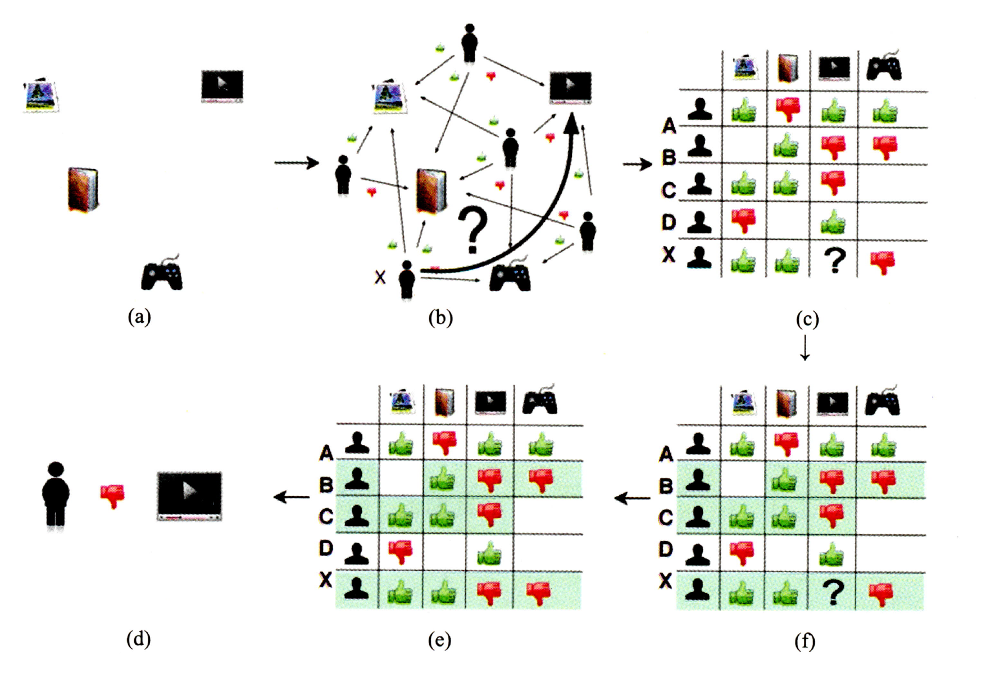

##### UserCF 用户协同过滤

用户相似度计算

##### ItemCF 物品协同过滤

##### 矩阵分解模型 MF

MF 是由协同过滤衍生出的

##### 特征值分解、奇异值分解、梯度下降

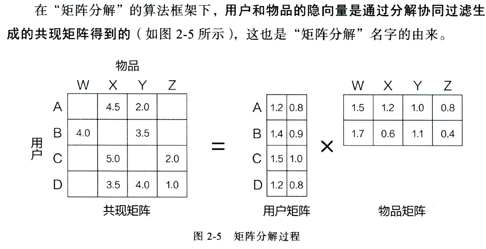

##### 过拟合现象和正则化

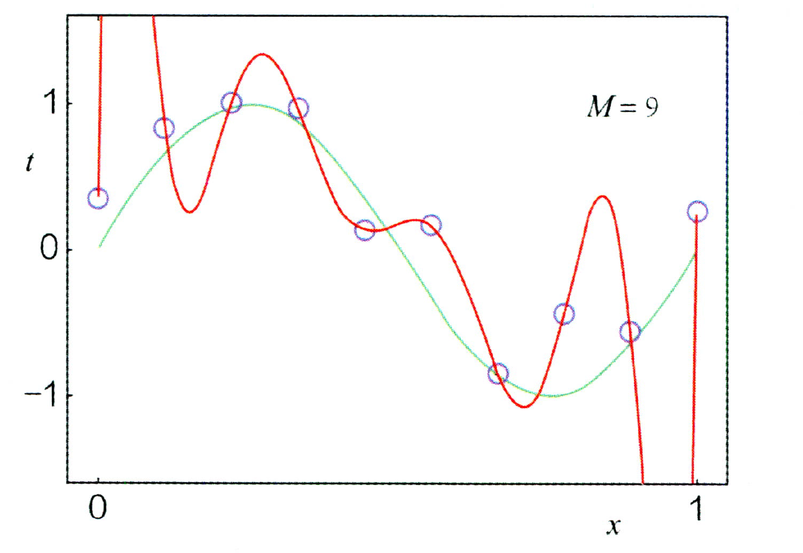

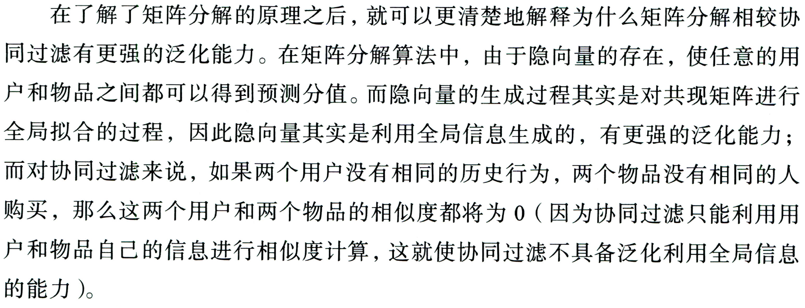

- 消除用户和物品打分的偏差

- 矩阵分解的最终产出是用户和物品隐向量，这其实与深度学习中的 embedding 思想不谋而合，因此矩阵分解的结果也非常便于与其他特征进行组合和拼接，便于与深度学习网络进行无缝结合

### 2、逻辑回归模型族 LR

利用、融合更多用户、物品及上下文特征。相比协同过滤和矩阵分解利用物品的“相似度”进行推荐，逻辑回归将推荐问题看成一个分类问题，通过预测**正样本**的**概率**进行排序。这里的**正样本**可以是用户“点击”“观看”了某商品。因此，逻辑回归模型将推荐问题转换成了一个点击率（Click Through Rate，CTR）预估问题。

- 由 LR 模型衍生出的大规模分片线性模型 LS-PLM，以及由逻辑回归发展出来的 FM 模型

- 基于逻辑回归模型的推荐流程

  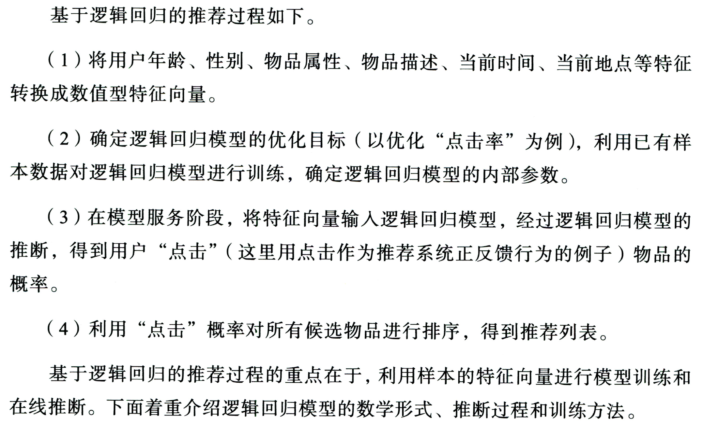

  其中，逻辑回归模型的数学形式如下：

  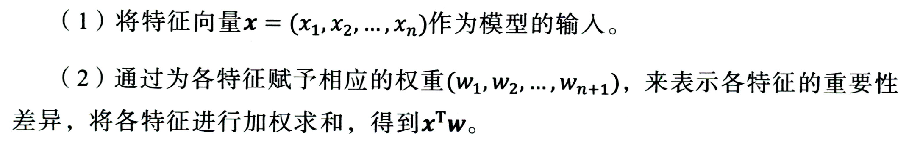

  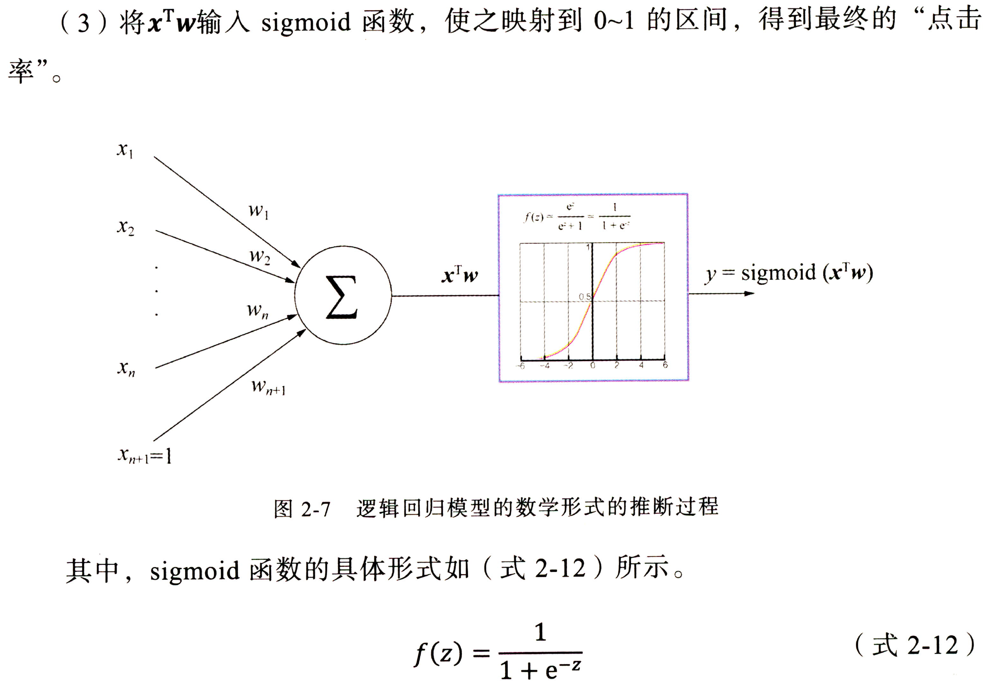

- 逻辑回归模型中，**权重向量 w** 的常用训练方法包括：梯度下降法、牛顿法、拟牛顿法等

  

##### 梯度下降法

目的：找到函数的局部最小值

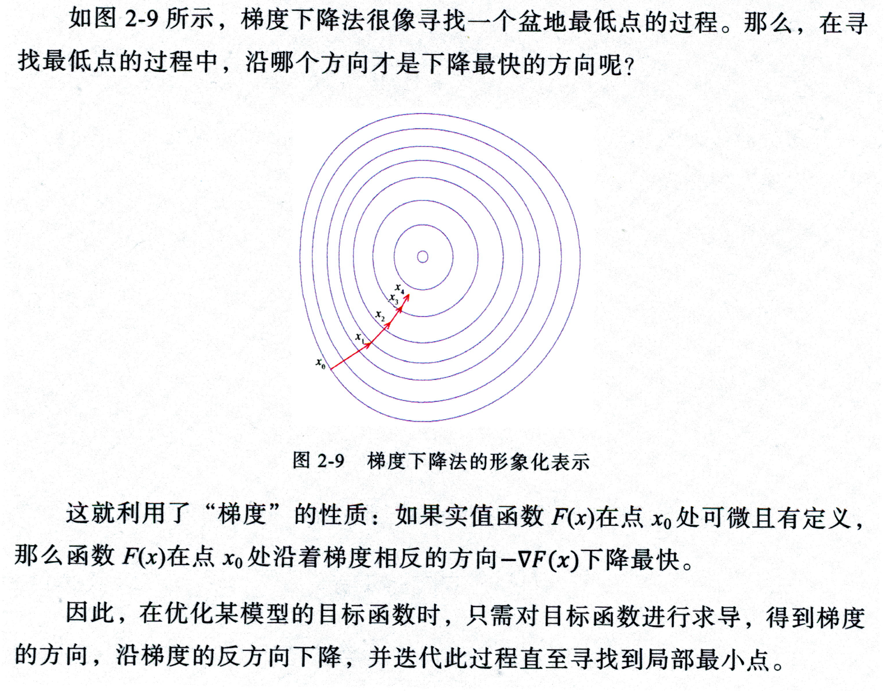

##### 逻辑回归 vs 线性回归

1. 线性回归使用最小二乘法让残差平方和最小；逻辑回归使用最大似然估计，最大化一个似然函数，即可能性函数

2. 线性回归假设因变量y（事件是否发生）服从高斯分布（正态分布），显然不是二分类问题的数学假设；逻辑回归假设y服从伯努利分布

##### 逻辑回归模型的局限性

无法进行特征交叉、特征筛选等操作，不可避免的造成信息的损失

### 3、因子分解模型族

在传统逻辑回归的基础上，加入了二阶部分，使模型具备了进行特征组合的能力

- 更进一步，在因子分解机的基础上，发展出来的域感知因子分解机（FFM），通过加入特征域的概念，加强了因子分解机特征交叉的能力

- 为什么需要特征交叉？——辛普森悖论，即如果对高维特征进行合并，会损失大量有效信息

#### POLY2 模型：对所有特征进行两两交叉

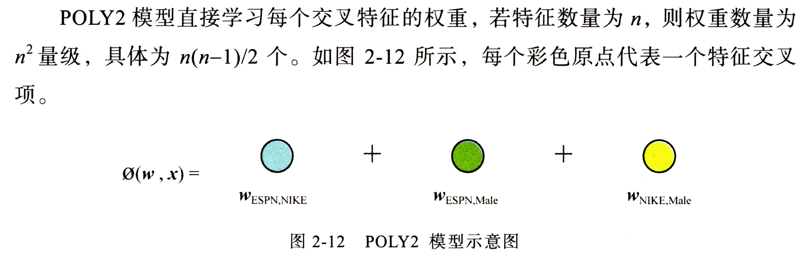

  - 互联网常采用 ont-hot 编码处理类别类型数据导致特征向量稀疏，而 POLY2 对特征进行“暴力”组合，对模型所有特征进行两两交叉。缺点：无选择的特征交叉使得原本就稀疏的特征向量更加稀疏，导致大部分交叉特征的权重缺乏有效的数据训练，无法收敛

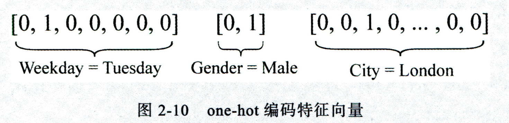

#### FM 模型：隐向量特征交叉

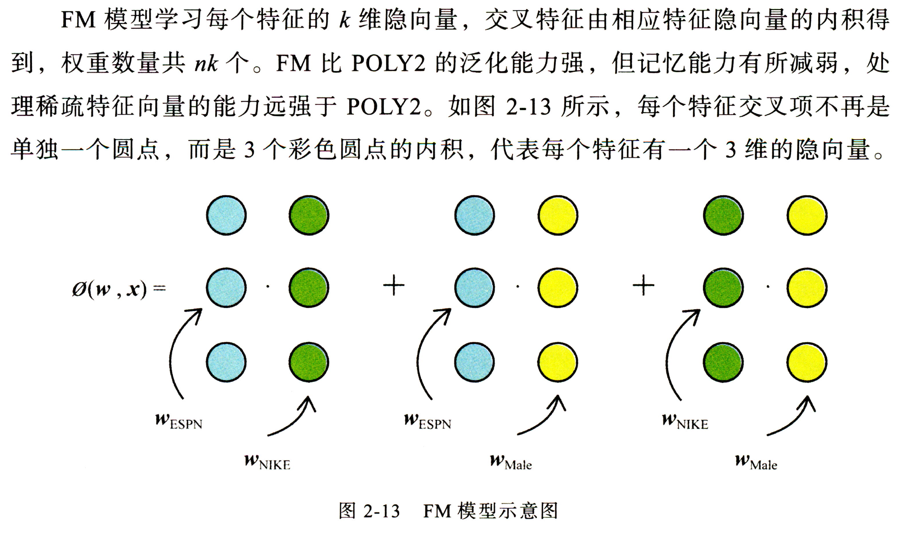

- FM 为每个特征学习了**一个隐权重向量**，在特征交叉时，使用**两个隐向量**的**内积**作为交叉特征的权重，取代单一的权重系数w。

- FM 可以说是将矩阵分解隐向量的思想进行了进一步的拓展，从单纯的用户、商品隐向量扩展到了所有特征上。

  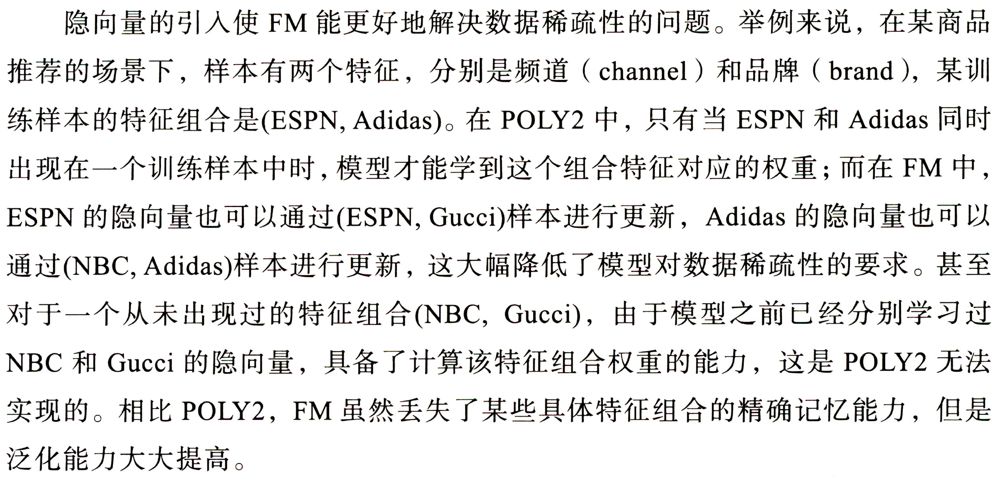

- FM 模型可以使用梯度下降法训练

- FM 在 2012-2014 年前后，成为业界主流的推荐模型之一

#### FFM 模型：引入特征域概念

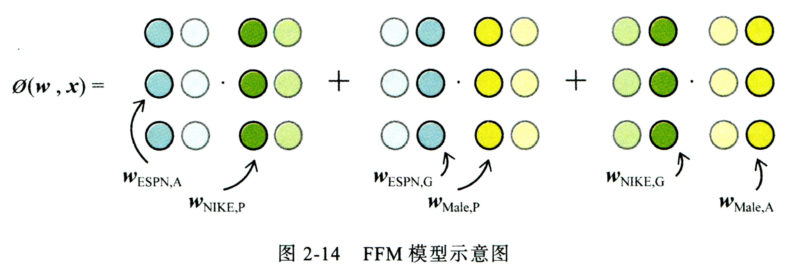

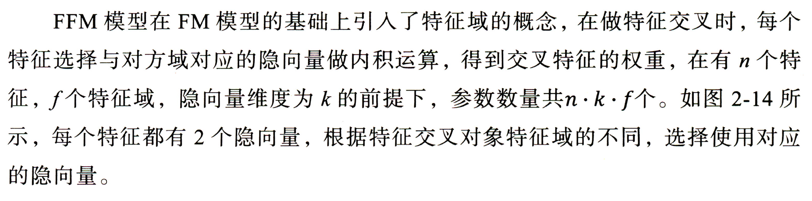

- 相比 FM 模型，FFM 引入**特征域**感知的概念

- 隐向量由原来的一个隐向量变成了一组隐向量（根据我的理解：以下图为例，已知有3个特征域，此时原有的FM有3个隐向量，而FFM将原有的3个隐向量进行了扩充，即将**一个隐向量**扩充成了**一组隐向量**，扩充方式是，原有的FM对不同的特征域使用的是同一个隐向量，而FFM对不同的特征域生成不同的隐向量）

  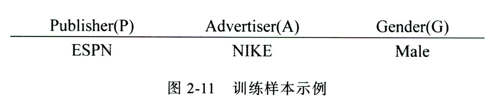

  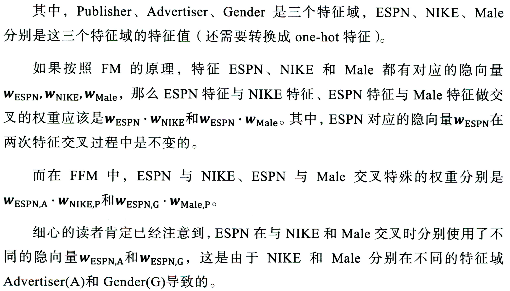

  在 FFM 模型的训练过程中，需要学习 n 个特征在 f 个域上的 k 维隐向量，参数数量共 n * k * f 个

### 4、组合模型

#### GBDT+LR 组合模型

- FFM 只能做二阶特征交叉，如果继续提高特征交叉的维度，会不可避免地产生组合爆炸的问题。2014 年，Facebook 提出了基于 GBDT+LR 组合模型的解决方案。其中，**用 GBDT 构建特征工程**，**利用 LR 预估 CTR** 这两步是 **独立训练** 的。

- 利用 GBDT 自动进行特征筛选和组合，进而生成新的离散特征向量，再把该特征向量当做 LR 模型输入。

- 为了融合多个模型的优点，将不同模型组合使用。

- 组合模型中体现出的特征模型工程化的思想，成为深度学习推荐模型的核心思想之一。

  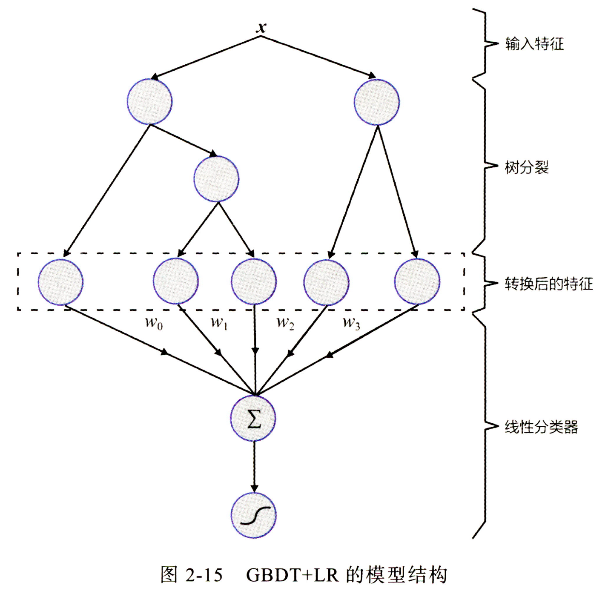

- 如何利用 GBDT **构建新的特征向量**？

  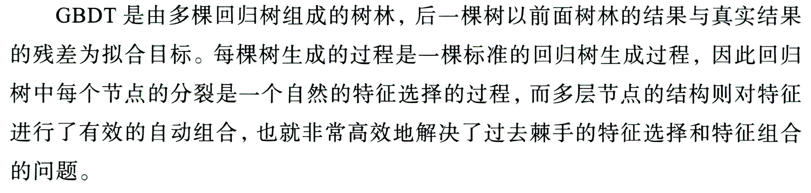

  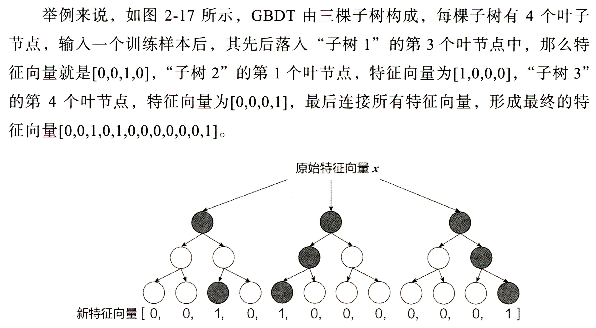

  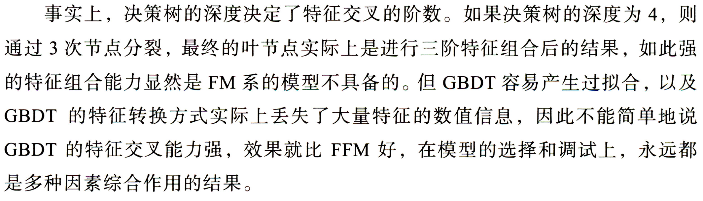

  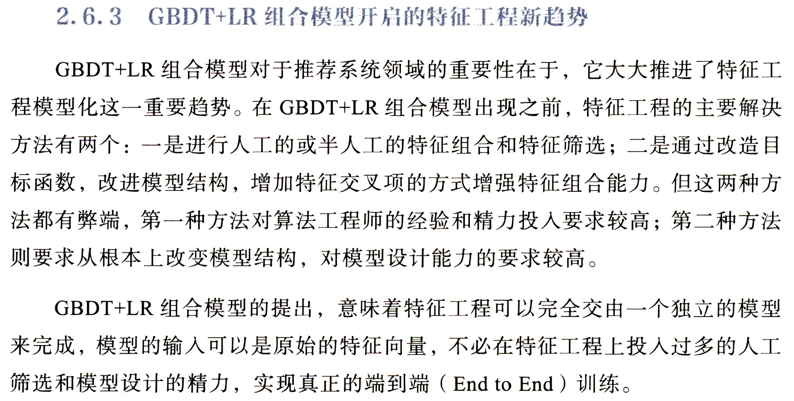
  
  
  
#### LS-PLM 大规模分段线性模型（阿里巴巴曾经主流推荐模型）

前深度学习时代最后一个推荐模型。**LS-PLM** 又称 **MLR**（混合逻辑回归模型），其结构与 **三层神经网络** 极其相似。

LS-PLM 在逻辑回归的基础上，先对样本进行 **分片**，再在样本 **分片中** 应用 **逻辑回归** 进行 CTR 预估。

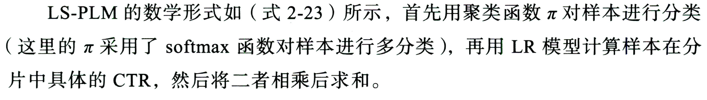

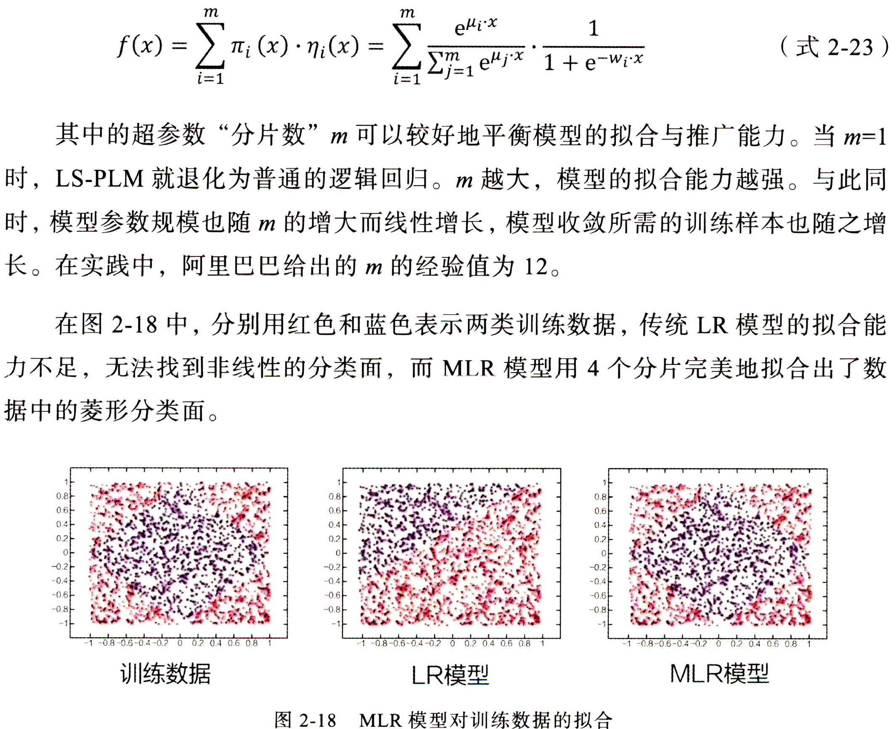

### 传统推荐模型的特点总结

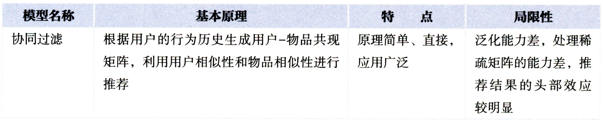

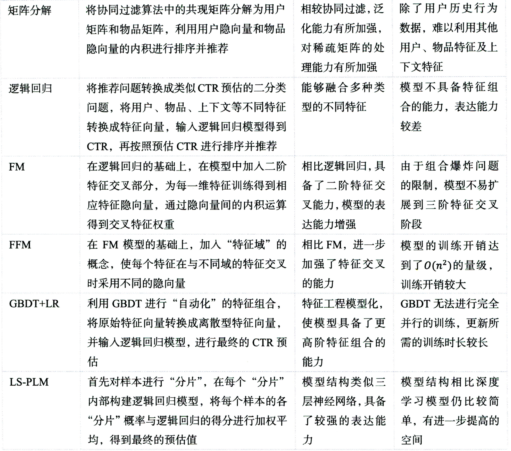

## 深度学习在推荐系统中的应用

以多层感知机 MLP 为核心，通过改变神经网络结构，深度学习模型的演变方向如下：

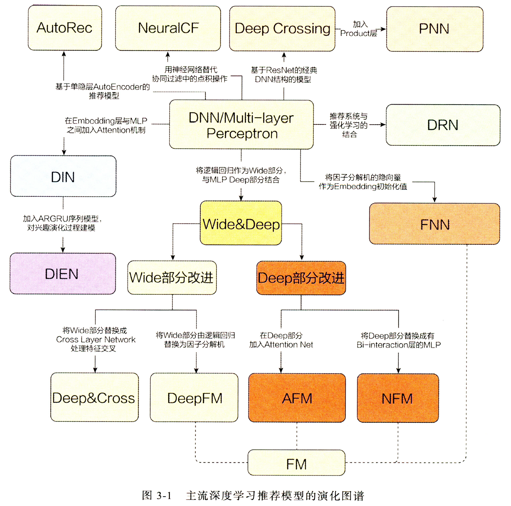

- 改变神经网络的复杂程度
  - AutoRec，最简单的单层神经网络模型（自编码器推荐）
  - Deep Crossing，经典的深度神经网络结构（深度特征交叉）
- 改变特征交叉方式
  - NeutralCF（神经网络协同过滤）
  - PNN（基于积操作的神经网络）
- 组合模型
  - Wide&Deep 模型
  - 后续变种 Deep&Cross，DeepFM 等
  - 通过组合两种不同特点、优势互补的深度学习网络，提升模型的综合能力
- FM 模型的深度学习演化版本
  - NFM，神经网络因子分解机，主要利用神经网络提升 FM 二阶部分的特征交叉能力
  - FNN，基于因子分解机支持的神经网络，利用 FM 的结果进行网络初始化
  - AFM，注意力因子分解机，引入了注意力机制的 FM 模型
- 注意力机制与推荐模型的结合
  - 主要包括结合了 FM 与注意力机制的 AFM
  - 引入了注意力机制的 CTR 预估模型 DIN（深度兴趣网络）
- 序列模型与推荐模型的结合
  - 使用序列模型模拟用户行为或用户兴趣的演化趋势，代表模型是 DIEN，深度兴趣进化网络
- 强化学习与推荐模型的结合
  - 将强化学习应用于推荐领域，强调模型的在线学习和实时更新，代表模型是 DRN，深度强化学习网络

### AutoRec 单隐层神经网络推荐模型

- 最简单的单层神经网络模型

- 将**自编码器**（AutoEncoder）的思想与**协同过滤**结合
  1. 利用协同过滤中的**共现矩阵**，完成**物品向量**或者**用户向量**的自编码
  2. 再利用自编码的结果得到用户对物品的预估评分，进而进行推荐排序

#### 什么是自编码器

输入 图像、音频、数据，向量为 r -> (自编码器) -> 输出尽量接近向量 r 本身

相当于完成了数据压缩和降维的工作，输出向量不完全等同于输入向量，因此具备缺失一定维度的预测能力

完成自编码器的训练后，相当于在重建函数中存储了所有数据向量的“精华”

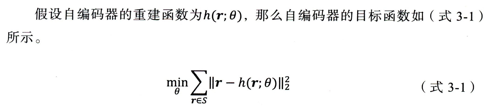

##### 共现矩阵

有 m 个用户，n 个物品，用户会对 n 个物品中的一个或几个评分，未评分的物品分值用默认值或平均值表示。则所有 m 个用户对物品的评分可以形成一个 m*n 维的评分矩阵，也就是协同过滤中的共现矩阵。

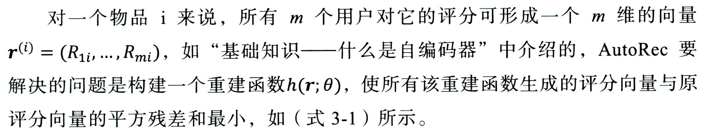

得到重建函数后，需要经过评分预估、排序，才能得到最终的推荐列表。

- 基于物品的 AutoRec：把物品的评分向量作为输入向量
- 基于用户的 AutoRec：把用户的评分向量作为输入向量

#### 重建函数的模型结构

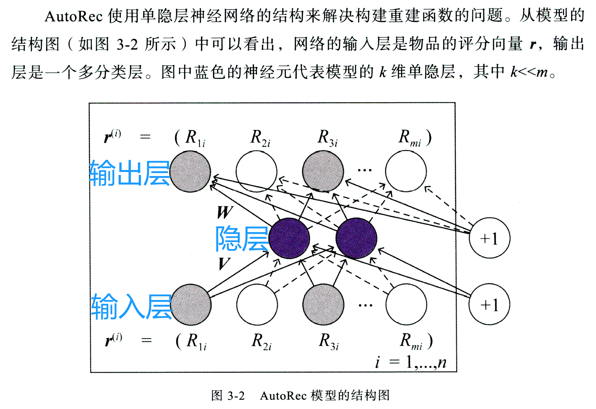

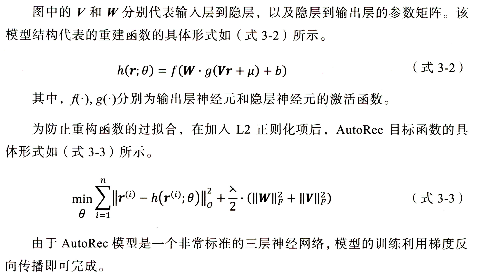

##### 神经元（感知机）

神经元，在具体实现、数学形式、训练方式上与**逻辑回归**一致

假设模型的输入向量是一个二维特征向量 x1，x2，则单神经元的结构如下图所示。

**篮圈内**的部分可以看作**线性的加权求和**，再加上一个常数偏置b，即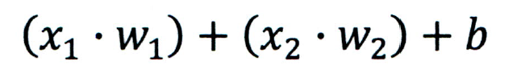

**篮圈**可以看作**激活函数**，主要作用是把一个无界输入映射到一个规范、有界的值域上

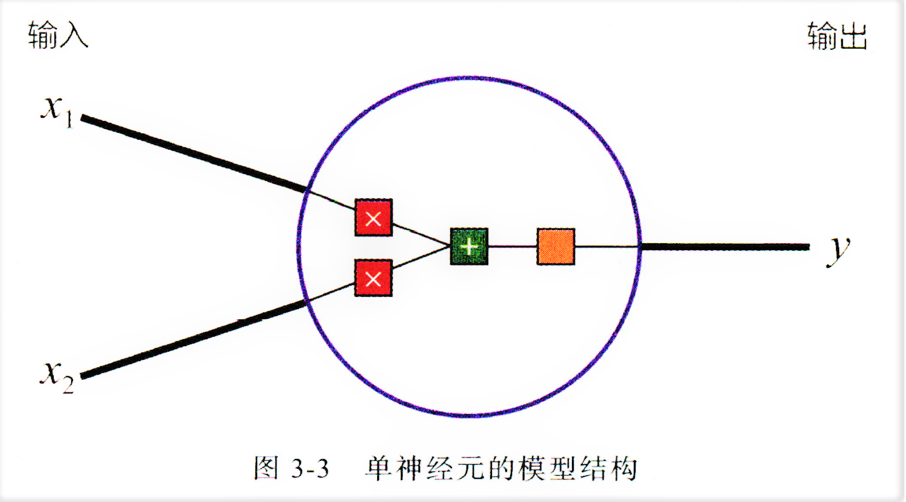

##### 神经网络（多个神经元组成一个网络）

单神经元拟合能力不强，解决复杂问题时，常用多神经元组成一个网络，使之具备拟合任意复杂函数的能力，这就是神经网络

由于对神经元不同连接方式的探索，才衍生出各种不同特性的神经网络，也就有了各种不同的深度学习模型。

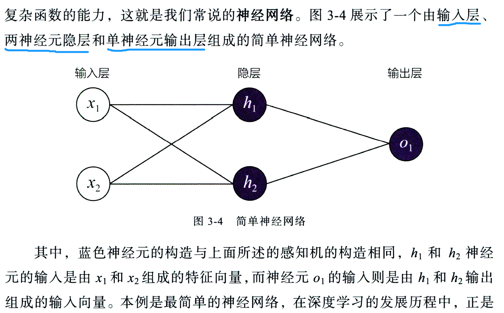

###### 如何训练一个神经网络？

神经网络的训练方法是**基于链式法则的梯度反向传播**。

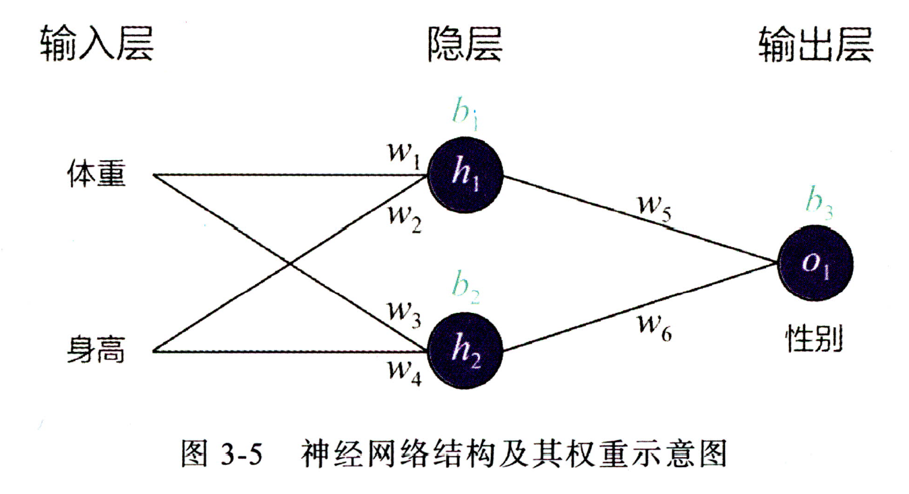

- 前向传播：在当前网络参数的基础上得到模型对输入的预估值，也就是模型推断过程。得到预估值之后，利用损失函数（Loss Function）的定义计算模型的损失。
  - 对 **输出层神经元 o1 **来说，可以直接利用梯度下降法计算神经元相关权重 w5, w6 的梯度，从而进行权重更新。
- 反向传播
  - 对 **隐层神经元的参数 w1** 来说，利用链式求导法则，可以解决梯度反向传播的问题。最终的梯度逐层传导回来，指导权重 w1 的更新。

##### 