# 深度学习推荐系统

## 传统推荐模型的发展脉络

### 1、协同过滤算法族

仅利用用户和商品之间的显示、隐式反馈

##### 共现矩阵

共现矩阵是一个这样的矩阵，以所有用户为行，所有物品为列组成的矩阵，矩阵中的值是用户对物品的打分，这样的矩阵就叫做共现矩阵。

##### UserCF 用户协同过滤

用户相似度计算方法：余弦相似度、Pearson 相关系数

获取 Top n 相似用户之后，用用户相似度和相似用户的评价的加权平均获得目标用户的评价预测

##### ItemCF 物品协同过滤

##### 协同过滤衍生出的矩阵分解模型 MF

MF 是由协同过滤衍生出的

##### 特征值分解、奇异值分解、梯度下降

##### 过拟合现象和正则化

- 消除用户和物品打分的偏差

- 矩阵分解的最终产出是用户和物品隐向量，这其实与深度学习中的 embedding 思想不谋而合，因此矩阵分解的结果也非常便于与其他特征进行组合和拼接，便于与深度学习网络进行无缝结合

### 2、逻辑回归模型族 LR

利用、融合更多用户、物品及上下文特征。相比协同过滤和矩阵分解利用物品的“相似度”进行推荐，逻辑回归将推荐问题看成一个分类问题，通过预测**正样本**的**概率**进行排序。这里的**正样本**可以是用户“点击”“观看”了某商品。因此，逻辑回归模型将推荐问题转换成了一个点击率（Click Through Rate，CTR）预估问题。

- 由 LR 模型衍生出的大规模分片线性模型 LS-PLM，以及由逻辑回归发展出来的 FM 模型

- 基于逻辑回归模型的推荐流程

  

  其中，逻辑回归模型的数学形式如下：

  

  

- 逻辑回归模型中，**权重向量 w** 的常用训练方法包括：梯度下降法、牛顿法、拟牛顿法等

  

##### 梯度下降法

目的：找到函数的局部最小值

##### 逻辑回归 vs 线性回归

1. 线性回归使用最小二乘法让残差平方和最小；逻辑回归使用最大似然估计，最大化一个似然函数，即可能性函数

2. 线性回归假设因变量y（事件是否发生）服从高斯分布（正态分布），显然不是二分类问题的数学假设；逻辑回归假设y服从伯努利分布

##### 逻辑回归模型的局限性

无法进行特征交叉、特征筛选等操作，不可避免的造成信息的损失

### 3、因子分解模型族

在传统逻辑回归的基础上，加入了二阶部分，使模型具备了进行特征组合的能力

- 更进一步，在因子分解机的基础上，发展出来的域感知因子分解机（FFM），通过加入特征域的概念，加强了因子分解机特征交叉的能力

- 为什么需要特征交叉？——辛普森悖论，即如果对高维特征进行合并，会损失大量有效信息

#### POLY2 模型：对所有特征进行两两交叉

  - 互联网常采用 ont-hot 编码处理类别类型数据导致特征向量稀疏，而 POLY2 对特征进行“暴力”组合，对模型所有特征进行两两交叉。缺点：无选择的特征交叉使得原本就稀疏的特征向量更加稀疏，导致大部分交叉特征的权重缺乏有效的数据训练，无法收敛

#### FM 模型：隐向量特征交叉

- FM 为每个特征学习了**一个隐权重向量**，在特征交叉时，使用**两个隐向量**的**内积**作为交叉特征的权重，取代**单一的权重系数w**。

- FM 可以说是将矩阵分解隐向量的思想进行了进一步的拓展，从单纯的用户、商品隐向量扩展到了所有特征上。

  

- 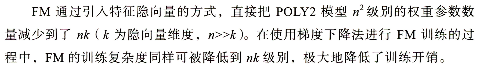

- FM 模型可以使用梯度下降法训练

- FM 在 2012-2014 年前后，成为业界主流的推荐模型之一

#### FFM 模型：引入特征域概念

- 相比 FM 模型，FFM 引入**特征域**感知的概念

- 隐向量由原来的一个隐向量变成了一组隐向量（根据我的理解：以下图为例，已知有3个特征域，此时原有的FM有3个隐向量，而FFM将原有的3个隐向量进行了扩充，即将 **一个隐向量** 扩充成了 **一组隐向量**，扩充方式是，原有的FM对不同的特征域使用的是同一个隐向量，而FFM对不同的特征域生成不同的隐向量）

  

  

  在 FFM 模型的训练过程中，需要学习 n 个特征在 f 个域上的 k 维隐向量，参数数量共 n * k * f 个

### 4、组合模型

#### GBDT+LR 组合模型

- FFM 只能做二阶特征交叉，如果继续提高特征交叉的维度，会不可避免地产生组合爆炸的问题。2014 年，Facebook 提出了基于 GBDT+LR 组合模型的解决方案。其中，**用 GBDT 构建特征工程**，**利用 LR 预估 CTR** 这两步是 **独立训练** 的。

- 利用 GBDT 自动进行特征筛选和组合，进而生成新的离散特征向量，再把该特征向量当做 LR 模型输入。

- 为了融合多个模型的优点，将不同模型组合使用。

- 组合模型中体现出的特征模型工程化的思想，成为深度学习推荐模型的核心思想之一。

  

- 如何利用 GBDT **构建新的特征向量**？

  

  

  

  
  
  
  
#### LS-PLM 大规模分段线性模型（阿里巴巴曾经主流推荐模型）

前深度学习时代最后一个推荐模型。**LS-PLM** 又称 **MLR**（混合逻辑回归模型），其结构与 **三层神经网络** 极其相似。

LS-PLM 在逻辑回归的基础上，先对样本进行 **分片**，再在样本 **分片中** 应用 **逻辑回归** 进行 CTR 预估。

### 传统推荐模型的特点总结

## 深度学习在推荐系统中的应用

以多层感知机 MLP 为核心，通过改变神经网络结构，深度学习模型的演变方向如下：

- 改变神经网络的复杂程度
  - AutoRec，最简单的单层神经网络模型（自编码器推荐）
  - Deep Crossing，经典的深度神经网络结构（深度特征交叉）
- 改变特征交叉方式
  - NeutralCF（神经网络协同过滤）
  - PNN（基于积操作的神经网络）
- 组合模型
  - Wide&Deep 模型
  - 后续变种 Deep&Cross，DeepFM 等
  - 通过组合两种不同特点、优势互补的深度学习网络，提升模型的综合能力
- FM 模型的深度学习演化版本
  - NFM，神经网络因子分解机，主要利用神经网络提升 FM 二阶部分的特征交叉能力
  - FNN，基于因子分解机支持的神经网络，利用 FM 的结果进行网络初始化
  - AFM，注意力因子分解机，引入了注意力机制的 FM 模型
- 注意力机制与推荐模型的结合
  - 主要包括结合了 FM 与注意力机制的 AFM
  - 引入了注意力机制的 CTR 预估模型 DIN（深度兴趣网络）
- 序列模型与推荐模型的结合
  - 使用序列模型模拟用户行为或用户兴趣的演化趋势，代表模型是 DIEN，深度兴趣进化网络
- 强化学习与推荐模型的结合
  - 将强化学习应用于推荐领域，强调模型的在线学习和实时更新，代表模型是 DRN，深度强化学习网络

### AutoRec 单隐层神经网络推荐模型

- 最简单的单层神经网络模型

- 将**自编码器**（AutoEncoder）的思想与**协同过滤**结合
  1. 利用协同过滤中的**共现矩阵**，完成**物品向量**或者**用户向量**的自编码
  2. 再利用自编码的结果得到用户对物品的预估评分，进而进行推荐排序

#### 什么是自编码器 AutoEncoder？

输入 图像、音频、数据，向量为 r -> (自编码器) -> 输出尽量接近向量 r 本身

相当于完成了数据压缩和降维的工作，输出向量不完全等同于输入向量，因此具备缺失一定维度的预测能力

完成自编码器的训练后，相当于在重建函数中存储了所有数据向量的 **精华**

##### 共现矩阵

有 m 个用户，n 个物品，用户会对 n 个物品中的一个或几个评分，未评分的物品分值用默认值或平均值表示。则所有 m 个用户对物品的评分可以形成一个 m*n 维的评分矩阵，也就是协同过滤中的共现矩阵。

得到重建函数后，需要经过评分预估、排序，才能得到最终的推荐列表。

- 基于物品的 AutoRec：把物品的评分向量作为输入向量
- 基于用户的 AutoRec：把用户的评分向量作为输入向量

#### 重建函数的模型结构

##### 神经元（感知机）

神经元，在具体实现、数学形式、训练方式上与**逻辑回归**一致

假设模型的输入向量是一个二维特征向量 x1，x2，则单神经元的结构如下图所示。

**篮圈内**的部分可以看作**线性的加权求和**，再加上一个常数偏置b，即

**篮圈**可以看作**激活函数**，主要作用是把一个无界输入映射到一个规范、有界的值域上

##### 神经网络（多个神经元组成一个网络）

单神经元拟合能力不强，解决复杂问题时，常用多神经元组成一个网络，使之具备拟合任意复杂函数的能力，这就是神经网络

由于对神经元不同连接方式的探索，才衍生出各种不同特性的神经网络，也就有了各种不同的深度学习模型。

###### 如何训练一个神经网络？

神经网络的训练方法是**基于链式法则的梯度反向传播**。

- 前向传播：在当前网络参数的基础上得到模型对输入的预估值，也就是模型推断过程。得到预估值之后，利用损失函数（Loss Function）的定义计算模型的损失。
  - 对 **输出层神经元 o1 **来说，可以直接利用梯度下降法计算神经元相关权重 w5, w6 的梯度，从而进行权重更新。
- 反向传播
  - 对 **隐层神经元的参数 w1** 来说，利用链式求导法则，可以解决梯度反向传播的问题。最终的梯度逐层传导回来，指导权重 w1 的更新。

### Deep Crossing 模型

应用场景：微软搜索引擎 Bing 中的搜索广告推荐场景，目标是预测广告的点击率

为了完成端到端的训练，需要解决：

- 稀疏特征向量稠密化问题
- 特征自动交叉组合问题
- 在输出层达成问题设定的优化目标

Deep Crossing 模型分别设置了不同的神经网络层来解决上述问题

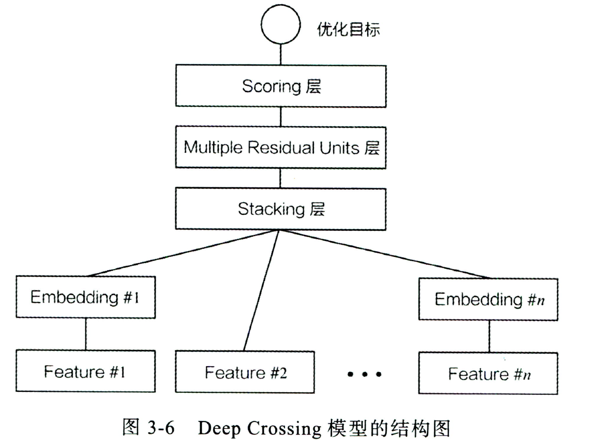

#### 神经网络各层功能和实现

##### Embedding 层

作用：将（one-hot编码后的）稀疏的类别特征转换成稠密的 Embedding 向量。有许多种不同的 Embedding 方法。

一般来说，Embedding 向量的维度远小于原始的稀疏特征向量，几十到上百维一般就能满足需求。

如图 3.6 Feature #2，数值型特征不需要经过 Embedding 层，直接进入 Stacking 层。

##### Stacking 层

把生成的 Embedding 特征和数值特征 **拼接** 在一起，形成新的包含全部特征的特征向量，也称为 concatenate 层

##### Multiple Residual Units 层

主要结构是多层感知机，使用 **多层残差网络** 作为 MLP 的具体实现

通过多层残差网络对特征向量各个维度进行充分的交叉组合，使模型能够抓取到更多的非线性特征和组合特征的信息

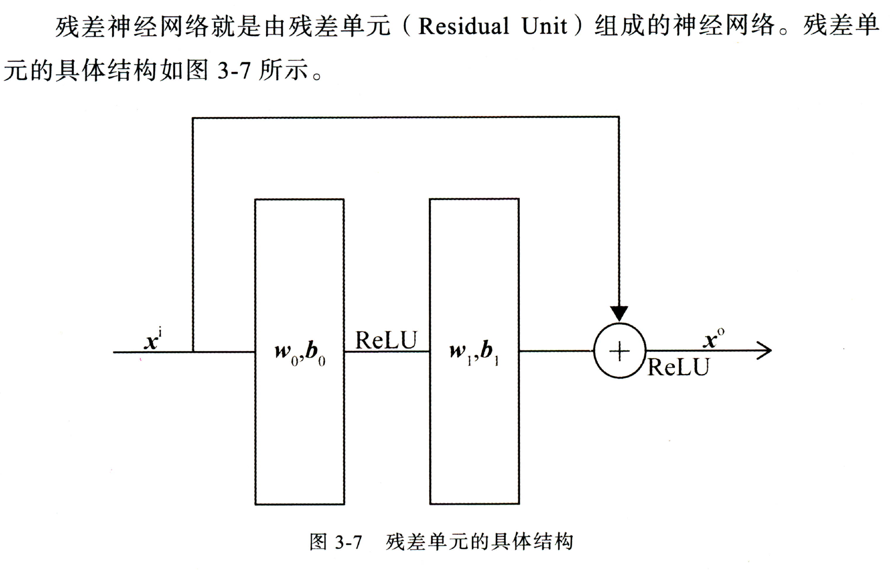

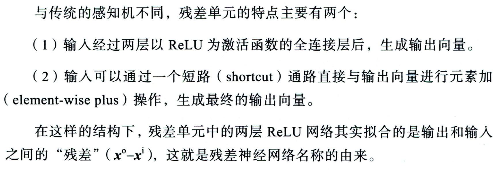

旁路用来做什么？“拟合残差”的意思是让残差尽可能小吗？什么情况下输入会走短路，什么时候走两层的ReLU？为什么越过ReLU直接走短路可以减少过拟合现象？

##### Scoring 层

输出层，为了拟合优化目标而存在。

##### 小结

以上是 Deep Crossing 模型结构。在此基础上，使用梯度反向传播的方法进行训练，最终得到基于 Deep Crossing 的 CTR 预估模型。

采用 **Embedding + 多层神经网络** 的经典深度学习结构，没有任何人工特征工程的参与，原始特征经 Embedding 后输入神经网络层，将特征交叉的任务交给模型。

相比 FM，FFM 只能进行二阶的特征交叉，Deep Crossing 可以通过调整 **神经网络的深度**，进行特征之间的“深度交叉”。

### NeuralCF 模型：CF 与深度学习的结合

**NeuralCF 模型基于用户向量和物品向量这两个 Embedding 层，利用不同的互操作层进行特征的交叉组合，并且可以灵活的进行不同的互操作层的拼接。**

Neural Collaborative Filtering，NeuralCF 是基于深度学习的协同过滤模型。

从深度学习的视角重新审视矩阵分解模型：

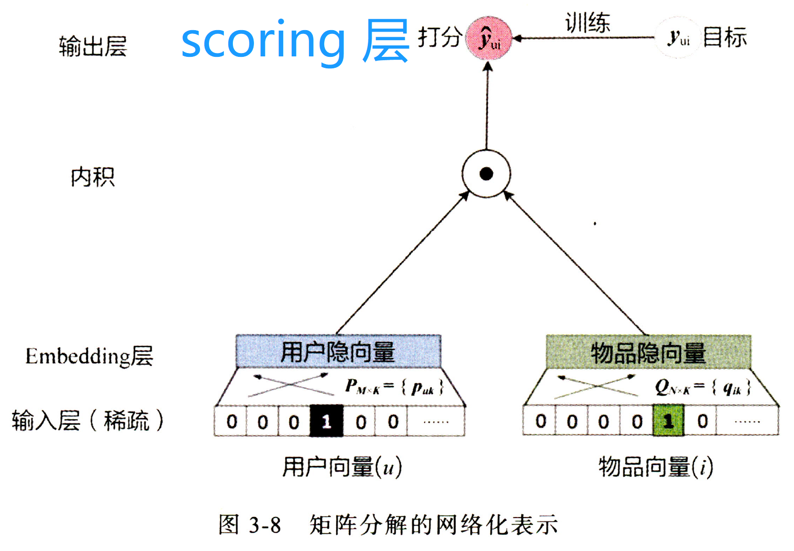

实际使用矩阵分解模型的时候，往往处于“欠拟合”状态，因为矩阵分解模型结构相对简单，尤其是 **输出层**，无法对优化目标进行有效拟合。为了让模型有更强的表达能力，提出 **NeuralCF 模型**。

NeuralCF 采用 **多层神经网络 + 输出层** 结构，代替了 **矩阵分解模型** 的 **内积** 操作，如下图 3-9。这样做的收益：

- 让用户向量和物品向量更充分交叉，得到更多特征组合
- 引入更多非线性特征，让模型表达能力更强

##### 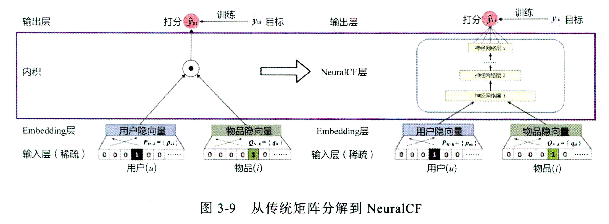

##### 广义矩阵分解模型

我的理解是，在向量互操作形式上，除了 NeuralCF 用 **神经网络** 来替代协同过滤的 **内积** 操作以外，广义上，任何向量之间的交互计算方式都可以用来替代协同过滤的内积操作，相应的模型可以称为广义矩阵分解模型。

##### NeuralCF 混合模型

NeuralCF 还能将不同的交互操作形式进行整合。例如下图，NeuralCF 混合模型整合了 **原始 NeuralCF** 和 **以元素积为互操作** 的广义矩阵分解模型。

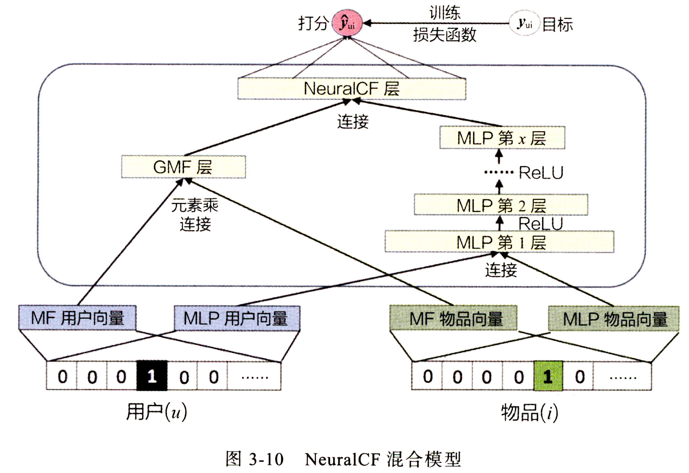

##### softmax 函数

> 对于像 CTR 这样的二分类问题，常采用 LR 来处理，而对于 图像分类等多分类问题，常采用 softmax 模型来处理。

将 n 维向量映射成一个概率分布。

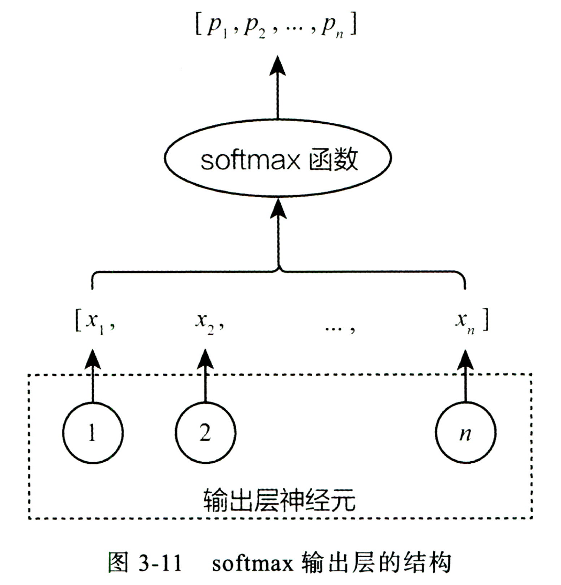

**softmax 函数** 常与 **交叉熵** 配合，因为 softmax 函数把分类输出标准化成了多个分类的概率分布，而交叉熵正好刻画了预测分类和真实结果之间的相似度。

这种配合不仅在数学形式上完美统一，而且在梯度形式上也非常简洁。使用梯度反向传播，可完成对整个神经网络权重的更新。

##### 局限性

NeuralCF 基于协同过滤思想进行构造，只用到了用户向量、物品向量两种特征向量，没有引入其他类型特征。

### PNN 模型：加强特征交叉能力

PNN 模型加入多种特征向量，并设计特征交互的方法。

PNN 采用 **Product Layer（乘积层）** 代替了 Deep Crossing 中的 **Stacking** 层。不同特征的 Embedding 向量 **不再是简单的拼接**，而是用 Product 操作进行 **两两交互**，更有针对性地获取特征之间的交叉信息。

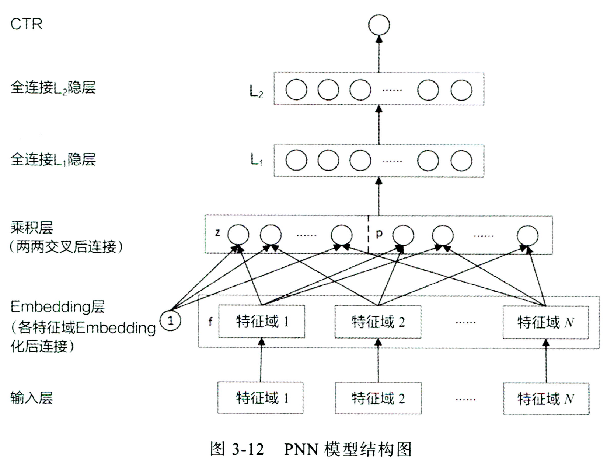

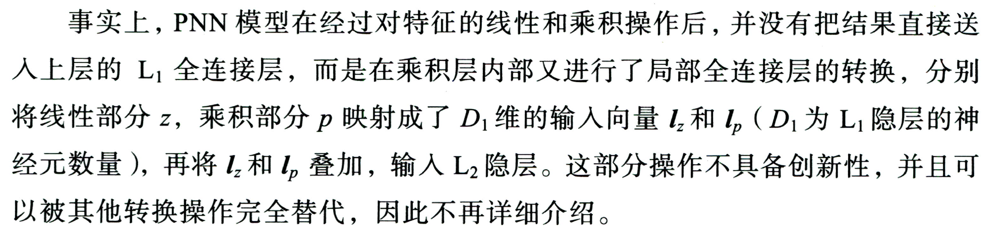

##### 乘积层

PNN 模型中的乘积层由 **线性操作部分**（z部分）和 **乘积操作部分**（p部分）组成，乘积特征交叉部分又分为内积操作 IPNN 和外积操作 OPNN，都是对 Embedding  向量进行两两组合。

为了能够乘积操作， 各 Embedding 向量的维度必须相同。

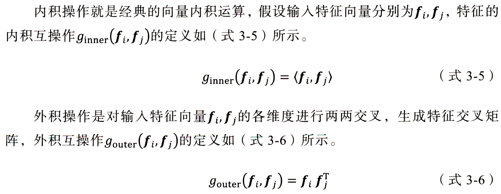

外积操作增加了问题的复杂度，PNN 论文中有一种降维的方法，把所有两两特征 Embedding 向量的外积结果相加，得到一个叠加外积操作矩阵，相当于让所有特征向量通过一个 **平均池化层 Average Pooling** 后，再进行外积操作。需要保证不同特征的对应维度有类似含义。平均池化操作经常发生在同类 Embedding 上，例如，将用户浏览过的多个物品的 Embedding 进行平均。

##### 局限性

对所有特征进行无差别的交叉，忽略了原始特征向量中包含的有价值的信息。如何综合原始特征及交叉特征？后续的 Wide&Deep，以及基于 FM 的各类模型给出了它们的解决方案。

#### Q&A

1. 同样是对数据的降维，Embedding Layer 和 AutoEncoder 有什么区别？能不能相互替代？

   答：AutoEncoder 的重建函数需要训练，而 Embedding Layer 不需要训练

2. Embedding Layer 和 AutoEncoder 不能简单理解成一个 hash，因为它让输出尽量接近输入数据本身，但是 PNN 模型中在 Embedding 后面有一个乘积层 Product Layer，做了乘积之后，比如两个向量做内积，得到一个值。当做内积的两个向量维度不同的时候（例如一个是年龄，一个是地区），相乘得到的值和原来的特征向量相比，还有没有原来的表达能力？

   答：相比于简单的交由全连接进行无差别化的处理，PNN 强调了 Embedding 向量之间的交叉方式是多样化的。当然有缺陷，对所有特征进行无差别的交叉，忽略了原始特征向量中包含的有价值的信息。

### Wide&Deep 模型：记忆能力和泛化能力的综合

Wide&Deep 模型，由 **单层的 Wide 部分** 和 **多层的 Deep 部分** 组成的混合模型。（google, 2016)

- Wide：让模型具有较强的 **记忆能力**
  - **记忆能力** 是指，模型直接学习并利用历史数据中物品或者特征的“共现频率”的能力
  - CF、LR等简单模型都有较强的记忆能力，原始数据的分布特点直接影响推荐结果
- Deep：让模型具有 **泛化能力**
  - 泛化能力是指，模型传递特征的相关性，以及发掘稀疏甚至从未出现过的稀有特征与最终标签相关性的能力
  - **矩阵分解** 引入了 **隐向量** 这样的结构，因此比 **协同过滤** 的泛化能力强

#### 模型结构

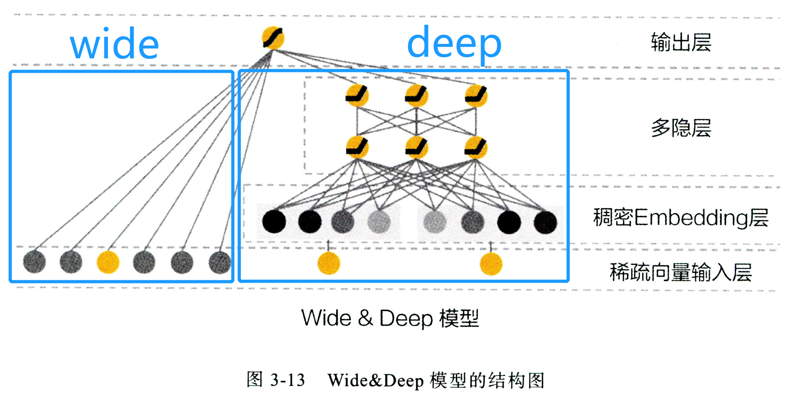

Wide&Deep 模型在 Google Play 中的实战

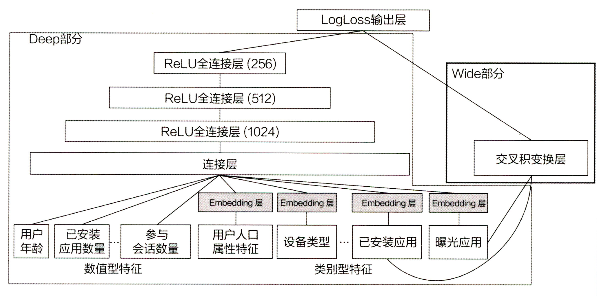

#### Deep&Cross 模型：Wide&Deep 模型的进化

用 **Cross 网络** 替代原来的 **Wide 部分**，增加特征之间的交互力度。

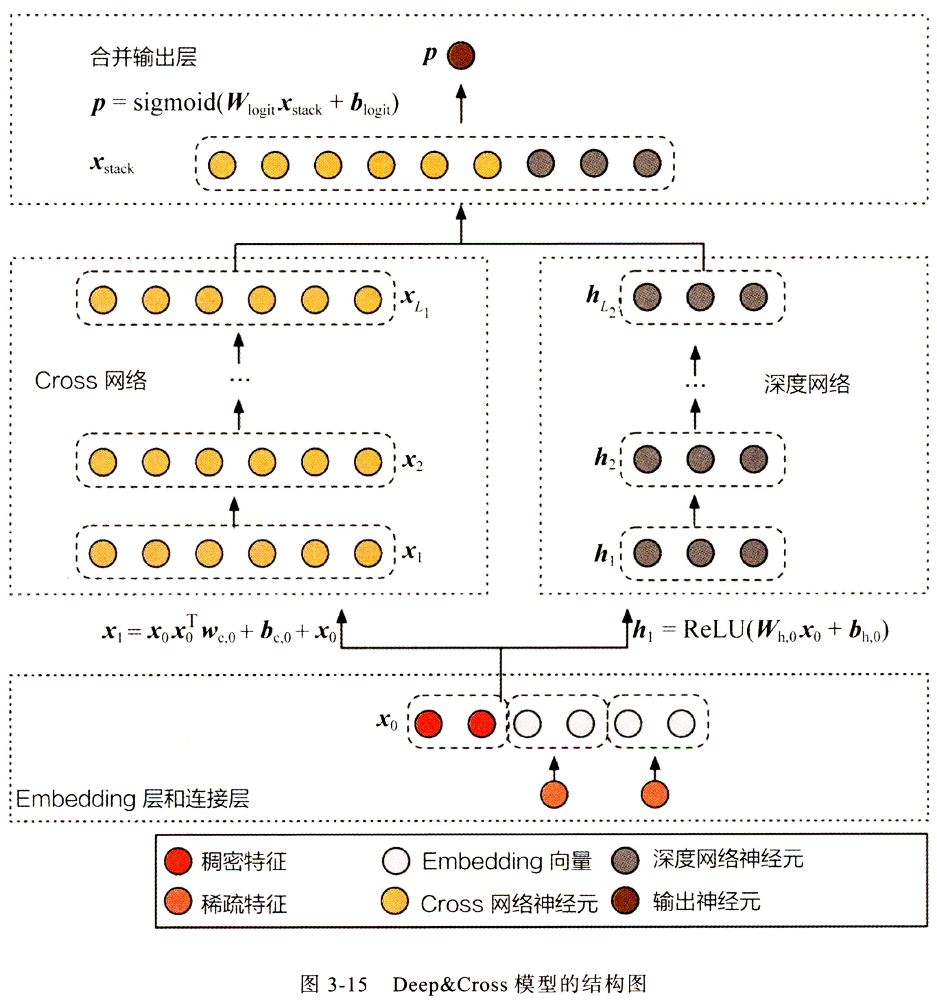

使用 **交叉层 cross layer** 对输入向量进行特征交叉：

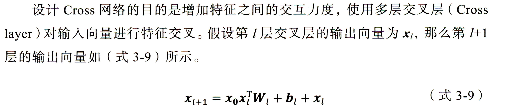

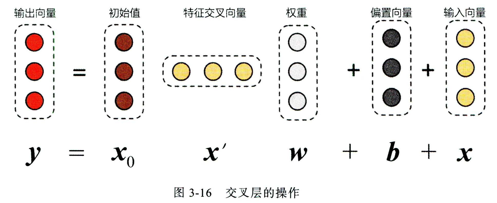

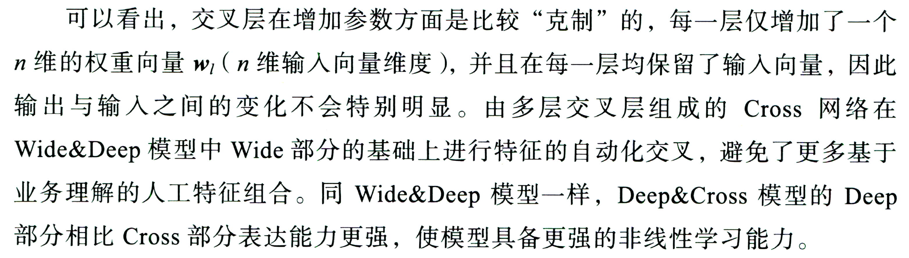

### FM 与深度学习模型的结合

#### FNN：用 FM 的隐向量完成 Embedding 层初始化

Embedding 层的参数往往占整个神经网络参数的大半以上，因此模型的收敛速度往往受限于 Embedding 层。

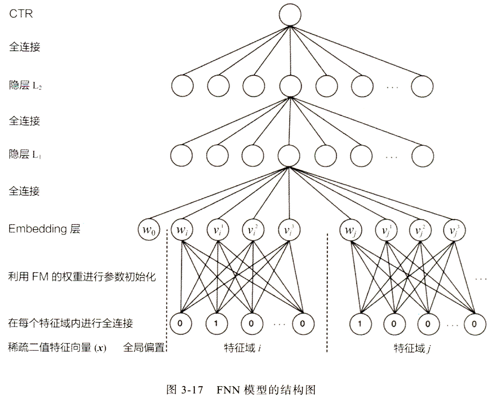

FNN 是对 Embedding 层的改进：

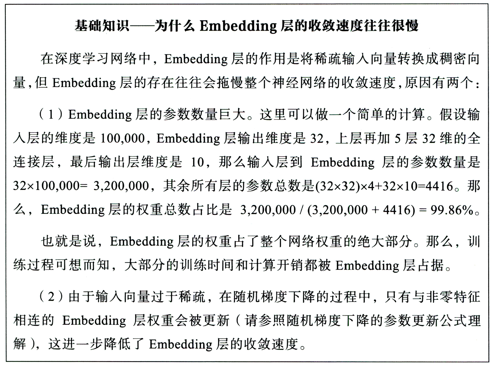

- 用 FM 训练好的各特征隐向量初始化 Embedding 层的参数，让初始值更接近目标，解决 **Embedding 层收敛速度慢** 的问题
- 为什么 FM 训练好的各特征隐向量会更接近目标的 Embedding 层参数？

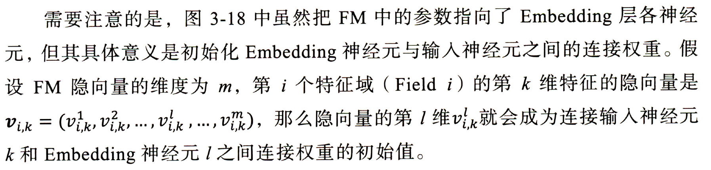

#### DeepFM：用 FM 代替 Wide 部分

将 **FM** 与 **Wide&Deep** 进行整合，加强了 **浅层网络部分** 特征组合的能力（2017，哈工大&华为），为了改进 Wide&Deep 的 Wide 部分不具备自动特征组合能力的缺陷进行的。

- 左边的 **FM 部分** 与右边的 **深度神经网络部分** 共享相同的 **Embedding 层**。

- 左侧的 FM 部分对不同的特征域的 Embedding 进行了两两交叉，也就是将 **Embedding 向量** 当做原 **FM 中的特征隐向量**。
- 最后将 **FM 的输出** 与 **Deep 部分的输出** 一同输入最后的输出层，参与最后的 **目标拟合**。

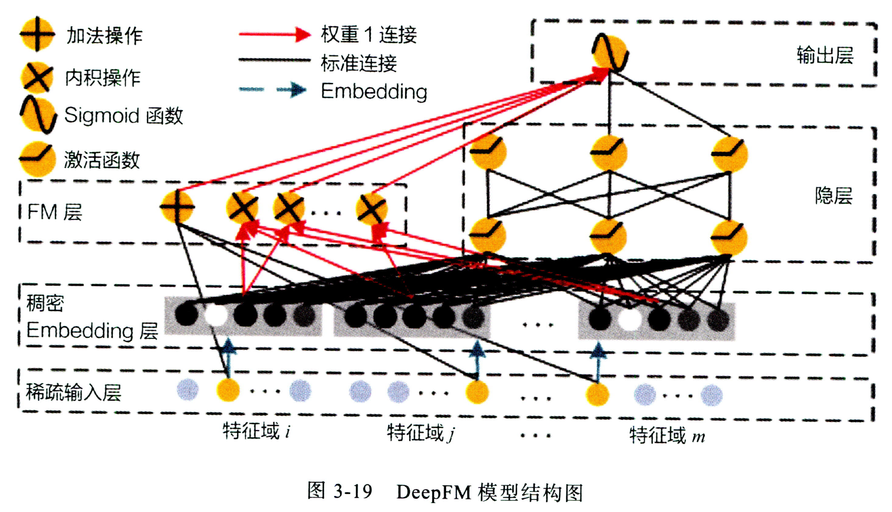

#### NFM：FM 的神经网络化尝试

FM 和 FFM 都是二阶特征交叉的模型，受到特征组合爆炸问题的制约，几乎不可能扩展到三阶以上。

NFM 模型利用神经网络更强的表达能力，改进 FM 模型。

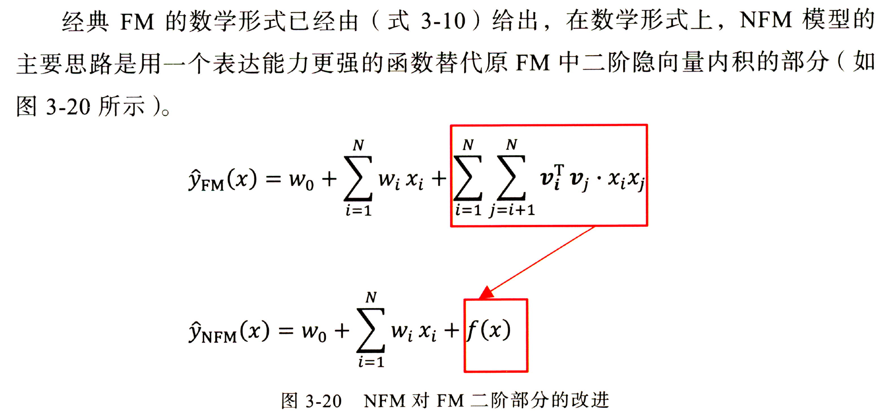

由于深度学习网络理论上有拟合任何复杂函数的能力，f(x) 的构造工作可以交由某个深度学习网络来完成，并通过 **梯度反向传播** 来学习，用以替代 FM 二阶部分的神经网络结构：

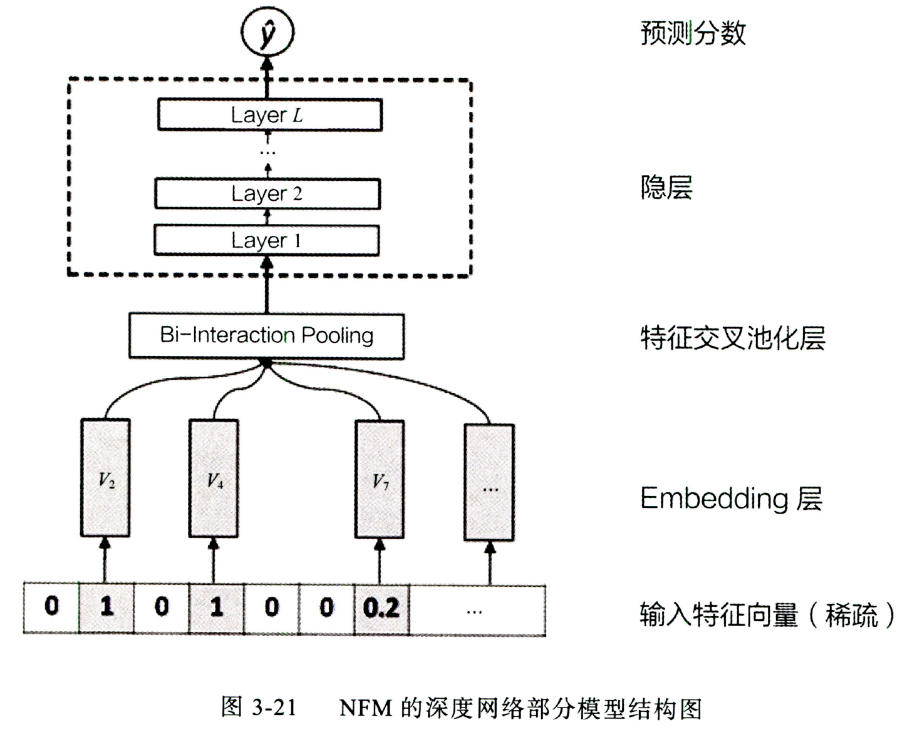

NFM 架构也可以视为 Wide&Deep 模型的优化。相比原始的 Wide&Deep 模型，NFM 模型对其 Deep 部分加入了特征交叉池化层，加强了特征交叉。

##### 特征交叉池化层

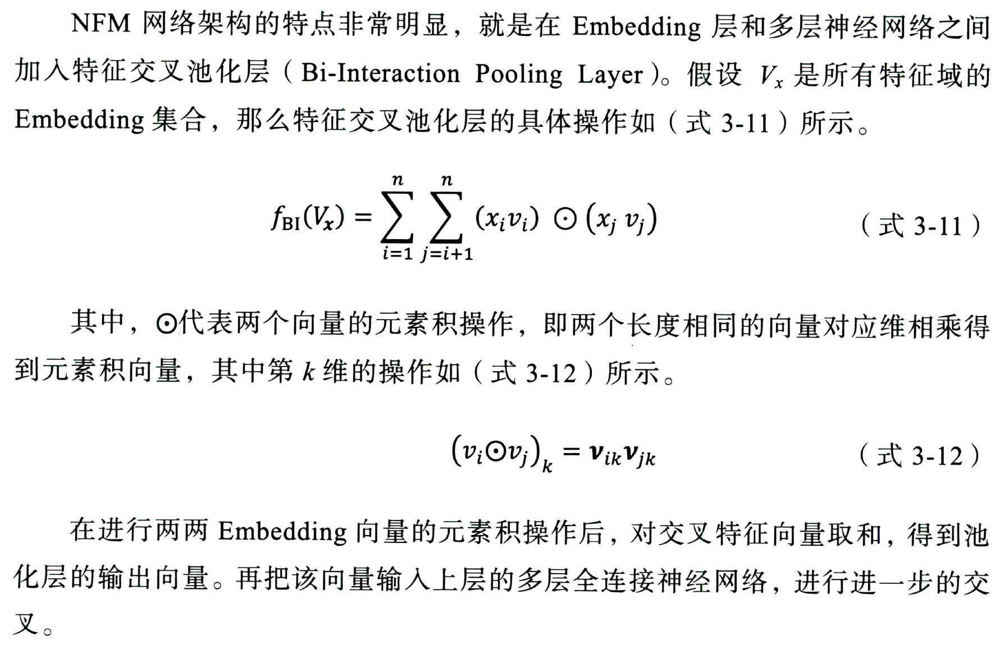

#### 小结

以上深度学习模型从 PNN 到 Wide&Deep，Deep&Cross，FNN，DeepFM，NFM 等模型，进行了大量基于不同特征交互操作思路的尝试，但都是从特征工程的角度，模型进一步提升的空间越来越小。

于是开始结构上的尝试：

- 注意力机制
- 序列模型
- 强化学习

### 注意力机制在推荐模型中的应用

#### AFM：引入注意力机制的 FM

AFM 由浙江大学提出。

AFM 模型可以被认为是 NFM 的延续，NFM 模型的 Embedding 向量经过特征交叉池化层进行 Sum Pooling 操作，将各特征向量一视同仁，没有考虑不同特征对结果的影响程度。而 **注意力机制** 模型会投入不同的注意力在不同的交叉特征上。

实现方式：在 **特征交叉层** 和 **最终输出层** 之间加入 **注意力网络 Attention Net**，为每一个交叉特征提供权重，即注意力得分。

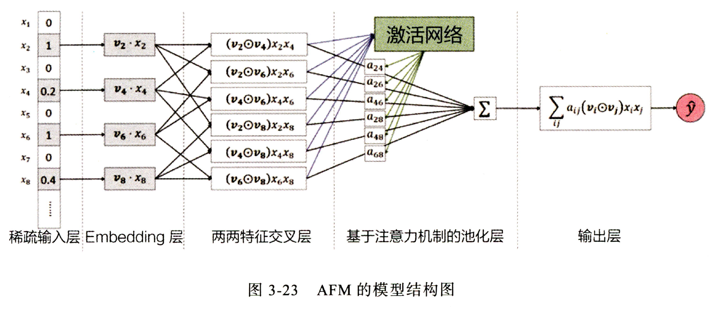

AFM 模型使用了一个在 **两两特征交叉层** 和 **池化层** 之间的 **注意力网络** 来生成注意力得分。该注意力网络的结构是：**单全连接层 + softmax 输出层**，数学形式如下。

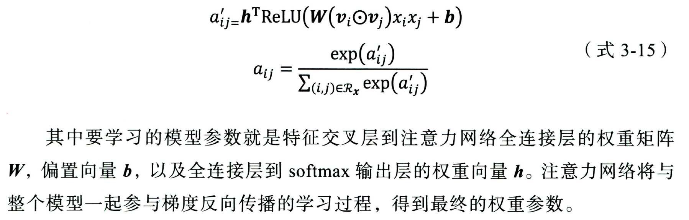

#### DIN：引入注意力机制的深度学习网络

应用场景是阿里巴巴的广告推荐。

例如，计算一个用户 u 是否点击一个广告 a。输入包括：

- 用户特征组 u

  - 包含特征：商品 id（用户曾经点击过的商品集合）

    原有模型只进行简单的 **平均池化操作** 后，进入上层神经网络中进行下一步训练，序列中的商品没有区分重要程度，和广告特征中的商品 id 也没有关系。而实际上，**用户特征** 和 **广告特征** 的 **关联程度非常强**，例如鼠标和键盘是互补商品，这时候，投给不同商品的 **注意力理应有所不同**。

  - 包含特征：商铺 id

- 广告特征组 a

  - 包含特征：商品 id
  - 包含特征：商铺 id

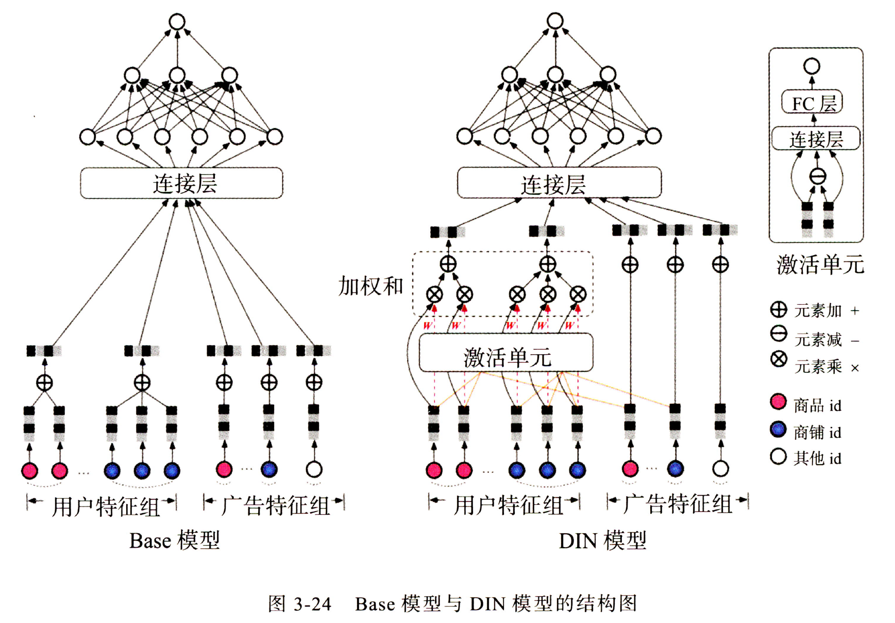

利用 **候选商品** 和 **历史行为商品** 之间的 **相关性** 计算出一个权重，这个权重就代表了 **注意力** 的强弱。其注意力部分的形式化表达如下：

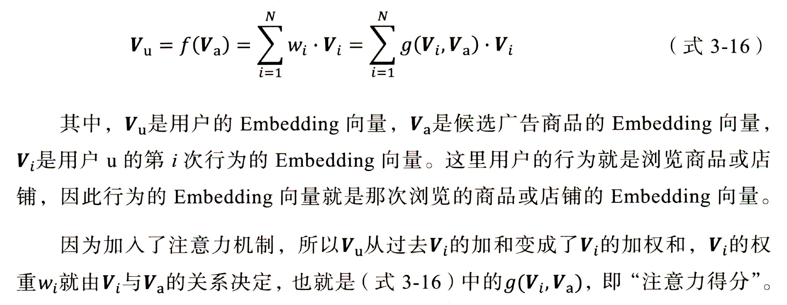

##### 注意力激活单元

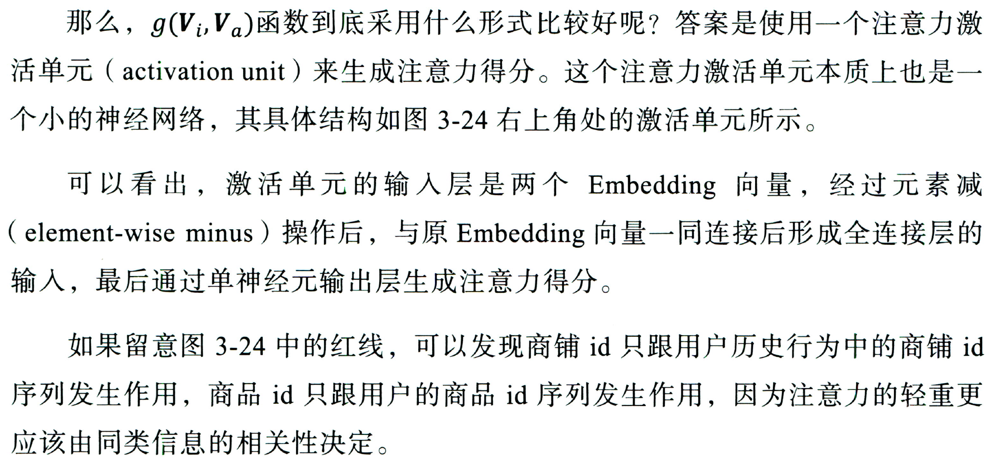

#### DIEN：序列模型与推荐系统的结合

2019，阿里巴巴提出 DIN 的演化版本 DIEN，用 **序列模型** 模拟了用户兴趣的进化过程。模型的应用场景和 DIN 完全一致。

用户的历史行为是随时间排序的序列。之前的模型是对时间无关，序列无关的。而序列信息对于推荐系统是有价值的，例如用户兴趣的迁移。序列信息的重要性在于：

- 它加强了 **最近行为** 对下次行为预测的影响
- 序列模型能够学习到购买趋势的信息，例如，用户兴趣从篮球鞋转移到机械键盘的概率

DIEN 模型的创新点在于如何构建 **兴趣进化网络**

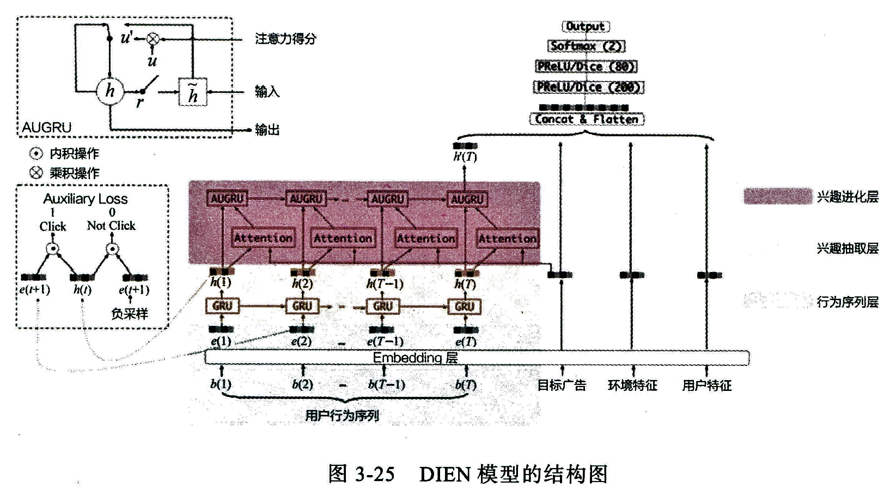

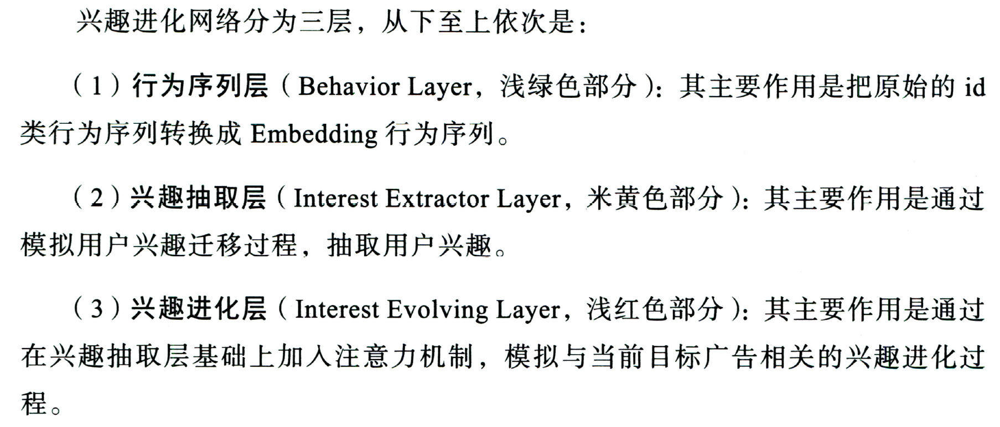

在兴趣进化网络中，行为序列层的结构与普通的 Embedding 层是一致的，模拟用户兴趣进化的关键在于 **兴趣抽取层** 和 **兴趣进化层**。

##### 兴趣抽取层的结构

兴趣抽取层的基本结构是 GRU 网络。

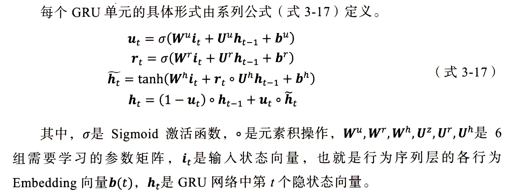

##### 兴趣进化层结构

在兴趣抽取层之上，再加上兴趣进化层，是为了更有针对性地模拟与目标广告相关的兴趣进化途径。兴趣进化层相比兴趣抽取层，最大的特点是加入了注意力机制。

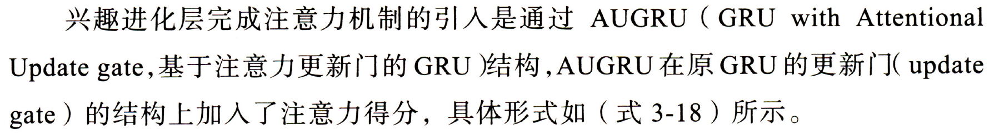

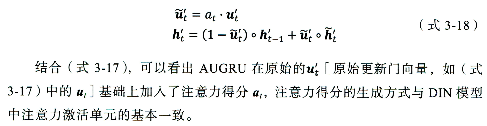

在工程实现上要注意：序列模型比较高的训练复杂度，以及在线上推断过程中的串行推断，使其在模型服务过程中延迟较大，这无疑增加了其上线的难度，需要在工程上着重优化。

##### 强化学习与推荐系统的结合

循环：行动 -> 反馈 -> 状态更新

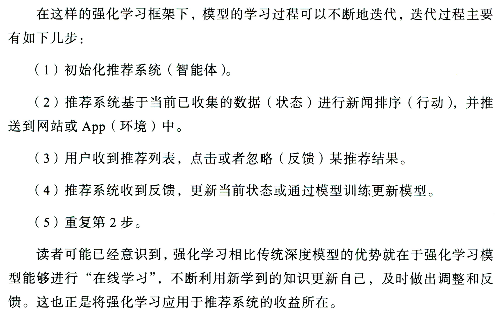

### 总结：推荐系统的深度学习时代

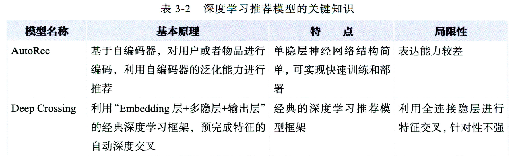

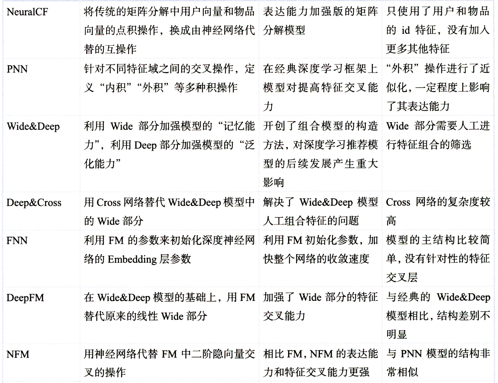

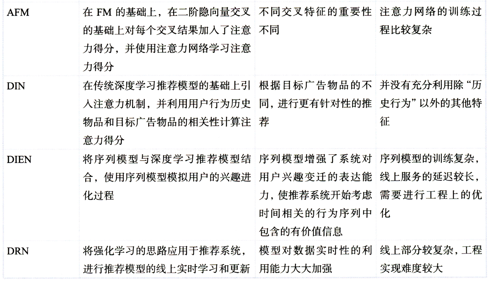

## Embedding 技术在推荐系统中的应用

### 什么是 Embedding？

Embedding 就是用一个低维稠密的向量“表示”一个对象。

Embedding 向量能够表达相应对象的某些特征，同时向量之间的距离反映了对象之间的相似性。

### Embedding 的重要性

- one-hot 编码出的特征向量极度稀疏，深度学习的结构特点不利于稀疏特征向量的处理，因此需要 Embedding 层负责将 **高维稀疏特征向量** 转化成 **稠密低维特征向量**

- Embedding 几乎可以对任何信息进行编码，本身包含大量有价值信息

- Embedding 对物品、用户相似度的计算是常用的推荐系统召回层技术：

  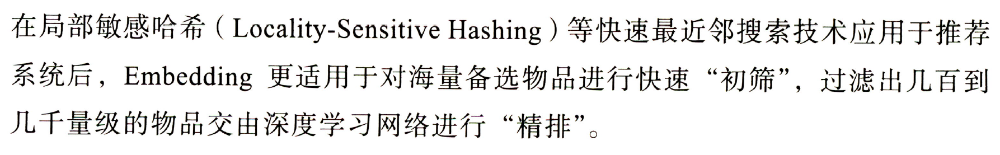

### 各类流行的 Embedding 方法

#### Word2vec：经典的 Embedding 方法

2013，google 提出

训练 Word2vec 模型需要一组句子组成的语料库，假定每个词都和相邻的词的关系最密切

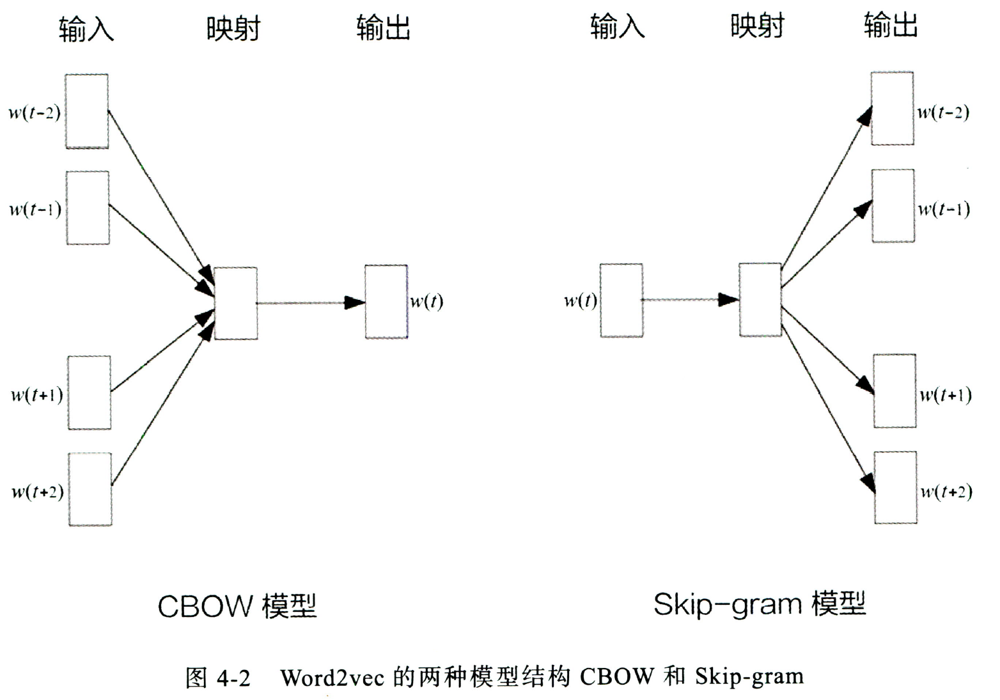

#### Embedding 层可以与神经网络独立训练

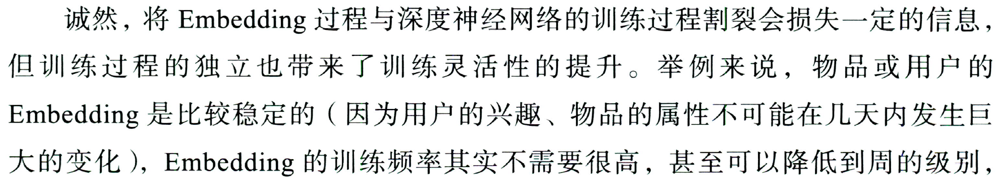

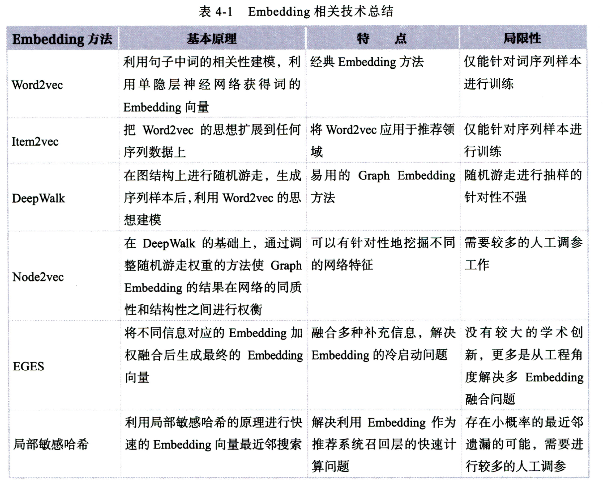