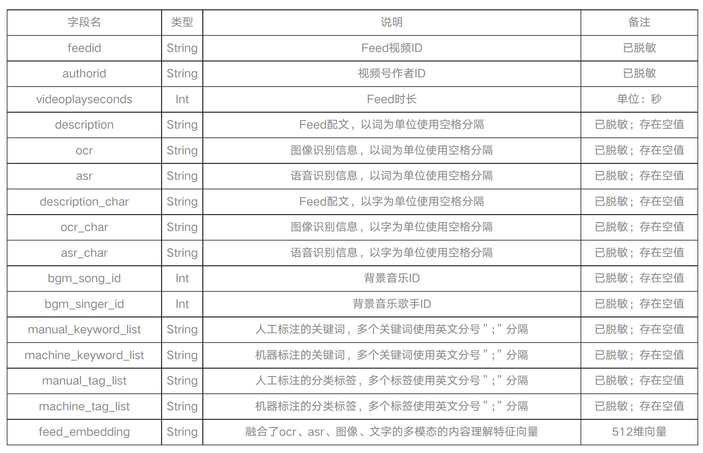
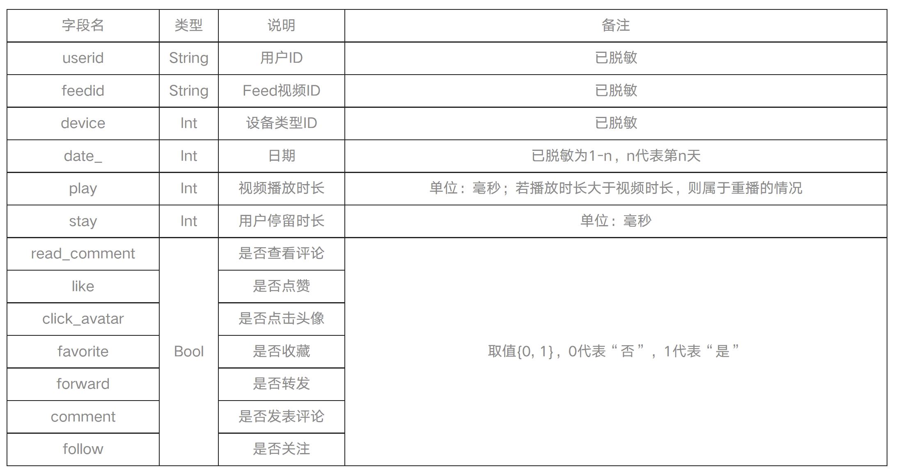
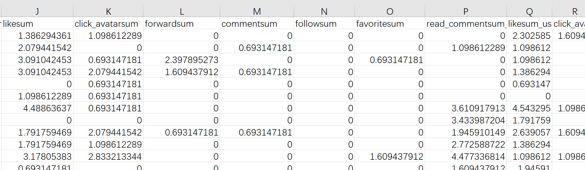
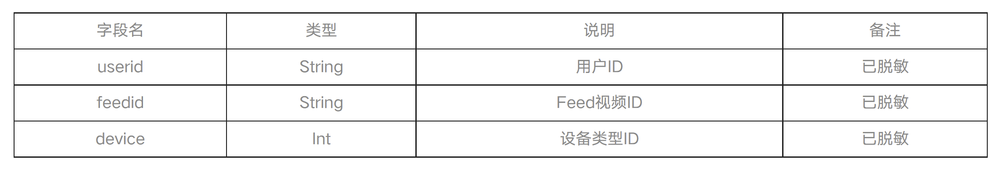

# 微信大数据挑战赛 工作内容分享

先说一下这个比赛在做什么，对这个流程有一个整体的了解

这是大赛官网上给出的赛题场景描述，我简单概括一下就是，这个比赛让我们做一个推荐模型，模型的使用的场景是微信视频号的推荐算法，我们希望可以通过这个模型把用户感兴趣的内容推送给他们。

模型的输入是用户在视频号内的历史n天的行为数据，用这些数据训练模型的参数。那我们怎么评估模型推荐的效果呢？这就有了训练集和测试集的概念。训练集用来训练模型，是带有用户行为标签的；测试集用来评估模型的效果，所以模型的输出就是根据测试集的这些数据预测用户对于每一个样本的点击率，每一个样本的点击率是一个0~1之间的小数。从直观上来看，你的预测的越准，说明模型的效果越好，我们通常用一种数值上的的评价指标来衡量，也就是 AUC，它你的分类器对两个随机样本进行预测，把1样本预测为1的概率为p1，把0样本预测为1的概率为p0，p1>p0的概率就等于AUC。

## 赛题场景描述

本次比赛基于脱敏和采样后的数据信息，对于给定的一定数量到访过微信视频号“热门推荐”的用户， 根据这些用户在视频号内的历史n天的行为数据，通过算法在测试集上预测出这些用户对于不同视频内容的互动行为（包括点赞、点击头像、收藏、转发等）的发生概率。 本次比赛以多个行为预测结果的加权uAUC值进行评分。

比赛提供训练集用于训练模型，测试集用于评估模型效果，提交结果demo文件用于展示提交结果的格式。 所有数据文件格式都是带表头的.csv格式，不同字段列之间用英文逗号分隔。初赛与复赛的数据分布一致，数据规模不同。 初赛提供**百万级**训练数据，复赛提供**千万级**训练数据。

#### 训练集

##### （1） Feed信息表

  该数据包含了视频（简称为feed）的基本信息和文本、音频、视频等多模态特征。具体字段如下：

##### （2） 用户行为表

该数据包含了用户在视频号内一段时间内的历史行为数据（包括停留时长、播放时长和各项互动数据）。具体字段如下：

join by feedid 生成用来训练模型的样本，在实际的工程中，因为天极样本的数据量是 TB 级别的，比如抖音的电商一天下来的数据量有 30T，所以 join 的过程也是值得研究的。工程上来讲，通常用 Spark 来做离线的样本拼接，用 Flink 来做在线的样本拼接。那对于这次比赛来说，因为数据量比较小，初赛提供百万级的训练数据，大小只有 70MB，所以可以用 python 的 pandas 库在本地完成样本的拼接。

我们看到的这些字段可以作为样本的特征，一般来说，为了提高模型的训练效果，特征之间可以相互交叉，比如两两交叉，或者也有更高维度的交叉。这个特征交叉的过程可以根据业务特点由经验丰富的算法同学手工来完成，也可以让模型自动来完成。

实际上，除了我们能够看到的这些特征以外，还可以手动从训练样本中提取更多的特征。比如说，我可以统计一下每个 feed 总共被 like 了多少次，点击了多少次，转发了多少次。。。这些新的特征维度可以让模型更好的学习到样本的一些特点。

#### 测试集

### 评估标准

本次比赛采用uAUC作为单个行为预测结果的评估指标，uAUC定义为不同用户下AUC的平均值，计算公式如下：

其中，n为测试集中的有效用户数，有效用户指的是对于某个待预测的行为，过滤掉测试集中全是正样本或全是负样本的用户后剩下的用户。AUCi为第i个有效用户的预测结果的AUC（Area Under Curve）。

##### AUC的定义和计算方法

AUC的计算方式是ROC曲线下方的面积（英语：Area under the Curve of ROC (AUC ROC)），其含义是：

https://www.zhihu.com/question/39840928

AUC就是从所有1样本中随机选取一个样本， 从所有0样本中随机选取一个样本，然后根据你的分类器对两个随机样本进行预测，把1样本预测为1的概率为p1，把0样本预测为1的概率为p0，p1>p0的概率就等于AUC。所以AUC反应的是分类器对样本的排序能力。根据这个解释，如果我们完全随机的对样本分类，那么AUC应该接近0.5。另外值得注意的是，AUC对样本类别是否均衡并不敏感，这也是不均衡样本通常用AUC评价分类器性能的一个原因。

可以直接优化AUC来训练分类器，即我们的模型。

### 模型的选择

知道了这个流程之后，下一步就是选模型了

以多层感知机 MLP 为核心，通过改变神经网络结构，深度学习模型的演变方向如下

## 工作内容描述

### baseline

环境搭建 一句话带过

baseline 做了什么特征组合

### 自己的模型

模型的演进和对比

如何选模型

可以结合之前说的科研的思路吗？

