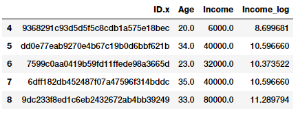
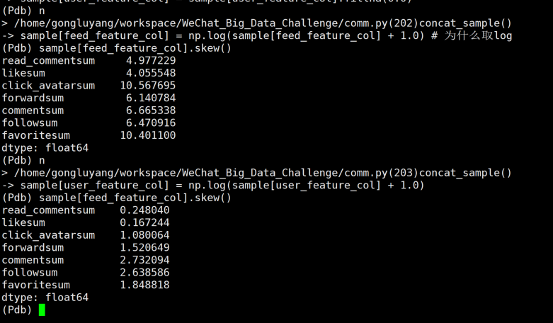

## WeChat_Big_Data_Challenge

baseline github: https://github.com/WeChat-Big-Data-Challenge-2021/WeChat_Big_Data_Challenge

my fork: https://github.com/HanquanHq/WeChat_Big_Data_Challenge

#### 1、代码中对数据取log的原因

```python
sample[feed_feature_col] = np.log(sample[feed_feature_col] + 1.0) # 为什么取log
sample[user_feature_col] = np.log(sample[user_feature_col] + 1.0)
```

##### 参考1

https://datascience.stackexchange.com/questions/40089/what-is-the-reason-behind-taking-log-transformation-of-few-continuous-variables

Mostly because of skewed distribution. Logarithm naturally reduces the dynamic range of a variable so the differences are preserved while the scale is not that dramatically skewed. Imagine some people got 100,000,000 loan and some got 10000 and some 0. Any feature scaling will probably put 0 and 10000 so close to each other as the biggest number anyway pushes the boundary. Logarithm solves the issue.

##### 参考2

https://towardsdatascience.com/understanding-feature-engineering-part-1-continuous-numeric-data-da4e47099a7b

Log transforms are useful when applied to skewed distributions as they tend to expand the values which fall in the range of lower magnitudes and tend to compress or reduce the values which fall in the range of higher magnitudes. This tends to make the skewed distribution as normal-like as possible. Let’s use log transform on our developer `Income` feature which we used earlier.

```python
fcc_survey_df['Income_log'] = np.log((1+ fcc_survey_df['Income']))
fcc_survey_df[['ID.x', 'Age', 'Income', 'Income_log']].iloc[4:9]
```



##### 偏度(Skewness)

用来描述数据分布的对称性，正态分布的偏度为0。计算数据样本的偏度，当偏度<0时，称为负偏，数据出现左侧长尾；当偏度>0时，称为正偏，数据出现右侧长尾；当偏度为0时，表示数据相对均匀的分布在平均值两侧，不一定是绝对的对称分布，此时要与正态分布偏度为0的情况进行区分。

当偏度绝对值过大时，长尾的一侧出现极端值的可能性较高。

##### 峰度(Kurtosis)

用来描述数据分布陡峭或是平滑的情况。正态分布的峰度为3，峰度越大，代表分布越陡峭，尾部越厚；峰度越小，分布越平滑。很多情况下，为方便计算，将峰度值－3，因此正态分布的峰度变为0，方便比较。

在方差相同的情况下，峰度越大，存在极端值的可能性越高。

```python
print(df.skew()) # 偏度计算
print(df.kurt()) # 峰度计算
```

##### 验证 log 操作对偏度的作用

log 操作使偏态分布的样本尽可能转换为正态分布



##### 拓展

https://www.zhihu.com/question/22012482

在统计学中为什么要对变量取对数？

是因为经济数据大多数都是偏态分布，比如收入GDP之类的，而且大多是右偏的。取对数可以将大于中位数的值按一定比例缩小，从而形成正态分布的数据。这对做计量模型，解决异方差问题都是很有帮助的。