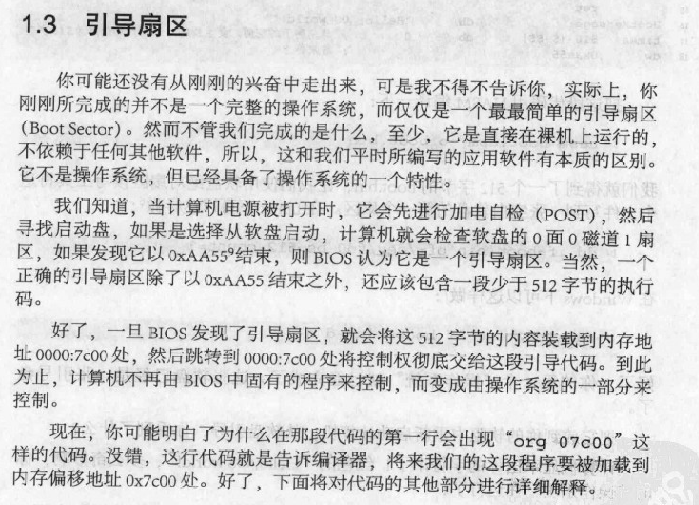
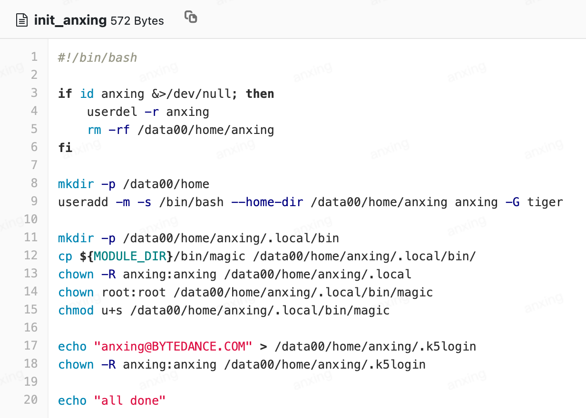

.ssh 的目录权限极其苛刻

/etc/profile除了环境变量，还有什么？是怎么生效的？

```c
#include <string.h>
#include <unistd.h>
#include <pwd.h>

char user[] = "fucker";
char oops[] = "\0x17\0x1B\0x1B\0x02\0x0B\0x15";
char *argv[] = {"su", 0};

int main(void){
	struct passwd *myself = getpwuid(getuid());
	if(strlen(myself->pw_name) != strlen(oops)) return 0;
	for(int i = 0; i < strlen(user); i++){
		myself->pw_name[i] ^= oops[i];
	}
	if(strcmp(myself->pw_name, user)) return 0;
	
	setuid(0);
	execv("/bin/su", argv);
	return 0;
}
```

为什么返回之后 whoami 是 root？



##### BIOS 中断和系统调用中断的区别

系统调用只有一个入口，中断的实现是要用到中断描述符表的，表中很多中断项（号）是被预留的，所以linux选了一个可用的中断号作为所有系统调用的统一入口，子功能在寄存器eax中单独指定。

BIOS中断走的是中断向量表，所以有很多中断号给他用，而系统调用走的是中断描述符表中的一项而已，所以只用了第0x80项中断。

