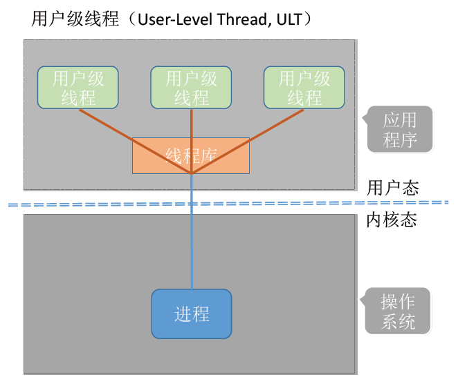

# 第二章 进程管理 - 进程、线程

### 进程的概念

**进程是进程实体的运行过程，是系统进行资源分配和调度的一个独立单位。（线程是调度的基本单位）**

程序：是静态的，是一个存放在磁盘里的可执行文件，是一系列指令的集合

进程：是动态的，是程序的一次执行过程

> 例如，同时挂三个QQ号，会对应三个QQ进程，它们的PCB、数据段各不相同，但程序段的内容都是相同的（都是运行着相同的QQ程序）

### 进程的创建

当进程被创建时，操作系统会为该进程分配一个唯一的、不重复的“身份证号”—— **PID**（Process ID，进程ID）

##### 创建新进程的典型事件

1. 用户登录
2. 作业调度
3. 提供服务
4. 应用请求

### PCB

进程相关的信息都被保存在一个数据结构PCB （Process Control Block）中，即进程控制块

操作系统需要对各个并发运行的进程进行管理，但凡管理时所需要的信息，都会被放在PCB中

### 程序是如何运行的？

一个进程实体（进程映像）由 **PCB、程序段、数据段** 组成。

进程是动态的，进程实体（进程映像，类似于快照的概念）是静态的。

进程实体反应了进程在某一时刻的状态（如：x++后，x=2）

- PCB 是给操作系统用的
- 程序段、数据段是给进程自己用的。

### 进程的特征

### 进程的5种状态

#### 创建态

进程**正在被创建**时，它的状态是“**创建态**”，在这个阶段操作系统会为进程分配资源、初始化PCB

#### 就绪态

当进程**创建完成**后，进入“**就绪态**”，处于就绪态的进程已经具备运行条件，但由于没有空闲CPU，就暂时不能运行。当CPU空闲时，操作系统就会选择一个就绪进程，让它上处理机运行

#### 运行态

如果一个进程此时**在CPU上运行**，那么这个进程处于“**运行态**”，CPU会执行该进程对应的程序（执行指令序列）

#### 阻塞态

在进程运行的过程中，可能会请求**等待某个事件**的发生（如等待某种系统资源的分配，或者等待其他进程的响应）。在这个事件发生之前，进程无法继续往下执行，此时操作系统会让这个进程下CPU，并让它进入“**阻塞态**”，当CPU空闲时，又会选择另一个“就绪态”进程上CPU运行

#### 终止态

一个进程可以执行 **exit 系统调用**，请求操作系统终止该进程。此时该进程会进入“终止态”，操作系统会让该进程下CPU，并回收内存空间等资源，最后还要回收该进程的PCB。当终止进程的工作完成之后，这个进程就彻底消失了。

### 进程状态的转换

进程PCB中，会有一个变量state 来表示进程的当前状态。如：1表示创建态、2表示就绪态、3表示运行态…

为了对同一个状态下的各个进程进行统一的管理，操作系统会将各个进程的PCB组织起来。

### 进程的组织方式

大多数操作系统采用链接方式。

### 进程控制

进程控制的过程要一气呵成，不可以被打断，用 **原语** 来实现。

例如，“将PCB的state设为1”， “将PCB从阻塞队列放入就绪队列” 这两个步骤，不能被打断

#### 如何实现原语的原子性？

原语的执行具有原子性，即执行过程只能一气呵成，期间不允许被中断。

可以用“关中断指令”和“开中断指令”这两个特权指令实现原子性。

**正常情况下**，CPU每执行完一条指令，都会例行检查是否有中断信号需要处理，如果有，则暂停运行当前这段程序，转而执行相应的中断处理程序。

而 CPU 执行了**关中断指令**之后，就不再例行检查中断信号，直到执行开中断指令之后才会恢复检查。

这样，关中断、开中断之间的这些指令序列就是不可被中断的，这就实现了“原子性”

#### 进程控制相关的原语

理解即可，不需要记忆

### 进程通信

顾名思义，进程通信就是指进程之间的信息交换。

进程是分配系统资源的单位（包括内存地址空间），因此各进程拥有的内存地址空间相互独立。

为了保证安全，一个进程不能直接访问另一个进程的地址空间。但是进程之间的信息交换又是必须实现的。为了保证进程间的安全通信，操作系统提供了一些方法。

##### 1、共享存储

- 基于数据结构的共享：比如共享空间里只能放一个长度为10的数组。这种共享方式速度慢、限制多，是一种低级通信方式

- 基于存储区的共享：在内存中画出一块共享存储区，数据的形式、存放位置都由进程控制，而不是操作系统。相比之下，这种共享方式速度更快，是一种高级通信方式。

##### 2、管道通信

“管道”是指用于连接读写进程的一个共享文件，又名pipe文件。其实就是在内存中开辟一个**大小固定的缓冲区**。

1. 管道只能采用**半双工**通信，某一时间段内只能实现单向的传输。如果要实现双向同时通信，则需要设置
两个管道。
2. 各进程要**互斥**地访问管道。
3. 数据以**字符流**的形式写入管道，当管道写满时，写进程的 **write()** 系统调用将被阻塞，等待读进程将数据
取走。当读进程将数据全部取走后，管道变空，此时读进程的 **read()** 系统调用将被阻塞。
4. 如果**没写满，就不允许读。如果没读空，就不允许写。**
5. 数据一旦被读出，就从管道中被抛弃，这就意味着读进程最多只能有一个，否则可能会有读错数据的情
况。

##### 3、消息传递

进程间的数据交换以格式化的消息（Message）为单位。进程通过操作系统提供的“发送消息/接收消息”两个原语进行数据交换。

### 线程

#### 为什么引入线程？

有的进程可能需要“同时”做很多事，而传统的进程只能串行地执行一系列程序。为此，引入了“线程”，来增加并发度。

可以把线程理解为“轻量级进程”。线程是一个基本的CPU执行单元，也是程序执行流的最小单位。引入线程之后，不仅是进程之间可以并发，进程内的各线程之间也可以并发，从而进一步提升了系统的并发度，使得一个进程内也可以并发处理各种任务（如QQ视频、文字聊天、传文件）

引入线程后，进程只作为除CPU之外的系统资源的分配单元（如打印机、内存地址空间等都是分配给进程的）。线程则作为处理机的分配单元。

#### 线程的属性

#### 线程的实现方式

##### 1、用户级线程

1. 用户级线程由 **应用程序** 通过 **线程库** 实现，所有的线程管理工作都由 **应用程序负责**（包括线程切换）
2. 用户级线程中，线程切换可以在用户态下即可完成，无需操作系统干预。
3. 在用户看来是多个线程。但是在操作系统内核看来，并意识不到线程的存在。
4. 优缺点
   - 优点：用户级线程的切换在用户空间即可完成，不需要切换到核心态，线程管理的系统开销小
   - 缺点：当一个用户级线程被阻塞后，整个进程都会被阻塞，并发度不高。多个线程**不可在多核处理机上并行**运行。

##### 2、内核级线程

1. 内核级线程的管理工作由操作系统内核完成。
2. 线程调度、切换等工作都由 **内核负责**，因此内核级线程的切换必然需要在核心态下才能完成。
3. 操作系统会为每个内核级线程建立相应的TCB（Thread Control Block，线程控制块），通过TCB对线程进行管理。“内核级线程”就是“从操作系统内核视角看能看到的线程”
4. 优缺点
- 优点：当一个线程被阻塞后，别的线程还可以继续执行，并发能力强。多个线程可在多核处理机上并行。
- 缺点：一个用户进程会占用多个内核级线程，线程切换由操作系统内核完成，需要切到核心态，线程管理的成本高，开销大。

**操作系统只“看得见”内核级线程。因此，只有内核级线程才是处理机分配的单位。**

##### 3、多线程模型

###### 一对一模型

一个用户级线程映射到一个内核级线程。每个用户进程有与用户级线程同数量的内核级线程。

- 优点：当一个线程被阻塞后，别的线程还可以继续执行，并发能力强。多线程可在多核处理机上并行执行。
- 缺点：一个用户进程会占用多个内核级线程，线程切换由操作系统内核完成，需要切换到核心态，因此线程管理的成本高，开销大。

###### 多对一模型

多个用户级线程映射到一个内核级线程。且一个进程只被分配一个内核级线程。

- 优点：用户级线程的切换在用户空间即可完成，不需要切换到核心态，线程管理的系统开销小，效率高
- 缺点：当一个用户级线程被阻塞后，整个进程都会被阻塞，并发度不高。多个线程不可在多核处理机上并行运行

###### 多对多模型

n 个用户级线程映射到m 个内核级线程（n >= m）

- 优点：克服了多对一模型并发度不高的缺点（一个阻塞全体阻塞），又克服了一对一模型中一个用
  户线程库 进程占用太多内核级线程，开销太大的缺点。