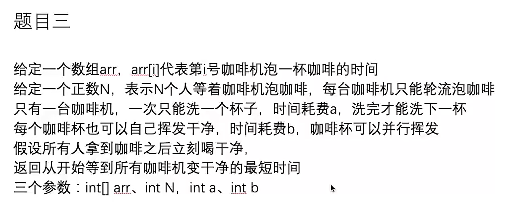

# DP

不需要讲可变参数变为严格的表结构，所以只需要记忆化搜索就可以了。

递归（参数设计很重要）->傻缓存->动态规划

从上(递归的入口)至下的缓存叫记忆化搜索，从下(base case)至上的缓存表叫dp表

##### DP 模型大套路

>DP套路之：暴力递归-＞傻缓存-＞DP
>1、暴力递归过程：递归就是尝试。此时，你的思维逻辑来源于你的自然智慧、你的递归代码具有现实意义。需要注意的是，在递归的时候，参数设计很重要，参数的个数直接决定了后续优化后dp的时间复杂度。
>2、傻缓存过程：带缓存的暴力递归。缓存可以是结构化的dp数组（状态有限的时候），或者是哈希表（状态难以穷举，或者状态太多，即便可以穷举也会超出空间限制），这种记忆化搜索的方法肯定比暴力递归要好得多，避免了重复计算。
>给暴力递归加缓存的时候，参数的含义/代码含义已经不重要了，缓存的设计可以脱离题意，因为它只是为了避免重复计算而设计的。因此，即便在这一步已经忘了题意，也不妨碍你仅从代码逻辑上进行改写。
>3、dp过程：去分析位置的严格依赖关系，将傻缓存转化成结构化的dp。这个过程更加套路，尤其是当你从从自顶向下的记忆化搜索变成了自底向上的dp时候，直接把你的逻辑结构翻了过来。你要先填base case，再按照依赖顺序逐层填dp表，至此你的dp已经搞定了。
>你会惊喜的发现你得到一个所谓的状态转移方程，而对于状态转移方程的直观解释，早已脱离了原始的自然智慧可以得到的递归的含义，它也许很短，也许是一个优美的结论，但它只是看起来优美而已，不具有普遍性和启发性，很难举一反三、一下想到。
>
>关于记忆化搜索与dp之争，它们二者时间复杂度同样的好。只不过记忆化搜索没有分析谁先依赖谁后依赖，你没算过你就递归去算，你算过你就直接从记忆表里拿值返回。而严格表结构的动态规划是，我严格的整理好依赖关系，从这张表的简单位置填到复杂位置，也就是说它比记忆化搜索进一步去梳理了依赖的关系，从简单位置，通过这个依赖关系，算出复杂位置，进而求出所有表的过程。
>
>网上大多数的博客/题解，上来就给你贴一个状态转移方程，然后根据这个状态转移方程去重新编一个故事作为解释，你看了之后觉得挺有道理。但实际上，这个新编的故事是用结论去推原因，所以无论它讲的多么清晰，多么有道理，它都已经脱离了原有的思维轨迹了。然后你就会看到评论区一片苦海，有人说“我知道应该dp但是不知道怎么dp”，“怎么才能想到状态转移方程啊”，“方法很巧但是自己想不出来”之类的，你想，为什么啊？作者已经擦掉了所有的思维轨迹，只留下最后的结论以及中间简单的推理步骤，给你看到的证明都是特别漂亮的样子，然后被认为是外星人留在地球的遗孤，我等凡人只能膜拜。你留下这些结论有什么用呢，你把那些思维过程都写出来不是更加激励后人吗？所以等以后有一天，你成为高手了，请你对新手好一点。。

- 从左往右的尝试模型（硬币组合问题，有限/无限硬币个数）
  - 对于有限硬币个数的题目来说，求一个格子，只要拿到它的依赖格子就可以了，是O(1)的。
  - 对于无限硬币个数的题目来说，求一个格子，要干一个for循环出来，终止条件为sum>target。
  - 你用傻缓存的方法，也就是我们说的极具启发性的记忆化搜索的方法，和我改成了严格表结构的方法，它整体肯定是比暴力搜索要好的多，记忆化搜索是没有分析谁先依赖、谁后依赖，你没算过，你就去算，你算过，你就直接从表里拿到，返回了，这就是记忆化搜索。而严格表结构的动态规划是，我严格的整理好依赖关系，从这张表的简单位置填到复杂位置，也就是说它比记忆化搜索进一步去梳理了依赖的关系，从简单位置，通过这个依赖关系，算出复杂位置，进而求出所有表的过程。
  - 记忆化搜索就是你没算过，你就去干递归，你算过了，直接在记忆表里拿值。表结构就是，我从简单到复杂，我严格规定好我先算哪个，后算哪个。
  - 他俩的时间复杂度呢？如果没有枚举行为，你这张表有多大，你的复杂度就是多少。记忆化搜索和严格表结构的时间复杂度同样的好。有枚举行为的话，需要先搞出严格表结构，然后继续优化。
- 范围尝试模型（玩家，纸牌游戏），明确知道L R 就是范围，而且左下半区没用，只要求对角线和右上半区就可以了。
- 样本对应模型（一个样本做行，一个样本做列，通常以结尾讨论可能性。两个参数就是下标，可以明确的知道参数的变化范围，即能确定dp数组的大小）
  - https://leetcode.com/problems/longest-common-subsequence/ 最长公共子序列
  - https://leetcode.com/problems/longest-palindromic-subsequence/
    - 方法1：样本对应模型。一个翻转串和它原串的最长公共子序列，就是最长回文子序列（注意子串和子序列的区别）
    - 方法2：范围尝试模型
- 业务限制模型（我们设计的递归可变参数，不能直观的确定变化范围，需要认为限制，把范围大小估出来，“限制不够，业务来凑”，假设最差情况，看他能冲到多大。如果实在改不出严格位置依赖了，咱就哈希表傻缓存。）



> 左神语录。。
>
> 在众多数学大牛中，我最讨厌的就是高斯，为啥？因为高斯为了显示自己特别牛逼，他把一个证明的所有思考轨迹全擦的干干净净，就给你留最后的结论以及中间简单的推理步骤，这个东西它毁掉很多的精华，有人说他像一个林间的老狐狸一样，用狐狸尾巴擦掉自己思维的所有轨迹，给你看到的证明都是特别漂亮的样子。有啥用啊？是，你被认为是外星人留在地球的遗孤，厉害，我等凡人只能膜拜，有啥用啊？你留下那些结论，你把那些思维轨迹都写出来，不是更加激励后人吗？
> 所以，以后有一天，你变成高手了，希望你对新手好一点。
>
> 自然智慧 vs 人工智慧
>
> 不怎么需要门槛，你长这么大，通过自然界遇到的事情掌握的能力，以他作为门槛就能想明白的事情，叫做自然智慧；你不得不经受这个行业的训练，掌握了很多的事实，才有可能懂的那些东西，叫人工智慧。我已经把动态规划只落在你的自然智慧上，剩下你只要试出来一个东西，底下所有东西都成套路了，这就是最精彩的地方。

##### 斜率优化题：求裂开的方法数（整数拆分问题）

给定一个正数n，求n的裂开方法数。规定：后面的数不能比前面的数小 。比如4的裂开方法有： 1+1+1+1、1+1+2、1+3、2+2、4，5种，所以返回5。

```java
public class Code03_SplitNumber {

	// n为正数
	public static int ways(int n) {
		if (n < 0) {
			return 0;
		}
		if (n == 1) {
			return 1;
		}
		return process(1, n);
	}

	// 上一个拆出来的数是pre
	// 还剩rest需要去拆
	// 返回拆解的方法数
	public static int process(int pre, int rest) {
		if (rest == 0) {
			return 1;
		}
		if (pre > rest) {
			return 0;
		}
		int ways = 0;
		for (int first = pre; first <= rest; first++) {
			ways += process(first, rest - first);
		}
		return ways;
	}

	public static int dp1(int n) {
		if (n < 0) {
			return 0;
		}
		if (n == 1) {
			return 1;
		}
		int[][] dp = new int[n + 1][n + 1];
		for (int pre = 1; pre <= n; pre++) {
			dp[pre][0] = 1;
			dp[pre][pre] = 1;
		}
		for (int pre = n - 1; pre >= 1; pre--) {
			for (int rest = pre + 1; rest <= n; rest++) {
				int ways = 0;
				for (int first = pre; first <= rest; first++) {
					ways += dp[first][rest - first];
				}
				dp[pre][rest] = ways;
			}
		}
		return dp[1][n];
	}

	public static int dp2(int n) {
		if (n < 0) {
			return 0;
		}
		if (n == 1) {
			return 1;
		}
		int[][] dp = new int[n + 1][n + 1];
		for (int pre = 1; pre <= n; pre++) {
			dp[pre][0] = 1;
			dp[pre][pre] = 1;
		}
		for (int pre = n - 1; pre >= 1; pre--) {
			for (int rest = pre + 1; rest <= n; rest++) {
				dp[pre][rest] = dp[pre + 1][rest];
				dp[pre][rest] += dp[pre][rest - pre];
			}
		}
		return dp[1][n];
	}

	public static void main(String[] args) {
		int test = 39;
		System.out.println(ways(test));
		System.out.println(dp1(test));
		System.out.println(dp2(test));
	}

}
```

