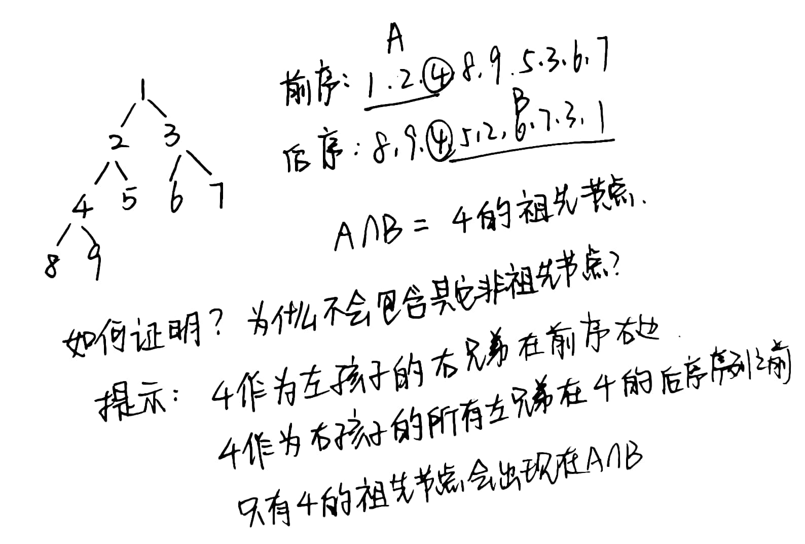

# 树

### 左孩子右兄弟表示法的任意有根树的遍历（试题2016-896算法设计）

> 算法导论 p.248 10.4-4

题目：对于一个含n个结点的任意有根树，写出一个O(n)时间的过程，输出其所有关键字，该树以左孩子右兄弟表示法存储

- 树结构的定义

```python
class Tree:
    def __init__(self, val):
        self.val = val
        self.left_child = None
        self.right_bro = None
```

- 使用栈实现树的遍历

```python
class Solution:
    def searchTree(self, tree=Tree) -> List[int]:
        if not self:
            return []
        resList, stack = [], list()
        stack.append(self)
        while stack:
            node = stack.pop()
            resList.append(node.val)
            if node.right_bro:
                stack.append(node.right_bro)
            if node.left_child:
                stack.append(node.left_child)
        return resList
```

- 使用递归实现树的遍历

```python
class Solution:
    def searchTree(self, tree=Tree) -> List[int]:
        if not self:
            return []
        resList = []
        if tree:
            resList.append(tree.val)
            if tree.right_bro:
                resList.extend(Solution.searchTree(self=self, tree=tree.right_bro))
            if tree.left_child:
                resList.extend(Solution.searchTree(self=self, tree=tree.left_child))
        return resList
```

## 先序、中序、后续、递归序

为什么将 sout 放在 1 2 3 行位置，就可以实现先序、中序，后续遍历？

因为递归序可以遇到每个节点 3 次，递归序是最强的。

根据递归序，第一次遇到某个节点的时候就输出，是先序；第二次遇到节点的时候输出，是中序；第三次遇到节点的时候输出，是后序。

```java
package class07;

public class Code01_RecursiveTraversalBT {

	public static class Node {
		public int value;
		public Node left;
		public Node right;

		public Node(int v) {
			value = v;
		}
	}

	public static void f(Node head) {
		if (head == null) {
			return;
		}
		// 1
		f(head.left);
		// 2
		f(head.right);
		// 3
	}

	// 先序打印所有节点
	public static void pre(Node head) {
		if (head == null) {
			return;
		}
		System.out.println(head.value);
		pre(head.left);
		pre(head.right);
	}

	public static void in(Node head) {
		if (head == null) {
			return;
		}
		in(head.left);
		System.out.println(head.value);
		in(head.right);
	}

	public static void pos(Node head) {
		if (head == null) {
			return;
		}
		pos(head.left);
		pos(head.right);
		System.out.println(head.value);
	}

	public static void main(String[] args) {
		Node head = new Node(1);
		head.left = new Node(2);
		head.right = new Node(3);
		head.left.left = new Node(4);
		head.left.right = new Node(5);
		head.right.left = new Node(6);
		head.right.right = new Node(7);

		pre(head);
		System.out.println("========");
		in(head);
		System.out.println("========");
		pos(head);
		System.out.println("========");
	}
}
```

##### x 祖先节点交集



##### 为什么工程上往往自己使用栈来模拟递归过程，而不使用系统栈？

因为os给系统栈分配的空间比较小，容易溢出；而如果我们在程序中建立一个栈的话，使用的是内存空间，内存分30多G，60多G很正常，系统栈往往只有200,300M，所以工程上不允许无限层数的递归出现，因为这样是有风险的，递归只能在算法中出现。
