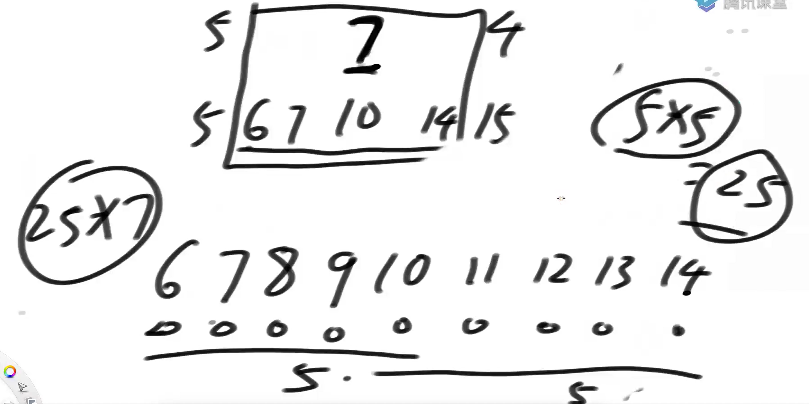
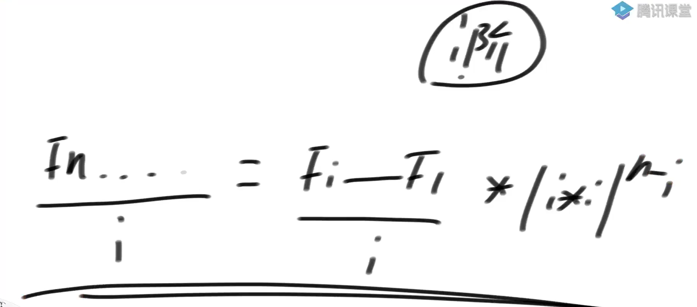
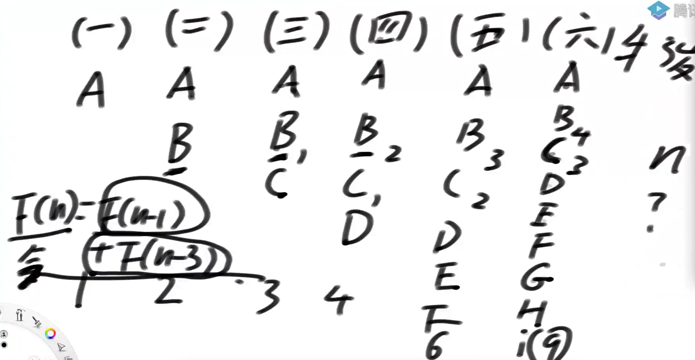
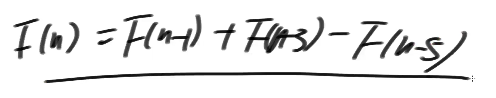
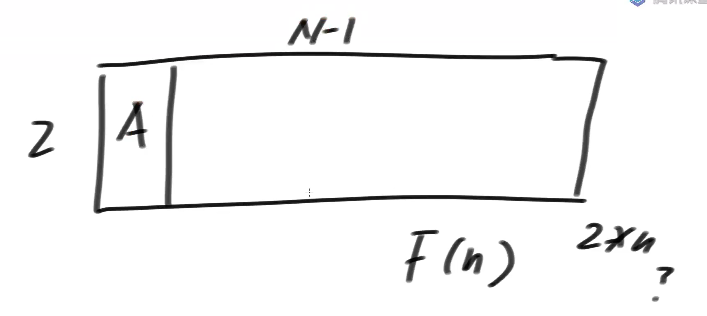
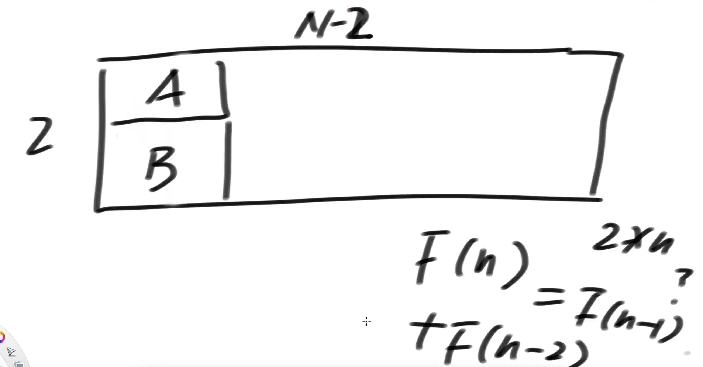

# •算法数据结构体系学习班

## •第26节

### •题目一（单调栈续）

给定一个数组arr，返回所有子数组最小值的累加和

### •求斐波那契数列矩阵乘法的方法

1）斐波那契数列的线性求解（O(N)）的方式非常好理解

2）同时利用线性代数，也可以改写出另一种表示

 | F(N) , F(N-1) | = | F(2), F(1) | * 某个二阶矩阵的N-2次方

> 不仅是 fib 数列，所有没有条件转移的，具有严格的递推式的式子，都有 O(logn) 的解法。

3）求出这个二阶矩阵，进而最快求出这个二阶矩阵的N-2次方

### •类似斐波那契数列的递归优化

如果某个递归，除了初始项之外，具有如下的形式

F(N) = C1 * F(N) + C2 * F(N-1) + … + Ck * F(N-k) ( C1…Ck 和k都是常数)

并且这个递归的表达式是严格的、不随条件转移的

那么都存在类似斐波那契数列的优化，时间复杂度都能优化成O(logN)

### •题目二

斐波那契数列矩阵乘法方式的实现

### •题目三

一个人可以一次往上迈1个台阶，也可以迈2个台阶

返回这个人迈上N级台阶的方法数

### •题目四

##### 题目

第一年农场有1只成熟的母牛A，往后的每年：

1）每一只成熟的母牛都会生一只母牛

2）每一只新出生的母牛都在出生的第三年成熟

3）每一只母牛永远不会死

返回N年后牛的数量。

##### 题解

行列式套路：

本题分析：

复杂度：O(logn)

变例：如果牛的寿命为5年，怎么算N年后牛的数量？

另外，矩阵可以根据行列式直接写，这是有公式的，不需要解方程。

### •题目五

给定一个数N，想象只由0和1两种字符，组成的所有长度为N的字符串

如果某个字符串,任何0字符的左边都有1紧挨着,认为这个字符串达标

返回有多少达标的字符串

解法：从左到右的尝试模型，定义 f(n) 为已知前一个元素为 1 的情况下，剩下的 n 个格式有多少种达标的字符串。

### •题目六

用`1*2`的瓷砖，把`N*2`的区域填满。返回铺瓷砖的方法数。

##### 题解

竖着摆：问题转化为 n-1 列干干净净的区域的填瓷砖问题

横着摆：下面只能横着再放一个瓷砖 B，列数还剩 n-2 列干干净净区域的填瓷砖问题。

