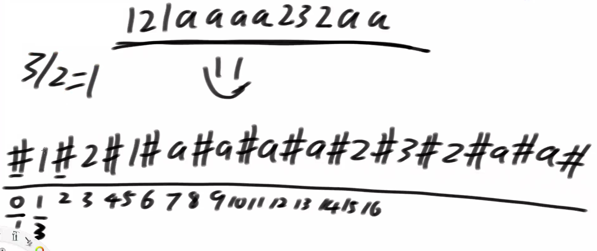

# •算法数据结构体系学习班

## •第28节

> 有很多同学在问上节课的 KMP 的事情，是这样的，KMP我们上节课讲了流程，它是一个 O(n) 的算法，我告诉你，系统里面的 indexOf()  方法，时间复杂度也是 O(n) 的【经过验证并不是】，作为算法课，我只是把最核心的算法流程讲给你听，但是在系统实现上，他可是要实际解决用户使用上面的很多问题的，所以它对于用户使用这个场景做了很多细节上的优化，我们算法课如果去讲这些系统上的优化的话，就会丢失重点，因为我们的目的，就是想把一个算法问题讲清楚，至于系统使用的用户会产生什么样的优化，那时具体的产品的设计者需要去想的。比如说，我们讲了快排，我们讲了 merge sort，我们讲了很多的排序，但是系统上的排序它是把十几种排序综合地用到一起，为啥？他想要达到常数时间跟整体复杂度都绝对的快，我们的课上不可能讲这么多，因为会让整个课失于细节。
>
> Manacher 算法是噩梦级的高频题，京东头条阿里。。几乎每年都会出现，所以你要能手撕出来。

## [Why does String.indexOf() not use KMP?](https://stackoverflow.com/questions/19543547/why-does-string-indexof-not-use-kmp)

KMP has better worst-case performance, but actually requires a little bit of up-front computation (to generate the table of offsets). It *also* requires an initial memory allocation, which could also impact performance.

For (presumably) common use-cases of searching in relatively short strings, this might actually end up slower than the primitive implementation.

This, bundled with the fact that for really huge data sets you will probably be using more specialized data structures than a simple `String` means that the increased implementation (and possibly runtime) cost is not worth investing.

Note that this *might* change in future Java versions, as the actual algorithm is not specified.

翻译：原来JDK的编写者们认为大多数情况下，字符串都不长，使用原始实现可能代价更低。因为KMP和Boyer-Moore算法都需要预先计算处理来获得辅助数组，需要一定的时间和空间，这可能在短字符串查找中相比较原始实现耗费更大的代价。而且一般大字符串查找时，程序员们也会使用其它特定的数据结构，查找起来更简单。

这有点类似于排除特定情况下的快速排序了。不同环境选择不同算法。

## •Manacher算法

> 原理：我前面扩的行为，会影响我后面扩的行为

假设字符串str长度为N，想返回最长回文子串的长度

时间复杂度O(N)

#### 处理回文串虚轴问题

Manacher算法则通过一种处理方式将字符串都转化为奇数串来处理，即在首尾及每量个字符之间插入任意选定字符，比如在字符串 "asdsa" 中插 '#'  变为 "#a#s#d#s#a#" （其实插入任意字符都可以）

##### 思考：是否可以使用原始串中出现过的字符作为虚轴填充？

任何时候你往两边扩的时候，不会有虚字符和实字符比较的情况。

所以，你可以使用原始串中出现过的字符来做填充，而不对结果产生影响。



### •Manacher算法核心

1）理解回文半径数组

2）理解所有中心的回文最右边界R，和取得R时的中心点C

3）理解  L…(i`)…C…(i)…R 的结构，以及根据i’回文长度进行的状况划分

4）每一种情况划分，都可以加速求解i回文半径的过程


```java
package class28;

public class Code01_Manacher {

	public static int manacher(String s) {
		if (s == null || s.length() == 0) {
			return 0;
		}
		// "12132" -> "#1#2#1#3#2#"
		char[] str = manacherString(s);
		// 回文半径的大小
		int[] pArr = new int[str.length];
		int C = -1;
		// 讲述中：R代表最右的扩成功的位置
		// coding：最右的扩成功位置的，再下一个位置
		int R = -1;
		int max = Integer.MIN_VALUE;
		for (int i = 0; i < str.length; i++) { // 0 1 2
			// R第一个违规的位置，i>= R
			// i位置扩出来的答案，i位置扩的区域，至少是多大。
			pArr[i] = R > i ? Math.min(pArr[2 * C - i], R - i) : 1;
			while (i + pArr[i] < str.length && i - pArr[i] > -1) {
				if (str[i + pArr[i]] == str[i - pArr[i]])
					pArr[i]++;
				else {
					break;
				}
			}
			if (i + pArr[i] > R) {
				R = i + pArr[i];
				C = i;
			}
			max = Math.max(max, pArr[i]);
		}
		return max - 1;
	}

	public static char[] manacherString(String str) {
		char[] charArr = str.toCharArray();
		char[] res = new char[str.length() * 2 + 1];
		int index = 0;
		for (int i = 0; i != res.length; i++) {
			res[i] = (i & 1) == 0 ? '#' : charArr[index++];
		}
		return res;
	}

	// for test
	public static int right(String s) {
		if (s == null || s.length() == 0) {
			return 0;
		}
		char[] str = manacherString(s);
		int max = 0;
		for (int i = 0; i < str.length; i++) {
			int L = i - 1;
			int R = i + 1;
			while (L >= 0 && R < str.length && str[L] == str[R]) {
				L--;
				R++;
			}
			max = Math.max(max, R - L - 1);
		}
		return max / 2;
	}

	// for test
	public static String getRandomString(int possibilities, int size) {
		char[] ans = new char[(int) (Math.random() * size) + 1];
		for (int i = 0; i < ans.length; i++) {
			ans[i] = (char) ((int) (Math.random() * possibilities) + 'a');
		}
		return String.valueOf(ans);
	}

	public static void main(String[] args) {
		int possibilities = 5;
		int strSize = 20;
		int testTimes = 5000000;
		System.out.println("test begin");
		for (int i = 0; i < testTimes; i++) {
			String str = getRandomString(possibilities, strSize);
			if (manacher(str) != right(str)) {
				System.out.println("Oops!");
			}
		}
		System.out.println("test finish");
	}

}

```


### •题目

给定两棵二叉树的头节点head1和head2

想知道head1中是否有某个子树的结构和head2完全一样