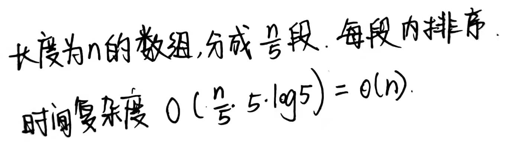

# •算法数据结构体系学习班

## •第29节

### •在无序数组中求第K小的数

1）改写快排的方法：随机选择一个数 v，比 v 小的放在你左侧，比 v 大的放在右侧。如果恰好 v==k，则成功找到了第 k 小的数，否则，如果 v<k，则从它左边继续找，如果 v>k，则从它右边继续找。思考：为什么快排是 O(nlogn)，而找第 k 小的数只需要 O(n)？因为对于快排来说，每次对 v 的两边都要做递归，而我们这道题，它要么走左边，要么走右边，二者只选其一。

思路：递归：“从 array L 到 R 范围上，如果排完序的话，处在 index 位置的是啥。”

2）bfprt 算法

- 5 个数一组
- 所有小组内部排序
- 每个小组的中位数拿出来，组成中位数数组，找到中位数数组的中位数 p
- 以 p 为 pivot，递归调用 bfprt

上述改写快排的方法已经是 O(n) 时间，O(1) 空间的最优解了，为什么还要有 bfprt 算法呢？因为快排改写是随机选 pivot 的情况下的概率期望上的 O(n)，而 bfprt 是绝对的 O(n)。

> 见：算法导论第9.3章，有时间复杂度的证明。T(N) = T(7N/10)+T(N/5)+O(N)，用 Master 公式无法证明，因为子过程的规模不一样。



把每一个小组的中位数拿出来，组成新数组 m[]，然后找到 m 的中位数，记为 h，现在我们终于找到了我们第一步要找的划分值 h。然后开始递归调 bfprt。

bfprt 为什么扯这么大的淡，去选这个划分值呢？

我们精挑细选出的 p，是中位数组成的数组中的中位数。经过推断，在原数组中，至少有 3N/10 的数要大于等于 p。所以最多有 7N/10 的数小于 p。

#### 彩蛋

为什么 5 个一组？因为是 5 个人发明的。

BFPRT 最重要的思想：（视频1:03位置）通过选一个平凡的能够确定淘汰一定比例的特殊的划分值，来避免通过概率来获得平均意义上的值，规避最差情况，使得算法具有严格意义上的优秀时间复杂度。

```java
// arr[L..R]  如果排序的话，位于index位置的数，是什么，返回
public static int bfprt(int[] arr, int L, int R, int index) {
    if (L == R) {
        return arr[L];
    }
    // L...R  每五个数一组
    // 每一个小组内部排好序
    // 小组的中位数组成新数组
    // 这个新数组的中位数返回
    int pivot = medianOfMedians(arr, L, R);
    int[] range = partition(arr, L, R, pivot);
    if (index >= range[0] && index <= range[1]) {
        return arr[index];
    } else if (index < range[0]) {
        return bfprt(arr, L, range[0] - 1, index);
    } else {
        return bfprt(arr, range[1] + 1, R, index);
    }
}

// arr[L...R]  五个数一组
// 每个小组内部排序
// 每个小组中位数领出来，组成marr
// marr中的中位数，返回
public static int medianOfMedians(int[] arr, int L, int R) {
    int size = R - L + 1;
    int offset = size % 5 == 0 ? 0 : 1;
    int[] mArr = new int[size / 5 + offset];
    for (int team = 0; team < mArr.length; team++) {
        int teamFirst = L + team * 5;
        // L ... L + 4
        // L +5 ... L +9
        // L +10....L+14
        mArr[team] = getMedian(arr, teamFirst, Math.min(R, teamFirst + 4));
    }
    // marr中，找到中位数
    // marr(0, marr.len - 1,  mArr.length / 2 )
    return bfprt(mArr, 0, mArr.length - 1, mArr.length / 2);
}

public static int getMedian(int[] arr, int L, int R) {
    insertionSort(arr, L, R);
    return arr[(L + R) / 2];
}

public static void insertionSort(int[] arr, int L, int R) {
    for (int i = L + 1; i <= R; i++) {
        for (int j = i - 1; j >= L && arr[j] > arr[j + 1]; j--) {
            swap(arr, j, j + 1);
        }
    }
}
```


### •题目

给定一个无序数组arr中，长度为N，给定一个正数k，返回top k个最大的数

不同时间复杂度三个方法：

1）O(N*logN)：先排序，然后取最后 k 个数返回。

2）O(N + K*logN)：首先建立大根堆。从下往上建堆的方式，复杂度是 `O(n)`，然后弹出 k 个元素，每个元素 `O(log N)`，总复杂度 `O(N + K*logN)`

3）O(n + k*logk)：O(n)第 N-k 大的数，然后把数组遍历，将大于 N-k 的数收集起来之后，记为小数组 res[]，最后对 res 排个序需要 O(klogk)

因为显然 k<=N，所以毫无疑问第三个的复杂度是最好的。


### •蓄水池算法

> 哪怕你不会写代码，这个算法的思想对你来说也很重要。

解决的问题：

假设有一个源源吐出不同球的机器（stream），依次以自然数的顺序吐出球的编号。

你有一个只能装下10个球的袋子。

每一个吐出的球，要么放入袋子，要么永远扔掉。

如何做到机器吐出每一个球之后，所有吐出的球都等概率被放进袋子里

##### 题解

前1~10号球，不淘汰，每一个都进袋子。

10号球以后：以 10/i 的概率，决定它要不要进袋子。如果要进袋子，先从袋子中等概率扔掉一个球。

##### 分析

例如，现在吐出了 1729 号球，我们看 3 号球是以什么概率存活的。

前10号球，3号球绝对存活。

来到第 11 号球，首先 11 号球以 10/11 概率决定它要不要进袋子，只有进袋子，且 3号球 1/10 概率被选中了，3号球才会被淘汰。所以，在 11 号球到来时，3 号球被淘汰的概率是 (10/11)*(1/10) = 1/11。它存活的概率是 10/11。

```
当 11 号球吐出时，3 号球存活的概率，是 10/11
当 12 号球吐出时，3 号球存活的概率，是 11/12
当 13 号球吐出时，3 号球存活的概率，是 12/13
...
当 1729 号球吐出时，3 号球存活的概率，是 1728/1729

累乘积，从 12 号球一直到 1729 号球，3 号球存活的概率，是 11/12 * 12/13 * ... * 1738/1729 = 10/1729
```

再例如，我们来看下 17 号球存活的概率，同样是现在吐出了 1729 号球。

```
当第 17 号球被吐出的时候，它存活的概率是 10/17
当 18 号球吐出时，17 号球被淘汰的概率是 10/18 * 1/10 = 1/18，17 号球存活的概率是 1-1/18 = 17/18
当 19 号球吐出时，17 号球存活的概率，是 18/19
当 20 号球吐出时，17 号球存活的概率，是 19/20
...
当 1729 号球吐出时，17 号球存活的概率，是 1728/1729

累乘积，从 17 号球一直到 1729 号球，17 号球存活的概率，是 10/17 * 17/18 * 18/19 * ... * 1738/1729 = 10/1729
```

##### 应用

你要举办一个抽奖活动，奖品有 100 个。你希望所有在 1 月 1 日 0:00 ~ 1 月 2 日 0:00 登录服务器的用户，都等概率获奖。

如果你不用蓄水池算法，你需要将这段时间内所有登录的用户的名单拿到手，这是一个非常浩大的过程，而且你难以 1 月 2 日 0:00 即时公布是否获奖，因为你需要手机数据，需要运算。

如果你用蓄水池算法，你只需要收集：

- 用户在登录时，是否第一次登录。第一次登录时参加抽奖。
- 知道用户是全球第 i 号登录的

你用 100/i 的概率，决定这个用户进不进奖池。如果不进奖池，就再也不可能中奖了。如果进奖池，就在奖池随机踢掉一个。

等 1 月 2 日 0:00 时刻一到，公布奖池即可。这种方式，代码的部署轻得多。


### 抖个机灵的google题

设计一个 uuid 生成器，每次生成的 uuid 都不一样，碰撞概率是 0，巨大吞吐量

- mac 地址+时间戳+count？机器坏了运到另一个时区，再重新上线，怎么办？

水平拓展 -> 垂直拓展

不使用 sha1，sha256, 等等这些哈希算法，因为哈希算法的碰撞几率不是 0,。

全球只用 1 台机器 A，为了维持稳定，可以有 3 台从机，机器上只维护 1 的变量的数据：base

下一级服务器，国家级，每个国家 1 台。维护两个变量：base，range。每个国家的机器向 A 所要 range，机器 A 根据要的频率，增减一次给的 range 范围。

再往后，省，县，街道，商家服务器，每个都维护自己的 base 和 range

> 左神评论：
>
> 在我们都在聊流式技术的时候，不是有了流技术，老技术就彻底退出历史舞台了，要具体问题具体分析。比如现在我们都聊水平扩展，那是不是垂直扩展就没有它的市场了？不是，在这样一个发uuid的模型中，可以说任何水平扩展，所有需要同步的东西，都没有这个原型好。你都得扯一大堆关于同步的淡。如果你同步服务挂了呢？是不是同步上面还得有同步？这就是套娃了。
>
> 当然，既然是工程设计题，就没有所谓的最优解，只是说这样一种设计思路，作为google自己设计的最优解，它确实是有自己的思想亮点的，而且它其实是一种 think out of box 的能力，即你跳出盒子思考的能力。当人人都在聊水平扩展的时候，我作为一个称职的技术人员，我要对技术的发展脉络足够的熟悉，遇到一个具体问题的时候，我要能想起来一个过往的技术，他可能非常适合用来解决这个问题，辩证的来看。
