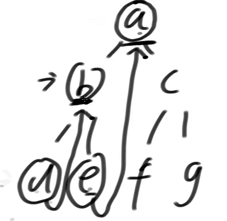

# •算法数据结构体系学习班

## •第30节

### •Morris遍历

一种遍历二叉树的方式，并且时间复杂度O(N)，**额外空间复杂度O(1)**

通过利用原树中大量空闲指针的方式，达到节省空间的目的。

注：普通的二叉树遍历，空间复杂度为O(h)，h为二叉树的高度。无论自建栈，还是系统调用栈，高度h是省不掉的。

### •Morris遍历细节

假设来到当前节点cur，开始时cur来到头节点位置

1）如果cur没有左孩子，cur向右移动(cur = cur.right)

2）如果cur有左孩子，找到左子树上最右的节点mostRight：

​	 a. 如果mostRight的右指针指向空，让其指向cur，然后cur向左移动(cur = cur.left)

​	 b. 如果mostRight的右指针指向cur（自己），让其指向null，然后cur向右移动(cur = cur.right)

3）cur为空时遍历停止

### •Morris遍历实质

**建立了一种机制，实质是在用我左树上的最右节点的右指针状态，来标记我到底是第一次来到cur节点，还是第二次来到。**如果左树上的最右节点指向空，说明是第一次来到cur节点，然后让左树上的最右节点指向自己，来标记已经来过一次cur了。然后继续遍历下一个节点，下一个节点同理。



生成了一种 Morris 序 a b d b e a c f c g，对于没有左子树的节点只到达一次，对于有左子树的节点会到达两次。

morris遍历时间复杂度依然是O(N)

> Morris 非常聪明，他聪明在哪儿？我们来看递归方法，注意注释 1 2 3 对应的位置。
>
> 1. 你在递归方法里，你知不知道你是第一次来到自己？你知道，因为系统栈把所有中间信息给你保留，栈记录了信息，你当然知道自己是第一次。
>
> 2. 你去了左树，当你再一次回到左树之后，你知不知道你是第二次回到自己？你知道，你怎么知道的？系统栈给你保留所有的过程信息，你当然知道你是第二次回到自己。
>
> 3. 然后你去你的右树，当你再次回到自己，要退出之前，你还会回到自己一次，不然你退出不了，你怎么知道你是第三次回到自己的？递归栈帮你实现了所有中间信息的记录，所以你知道。
>
> 你开辟的空间支持你知道是第几次回到自己。所以你可以认为，Morris遍历在利用我任何一个节点左树上的最右节点的右指针，向递归行为致敬。

```java
public static void process(Node root) {
    if (root == null) {
        return;
    }
    // 1
    process(root.left);
    // 2
    process(root.right);
    // 3
}
```

### Morris 遍历有啥用？

你在一个内存吃紧的空间，例如你是一个嵌入式编程/系统编程的程序员，内存有限，你的代码是要做一个系统，所有人的代码都要在你的系统上来跑。越底层的代码，就要求越高效、越省空间。只是你做 web 应用，觉得内存便宜了，你不需要关注，不代表其他程序员不关注，甚至可能很重要。阿波罗只需要 128 kb 就登月了，就是把所有的空间用到极致的结果。

### •题目

给定一棵二叉树的头节点head

求以head为头的树中，最小深度是多少？