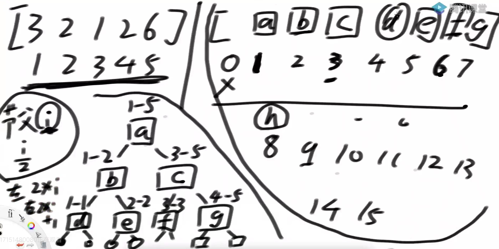

# •算法数据结构体系学习班

## •第31节

### •线段树

> 线段树的题目敏感度很高，只要有区间更新、区间查询，就很容易能想到用线段树。它难在你要将代码思路理清楚。

1，一种支持范围整体修改和范围整体查询的数据结构

- 区间范围内的统一增加
- 区间范围内的统一修改
- 区间范围内的统一查询

时间复杂度O(logn)

2，解决的问题范畴：

大范围信息可以只由左、右两侧信息加工出，

而不必遍历左右两个子范围的具体状况

### •线段树实例一

给定一个数组arr，用户希望你实现如下三个方法

1）void add(int L, int R, int V) : 让数组arr[L…R]上每个数都加上V

2）void update(int L, int R, int V) : 让数组arr[L…R]上每个数都变成V

3）int sum(int L, int R) :让返回arr[L…R]这个范围整体的累加和

怎么让这三个方法，时间复杂度都是O(logN)

### •线段树实例二

想象一下标准的俄罗斯方块游戏，X轴是积木最终下落到底的轴线

下面是这个游戏的简化版：

1）只会下落正方形积木

2）[a,b] -> 代表一个边长为b的正方形积木，积木左边缘沿着X = a这条线从上方掉落

3）认为整个X轴都可能接住积木，也就是说简化版游戏是没有整体的左右边界的

4）没有整体的左右边界，所以简化版游戏不会消除积木，因为不会有哪一层被填满。

给定一个N*2的二维数组matrix，可以代表N个积木依次掉落，

返回每一次掉落之后的最大高度

•线段树实例二原题目出处：

https://leetcode.com/problems/falling-squares/

### 线段树可以解决的问题

我拿到左孩子的信息，我拿到右孩子的信息，父节点的信息我不用调研具体状况，只需要O(1)时间由两个子节点简单加工来的问题，可以用线段树。