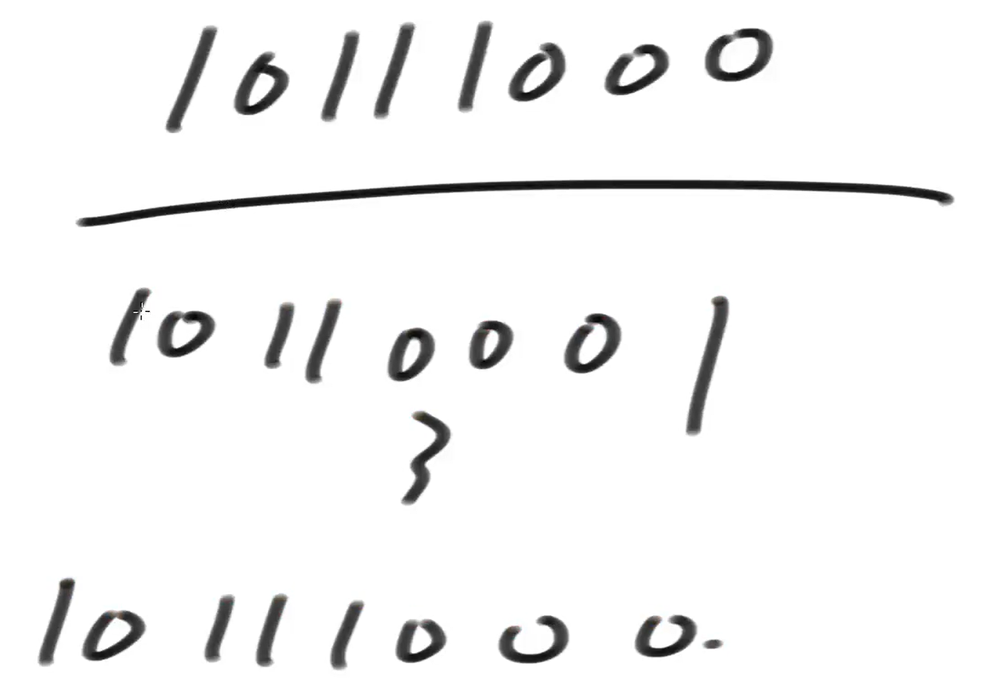
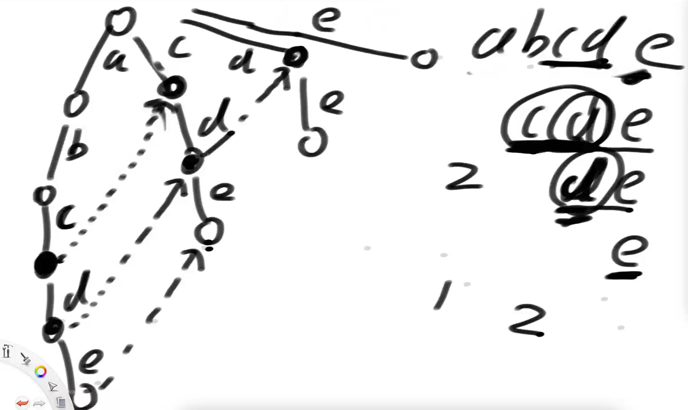

# •算法数据结构体系学习班

## •第32节

### •AC自动机

在前缀树上做KMP

解决在一个大字符串中，找到多个候选字符串的问题

•AC自动机算法核心

1）把所有匹配串生成一棵前缀树

2）前缀树节点增加fail指针

3）fail指针的含义：如果必须以当前字符结尾，当前形成的路径是str，剩下哪一个字符串的前缀和str的后缀，拥有最大的匹配长度。fail指针就指向那个字符串的最后一个字符所对应的节点。（迷不迷？听讲述！）

### •IndexTree 树状数组

相当于线段树的一个子结构，线段树已经可以完美实现了，但是 index tree 有比线段树更优的地方。

特点：

1）支持区间查询

2）没有线段树那么强，但是非常容易改成一维、二维、三维的结构

3）IndexTree 只支持单点更新。线段树可以支持范围更新。

人为规定，下标统一以1开始。

https://leetcode.com/problems/range-sum-query-mutable/

10111000管的位置：把最后一个1拆散再加1，到它自己。

可以理解成先把2的n次方都删掉，剩下的部分就是i位置的数能控制的部分

只要你下标从1开始，你想让刚才我们说的管理模型成立，它下标天然有这个规律。

你很难说我是刻意要设计这样一种极其巧妙的对应关系才发明的 index tree 这种组织，还是说我发明了这种组织，然后发现托管的这些下标比较方便，你很难说谁先出来的，总而言之它就有这个规律。

有了 help 数组，怎么使用？

每次抹掉最后一个1，所有的东西累加起来

原理有点像 8(or not)+4(or not)+2(or not)+1(or not)

所谓的fail指针是指，当我这个东西匹配失败了，必须以我这个字符做结尾，和哪一个字符必须从开头开始，的前缀，相等长度最长

