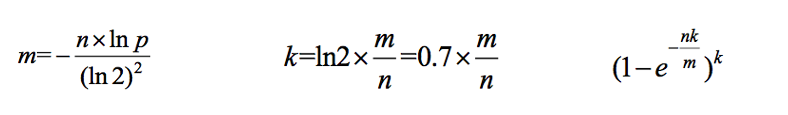

# •算法数据结构体系学习班

### •第33节

•认识哈希函数 ->  out f(in data)

1）输入参数data，假设是in类型，特征：可能性无穷大，比如str类型的参数

2）输出参数类型out，特征：可能性可以很大，但一定是有穷尽的

3）哈希函数没有任何随机的机制，固定的输入一定是固定的输出

4）输入无穷多但输出值有限，所以不同输入也可能输出相同（哈希碰撞）

5）再相似的不同输入，得到的输出值，会几乎均匀的分布在out域上

重点：第5条！

•哈希函数作用：可以把数据根据不同值，几乎均匀的分开

举个例子：

### 哈希表的设计

#### •布隆过滤器

1）利用哈希函数的性质

2）每一条数据提取特征

3）加入描黑库

### 原理视频重点讲解

•布隆过滤器重要的三个公式

1，假设数据量为n，预期的失误率为p（布隆过滤器大小和每个样本的大小无关）

2，根据n和p，算出Bloom Filter一共需要多少个bit位，向上取整，记为m

3，根据m和n，算出Bloom Filter需要多少个哈希函数，向上取整，记为k

4，根据修正公式，算出真实的失误率p_true

### •一致性哈希

分布式存储结构最常见的结构

1）哈希域变成环的设计

2）虚拟节点技术

hyperloglog：林子大了，什么鸟都有。我们用鸟有多怪，来评价林子有多大。