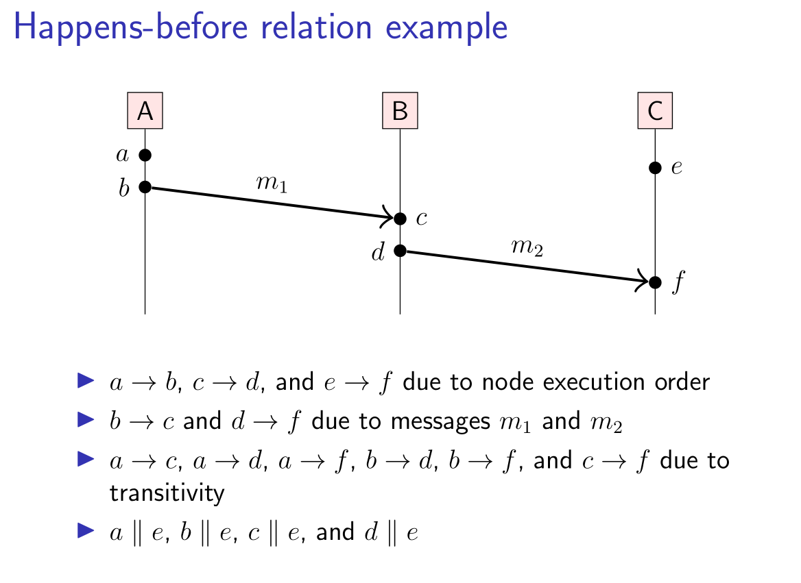

# 不知道分类的放这里

#### 内存数据库

借助面向数字化业务和智慧企业的卓越内存数据库 SAP HANA（参考公众号：汪子熙）


#### 打印log对性能影响

打印log会对性能有影响，如果使用metrics打点的话几乎没有影响


#### Java 检测字符串是否相等

如果虚拟机始终将相同的字符串共享， 就可以使用= 运算符检测是否相等。但实际上 只有字符串常量是共享的，而+ 或 substring 等操作产生的结果并不是共享的。因此，千万不要使用 == 运算符测试字符串的相等性， 以免在程序中出现糟糕的 bug，看起来这种 bug 就像随机产生的间歇性错误。

> C++注释：对于习惯使用C++的string类的人来说，在进行相等性检测的时候一定要特别小心。C++的string类重载了==运算符以便检测字符串内容的相等性。可惜Java没有采用这种方式，它的字符串“看起来、感觉起来”与数值一样，但进行相等性测试时，其操作方式又类似于指针。语言的设计者本应该像对+那样也进行特殊处理，即重定义==运算符。当然，每一种语言都会存在一些不太一致的地方。
>
> C程序员从不使用==对字符串进行比较，而使用strcmp函数。Java的compareTo方法与strcmp完全类似，因此，可以这样使用：
>
> ```
>  if (greeting.compareTo("Hel1oH) === 0} . . . 
> ```
>
> 不过， 使用 equals 看起来更为清晰。


### Is ping using TCP or UDP?

The ping command can be related to these TCP and UDP protocols but **it does not use TCP or UDP**. This may be even asked you in an interview or certificate exam or class exam. The ping command uses the ICMP protocol.

> 如何自己实现一个 ping?


#### 内存池

大佬们，请教一个问题啊，有人做过能够在多线程高并发环境下的内存池吗？除了给每个线程分配一个内存池，有其他方案吗？


### leetcode 647. Palindromic Substrings

兴业数字金融笔试题 回文串 可以用 Manacher算法


### ubuntu apt update 错误 Public key is not available 解决方法

#### [Force update from unsigned repository](https://askubuntu.com/questions/732985/force-update-from-unsigned-repository)

https://askubuntu.com/questions/732985/force-update-from-unsigned-repository

/etc/apt/sources.list.d 目录下找到对应的 url，加上 [trusted=yes]（但是它并不管用啊。。后来直接在 list 里把报错的仓库删了）

```
➜  ~ sudo apt-get update                                                                                                             
Hit:1 http://ftp.sjtu.edu.cn/ubuntu focal InRelease
Hit:2 http://ftp.sjtu.edu.cn/ubuntu focal-security InRelease                                                                                                                                
Hit:3 http://dl.google.com/linux/chrome/deb stable InRelease                                                                                                                                
Hit:4 http://dl.google.com/linux/earth/deb stable InRelease                                                                                                                                 
Hit:5 http://security.ubuntu.com/ubuntu focal-security InRelease                                                                                                                            
Hit:6 http://packages.microsoft.com/repos/vscode stable InRelease                                                                                                                           
Hit:7 http://ppa.launchpad.net/alex-p/llpp/ubuntu focal InRelease                                                                                                                           
Ign:8 http://mirrors.tuna.tsinghua.edu.cn/ros/ubuntu focal InRelease                                            
Hit:9 http://mirrors.tuna.tsinghua.edu.cn/ros/ubuntu focal Release                      
Hit:11 https://typora.io/linux ./ InRelease                                     
Get:12 https://linux-clients.seafile.com/seafile-deb/focal stable InRelease [1,631 B]
Ign:12 https://linux-clients.seafile.com/seafile-deb/focal stable InRelease
Get:13 https://linux-clients.seafile.com/seafile-deb/focal stable/main amd64 Packages [2,648 B]
Fetched 2,648 B in 3s (827 B/s)       
Reading package lists... Done
N: Skipping acquire of configured file 'main/binary-arm64/Packages' as repository 'http://packages.microsoft.com/repos/vscode stable InRelease' doesn't support architecture 'arm64'
N: Skipping acquire of configured file 'main/binary-armhf/Packages' as repository 'http://packages.microsoft.com/repos/vscode stable InRelease' doesn't support architecture 'armhf'
W: GPG error: https://linux-clients.seafile.com/seafile-deb/focal stable InRelease: The following signatures couldn't be verified because the public key is not available: NO_PUBKEY B9AEC3A21F035485
```


看看为什么找不到？(不是找不到，是真的没有。。在同一个repository下，不同内核版本的apt软件列表不同？)

apt-cache search ros 搜索结果都是如下 noetic 的，grep 了一下，没有 kinetic。搜了一下 noetic 和 kinetic 有什么区别？

```
ros-noetic-wireless-msgs - Messages for describing a wireless network such as bitrate, essid, and link quality.
ros-noetic-wireless-watcher - A Python-based which publishes connection information about a linux wireless interface.
ros-noetic-ws281x - ROS node for rpi_ws281x LED strip driver
ros-noetic-ws281x-dbgsym - debug symbols for ros-noetic-ws281x
ros-noetic-wu-ros-tools - A collection of tools for making a variety of generic ROS-related tasks easier.
ros-noetic-xacro - Xacro (XML Macros) Xacro is an XML macro language.
ros-noetic-xmlrpcpp - XmlRpc++ is a C++ implementation of the XML-RPC protocol.
ros-noetic-xmlrpcpp-dbgsym - debug symbols for ros-noetic-xmlrpcpp
ros-noetic-xpp-msgs - ROS messages used in the XPP framework.
ros-noetic-xpp-states - Common definitions (positions, velocities, angular angles, angular rates) and robot definitions in Cartesian and joint state used in the Xpp Motion Framework, as well as conversions to/from xpp_msgs.
ros-noetic-xpp-states-dbgsym - debug symbols for ros-noetic-xpp-states
ros-noetic-xv-11-laser-driver - Neato XV-11 Laser Driver.
ros-noetic-xv-11-laser-driver-dbgsym - debug symbols for ros-noetic-xv-11-laser-driver
ros-noetic-ypspur - YP-Spur is a mobile robot motion control software with coordinate frame based commands.
ros-noetic-ypspur-dbgsym - debug symbols for ros-noetic-ypspur
ros-noetic-ypspur-ros - ROS wrapper for the mobile robot control platform YP-Spur
ros-noetic-ypspur-ros-dbgsym - debug symbols for ros-noetic-ypspur-ros
ros-noetic-zbar-ros - Lightweight ROS wrapper for Zbar barcode/qrcode reader library (http://zbar.sourceforge .net/)
```

有人说 20.04 没有 kinetic：

https://www.reddit.com/r/ROS/comments/n3loko/is_there_a_big_difference_between_ros_kinetic_and/

Long story short, I tried installing ubuntu 16.04 but failed, yet successfully downloaded 20.04, and unfortunately ROS kinetic is not on 20.04 but noetic is.

One big difference is that Noetic uses python 3, while kinetic uses python 2. Of course this really doesn’t matter if you’re writing C++. If you’re familiar with Docker you can get a Dockerfile for kinetic [here](https://hub.docker.com/_/ros)

ubuntu 的 PPA List 可以看到，各个 PPA 是有 Available 版本号的。https://www.ubuntuupdates.org/ppas

考虑到开源代码无法从 py2 切换到 py3，所以只能装 kinetic

http://wiki.ros.org/cn/kinetic/Installation/Ubuntu 官方也说了，ROS Kinetic **只** 支持Wily (Ubuntu 15.10), Xenial (Ubuntu 16.04) 和Jessie (Debian 8) 的debian包。

找到一个  **install ROS Noetic** on **Ubuntu 20.04**. 的教程

https://linoxide.com/how-to-install-ros-noetic-on-ubuntu-20-04/


### 为什么程序在编译阶段不计算运行结果，优化到极致？

您想，如果程序在编译阶段就能检测程序行为的话，那还运行程序干吗？直接在该程序的编译阶段输出程序运行结果，不就完了吗？


### Happens Before



Finally, we take the transitive closure, and the result is the happens-before relation. This is a partial order, which means that it is possible that for some events a and b, neither a happened before b, nor b happened before a. In that case, we call a and b concurrent. Note that here, “concurrent” does not mean literally “at the same time”, but rather that a and b are independent in the sense that there is no sequence of messages leading from one to the other.


### 如何学习逆向工程？作为过来人，有什么可以嘱咐晚辈的？

https://www.zhihu.com/question/23999930

从理论上看，你为了理解系统，你读代码，无论是源码还是汇编，甚至二进制机械指令，都是一个逆向过程，其结果就是建立了一个模糊的心理模型，用于理解系统的运作过程，然而系统代码是复杂的，庞大的，只凭脑力难以定位底层细节，需要借助工具，如反汇编器，调试器，模拟器。有人认为学好了汇编语言，就相当于可以阅读任何闭源软件了，这显然是错误的思想，没有理论上的清晰认识，容易进入这个思维误区，给定一个逆向的目标，不去搜索背景信息，已有成果，而是一头扎进汇编独自探索，是愚蠢的行为。因为人类的临时记忆是非常可怜的，靠脑力仅能推演很短的代码量，通过纯汇编去推演高层逻辑，是人脑不可承受的，即便理论是可能的，但时间也是不可承受的。所以推演必须要让cpu来执行，人脑只负责在特定的条件下让系统停下来，读取推演的结果。于是就有了调试器。用了调试器，人脑只需判断并控制条件逼近底层细节，具体的就是操作软件，并结合条件断点来定位底层代码，这样在效率上比人肉调试器就有了质的提高。

而这种逆向模型，在很多时候仍然不够，因为它要求逆向者对软件高层概念对底层代码的映射有清晰深刻的理解，也就是编译器如何把源码层的概念编译为底层代码的，比如高层的函数，语句，变量，如何变为底层的函数，汇编，内存地址的。一般情况下，逆向者阅读汇编会直接反向映射为高层的函数语句变量等，但是也仅此而已，拥有源码的人根据函数名就知道这个函数是干嘛的，而逆向者需要更多的信息才能知道，在仅依赖汇编的基础上，如何才能得知这段代码的功能呢，关注它的输入和输出，以及所调函数，这决定了它的功能。在输入和输出上以及所调用函数的断点上抽取信息做判断，这是和琐碎的工作，是体力活，于是面向调试器脚本的编程又将逆向推进一步。逆向能力随着逆向手段的增强而越来越强，软件保护的一方也在不断进步，从开始的反调试，反反汇编，此阶段逆向与保护的能力基本持平，此消彼长，水平依赖于经验，后来发展到虚拟机保护，保护的一方对逆向破解者造成对抗上的碾压。逆向者面对虚拟机保护一筹莫展，原来的知识体系仅能逆向虚拟机，对虚拟机指令无能为力，并且没有现成的反汇编器可用，当其中混入了反调后（直接使用系统调用指令），常规逆向走入了死胡同，期待出现新的逆向手段。终于基于模拟器的技术承担了这一重任，cpu模拟，全系统模拟，污点分析，程序切片技术，总的来说是面向模拟器分析的编程。模拟器是天然规避反调试的，虚拟指令不用分析了，因为大部分情况我们不需要那种心理模型了。这个对抗阶段，是多种技术方案并存的，因为门槛比较高，虚拟机保护基本是要花钱的，逆向破解也少有人能力足够来做。目前这个层次的对抗是个神仙打架，大家围观的状态。


### 有可能的研究方向

- 设计一种特定（真实）场景下的分布式系统冲突解决方法，例如多人编辑文档
- 设计一种特定（真实）场景下的JVM垃圾回收器，例如对于简短的函数直接不去回收，尤其是在容器化环境下，一个task运行时间很短
- 盲人眼镜
- 基于非易失性存储的数据库存储引擎设计
- 用随机的特性从概率上解决一些问题？例如，skip list，蚁群，遗传
- 用“懒”的方案解决一些读写问题？如 CoW，异步解决一些问题 LSM tree
- 
