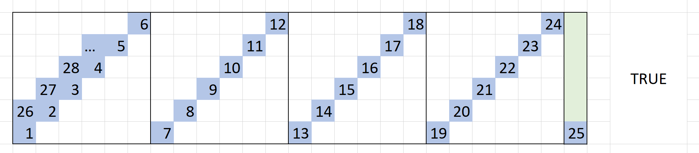
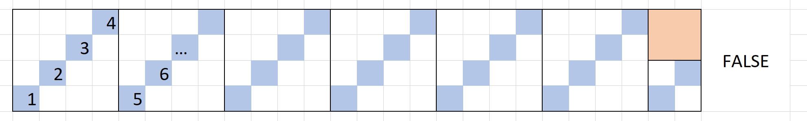
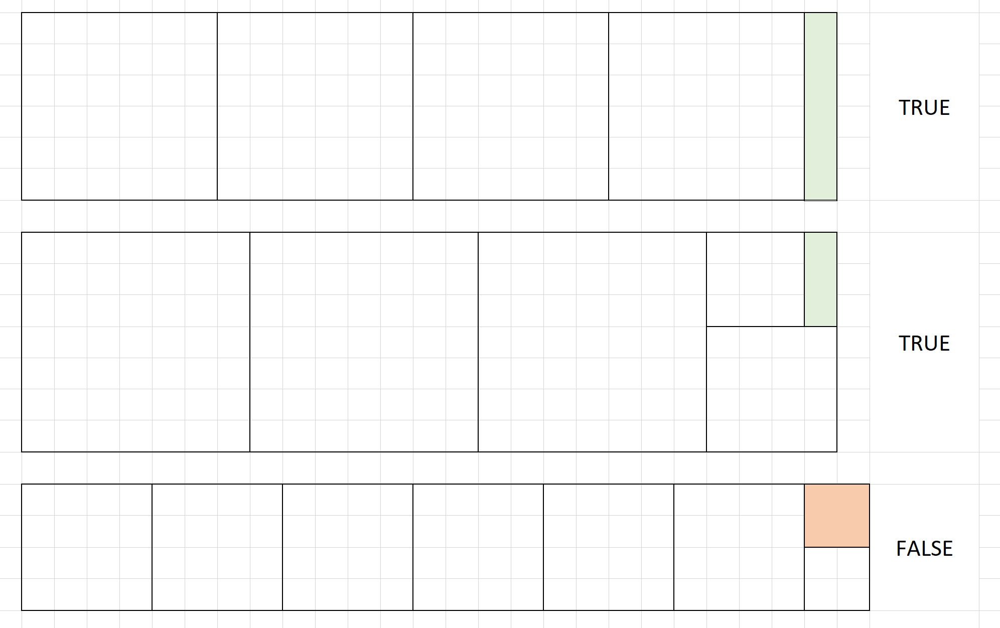

# 某题

### 题目

x * y 矩形，从左下角开始，斜向上45度填充，到边界顺延，判断能否填满？





### 题解

每一个正方形区域中的路线，都是对前一个正方形的重复，所以正方形可以消掉。

因此，问题被简化为：消掉所有正方形后，判断剩余部分是否为正方形。

我们假设剩余部分长宽分别为(x,y)，则分类如下

1. `x==y==1`的情况，需要分类讨论 
   - 如果输入是 `1*1`，那么显然可以填满
   - 如果是消去正方形之后剩下 `1*1`，则消掉的其它非 `1*1` 正方形是不能被填满的
2. `x==y!=1`，路线只能在正方形的对角线上循环，不能全部填满
3. `x==1 || y==1`，即边长为1的矩形，可以全部填满



上代码

```java
class Solution {
    // 问题1：如何判断能否填满
    public static boolean checkBoard1(int x, int y) {
        int[][] board = new int[x][y];
        int count = 0;
        int i = 0;
        int j = 0;
        while (true) {
            if (board[i][j] == 1) {
                return count == x * y;
            } else {
                board[i][j] = 1;
                i++;
                j++;
                i %= x;
                j %= y;
            }
            count++;
        }
    }

    // 问题2：找规律，什么情况能填满
    public static boolean checkBoard2(int x, int y) {
        if (x == 1 && y == 1) return true;
        while (x != 1 && y != 1) {
            if (y == 0) return false;
            x %= y;
            if (x == 0) return false;
            y %= x;
        }
        return x != 1 || y != 1;
    }

    public static void main(String[] args) {
        // for test
        for (int i = 1; i < 500; i++) {
            for (int j = 1; j < 500; j++) {
                System.out.println("check i=" + i + ", j=" + j);
                if (checkBoard1(i, j) != checkBoard2(i, j)) {
                    System.out.println("Oops! i=" + i + ", j=" + j + ", " + checkBoard1(i, j) + ", " + checkBoard2(i, j));
                    return;
                }
            }
        }
        System.out.println("Pass");
    }
}
```

https://zh.wikipedia.org/wiki/%E4%B8%AD%E5%9B%BD%E5%89%A9%E4%BD%99%E5%AE%9A%E7%90%86
