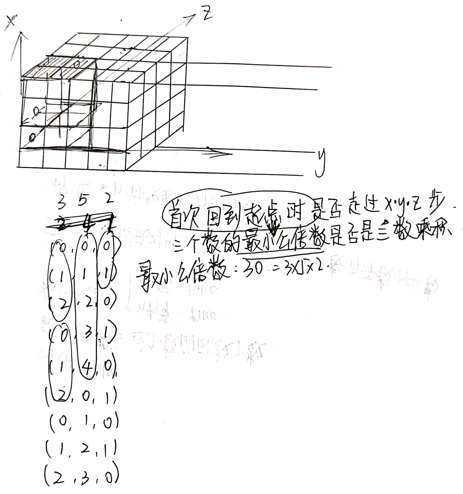

# 无题

### 背景

> \[背景1\]  [中国剩余定理](https://zh.wikipedia.org/wiki/%E4%B8%AD%E5%9B%BD%E5%89%A9%E4%BD%99%E5%AE%9A%E7%90%86)
>
> \[背景2\]  和 npy 去某郊区某湖玩耍。大巴车上，别人线上查 bug，我俩互考算法题；别人聊得热火朝天，我俩互考算法题；别人昏昏欲睡，我俩还在互考算法题。
>
> \[背景3\]  一道好的题目就是：打开之后，行云流水，拍案叫绝；合上之后，流连忘返，回味无穷。

### 填充矩形：二维场景

#### 题目

x * y 矩形，从左下角开始，斜向上45度填充，到边界顺延，判断能否填满？


#### 题解

每一个正方形区域中的路线，都是对前一个正方形的重复，所以正方形可以消掉。

因此，问题被简化为：消掉所有正方形后，判断剩余部分是否为正方形。

我们假设剩余部分长宽分别为(x,y)，则分类如下

1. `x==y==1`的情况，需要分类讨论 
   - 如果输入是 `1*1`，那么显然可以填满
   - 如果是消去正方形之后剩下 `1*1`，则消掉的其它非 `1*1` 正方形是不能被填满的
2. `x==y!=1`，路线只能在正方形的对角线上循环，不能全部填满
3. `x==1 || y==1`，即边长为1的矩形，可以全部填满


不多说，上代码

```java
class Solution {
    // 问题1：如何判断能否填满
    public static boolean checkBoard1(int x, int y) {
        int[][] board = new int[x][y];
        int count = 0;
        int i = 0;
        int j = 0;
        while (true) {
            if (board[i][j] == 1) {
                return count == x * y;
            } else {
                board[i][j] = 1;
                i++;
                j++;
                i %= x;
                j %= y;
            }
            count++;
        }
    }

    // 问题2：找规律，什么情况能填满
    public static boolean checkBoard2(int x, int y) {
        if (x == 1 && y == 1) return true;
        while (x != 1 && y != 1) {
            if (y == 0) return false;
            x %= y;
            if (x == 0) return false;
            y %= x;
        }
        return x != 1 || y != 1;
    }

    public static void main(String[] args) {
        // for test
        for (int i = 1; i < 500; i++) {
            for (int j = 1; j < 500; j++) {
                System.out.println("check i=" + i + ", j=" + j);
                if (checkBoard1(i, j) != checkBoard2(i, j)) {
                    System.out.println("Oops! i=" + i + ", j=" + j + ", " + checkBoard1(i, j) + ", " + checkBoard2(i, j));
                    return;
                }
            }
        }
        System.out.println("Pass");
    }
}
```
---

### 填充长方体：拓展到三维

#### 题目

x * y * z 三维长方体，斜向45度填充，到边界顺延，判断能否填满？



#### 题解

以 x * y * z = 3 * 5 * 2 的长方体为例，从原点出发，走过的坐标依次为：

```
0, 0, 0
1, 1, 1
2, 2, 0
0, 3, 1
...
```

#### 方法1：原始模拟，O(x\*y\*z)

根据图形可知，最简单的判断能否填满的方法是：当首次走到重复路径时，如果恰好走完所有的格子，说明可以填满；否则无法填满。

具体到三维的情况，**当首次回到起点时，如果走过的格子数量刚好等于 x * y * z，则说明可以填满**。

以上是模拟的思路。由于复杂度太高，所以需要进一步归纳。

#### 方法2：最小公倍数，O(1)

如何衡量上述的“首次回到起点”？

在本例中，对于 x, y, z 这 3 个方向来说，它们的上限分别是 3, 5, 2，超出之后会进行循环取余。也就是说，x 方向每 3 个数一循环，y 方向每 5 个数一循环，z 方向每 2 个数一循环。

什么时候首次回到起点呢？当三个方向同时循环到 0 的时候。显然，此时走过的格子数量是三个数的最小公倍数。

于是我们的结论可以描述为：**当三个数的最小公倍数是三个数的乘积时，说明可以填满**。

```java
class Solution {
    // 问题1：如何判断能否填满
    public static boolean checkBoard1(int x, int y, int z) {
        int[][][] board = new int[x][y][z];
        int count = 0;
        int i = 0;
        int j = 0;
        int k = 0;
        while (true) {
            if (board[i][j][k] == 1) { // 首次走到重复路线
                return count == x * y * z;
            } else {
                board[i][j][k] = 1;
                i++;
                j++;
                k++;
                i %= x;
                j %= y;
                k %= z;
            }
            count++;
        }
    }

    // 问题2：找规律，什么情况能填满
    public static boolean checkBoard2(int x, int y, int z) {
        return lcm(lcm(x, y), z) == x * y * z;
    }

    // 最小公倍数
    static int gcd(int a, int b) {
        if (a == 0) return b;
        return gcd(b % a, a);
    }

    // 最大公因数
    static int lcm(int a, int b) {
        return (a / gcd(a, b)) * b;
    }

    public static void main(String[] args) {
        // for test
        for (int i = 1; i < 50; i++) {
            for (int j = 1; j < 50; j++) {
                for (int k = 1; k < 50; k++) {
                    System.out.println("check i=" + i + ", j=" + j);
                    if (checkBoard1(i, j, k) != checkBoard2(i, j, k)) {
                        System.out.println("Oops! i=" + i + ", j=" + j + ", " + checkBoard1(i, j, k) + ", " + checkBoard2(i, j, k));
                        return;
                    }
                }

            }
        }
        System.out.println("Pass");
    }
}
```

---

### 拓展到 n 维

以上结论拓展为：**在 n 维空间中，当 n 个数的最小公倍数是 n 个数的乘积时，说明可以填满。**

经过提示，当两个数互质时，这两个数的最小公倍数是两个数的乘积。所以，**当 n 个数互质时，可以填满**。
