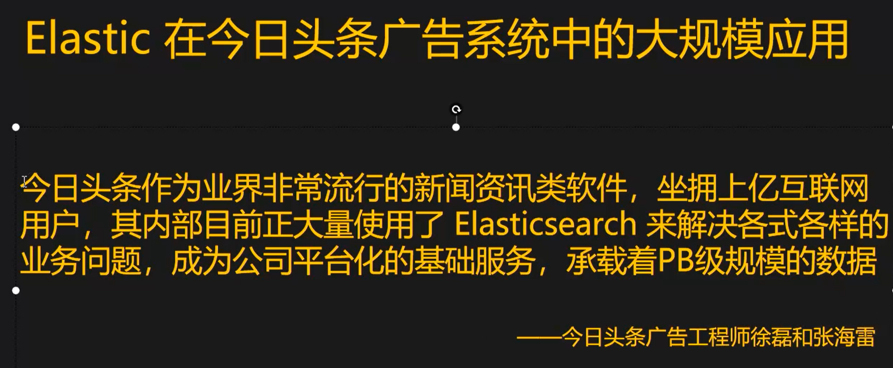
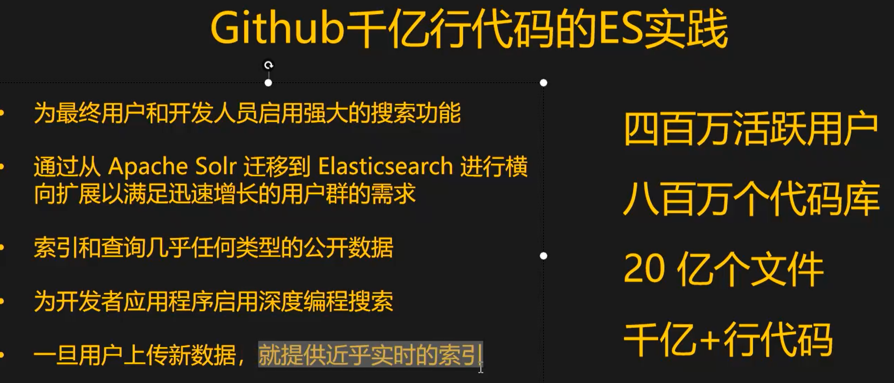
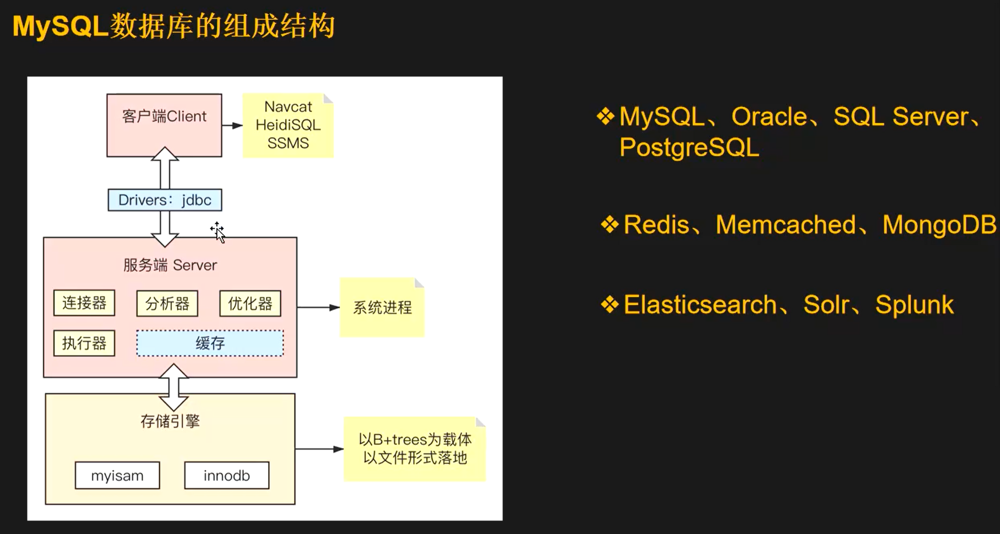
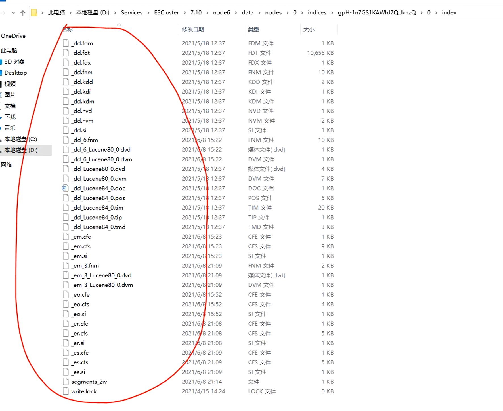
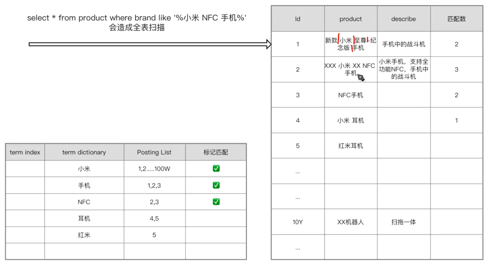
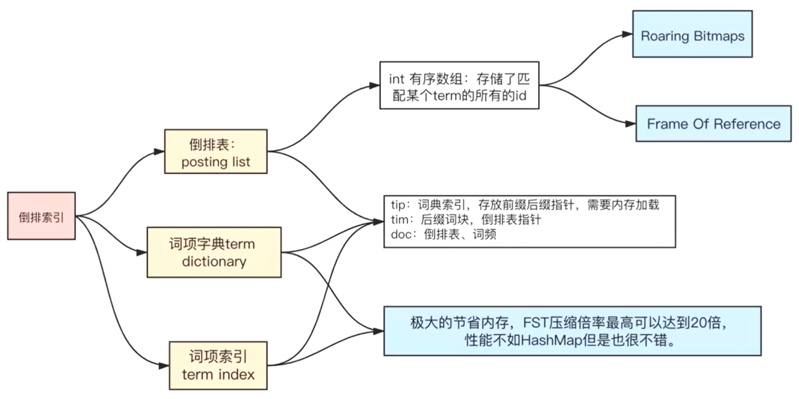

# ElasticSearch

### 为什么学ES？

Shay Banon: Search is something that any application should have

海量数据的应用场景：导航、打车、外卖、团购等等

### 应用场景

#### 技术选型

几乎任何公司都有搜索场景。这些搜索场景，都用ES吗？怎么做技术选型？

- 性能
- 生态
- 可用性
- 社区
- 维护团队

海量数据的系统架构技术如何选型？目前主流数据库

- MySQL
- Redis
- mongoDB
- Solr
- Lucene

ES一般做OLAP，mongoDB一般做OLTP

mongoDB没有倒排索引，所以不适合做大规模数据检索

为什么不能使用 MySQL？

mysql 百万级 不加索引 1s左右，加普通索引（%在左边会走全表, 索引失效），去掉like 0.125秒。

> es的优势就是在于他的全文检索的能力，配合分词算法，达到高精准的匹配，适合没有事务的场景，聚合能力相对较弱，对结构化文本数据的处理能力相对较弱，主要就是用于文档检索记住这个就ok了。全字段都有索引，异步查询合并接口，查询性能出众，但是问题也有，不适合插入立马查询这种实时性强的场景，因为异步分布式的问题，马上插入马上查询会查询不到。
> 有检索需求的就无脑es就ok了

#### 搜索引擎数据库排名

有这种应用场景，无脑选 ES 就可以。

DB-Engines 搜索引擎类数据库排名常年霸榜。

ES != 搜索引擎，但大家把它称作搜索引擎，牺牲写入性能来换取搜索性能。可以把 ES 理解成一个分布式数据库，它只不过是实现了搜索引擎的组成部分中的索引以及存储过程而已。

ES 如何调优？调节 refresh interval（写入时间间隔）

#### 倒排索引

什么是索引？

ES底层的数据文件

##### 倒排索引的数据结构

为什么不能用 B+ 树作为数据结构？为什么 MySQL 不能作为大规模数据检索？

倒排索引过程

