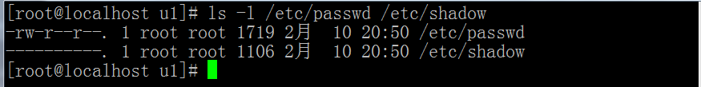
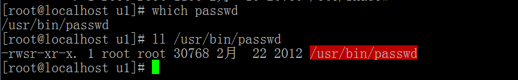
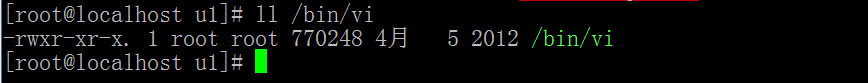
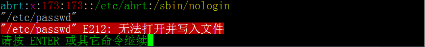
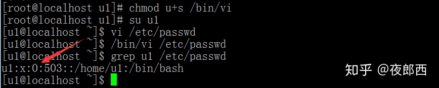
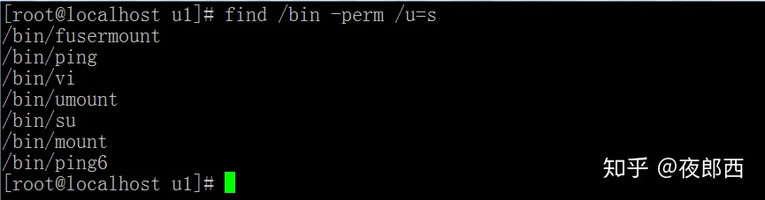

# sudo 实现原理

```
➜  linux-0.01 find /usr/bin -perm /u=s
/usr/bin/newgrp
/usr/bin/chfn
/usr/bin/sudo
/usr/bin/passwd
/usr/bin/gpasswd
/usr/bin/chsh

➜  linux-0.01 ls -l /usr/bin/passwd    
-rwsr-xr-x 1 root root 63736 Jul 27  2018 /usr/bin/passwd
```

普通用户去修改密码的时候,我们会发现有一个很有意思的事情。普通用户能够修改自己的密码，符合逻辑！符合常理！没有任何毛病，问题的关键是，请看下图：



默认情况下，用来存放用户信息和用户密码的文件都没有可写和可执行的权限，/etc/shadow文件甚至什么权限都没有，那普通用户是如何更改密码并且让密码自动更新到/etc/shadow文件当中去的呢?

用户变更自己的密码所使用的命令是passwd，秘密会不会就在passwd这儿呢？我们来看passwd它的详细信息：



和普通文件不一样，存放在/usr/bin目录下的passwd文件有一个特殊的权限位s，原本s位是用来安置x权限的，现在却被s给占用了，那么这个s是个什么东西？它究竟有何神力能让没有任何权限的普通用户，轻而易举地就把密码给改了，还把密码信息写入到了所有用户都没有任何权限的/etc/shadow文件中？

s为何物？它就是我们今天要介绍的对象SetUID。要了解什么是SetUID，首先我们得了解一下它的相关定义。

SetUID的定义：当一个可执行程序具有SetUID权限，用户执行这个权限时，将以这个程序所有者的身份执行。我们来认真看一下/usr/bin/passwd这个文件的所有者是谁？是root!!

也就是说其他用户在使用/usr/bin/passwd这个命令时，由于/usr/bin/passwd设置了s位，其他用户瞬间就被root灵魂附体，从此以root用户的身份去执行这个命令，这个s位就是普通用户能更改密码的真正原因。


既然s位这么厉害，那是不是所有文件只要被设置了s位以后，其他用户在使用时都具备其所有者身份？答案是否定的。如果要给一个文件设置s位，想要其发挥s位的效果，前提是此文件一定是一个可执行文件，也就是它必须具备x的权限（所有者或者所属组）。

这下就比较有意思了！我们可以设想一下，假如我们服务器里面的/bin/vi被人给设置了s位，那会有什么后果？



通常情况下，普通用户使用/bin/vi命令去查看/etc/passwd，是没有办法对其进行修改保存的。哪怕你使用:wq！去强制保存，也只能得到如下提示：



那当/bin/vi被赋予了s位之后呢？



普通用户u1可以轻而易举地让自己成为超级用户（通过/bin/vi命令修改/etc/passwd文件内容，把自己的UID改成0），从此就能为所欲为！！想想头皮就发麻！！！！所以SetUID一定要慎用，而且作为管理员，要知道有哪些执行文件被授予了s位，对于存在风险的，定要删除。

使用find /bin -perm /u=s 就可以轻松查看/bin目录下哪些可执行文件具有s位。



最后，再分享一个小知识点，就是普通用户使用的vi是一个假名，它真正的路径并不是/bin/vi，而是/usr/bin/vim。


---

### [How do the internals of sudo work?](https://unix.stackexchange.com/questions/80344/how-do-the-internals-of-sudo-work)

### Question

How does `sudo` work internally? How is it possible that it can become root without having the root password, unlike `su`? What syscalls, etc. are involved in the process? Is it not a gaping security hole in Linux (e.g. why couldn't I compile a heavily-patched `sudo` that just did whatever regular `sudo` did, but didn't ask for the unprivileged user's password)?

I have read [login and su internals](https://unix.stackexchange.com/questions/15455/login-and-su-internals). I have also read [How is sudo intended to be used?](https://unix.stackexchange.com/questions/11285/how-does-sudo-work) but despite the title, they mainly deal with the differences between `su` and `sudo`.

### Answer

If you take a look at the executable `sudo`:

```
$ which sudo
/usr/bin/sudo
$ ls -la /usr/bin/sudo
---s--x--x 2 root root 208808 Jun  3  2011 /usr/bin/sudo
```

You'll notice that it carries the permission bits `---s--x--x`. These can be broken down as follows:

```
-|--s|--x|--x
-      - first dash denotes if a directory or a file ("d" = dir, "-" = file)  
--s    - only the setuid bit is enabled for user who owns file
--x    - only the group execute bit is enabled
--x    - only the other execute bit is enabled
```

So when a program has it's setuid bit enabled (also referred to as SUID) it means that when someone runs this program it will run with the credentials of the user that owns the file, aka. root in this case.

### Example

If I run the following command as user saml:

```
$ whoami
saml

$ sudo su -
[sudo] password for saml: 
```

You'll notice that the execution of `sudo` actually is running as root:

```
$ ps -eaf|grep sudo
root     20399  2353  0 05:07 pts/13   00:00:00 sudo su -
```

### setuid mechanism

If you're curious how SUID works take a look at `man setuid`. Here's an excerpt from the man page that explains it better than I could:

> setuid() sets the effective user ID of the calling process. If the effective UID of the caller is root, the real UID and saved set-user-ID are also set. Under Linux, setuid() is implemented like the POSIX version with the _POSIX_SAVED_IDS feature. This allows a set-user-ID (other than root) program to drop all of its user privileges, do some un-privileged work, and then reengage the original effective user ID in a secure manner.
>
> If the user is root or the program is set-user-ID-root, special care must be taken. The setuid() function checks the effective user ID of the caller and if it is the superuser, all process-related user ID's are set to uid. After this has occurred, it is impossible for the program to regain root privileges.

The key concept here is that programs have a real userid (UID) and an effective one (EUID). Setuid is setting the effective userid (EUID) when this bit is enabled.

So from the kernel's perspective it's known that in our example, `saml` is still the original owner (UID), but the EUID has been set with whomever is the owner of the executable.

### setgid

I should also mention that when we're breaking down the permissions on the sudo command the second group of bits were for group permissions. The group bits also has something similar to setuid called set group id (aka. setgid, SGID). This does the same thing as SUID except it runs the process with the group credentials instead of the owner credentials.

### References

- [setuid wikipedia page](http://en.wikipedia.org/wiki/Setuid)
- [setuid man page](http://linux.die.net/man/2/setuid)