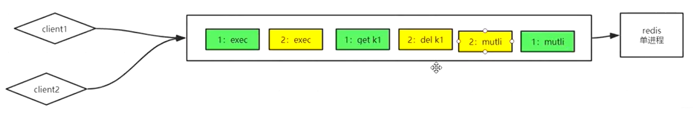

# 队列模式 Queuing Pattern

Redis的IO多线程多线程了个寂寞，搞了个总分总，流水线他不香吗？就如同我这个帽子，除了粉嫩，也没改变啥，头还是那么秃，只不过看着年轻点而已。文章链接先放这里了：https://b23.tv/HPALop

采用单工作 worker 线程，6.x 版本有多 IO threads（Tomcat，Netty 也有 IO threads）；

#### 单线程优势

代码更清晰，处理逻辑更简单。

Redis 天生单线程，多 server 共同请求时，不需要加锁、释放锁等操作，没有因为可能出现死锁而导致的性能消耗。

不存在“多进程或者多线程导致的切换”而消耗CPU。

#### 

### [从单机到多机：多机一定比单机快吗？秒杀系统到底有没有必要用分布式锁？](https://blog.csdn.net/sinat_42483341/article/details/112128102)

#### 服务的无状态性：多机一定比单机快吗？都说秒杀场景一定要用分布式锁，真的是这样吗？ 

首先要理解一个概念，就是服务的状态性。累加器、公共值，属于状态数据。为了维护多机的状态，要保持数据的同步，去做事件传递，去做分布式协调。**zk 是主从架构，性能并不高，仅应该用来维护核心且不经常发生变化的那些数据的一致性，并不是一个很好的用于数据同步的技术方案。正确的方式是做服务状态的迁出，而不是去多台机器上做数据的同步。**

单机情况下，没有到达瓶颈的时候，单笔业务处理速度是最快的。加机器并不能提升速度，反而由于网络开销，让单笔请求变慢。而且单机是不需要外部锁的，而多机要做一致性、同步问题，反而加机器会让整个系统变慢。

那为什么常说多机会变快？这样说的前提是：**不只有一件商品。**如果只有一件商品，最终都要成为串行去扣这一件商品的库存，多机一定不会带来速度的提升。而在多件商品的情况下，多机可以让**无关的商品之间并行**，不同商品的减库存进入不同的机器并同时执行，而受制于一台机器的性能问题，虽然可能会排队，但最终的表现是，多机能够“**让无关请求并行起来**”，因此才会有所谓的“快”。

最后，无论你怎么变，（考虑到多机存在的数据同步问题和单机存在的CPU调度问题），在“没有资源瓶颈”的时候，并行总是会比串行慢。串行才是效率最高的方式。

redis 所有的操作是串行的，每一个操作拥有了原子性和排他性。分布式锁成本是很高的，上述解决方案将 redis 集群前移来做请求有效性识别、减库存这些事情，就不需要做分布式锁了。

**所以，对于任何系统设计，不要上来就推导“多机”的架构模式。**

#### 分布式锁岂不是没用了？

分布式锁其实是在解决并发问题。未来很多公司采用响应式编程、流式编程模型（而且已经有公司落地了），无状态、无锁化将是趋势。

如果你学过大数据的话会更好理解，map reduce 计算框架，map 处理数据初始状态进行加工，同一数据做 reduce 的时候会有分区概念，最后分治汇总。

所以，在开发的时候，我们应该尽量去规避分布式锁，去采用无锁化的方式解决问题。

> 举两个架构设计中的例子，一个是 kafka 在推荐系统数据流中的应用，一个是 redis 的单工作线程。
>
> 先来看下 kafka。在推荐系统中，

