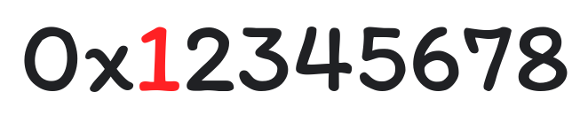
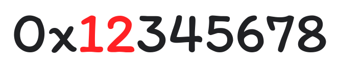
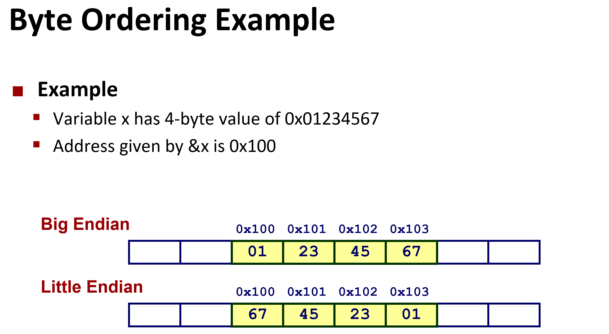
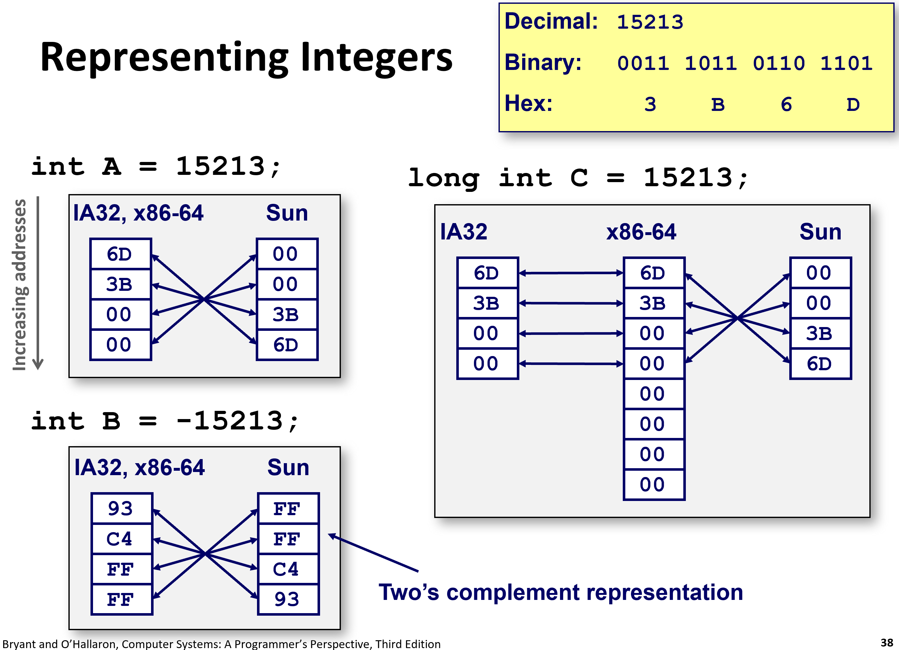

# 计算机中的字节序

> https://dgideas.net/2020/endianness/
>
> 发布日期：2020年11月1日

字节（Byte）是计算机内存中的最小可寻址单位。计算机对于较大的对象使用多个字节将其表示：在将这些字节存入内存中时，计算机必须决定以何种顺序存储这些数据；同样地，在网络中传输大对象时，多个字节的传输顺序也至关重要——这些彼此相连的计算机系统必须确立一种统一的多字节数据传输方式，才可能互相协作。

这种事先约定的对多字节数据的存储以及传输使用的顺序，被称为字节序（又称“端序”，Endianness）。理解字节序对构建较底层程序以及深入理解计算机系统有帮助。


## 最高有效位与最高有效字节

我们以计算机如何存储正整数 305419896 为例。这个数字的特殊之处在于，其十六进制的表示为 `0x12345678`——不要对这个数字的十六进制记法感到疑惑，与十进制类似，这个数字中末尾的 8 表示十六进制中的个位（表示 8 个 1），而靠前的 7 则权重更高（表示 7 个 16），以此类推……而最高位的 1 权重最高，被称为最高有效位（Most Significant Bit，MSB）：



十六进制字面量 `0x12345678`，其中用红色字体标识的 1 是最高有效位

我们拓展最高有效位的概念到“最高有效字节”：如果在某一种架构的计算机下，一个字节表示 8 位（这是很常见的情况），那么在十六进制计数法下，我们用来举例的值 `0x12345678` 则正好可以用四个字节：`0x12` `0x34` `0x56` `0x78` 来表示，其中包含 MSB 的字节 `0x12` 是“最高有效字节”：



红色字体标识的“最高有效字节”，即 `0x12`

## 大端序与小端序

简单地理解端序的方法是：在存储或传输这些多字节数据时，最高有效位或“最高有效字节”是被最先传输还是最后存储或传输。如果“最高有效字节”被最先处理，我们就称这种顺序为大端序（big-endian，BE）。否则，被称为小端序（little-endian，LE）。

想象一下在互联网中我们常采用**大**端序来传输数据。作为数据的接收者，如果对端以某种方式告诉我们即将有一个四字节数据被传输，而我们收到的数据依次为 `**0xA0**` `0xB0` `0xC0` `0xD0`，则最终的数据值应为 `0x**A0**B0C0D0`。


同样地，如果另一个系统采用**小**端序顺序，而一个字节为 16 位时，内存中依序存储的数据为 `0xF1CE` `**0x000F**` 的情况下，表示的原始数据为 `0x**000F**F1CE`（看起来像“Office”，这是一个[十六进制笑话](https://en.wikipedia.org/wiki/Hexspeak)）。因为在小端序的情况下，“最高有效字节”被最后传输。

根据维基百科的[介绍](https://en.wikipedia.org/wiki/Endianness#Middle-endian)，还有一些罕见的字节序包括混合序（middle-endian）。比如 [PDP-11](https://en.wikipedia.org/wiki/PDP-11) 系列计算机使用混合端序，要表示值 `0x**A0B0**C0D0`，内存中对应存储的数据是这样的：

```
0xB0 0xA0 0xD0 0xC0
```

该系列计算机将 32 位长的值表示为两个大端序存储的 16 位长的字（`**0xB0A0**`[最高有效字] 与 `0xD0C0`），然后在每个字中以小端序存储其中的各个字节（比如 `0xB0**A0**` 中的 `0xB0` 与 `**0xA0**`[最高有效字节]）。

## 端序不分好坏

在使用多字节表示数据时，使用何种端序完全只是一种约定。由于系统内均使用相同的方式存储、传输与解释这些多字节数据，所以不存在技术原因使得任意一种端序比起另一种更存在优势。

然而，你肯定因为“端序”这个词的来源感到好奇。根据维基百科的介绍，就像早餐敲鸡蛋的时候先敲大头还是小头一样，在各种文化中对于这种问题也存在争议。端序对应的英文单词 endian 最早出现在爱尔兰作家 Jonathan Swift 的著作《Gulliver’s Travels》中：

> 正如我所要告诉你的那样，这两个强大的国家在过去的三十六个月里，一直在进行着一场最顽固的战争。起因是这样的：大家都知道，在吃鸡蛋的时候，最原始的方法是打破较大的一端。但是现在的皇帝的祖父，在他还小的时候，有一次根据古老的做法打碎鸡蛋准备吃的时候，碰巧割破了他的手指。于是，他的父亲——当时的皇帝，就颁布了一道诏书：命令所有的臣民吃鸡蛋的时候要从小头开始打破，违者重罚。人们都对这部法律深恶痛绝，以至于我们的历史告诉我们，针对于此已经有了六次的叛乱。其中一个皇帝丢了性命，另一个丢了王位。这些内乱不断地被 Blefuscu 的大臣们煽动起来，而当它们平息的时候，逃亡者总是去那个帝国来避难。据统计，几次一共有一万一千人因为不愿意打破鸡蛋小的一段而惨遭杀戮。关于这一争端，有数百本大部头的著作都在讨论。不过大端派的书一直是受禁的，法律也规定该派的任何人不得做官。
>
> 翻译自《Gulliver’s Travels》§1.4，[原书第 42 页](https://en.wikisource.org/wiki/Page%3AThe_Works_of_the_Rev._Jonathan_Swift%2C_Volume_6.djvu/64)

## 常见的端序

我们使用的计算机通常采用 x86-64 架构，这种桌面架构与遗留的 x86 架构一样，属于小端序。而针对移动设备设计的 ARM 架构的端序则是可配置的。PowerPC、MIPS 与 IA64 架构的端序也是可配置的。

如上所述，在计算机网络传输中，通常采用大端序。IP 协议于 [RFC 791](https://tools.ietf.org/html/rfc791) 中保证了协议头为大端序传输。


# CMU 15-213: Introduction to Computer Systems

http://www.cs.cmu.edu/afs/cs/academic/class/15213-f17/www/schedule.html




