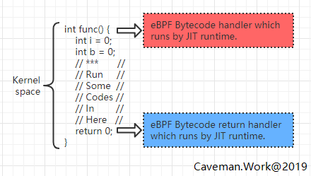
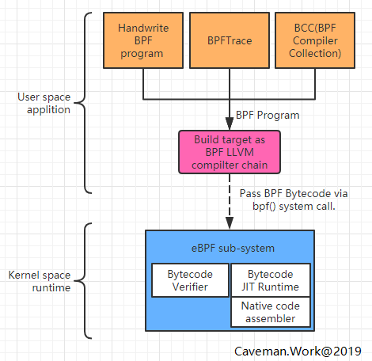

[**Caveman.Work Blog**](http://www.caveman.work/)

[Blog](http://www.caveman.work/) [Contact](http://www.caveman.work/about) [Archives](http://www.caveman.work/archives)

# eBPF架构优势及其应用方向上的畅想

> 转自：[eBPF架构优势及其应用方向上的畅想](http://www.caveman.work/2019/01/28/eBPF%E6%9E%B6%E6%9E%84%E4%BC%98%E5%8A%BF%E5%8F%8A%E5%85%B6%E5%BA%94%E7%94%A8%E6%96%B9%E5%90%91%E4%B8%8A%E7%9A%84%E7%95%85%E6%83%B3/)

 Posted on 2019-01-28

## eBPF架构的优势

本文假设读者已了解以下内容：

1. 了解BPF/eBPF是什么，了解BPF的演变历史，可参考引用7。
2. 了解程序的编译与执行流程，虚拟机工作原理。
3. 大致了解Android系统架构以及开发流程。
4. 本文是基于嵌入式Linux的开发角度阐述eBPF的应用，对负载情况及需求不一样的其他应用领域（如，云计划，后端服务器）可能不太适用，请读者注意区分。

### eBPF功能的概括描述

概括讲，eBPF是一套调试框架，它允许当用户关心的事件发生时允许直接运行用户编写的代码。是不是感觉很熟悉？在Linux中早已存在的Ftrace，SystemTap，甚至Java中ASM技术都有类似的功能。在内核空间中执行到目标函数入口时执行用户事先定义好的代码，可以处理目标函数的入参数据。当目标函数执行完成后返回时也可以执行用户事先定义好的代码，对函数返回值做处理。

注意：eBPF可以通过USDT(User Statically-Defined Tracing)技术对用户空间程序做同样的效果，但因为本质上都是执行在内核空间所以不做过多区分。

对目标函数的处理流程，相比其他Profile工具而言没有特殊之处，抽象此流程为如下：

[](http://www.caveman.work/2019/01/28/eBPF架构优势及其应用方向上的畅想/ebpf_handler_works.png)

但是在此执行流程基础上，eBPF的特殊之处在于：

1. 用户定义的回调函数及数据处理可以直接运行在内核空间。
2. 用户的回调函数实现是动态执行的，也就是不参与内核或系统的编译，像Shell脚本一样即写即可得。
3. 大一统了Linux目前主流的调试框架、如：Ftrace，Kprobe，Perf，USDT(User Statically-Defined Tracing)等。

这三个特殊之处可了不得，它使的eBPF相比之前调试工具：

1. 目标函数数据的处理都执行在内核空间，这就省去了大量的用户与内核空间上的**数据拷贝**，**系统调用**，**上下文切换**等负载。性能强悍到甚至可以直接处理网络请求包(BPF是Berkeley Packet Filters的缩写而e代表Extended)，从他的名字就能猜到它就是为此而生。
2. 因为用户回调函数是动态执行，大大提高了应用上的灵活性。遇到手头问题的时候，想查哪个状态随手一敲就能得到结果。
3. 之前学习各类Linux上的调试工具时候总觉得东西好多而且好乱。eBPF使用了一套API统一了各种底层调试机制，套用互联网应用开发常说的话，”让程序员更专注在具体业务上”。

### 要是我的话该怎么设计？

与eBPF类似的调试系统就是Dtrace，它主要应用在Solaris，MacOS上。Linux社区上也有多个分支版本，但始终没有合并到主干上。第一次初步了解eBPF的时候我也设想过如果要我设计类Dtrace的系统，应该怎么设计。假设我们将过程分为三步：

1. 事件发生时通知到调试系统
2. 调试系统接到通知后在内核层执行用户注册的回调函数
3. 用户代码不需要编译，可直接运行

#### 1. 事件发生时通知到调试系统

首先想到就是复用ftrace接口，将原先访问/sys/kernel/debug/tracing操作接口转换成更为方便的API，可供用户层的回调函数使用。后来想到既然都是运行在内核层，不如把范围扩大一些。只要是带符号的内核函数，都可以当做目标函数供用户使用。对目标函数的寻址方法沿用类似Dtrace方案，也就是约定好命名规则。

#### 2. 调试系统接到通知后在内核层执行用户注册的回调函数

既然是可执行代码，那就需要编译。编译器将用户的回调函数直接编译成目标CPU架构的ELF文件后将ELF文件写入到内核的类似ioctl之类的系统调用上。这套理论上可行，但实际上问题很多。有一个难搞定的问题是用户函数可以通过指针操作，访问到内核的任何数据接口，这在安全性上是不可接受的。后来又看到Lua引擎运行在内核上的项目，是不是也可以参考此类架构，在Kernel中安插一个解释脚本引擎，如Lua，甚至简单版本的Java，Python之类。这个方案的不足之处在于，这类语言的编译器比较庞大，对内核来说一是代码不够统一，二是过于复杂容易造成安全漏洞。

#### 3. 用户代码不需要编译，可直接运行

这条与第2条是本质上是同一个，为了支持动态执行，要么写入到内核之前编译好目标代码，要么由内核来直接解释执行。

### 社区的实现方案

[](http://www.caveman.work/2019/01/28/eBPF架构优势及其应用方向上的畅想/ebpf_with_tool_chain.png)

社区的实现相比我的初步设想优点不一样，而且更好更强大。

- 首先，它统一了几乎所有内核现有的调试框架，ftrace，kproble都可以使用，甚至perf 事件，用户空间程序自定义事件也都没问题。编程接口上使用简单地规则定义了具体要监听哪种调试框架下的哪种事件，使用起来非常方便。
- 然后参照Java语言虚拟机方案，如下：
  - 先对Java语言通过编译器编译成优化好的Bytecode。
  - 虚拟机对输入进来的Bytecode做例行检查后以解释执行或JIT执行。
- 社区的方案是将Java语言替换成BPF语言，Java编译器替换成LLVM编译器，它生成出来的文件称为 BPF Bytecode。
- 使用者把生成出来的Bytecode通过一个叫bpf()系统调用传递给内核，由内核虚拟机处理。
- 内核没有沿用任何已有的虚拟机，而是实现了一套简单，但是又能保证安全的虚拟机来执行BPF bytecode。它既不能大量的循环操作，也不能访问指定范围外的内核数据。这么做是为了保证内核安全以及回调程序的性能。因为它是执行在内核上下文，如果随便来个for(;;) {}岂不是分分钟把系统搞挂？ 这是绝对不允许的。格外需要说明的是BPF程序实际上可以执行循环语句，但数量有限。

## 有意思的eBPF工具栈

经过上面讨论可知，我们需要用户空间运行的LLVM编译器，也需要跟内核打交道的处理程序（调用bpf()及相关命令），又要把eBPF返回的数据展示给用户。整个流程涉及的点比较多，可以手动编写代码来完成也可以使用社区正在开发的开源项目，BPFtrace及BCC。
如果想要了解eBPF整个流程的话，从简单地demo代码开始入手确是个好选择。请参考引用3项目，学习下最基础的eBPF流程是怎样的。BPFtrace，BCC其实都是这个demo程序的高阶版本，他们存在的目的无非是再封装一层，屏蔽了大量繁琐的细节之后让”让程序员更专注在具体业务上”。

### BPFTrace

来几段所谓One liner的程序观赏一下（项目参考引用4）：

```
# bpftrace -e 'tracepoint:syscalls:sys_enter_* { @[probe] = count(); }'
Attaching 320 probes...
^C
...
@[tracepoint:syscalls:sys_enter_access]: 3291
@[tracepoint:syscalls:sys_enter_close]: 3897
@[tracepoint:syscalls:sys_enter_newstat]: 4268
@[tracepoint:syscalls:sys_enter_open]: 4609
@[tracepoint:syscalls:sys_enter_mmap]: 4781
# bpftrace -e 'kprobe:do_sys_open { printf("%s: %s\n", comm, str(arg1)) }'
Attaching 1 probe...
git: .git/objects/da
git: .git/objects/pack
git: /etc/localtime
systemd-journal: /var/log/journal/72d0774c88dc4943ae3d34ac356125dd
DNS Res~ver #15: /etc/hosts
^C
```

是不是特别简单优美，即使没学过BPF语法一看就能懂。具体细节请参考BPFtrace项目文档，文档写的很全很详细。BPFTrace设计意图在于提供简单地编程方式实现对系统的调试。BPFTrace可以这么简洁的原因是他已经封装好了常用的函数以及程序行为，简单的代价是功能上有所割舍。适用于快速概念验证，调试探索阶段使用，更复杂功能还要看BCC。

### BCC(BPF Compiler Collection)

```
# ./bitehist.py
Tracing... Hit Ctrl-C to end.
^C
     kbytes          : count     distribution
       0 -> 1        : 3        |                                      |
       2 -> 3        : 0        |                                      |
       4 -> 7        : 211      |**********                            |
       8 -> 15       : 0        |                                      |
      16 -> 31       : 0        |                                      |
      32 -> 63       : 0        |                                      |
      64 -> 127      : 1        |                                      |
     128 -> 255      : 800      |**************************************|
```

BCC的功能基本上BPFTrace类似，但是他呈现的方式不太一样（项目参考引用5），具体表现为：

1. BCC中的工具虽然提供的功能跟BPFTrace一样，但是他能做更多的事情。不像BPFTrace简单一行代码，它是用Python代码实现的命令，在此程序中加载一个叫BCC的python程序包，在这个库中实现了对eBPF的所有封装。所有它可以利用Python以及庞大的工具库实现非常丰富的监控流程控制与结果展示，如：画图，统计，甚至对输出数据做机器学习训练。
2. 在Python程序中需要以BPF语言实现回调函数，所以对eBPF行为的控制更佳细致及深入，具体参考Reference Guide（参考应用6）。
3. 对eBPF返回的结果做更多的处理操作。

总之如作者所说，简单需求使用BPFTrace，复杂需求使用BCC。

## eBPF在Android系统优化上的畅想

BCC项目中提供了大量的调试小程序，在我看来这些其实是对历史性能调试工具的重新实现，是以更优雅的方式实现。eBPF更大的魅力在于他的高性能跟灵活性。灵活性体现在只要是编译好的bytecode内核可以直接执行，这在线上固件的调试上带来了极大的便利性。

### 强悍的性能

实现直接对用户版本的固件进行性能回归测试。之前为了达到同样的效果，要么直接对内核修改，要么开启大量调试功能并执行特殊的性能分析程序。 这会带来的一个麻烦问题是需要维护单独开发分支以免干扰用户主干分支，而且随着时间的迭代，代码基线会偏离于线上用户版本，后续维护成本很大。所以在CI/CD的落地过程中，系统固件部分的测试是工程实践难点。如果eBPF的高性能可以满足可接受范围内的性能损失，那完全可以直接拿线上版本做回归测试。

### 虚拟机带来的灵活性

实现针对线上用户的单点下发，以了解更多的用户实际使用的系统负载情况。了解真实用户的系统负载对改进系统设计来说帮助很大，他就像一个灯塔指示了优化方向及系统瓶颈点。但痛点是在用户版本固件中不敢开大量的调试功能用于收集系统运行状态，因为性能损耗非常大。在eBPF之后可以根据情况随时修改脚本，并做灰度测试用于收集相关运行指标，会大大加快整个优化流程。Android中的很多应用都热衷于热修复一样，不打扰用户的情况下修改线上程序的需求在系统开发时也是很有用的功能。

## 写在最后

1. 随着软件技术的发展，调试机制也会不断发展，方向是朝着更具有框架性，更易于使用，更高性能为目标。不像之前那样，为了解决特定问题而设计，在完整性上提升了很多。
2. 业务负载变复杂的同时，手上工具也需要越来越灵活多变，用以面对不停变化的局面。先进生产力，有一部分是体现在工具的使用上，好的工具可避免没必要的时间浪费，提升工作效率，将精力集中在更有挑战的事情上。
3. 随说软件轮子复用是好工程的指标之一，但从eBPF实现来看它借鉴了其他项目的好想法但实现上完全是另起炉灶。
4. 软甲架构设计中，分层思路是万古不变的原则。
5. BCC在android上的应用实践请参考本博的博文[eBPF on Android](http://www.caveman.work/2019/01/29/eBPF-on-Android/)

## Reference

1. http://www.brendangregg.com/perf.html
2. https://github.com/iovisor/bpftrace/blob/master/docs/reference_guide.md#probes
3. https://github.com/pratyushanand/learn-bpf
4. https://github.com/iovisor/bpftrace
5. https://github.com/iovisor/bcc
6. https://github.com/iovisor/bcc/blob/master/docs/reference_guide.md
7. https://www.ibm.com/developerworks/cn/linux/l-lo-eBPF-history/index.html ; eBPF 简史
8. http://www.caveman.work/2019/01/29/eBPF-on-Android/

[以Little's Law角度解读iostat输出的avgqu-sz(平均队列长度)](http://www.caveman.work/2018/11/13/以Little-s-Law角度解读iostat输出的avgqu-sz-平均队列长度/)


[eBPF on Android](http://www.caveman.work/2019/01/29/eBPF-on-Android/)

 

- Table of Contents
-  

- Overview

1. \1. eBPF架构的优势
   1. [1.1. eBPF功能的概括描述](http://www.caveman.work/2019/01/28/eBPF架构优势及其应用方向上的畅想/#eBPF功能的概括描述)
   2. [1.2. 要是我的话该怎么设计？](http://www.caveman.work/2019/01/28/eBPF架构优势及其应用方向上的畅想/#要是我的话该怎么设计？)
   3. [1.3. 社区的实现方案](http://www.caveman.work/2019/01/28/eBPF架构优势及其应用方向上的畅想/#社区的实现方案)
2. [2. 有意思的eBPF工具栈](http://www.caveman.work/2019/01/28/eBPF架构优势及其应用方向上的畅想/#有意思的eBPF工具栈)
3. [3. eBPF在Android系统优化上的畅想](http://www.caveman.work/2019/01/28/eBPF架构优势及其应用方向上的畅想/#eBPF在Android系统优化上的畅想)
4. [4. 写在最后](http://www.caveman.work/2019/01/28/eBPF架构优势及其应用方向上的畅想/#写在最后)
5. [5. Reference](http://www.caveman.work/2019/01/28/eBPF架构优势及其应用方向上的畅想/#Reference)

© 2019 Caveman.Work