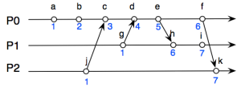
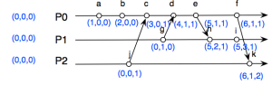

# [Lamport clock vs Vector clock](https://newbiettn.github.io/2014/05/03/lamport-clock-vs-vector-clock/#)

First and foremost, I want to say I am pretty much tired mentally and physically yet do not how to boost up myself. But I am human, so just have some fun with knowledge and pray I will be better when I reach the end of the post. Pray for me!

My today topic is much different compared to other posts. Neither programming languages nor Web-related things. Today is about Distributed Computer Systems and I can assure that it is not difficult to grasp as it seems to be.

**1. Timing in distributed system**

One of the most fundamental concept in distributed system is *to manage the order of events* – knowing one event happening before the another. To the best of my knowledge, two algorithms were invented to solve such thing are *Lamport* and *Vector clock*.

**1.1 Lamport clock**

Lamport timestamp or Lamport clock is an algorithm named under its creator, Lessie Lamport. Lamport clock is used to determine *the partial ordering the events.*

Suppose we have 3 different processes **P0**, **P1**, **P2** in the system. By following Lamport rules, every processes **P0**, **P1**, **P2** will maintain a single Lamport clock, says **t**. Whenever a event sends a message to the receiver, it will necessarily attach its timestamp along with its message.

Figure 1

The first rule is for every internal event inside the process, the clock **t** will be increased by **1** as illustrated in the *Figure 1* with the process P0 and its events ***a, b, c, d**…*

> t:= t + 1

The second rule is whenever the receiver receives the message, it will try to compare its current timestamp with the attached timestamp of the message, and after that the value will be increased by **1.** Mathematically, we say

> **t:= max(currentTimestamp, messageTimestamp) + 1** where
>
> *currentTimestamp*: the current timestamp of the receiver
>
> *messageTimestamp*: the attached timestamp of the message

In the *Figure 1,* event ***k*** is the receipt of the sending message of event ***f\*** of the process **P0.** Following the first rule, we can say that the timestamp of event ***k*** should be **2**. However, because event ***k\*** is the receiver, we have to consider the second rule in this case. In detail, the attached timestamp of ***f*** is **6**, and the computation

**t := max(2 = currentTimestamp, 6 = messageTimestamp) + 1**

simply yields 7. Thus, we have timestamp of ***k\*** is 7. Easy enough?

**1. 2 Vector clock**

Vector clock works in a little different manner compared to Lamport clock. Origin from mathematics, vector demonstrates the displacement from point to point. For example, vector AB [x,y,z] from point A(0,0,0) to point B(3, 4, 5) in 3D space. So, you can image vector clock is such an array in which each process is a list item.

Formally, vector clock is an array of integer instead of Lamport clocks’s unique integer. Reuse the above example, we will have a vector clock as following.

Figure 2

I will now explain rules of the Vector clock algorithms step by step by using the example.

First of all, every processes will have single vector, says **vp[N]** where **N** is the number of processes. In our case, **P0**, **P1**, **P2** will have vectors **(0, 0, 0)** at the beginning. And whenever the event start sending message, it necessarily attach its vector clock to the message in the same way as we see in Lamport clock.

Secondly, for every internal event of the same process, the timestamp will be increased by **1**. Take a look at events *a, b, c, d…* of process **P0**, the according timestamps are (1, 0, 0), (2, 0, 0)… respectively.

> vp[p] := vp[p] + 1 where p is the current process.

Thirdly, whenever the receiver receives the message, it will compare the value as same as Lamport.

> vp[i] := max(currentVector[i], receivedVector[i])

Event ***k,*** for example, is supposed to have the vector clock (0, 0, 2). However, when it receives the message from the event ***f,*** the third rule executes, which makes the vector of ***k*** is (6, 1, 2).