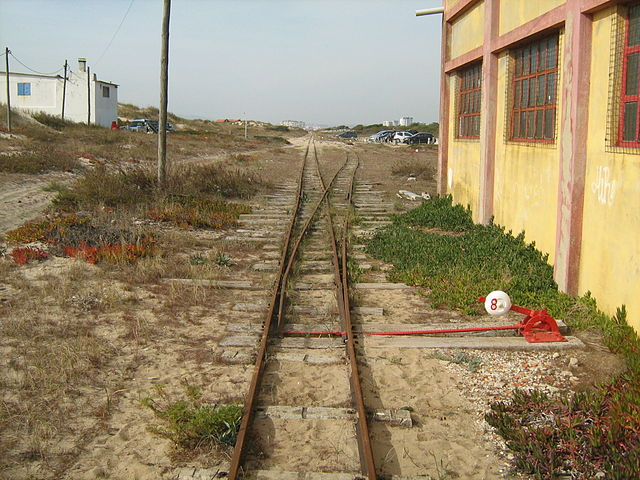
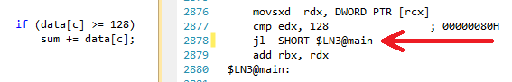

# [Purpose of cmove instruction in x86 assembly?](https://stackoverflow.com/questions/30150274/purpose-of-cmove-instruction-in-x86-assembly)

The purpose of `cmov` is to allow software (in some cases) to avoid a branch.

For example, if you have this code:

```
    cmp eax,ebx
    jne .l1
    mov eax,edx
.l1:
```

..then when a modern CPU sees the `jne` branch it will take a guess about whether the branch will be taken or not taken, and then start speculatively executing instructions based on the guess. If the guess is wrong there's a performance penalty, because the CPU has to discard any speculatively executed work and then start fetching and executing the correct path.

For a conditional move (e.g. `cmove eax,edx`) the CPU doesn't need to guess which code will be executed and the cost of a mispredicted branch is avoided. However, the CPU can't know if the value in `eax` will change or not, **which means that later instructions that depend on the results of the conditional move have to wait until the conditional move completes (instead of being speculatively executed with an assumed value and not stalling).** 我理解它只是通过不去预测这种方式，来避免预测错了重来。就像你只要不写代码，就不会有bug。

This means that if the branch can be easily predicted a branch can be faster; and if the branch can't be easily predicted the condition move can be faster.

Note that a conditional move is never strictly needed (it can always be done with a branch instead) - it's more like an optional optimization.


# 另外：

翻译：https://segmentfault.com/a/1190000006889989

## What is Branch Prediction?

Consider a railroad junction:

[](https://commons.wikimedia.org/wiki/File:Entroncamento_do_Transpraia.JPG) [Image](https://commons.wikimedia.org/wiki/File:Entroncamento_do_Transpraia.JPG) by Mecanismo, via Wikimedia Commons. Used under the [CC-By-SA 3.0](https://creativecommons.org/licenses/by-sa/3.0/deed.en) license.

Now for the sake of argument, suppose this is back in the 1800s - before long-distance or radio communication.

You are the operator of a junction and you hear a train coming. You have no idea which way it is supposed to go. You stop the train to ask the driver which direction they want. And then you set the switch appropriately.

*Trains are heavy and have a lot of inertia, so they take forever to start up and slow down.*

Is there a better way? You guess which direction the train will go!

- If you guessed right, it continues on.
- If you guessed wrong, the captain will stop, back up, and yell at you to flip the switch. Then it can restart down the other path.

**If you guess right every time**, the train will never have to stop.
**If you guess wrong too often**, the train will spend a lot of time stopping, backing up, and restarting.

------

**Consider an if-statement:** At the processor level, it is a branch instruction:



You are a processor and you see a branch. You have no idea which way it will go. What do you do? You halt execution and wait until the previous instructions are complete. Then you continue down the correct path.

*Modern processors are complicated and have long pipelines. This means they take forever to "warm up" and "slow down".*

Is there a better way? You guess which direction the branch will go!

- If you guessed right, you continue executing.
- If you guessed wrong, you need to flush the pipeline and roll back to the branch. Then you can restart down the other path.

**If you guess right every time**, the execution will never have to stop.
**If you guess wrong too often**, you spend a lot of time stalling, rolling back, and restarting.

------

This is branch prediction. I admit it's not the best analogy since the train could just signal the direction with a flag. But in computers, the processor doesn't know which direction a branch will go until the last moment.

How would you strategically guess to minimize the number of times that the train must back up and go down the other path? You look at the past history! If the train goes left 99% of the time, then you guess left. If it alternates, then you alternate your guesses. If it goes one way every three times, you guess the same...

***In other words, you try to identify a pattern and follow it.*** This is more or less how branch predictors work.

Most applications have well-behaved branches. Therefore, modern branch predictors will typically achieve >90% hit rates. But when faced with unpredictable branches with no recognizable patterns, branch predictors are virtually useless.

Further reading: ["Branch predictor" article on Wikipedia](https://en.wikipedia.org/wiki/Branch_predictor).

------

## As hinted from above, the culprit is this if-statement:

```haskell
if (data[c] >= 128)
    sum += data[c];
```

Notice that the data is evenly distributed between 0 and 255. When the data is sorted, roughly the first half of the iterations will not enter the if-statement. After that, they will all enter the if-statement.

This is very friendly to the branch predictor since the branch consecutively goes the same direction many times. Even a simple saturating counter will correctly predict the branch except for the few iterations after it switches direction.

**Quick visualization:**

```none
T = branch taken
N = branch not taken

data[] = 0, 1, 2, 3, 4, ... 126, 127, 128, 129, 130, ... 250, 251, 252, ...
branch = N  N  N  N  N  ...   N    N    T    T    T  ...   T    T    T  ...

       = NNNNNNNNNNNN ... NNNNNNNTTTTTTTTT ... TTTTTTTTTT  (easy to predict)
```

However, when the data is completely random, the branch predictor is rendered useless, because it can't predict random data. Thus there will probably be around 50% misprediction (no better than random guessing).

```none
data[] = 226, 185, 125, 158, 198, 144, 217, 79, 202, 118,  14, 150, 177, 182, ...
branch =   T,   T,   N,   T,   T,   T,   T,  N,   T,   N,   N,   T,   T,   T  ...

       = TTNTTTTNTNNTTT ...   (completely random - impossible to predict)
```

------

**What can be done?**

If the compiler isn't able to optimize the branch into a conditional move, you can try some hacks if you are willing to sacrifice readability for performance.

Replace:

```haskell
if (data[c] >= 128)
    sum += data[c];
```

with:

```haskell
int t = (data[c] - 128) >> 31;
sum += ~t & data[c];
```

This eliminates the branch and replaces it with some bitwise operations.

(Note that this hack is not strictly equivalent to the original if-statement. But in this case, it's valid for all the input values of `data[]`.)

**Benchmarks: Core i7 920 @ 3.5 GHz**

C++ - Visual Studio 2010 - x64 Release

| Scenario                 | Time (seconds) |
| :----------------------- | :------------- |
| Branching - Random data  | 11.777         |
| Branching - Sorted data  | 2.352          |
| Branchless - Random data | 2.564          |
| Branchless - Sorted data | 2.587          |

Java - NetBeans 7.1.1 JDK 7 - x64

| Scenario                 | Time (seconds) |
| :----------------------- | :------------- |
| Branching - Random data  | 10.93293813    |
| Branching - Sorted data  | 5.643797077    |
| Branchless - Random data | 3.113581453    |
| Branchless - Sorted data | 3.186068823    |

Observations:

- **With the Branch:** There is a huge difference between the sorted and unsorted data.
- **With the Hack:** There is no difference between sorted and unsorted data.
- In the C++ case, the hack is actually a tad slower than with the branch when the data is sorted.

A general rule of thumb is to avoid data-dependent branching in critical loops (such as in this example).

------

**Update:**

- GCC 4.6.1 with `-O3` or `-ftree-vectorize` on x64 is able to generate a conditional move, so there is no difference between the sorted and unsorted data - both are fast.

  (Or somewhat fast: for the already-sorted case, `cmov` can be slower especially if GCC puts it on the critical path instead of just `add`, especially on Intel before Broadwell where `cmov` has 2 cycle latency: [gcc optimization flag -O3 makes code slower than -O2](https://stackoverflow.com/questions/28875325/gcc-optimization-flag-o3-makes-code-slower-than-o2))

- VC++ 2010 is unable to generate conditional moves for this branch even under `/Ox`.

- [Intel C++ Compiler](https://en.wikipedia.org/wiki/Intel_C++_Compiler) (ICC) 11 does something miraculous. It [interchanges the two loops](https://en.wikipedia.org/wiki/Loop_interchange), thereby hoisting the unpredictable branch to the outer loop. Not only is it immune to the mispredictions, it's also twice as fast as whatever VC++ and GCC can generate! In other words, ICC took advantage of the test-loop to defeat the benchmark...

- If you give the Intel compiler the branchless code, it just outright vectorizes it... and is just as fast as with the branch (with the loop interchange).

This goes to show that even mature modern compilers can vary wildly in their ability to optimize code...