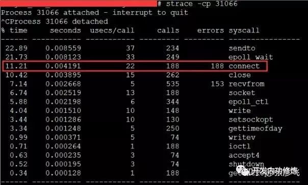
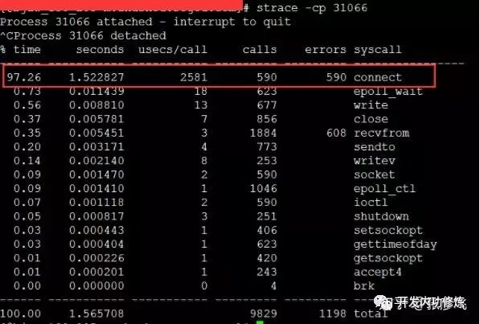

# 追踪将服务器CPU耗光的凶手!

https://mp.weixin.qq.com/s/ZNeFrJWHfFnMa6rGNruOOw

在前一篇文章《一次系统调用开销到底有多大？》中，我们讨论系统调用的时候结论是耗时200ns-15us不等。不过我今天说的我的这个遭遇可能会让你进一步认识系统调用的真正开销。在本节里你会看到一个耗时2.5ms的connect系统调用，注意是毫秒,相当于2500us！

### 1 问题描述

当时是我的一个线上云控接口，是nginx+lua写的。正常情况下，单虚机8核8G可以抗每秒2000左右的QPS，负载还比较健康。但是该服务近期开始出现一些500状态的请求了，监控时不时会出现报警。通过`sar -u`查看峰值时cpu余量只剩下了20-30%。

### 2 第一步、迅速锁定嫌疑人

`top`命令查看cpu使用，通过top命令发现峰值的时候cpu确实消耗的比较多，idle只有20-30%左右。在使用的cpu里，软中断的占比也比较高，1/3左右。

再通过`cat /proc/softirqs`查看到软中断是都是网络IO产生的NET_TX，NET_RX，和时钟TIMER。
既然软中断这个贼人吃掉了我这么多的CPU时间，所以案件的嫌疑人就这么初步被我锁定了。

处理，那既然是NET_TX，NET_RX和TIMER都高，那咱就挑可以削减的功能砍一砍呗，所以对线上执行了如下操作：

1.砍掉多余的gettimeofday系统调用

2.每个请求砍掉一次非必须Redis访问，只留了必要的。

结果：峰值的cpu余量从确实多出来一些了。报警频率确实下来了，但是还是偶尔会有零星的报警。可见该嫌疑人并非主犯。。

### 3 第二步、干掉一大片，真凶在其中

接着查看网络连接的情况`ss -n -t -a`发现，ESTABLISH状态的链接不是很多，但是TIME-WAIT有11W多。继续研究发现针对*.*.*.122:6390的TIME-WAIT已经超过了3W。所以端口有限。原来呀，上一步执行时只干掉了连接上的数据请求，但是tcp握手请求仍然存在。

处理：彻底干掉了针对*.*.*.122:6390的网络连接请求，只保留了必须保留的逻辑。
结果：问题彻底解决。sar -u查看cpu的idle余量竟然达到了90%多。

> Tips：单台机器如果作为TCP的客户端，有如下限制。1）ESTABLISH状态的连接只能有ip_local_port_range范围内的个数。2）只有针对特定ip，特定port的TIME-WAIT过多，超过或接近ip_local_port_range，再新建立连接可能会出现无端口可用的情况。（ 总的TIME-WAIT过多并不一定有问题 ）

没想到一个简单砍掉一个对redis server的tcp连接，能把cpu优化到这么多。大大出乎意料，而且也想不明白。根据我之前的性能测试经验，每个tcp连接的建立大约只需要消耗36usec的cpu时间。我们来估算一下：

当时server的qps大约在2000左右，假设是均匀分布的，则8个核每个核每秒只需要处理250个请求。也就是说每秒一条tcp连接需要消耗的cpu时间为：250*36usec = 9ms.

也就是说，正常来讲砍掉这些握手开销只能节约1%左右的cpu，不至于有这么大的提升。（即使我上面的估算只考虑了建立连接，没有统计释放连接的cpu开销，但是连接释放cpu开销也和建立连接差不多。）

总之，这一步确实解决了问题，但是代价是牺牲了一个业务逻辑。

### 4 最后、揪出真凶，真相大白

我在某一台机器上把老的有问题的代码回滚了回来，恢复问题现场。然后只修改一下ip_local_port_range。然后请出了`strace`这个命令。

通过`strace -c` 统计到对于所有系统调用的开销汇总。结果我们发现了connect系统调用这个二货，在正常的机器上只需要22us左右，在有问题的机器上竟然花掉来 2500us，上涨了100倍。我们用`strace -c $PID`查看一下出问题时和正常时的connect系统调用耗时对比：





然后回想起了*.*.*.122:6390的TIME-WAIT已经超过了3W，会不会TIME_WAIT占用了太多端口导致端口不足呢。因此查看端口内核参数配置：

```bash

# sysctl -a | grep ip_local_port_range
net.ipv4.ip_local_port_range = 32768    65000
```

果然发现该机器上的端口范围只开了3W多个，也就是说端口已经几乎快用满了。那就提高端口可用数量：

```bash

# vim /etc/sysctl.conf
net.ipv4.ip_local_port_range = 10000 65000
```

connect系统调用恢复理性状态，整体服务器的CPU使用率非常健康。

问题的根本原因是建立TCP连接使用的端口数量上（ip_local_port_range）不充裕，导致connect系统调用开销上涨了将近100倍！

后来我们的一位开发同学帮忙翻到了connect系统调用里的一段源码（源代码可能需要左右滑动）

```c
int inet_hash_connect(struct inet_timewait_death_row *death_row, struct sock *sk){
    return __inet_hash_connect(death_row, sk, inet_sk_port_offset(sk),
            __inet_check_established, __inet_hash_nolisten);
}

int __inet_hash_connect(struct inet_timewait_death_row *death_row,
                struct sock *sk, u32 port_offset,
                int (*check_established)(struct inet_timewait_death_row *,
                        struct sock *, __u16, struct inet_timewait_sock **),
                int (*hash)(struct sock *sk, struct inet_timewait_sock *twp)){
        struct inet_hashinfo *hinfo = death_row->hashinfo;
        const unsigned short snum = inet_sk(sk)->inet_num;
        struct inet_bind_hashbucket *head;
        struct inet_bind_bucket *tb;
        int ret;
        struct net *net = sock_net(sk);
        int twrefcnt = 1;

        if (!snum) {
                int i, remaining, low, high, port;
                static u32 hint;
                u32 offset = hint + port_offset;
                struct inet_timewait_sock *tw = NULL;

                inet_get_local_port_range(&low, &high);
                remaining = (high - low) + 1;

                local_bh_disable();
                for (i = 1; i <= remaining; i++) {
                        port = low + (i + offset) % remaining;
                        if (inet_is_reserved_local_port(port))
                                continue;
                        ......
        }
}

static inline u32 inet_sk_port_offset(const struct sock *sk){
        const struct inet_sock *inet = inet_sk(sk);
        return secure_ipv4_port_ephemeral(inet->inet_rcv_saddr,
                                          inet->inet_daddr,
                                          inet->inet_dport);
}
```

从上面源代码可见，临时端口选择过程是生成一个随机数，利用随机数在ip_local_port_range范围内取值，如果取到的值在ip_local_reserved_ports范围内 ，那就再依次取下一个值，直到不在ip_local_reserved_ports范围内为止。原来临时端口竟然是随机撞。出。来。的。。也就是说假如就有range里配置了5W个端口可以用，已经使用掉了49999个。那么新建立连接的时候，可能需要调用这个随机函数5W次才能撞到这个没用的端口身上。

所以请记得要保证你可用临时端口的充裕，避免你的connect系统调用进入SB模式。正常端口充足的时候，只需要22usec。但是一旦出现端口紧张，则一次系统调用耗时会上升到2.5ms，整整多出100倍。这个开销比正常tcp连接的建立吃掉的cpu时间（每个30usec左右）的开销要大的多。

> 解决TIME_WAIT的办法除了放宽端口数量限制外，还可以考虑设置net.ipv4.tcp_tw_recycle和net.ipv4.tcp_tw_reuse这两个参数，避免端口长时间保守地等待2MSL时间。