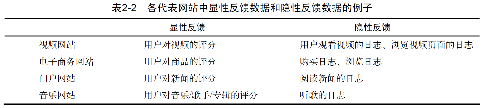
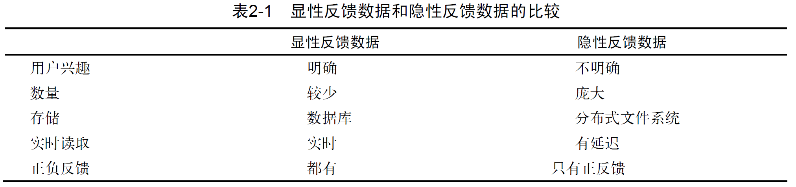
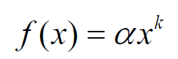
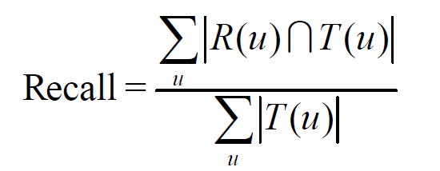
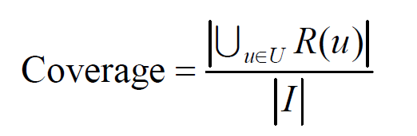
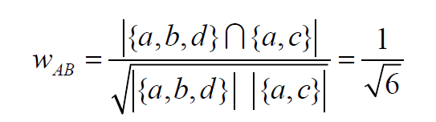
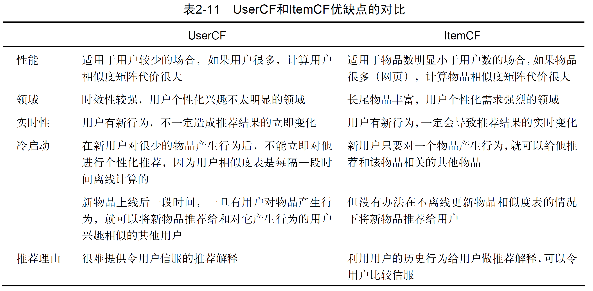
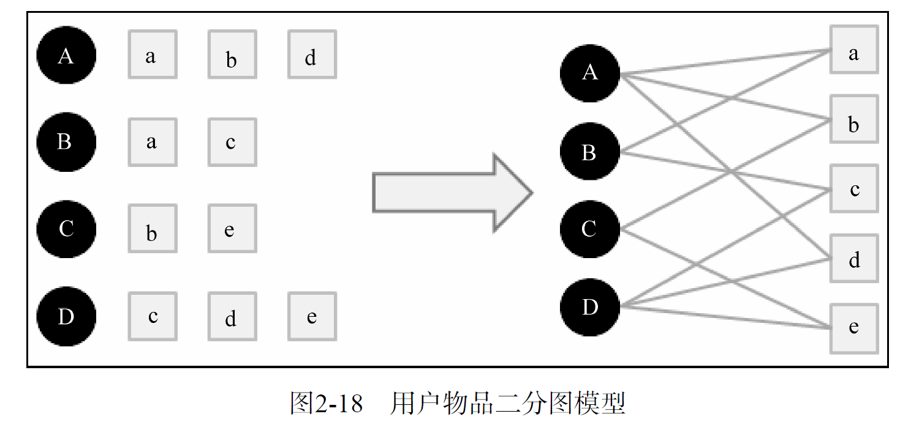

# 推荐系统实战-阅读笔记

- 推荐系统诞生快20年了
- 亚马逊有20%～30%的销售来自于推荐系统。


## 第一章 好的推荐系统

### 1.1 什么是推荐系统

信息过载时代，推荐系统的任务就是联系用户和信息，一方面帮助用户发现对自己有价值的信息，另一方面让信息能够展现在对它感兴趣的用户面前，从而实现信息消费者和信息生产者的双赢。

代表性的解决方案：

- 分类目录（门户网站，网址导航）
- 搜索引擎（google）

##### 推荐系统 VS 搜索引擎

搜索引擎满足了用户有明确目的时的主动查找需求，而推荐系统能够在用户没有明确目的的时候帮助他们发现感兴趣的新内容。

##### 推荐系统的作用

主流商品往往代表了绝大多数用户的需求，而长尾商品往往代表了一小部分用户的个性化需求。因此，如果要通过发掘长尾提高销售额，就必须充分研究用户的兴趣，而这正是个性化推荐系统主要解决的问题。推荐系统通过发掘用户的行为，找到用户的个性化需求，从而
将长尾商品准确地推荐给需要它的用户，帮助用户发现那些他们感兴趣但很难发现的商品。

##### 推荐系统是如何工作的

推荐算法的本质是通过一定的方式将用户和物品联系起来，而不同的推荐系统利用了不同的方式，比如利用好友、用户的历史兴趣记录以及用户的注册信息等。


### 1.2 个性化推荐系统的应用

推荐系统的组成

- 前台展示页面
- 后台日志系统
- 推荐算法

##### 1.2.1 电子商务

##### 1.2.2 电影和视频网站

##### 1.2.3 个性化音乐网络电台

##### 1.2.4 社交网络

##### 1.2.5 个性化阅读

##### 1.2.6 基于位置的服务

##### 1.2.7 个性化邮件

##### 1.2.8 个性化广告


### 1.3 推荐系统评测

完整的推荐系统有3个参与方：

- 用户
- 物品提供者
- 提供推荐系统的网站

##### 什么才是好的推荐系统？

- 首先，推荐系统需要满足**用户的需求**，给用户推荐那些令他们感兴趣的图书。

- 其次，推荐系统要让**各出版社**的书都能够被推荐给对其感兴趣的用户，而不是只推荐几个大型出版社的书。

- 最后，好的推荐系统设计，能够让推荐系统本身收集到高质量的用户反馈，不断完善推荐的质量，增加用户和网站的交互，**提高网站的收入**。

因此在评测一个推荐算法时，需要同时考虑三方的利益，一个好的推荐系统是能够令三方共赢的系统。好的推荐系统能够：

- 准确预测用户的行为
- 扩展用户的视野，帮助用户发现那些他们可能会感兴趣，但却不那么容易发现的东西
- 帮助商家将那些被埋没在长尾中的好商品介绍给可能会对它们感兴趣的用户

##### 评价推荐系统好坏的误区

准确率是100%的预测可能是没有意义的，因为用户早已决定购买

##### 1.3.1 推荐系统实验方法

有3种评测推荐效果的实验方法：

1. 离线实验

   一般由如下几个步骤构成：
   (1) 通过日志系统获得用户行为数据，并按照一定格式生成一个标准的数据集；
   (2) 将数据集按照一定的规则分成训练集和测试集；
   (3) 在训练集上训练用户兴趣模型，在测试集上进行预测；
   (4) 通过事先定义的离线指标评测算法在测试集上的预测结果。

2. 用户调查

   用户调查需要有一些真实用户，让他们在需要测试的推荐系统上完成一些任务。在他们完成任务时，我们需要观察和记录他们的行为，并让他们回答一些问题。最后，我们需要通过分析他们的行为和答案了解测试系统的性能。

   用户调查需要尽量保证测试用户的分布和真实用户的分布相同，比如男女各半，以及年龄、活跃度的分布都和真实用户分布尽量相同。此外，用户调查要尽量保证是双盲实验，不要让实验人员和用户事先知道测试的目标，以免用户的回答和实验人员的测试受主观成分的影响。

3. 在线实验

   AB测试是一种很常用的在线评测算法的实验方法。它通过一定的规则将用户随机分成几组，并对不同组的用户采用不同的算法，然后通过统计不同组用户的各种不同的评测指标比较不同算法，比如可以统计不同组用户的点击率，通过点击率比较不同算法的性能。

##### 1.3.2 评测指标

1. 用户满意度

2. 预测准确度

3. 覆盖率：描述一个推荐系统对物品长尾的发掘能力。

   马太效应，即所谓强者更强，弱者更弱的效应。推荐系统的初衷是希望消除马太效应。

4. 多样性

5. 新颖性：新颖的推荐不应该给用户推荐那些他们已经看过、打过分或者浏览过的视频。通过牺牲精度来提高多样性和新颖性是很容易的，而困难的是如何在不牺牲精度的情况下提高多样性和新颖性。

6. 惊喜度：推荐结果和用户的历史兴趣不相似

7. 信任度：用户对推荐结果产生信任

8. 实时性：新闻的时效性

9. 健壮性：搜索引擎的作弊和反作弊

   - 设计推荐系统时尽量使用代价比较高的用户行为（购买行为代价>点击行为代价）

10. 商业目标：不同的网站具有不同的商业目标。

    - 电子商务网站的目标可能是销售额
    - 基于展示广告盈利的网站其商业目标可能是广告展示总数
    - 基于点击广告盈利的网站其商业目标可能是广告点击总数

##### 1.3.3 评测维度

- 用户维度
- 物品维度
- 时间维度


## 第二章 利用用户行为数据

我们需要通过算法自动发掘用户行为数据，从用户的行为中推测出用户的兴趣，从而给用户推荐满足他们兴趣的物品

用户行为数据中蕴涵着很多不是那么显而易见的规律（例如啤酒和尿布），而个性化推荐算法的任务就是通过计算机去发现这些规律，从而为产品的设计提供指导，提高用户体验。

##### 协同过滤算法

基于用户行为分析的推荐算法是个性化推荐系统的重要算法，学术界一般将这种类型的算法称为协同过滤算法。顾名思义，协同过滤就是指用户可以齐心协力，通过不断地和网站互动，使自己的推荐列表能够不断过滤掉自己不感兴趣的物品，从而越来越满足自己的需求。

### 2.1 用户行为数据简介

用户行为数据在网站上最简单的存在形式就是日志。

网站在运行过程中都产生大量原始日志（raw log），并将其存储在文件系统中。很多互联网业务会把多种原始日志按照用户行为汇总成会话日志（session log），其中每个会话表示一次用户行为和对应的服务。比如，在搜索引擎和搜索广告系统中，服务会为每次查询生成一个展示日志（impression log），其中记录了查询和返回结果。如果用户点击了某个结果，这个点击信息会被服务器截获并存储在点击日志（click log）中。

一个并行程序会周期性地归并展示日志和点击日志，得到的会话日志中每个消息是一个用户提交的查询、得到的结果以及点击。类似地，推荐系统和电子商务网站也会汇总原始日志生成描述用户行为的会话日志。会话日志通常存储在分布式数据仓库中，如支持离线分析的 Hadoop Hive和支持在线分析的Google Dremel。这些日志记录了用户的各种行为，如在电子商务网站中这些行为主要包括网页浏览、购买、点击、评分和评论等。

用户行为在个性化推荐系统中一般分两种：

- 显性反馈行为（explicit feedback），例如评分、喜欢不喜欢按钮
- 隐性反馈行为（implicit feedback），不能明确反应用户喜好的行为，例如页面浏览行为





按照反馈的明确性分，用户行为数据可以分为显性反馈和隐性反馈，但按照反馈的方向分，又可以分为**正反馈**和**负反馈**。正反馈指用户的行为倾向于指用户喜欢该物品，而负反馈指用户的行为倾向于指用户不喜欢该物品。在显性反馈中，很容易区分一个用户行为是正反馈还是负反馈，而在隐性反馈行为中，就相对比较难以确定。

##### 用户行为如何表示？

互联网中的用户行为有很多种，比如浏览网页、购买商品、评论、评分等。要用一个统一的方式表示所有这些行为是比较困难的。表2-3给出了一种表示方式，它将一个用户行为表示为6部分，即产生行为的用户和行为的对象、行为的种类、产生行为的上下文、行为的内容和权重。

```
user id 产生行为的用户的唯一标识
item id 产生行为的对象的唯一标识
behavior type 行为的种类（比如是购买还是浏览）
context 产生行为的上下文，包括时间和地点等
behavior weight 行为的权重（如果是观看视频的行为，那么这个权重可以是观看时长；如果是打分行为，这个权重可以是分数）
behavior content 行为的内容（如果是评论行为，那么就是评论的文本；如果是打标签的行为，就是标签）
```

### 2.2 用户行为分析

##### 2.2.1 用户活跃度和物品流行度的分布

Power Law 分布，长尾分布：如果将单词出现的频率按照由高到低排列，则每个单词出现的频率和它在热门排行榜中排名的常数次幂成反比。



##### 2.2.2 用户活跃度和物品流行度的关系

新用户倾向于浏览热门的物品，因为他们对网站还不熟悉，只能点击首页的热门物品，而老用户会逐渐开始浏览冷门的物品。

即：用户越活跃，越倾向于浏览冷门的物品。

仅仅基于用户行为数据设计的推荐算法一般称为**协同过滤算法**。

- 基于邻域的方法
  - 基于用户的协同过滤算法：给用户推荐和他兴趣**相似的其他用户**喜欢的物品
  - 基于物品的协同过滤算法：给用户推荐和他之前**喜欢的物品相似**的物品
- 隐语义模型
- 基于图的随机游走算法

### 2.3 实验设计和算法评测

##### 2.3.3 评测指标

> 对用户u推荐N个物品（记为R(u)），令用户u在测试集上喜欢的物品集合为T(u)，然后可以通过准确率/召回率评测推荐算法的精度

召回率：描述有多少比例的"用户—物品评分记录"包含在最终的推荐列表中。



准确率：描述最终的推荐列表中有多少比例是发生过的"用户—物品评分记录"。


覆盖率：表示最终的推荐列表中包含多大比例的物品。覆盖率反映了推荐算法发掘长尾的能力，覆盖率越高，说明推荐算法越能够将长尾中的物品推荐给用户。



### 2.4 基于邻域的算法

- 基于用户的协同过滤算法

  - 推荐系统中最古老的算法

  - (1) 找到和目标用户兴趣相似的用户集合。（协同过滤算法主要利用行为的相似度计算兴趣的相似度）

    通过余弦相似度计算

    

  - (2) 找到这个集合中的用户喜欢的，且目标用户没有听说过的物品推荐给目标用户。

- 基于物品的协同过滤算法

- 二者对比

  


### 2.5 隐语义模型

LFM（latent factor model）隐语义模型，核心思想是通过隐含特征(latent factor)联系用户兴趣和物品。

首先通过一个例子来理解一下这个模型。

> 从他们的阅读列表可以看出，用户A的兴趣涉及侦探小说、科普图书以及一些计算机技术书，而用户B的兴趣比较集中在数学和机器学习方面。那么如何给A和B推荐图书呢？
>
> - 对于UserCF，首先需要找到和他们看了同样书的其他用户（兴趣相似的用户），然后给他们推荐那些用户喜欢的其他书。
> - 对于ItemCF，需要给他们推荐和他们已经看的书相似的书，比如作者B看了很多关于数据挖掘的书，可以给他推荐机器学习或者模式识别方面的书。

还有一种方法，可以对书和物品的兴趣进行分类。对于某个用户，首先得到他的兴趣分类，然后从分类中挑选他可能喜欢的物品。总结一下，这个基于兴趣分类的方法大概需要解决3个问题。

> - 如何给物品进行分类？
> - 如何确定用户对哪些类的物品感兴趣，以及感兴趣的程度？
> -  对于一个给定的类，选择哪些属于这个类的物品推荐给用户，以及如何确定这些物品在一个类中的权重？


### 2.6 基于图的模型



##### 2.6.2 基于图的推荐算法

将用户行为表示为二分图模型后，下面的任务就是在二分图上给用户进行个性化推荐。如果将个性化推荐算法放到二分图模型上，那么给用户u推荐物品的任务就可以转化为度量用户顶点vu和与vu没有边直接相连的物品节点在图上的相关性，相关性越高的物品在推荐列表中的权重就越高。

度量图中两个顶点之间相关性的方法很多，但一般来说图中顶点的相关性主要取决于下面3个因素：

- 两个顶点之间的路径数；
- 两个顶点之间路径的长度；
- 两个顶点之间的路径经过的顶点。


而相关性高的一对顶点一般具有如下特征：
- 两个顶点之间有很多路径相连；
- 连接两个顶点之间的路径长度都比较短；
- 连接两个顶点之间的路径不会经过出度比较大的顶点。

##### 基于随机游走的PersonalRank算法

经过很多次随机游走后，每个物品节点被访问到的概率会收敛到一个数。最终的推荐列表中物品的权重就是物品节点的访问概率。


## 第三章 推荐系统冷启动问题

如何在没有大量用户数据的情况下设计个性化推荐系统并且让用户对推荐结果满意从而愿意使用推荐系统，就是冷启动的问题。

### 3.1 冷启动问题简介

冷启动问题（cold start）主要分3类。

- 用户冷启动：用户冷启动主要解决如何给新用户做个性化推荐的问题。当新用户到来时，我们没有他的行为数据，所以也无法根据他的历史行为预测其兴趣，从而无法借此给他做个性化推荐。
- 物品冷启动：物品冷启动主要解决如何将新的物品推荐给可能对它感兴趣的用户这一问题。
- 系统冷启动：系统冷启动主要解决如何在一个新开发的网站上（还没有用户，也没有用户行为，只有一些物品的信息）设计个性化推荐系统，从而在网站刚发布时就让用户体验到个性化推荐服务这一问题。

对于这3种不同的冷启动问题，有不同的解决方案。一般来说，可以参考如下解决方案。

- 提供非个性化的推荐 非个性化推荐的最简单例子就是热门排行榜，我们可以给用户推荐热门排行榜，然后等到用户数据收集到一定的时候，再切换为个性化推荐。
- 利用用户注册时提供的年龄、性别等数据做粗粒度的个性化。
- 利用用户的社交网络账号登录（需要用户授权），导入用户在社交网站上的好友信息，然后给用户推荐其好友喜欢的物品。
- 要求用户在登录时对一些物品进行反馈，收集用户对这些物品的兴趣信息，然后给用户推荐那些和这些物品相似的物品。
- 对于新加入的物品，可以利用内容信息，将它们推荐给喜欢过和它们相似的物品的用户。
- 在系统冷启动时，可以引入专家的知识，通过一定的高效方式迅速建立起物品的相关度表。

### 3.2 利用用户注册信息

用户的注册信息分3种。

- 人口统计学信息 包括用户的年龄、性别、职业、民族、学历和居住地。

- 用户兴趣的描述 有一些网站会让用户用文字描述他们的兴趣。

- 从其他网站导入的用户站外行为数据 比如用户通过豆瓣、新浪微博的账号登录，就可以在得到用户同意的情况下获取用户在豆瓣或者新浪微博的一些行为数据和社交网络数据。

### 3.3 选择合适的物品启动用户的兴趣

解决用户冷启动问题的另一个方法是在新用户第一次访问推荐系统时，不立即给用户展示推荐结果，而是给用户提供一些物品，让用户反馈他们对这些物品的兴趣，然后根据用户反馈给提供个性化推荐。很多推荐系统采取了这种方式来解决用户冷启动问题。