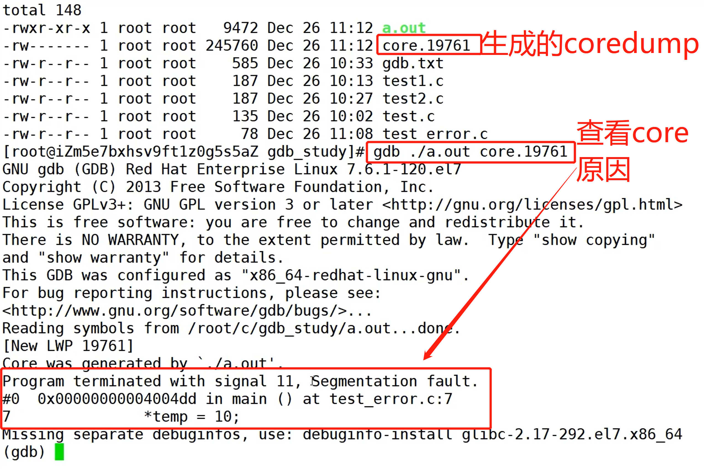

# 使用 GDB 调试

通俗版视频：https://www.bilibili.com/video/BV1EK411g7Li?from=search&seid=419761970244205414

### 安装

```shell
yum install gdb
```

### 使用

1. 查看 gdb 命令使用方法

```shell
man gdb
```

2. 使用 gdb 调试程序（见下方英文文档）

3. 使用 gdb 查看 core 文件

   由于一台主机是多人共享的，shell 对用户做了一些限制，core 文件默认不生成，使用 `ulimit -a` 查看 core 文件的限制

   `man ulimit` 可以查看 ulimit 命令的用法

   ```shell
   [root@aliyun workspace]# ulimit -a
   core file size          (blocks, -c) 0 # 可以看到默认大小为0
   data seg size           (kbytes, -d) unlimited
   scheduling priority             (-e) 0
   file size               (blocks, -f) unlimited
   pending signals                 (-i) 7284
   max locked memory       (kbytes, -l) 64
   max memory size         (kbytes, -m) unlimited
   open files                      (-n) 65535
   pipe size            (512 bytes, -p) 8
   POSIX message queues     (bytes, -q) 819200
   real-time priority              (-r) 0
   stack size              (kbytes, -s) 8192
   cpu time               (seconds, -t) unlimited
   max user processes              (-u) 7284
   virtual memory          (kbytes, -v) unlimited
   file locks                      (-x) unlimited
   ```

   使用 `ulimit -c unlimited` 解除 core 文件大小限制，就可以生成 core 文件了。在运行发生错误的时候，会产生 coredump。示例：

   


# A GDB Tutorial with Examples

By Manasij Mukherjee

A good debugger is one of the most important tools in a programmer's toolkit. On a UNIX or Linux system, GDB (the GNU debugger) is a powerful and popular debugging tool; it lets you do whatever you like with your program running under GDB.

Should you read this?

You should... if you can relate to two or more of the following:

- You have a general idea of programming with C or C++.
- You put a lot of cout or printf statements in the code if something goes wrong.
- You have used a debugger with an IDE, and are curious about how the command line works.
- You've just moved to a Unix-like operating system and would like to know about the toolchain better.

## A crash course on compiling with gcc (or g++)

[Gcc](https://www.cprogramming.com/gcc.html) is the de facto compiler in Linux or any other *nix system. It also has Windows ports but on Windows, you'll probably find the [debugger in Visual Studio](https://www.cprogramming.com/tutorial/debugging_concepts.html) 'easier'.

Suppose you have a file called main.cpp containing your c++ code. You should compile it with the following command:

```
g++ main.cpp -o main
```

While this will work fine and produce an executable file called main, you also need to put a -g flag to tell the compiler that you may want to debug your program later.

So the final command turns into:

```
g++ main.cpp -g -Wall -Werror -o main
```

(If you're wondering what -Wall and -Werror are, you may find [this page on GCC](https://www.cprogramming.com/gcc.html) a useful read.)

Don't worry if it looks cumbersome, you'll get used to it! (If you've got multiple source files you should use a good build system like [make](https://www.cprogramming.com/tutorial/makefiles.html) or [Scons](https://en.wikipedia.org/wiki/SCons).)

## The Basics of GDB

Provided you've compiled your program with the debugging symbols enabled, you're ready to start debugging. Any time there is text you should replace, I've put it in <angle brackets>.

### Starting GDB

To start GDB, in the terminal,

```
gdb <executable name>
```

For the above example with a program named main, the command becomes

```
gdb main
```

### Setting Breakpoints

You'll probably want you program to stop at some point so that you can review the condition of your program. The line at which you want the program to temporarily stop is called the breakpoint.

```
break <source code line number>
```

### Running your program

To run your program, the command is, as you guessed,

```
run
```

### Looking at the code

When the program is stopped, you can do a number of important things, but most importantly you need to see which part of the code you've stopped. The command for this purpose is "list". It shows you the neighbouring 10 lines of code.

### Next and Step

Just starting and stopping isn't much of a control. GDB also lets you to run the program line-by-line by the commands 'next' and 'step'. There is a little difference between the two, though. Next keeps the control strictly in the current scope whereas step follows the execution through function calls.

Look at this example carefully;

Suppose you have a line in the code like

```
value=display();``readinput();
```

If you use the next command, the line (and the function, provided there aren't breakpoints in it) gets executed and the control advances to the next line, readinput(), where you can perhaps examine 'value' to get an idea of how display() worked.

But if you use the step command, you get to follow what display() does directly, and the control advances to the first line of display(), wherever it is.

### Examining your Variables

When you want to find the misbehaving portion of your program, it often helps to examine local variables to see if anything unexpected has occurred. To examine a variable, just use

```
print <var name to print>
```

Note: You can also modify variables' values by

```
set <var> = <value>
```

You can modify variables to see if an issue is resolved if the variable has another value or to force the program to follow a particular path to see if the reason for a bug was due to a variable having the wrong value.

### Setting Watchpoints

Setting watchpoints is like asking the debugger to provide you with a running commentary of any changes that happen to the variables. Whenever a change occurs, the program pauses and provides you with the details of the change.

The command to set a simple watchpoint (a write watchpoint, i.e you are notified when the value is written) is

```
watch <var>
```

Here's some example output when GDB pauses due to a change in <var>:

```
Continuing.
Hardware watchpoint 2: variable

Old value = 0
New value = 1
0x08048754 at main.cpp:31
31        variable=isalpha(ch)
```

*Note: You can only set watchpoints for a variable when it is in scope. So, to watch something within another function or a inner block, first set a breakpoint inside that scope and then when the program pauses there, set the watchpoint.*

### Quit

To stop your program, when it is paused, use kill and to quit GDB itself, use quit.

## An Example Debugging Session

The given code computes the factorial of a number erroneously. The goal of the debugging session is to pinpoint the reason of the error.

```cpp
#include<iostream>
      
using namespace std;
      
long factorial(int n);
      
int main()
{
    int n(0);
    cin>>n;
    long val=factorial(n);
    cout<<val;
    cin.get();
    return 0;
}
      
long factorial(int n)
{
    long result(1);
    while(n--)
    {
        result*=n;
    }
    return result;
}
```

### Into the Debugger

Now follow the commands and the outputs carefully, especially the watchpoints. What I'm doing is basically:

- Setting a breakpoint just in the line of the function call
- Stepping into the function from that line
- Setting watchpoints for both the result of the calculation and the input number as it changes.
- Finally, analyzing the results from the watchpoints to find problematic behaviour

```
1.      $ g++ main.cpp -g -Wall -o main
2.      $ gdb main
3.      GNU gdb (GDB) Fedora (7.3-41.fc15)
4.      Copyright (C) 2011 Free Software Foundation, Inc.
5.      This GDB was configured as "i686-redhat-linux-gnu".
6.      For bug reporting instructions, please see:
7.      <http://www.gnu.org/software/gdb/bugs/>...
8.      Reading symbols from /home/manasij7479/Documents/main...done.
9.      (gdb) break 11
10.     Breakpoint 1 at 0x80485f9: file main.cpp, line 11.
11.     (gdb) run
12.     Starting program: /home/manasij7479/Documents/main
13.     3
14.     
15.     Breakpoint 1, main () at main.cpp:11
16.     11        long val=factorial(n);
17.     (gdb) step
18.     factorial (n=3) at main.cpp:19
19.     19        long result(1);
20.     (gdb) list
21.     14        return 0;
22.     15      }
23.     16
24.     17      long factorial(int n)
25.     18      {
26.     19        long result(1);
27.     20        while(n--)
28.     21        {
29.     22          result*=n;
30.     23        }
31.     (gdb) watch n
32.     Hardware watchpoint 2: n
33.     (gdb) watch result
34.     Hardware watchpoint 3: result
35.     (gdb) continue
36.     Continuing.
37.     Hardware watchpoint 3: result
38.     
39.     Old value = 0
40.     New value = 1
```

Notice that result starts from 0 and is initialized to 1.

```
41.     factorial (n=3) at main.cpp:20
42.     20        while(n--)
43.     (gdb)
```

Notice that I didn't put in a command, I just hit <return>. It re-executes the last command.

```
44.     Continuing.
45.     Hardware watchpoint 2: n
46.     
47.     Old value = 3
48.     New value = 2
```

Notice that n gets is immediately decremented from 3 to 2.

```
49.     0x08048654 in factorial (n=2) at main.cpp:20
50.     20        while(n--)
51.     (gdb)
52.     Continuing.
53.     Hardware watchpoint 3: result
54.     
55.     Old value = 1
56.     New value = 2
```

Now result becomes 2 (by multiplying result's earlier value with n's value). We've found the first bug! result is supposed to be evaluated by multiplying 3 * 2 * 1 but here the multiplication starts from 2. To correct it, we have to change the loop a bit, but before that, lets see if the rest of the calculation is correct.

```
57.     factorial (n=2) at main.cpp:20
58.     20        while(n--)
59.     (gdb)
60.     Continuing.
61.     Hardware watchpoint 2: n
62.     
63.     Old value = 2
64.     New value = 1
```

n gets decremented from 2 to 1. Result doesn't change since n is 1.

```
65.     0x08048654 in factorial (n=1) at main.cpp:20
66.     20        while(n--)
67.     (gdb)
68.     Continuing.
69.     Hardware watchpoint 2: n
70.     
71.     Old value = 1
72.     New value = 0
```

n gets decremented from 1 to 0.

```
73.     0x08048654 in factorial (n=0) at main.cpp:20
74.     20        while(n--)
75.     (gdb)
76.     Continuing.
77.     Hardware watchpoint 3: result
78.     
79.     Old value = 2
80.     New value = 0
```

Now result becomes 0 (by multiplying result's earlier value with n's value, 0). Another bug! How can result hold the value of the factorial when it is multiplied by 0? The loop must be stopped before n reaches 0.

```
81.     factorial (n=0) at main.cpp:20
82.     20        while(n--)
83.     (gdb)
84.     Continuing.
85.     Hardware watchpoint 2: n
86.     
87.     Old value = 0
88.     New value = -1
89.     0x08048654 in factorial (n=-1) at main.cpp:20
90.     20        while(n--)
91.     (gdb)
92.     Continuing.
```

Now n becomes -1 and the loop isn't permitted to run anymore because n-- returns 0, and the function returns result's current value 0. Let's see what happens when the function exits.

```
93.     
94.     Watchpoint 2 deleted because the program has left the block in
95.     which its expression is valid.
96.     
97.     Watchpoint 3 deleted because the program has left the block in
98.     which its expression is valid.
```

This is what happens to a watchpoint when the variable goes out of scope.

```
99.     0x08048605 in main () at main.cpp:11
100.    11        long val=factorial(n);
101.    (gdb) print val
102.    $1 = 1293357044
```

print val shows a garbage value because gdb points to a line before it is executed, not after.

```
103.    (gdb) next
104.    12        cout<<val;
105.    (gdb) continue
106.    Continuing.
107.    0[Inferior 1 (process 2499) exited normally]
108.    (gdb) quit
```

Here's what the fix should look like:

```
while``(n>0) ``//doesn't let n reach 0``{`` ``result*=n;`` ``n--;    ``//decrements only after the evaluation``}
```

## GDB in Conclusion

You have now seen enough to try GBD out on your own. Some important topics have not been touched upon here for the sake of simplicity, such as dealing with [segmentation faults and other kinds of crashes](https://www.cprogramming.com/debugging/segfaults.html) or using tools like [Valgrind](https://www.cprogramming.com/debugging/valgrind.html) to find memory leaks.

Remember that GDB comes built in with an excellent help system. Just type help in the (gdb) prompt and you will be presented with options of what you could need help with. For details about a specific command, use the syntax

```
help <command>
```

Another important point to note is the use of shortcuts (like 'q' for 'quit'). GDB lets you use shortcuts for commands when it is not ambigious.

After learning about GDB, you do not have to panic the next time your program goes crazy. You have an excellent weapon in your arsenal now.


