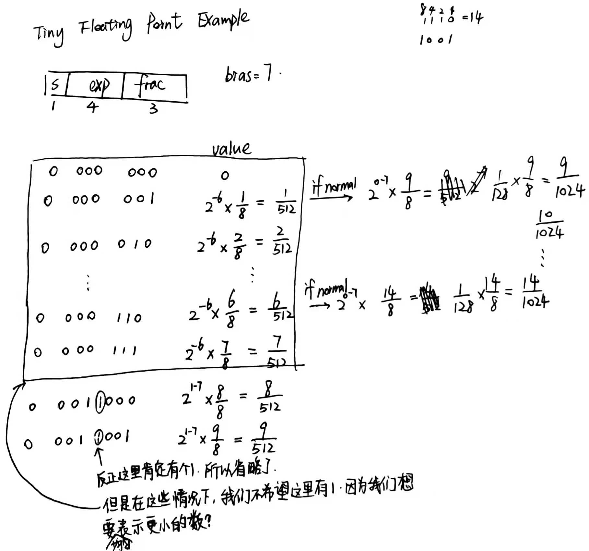

# 原码、反码、补码

正数的原码、反码、补码都相同

##### 原码和反码：为什么不能用反码来进行加减运算？


##### 补码的引入


##### 控制总线、数据总线、地址总线的作用


##### 如何理解C语言中的指针？


### LEA 指令

CSAPP 3.5.1 Load Effective Address

> 编辑器经常发现 leaq 的一些灵活用法，根本就与有效地址计算无关

CSAPP 3.6.1 

> leaq 指令不改变任何条件码（condition code, e.g. CF, ZF, SF, OF）

https://stackoverflow.com/questions/46597055/using-lea-on-values-that-arent-addresses-pointers


##### [How to multiply a register by 37 using only 2 consecutive leal instructions in x86?](https://stackoverflow.com/questions/46480579/how-to-multiply-a-register-by-37-using-only-2-consecutive-leal-instructions-in-x)

At `-O3`, gcc will emit

https://gcc.godbolt.org/

```c++
int mul37(int a) { return a*37; }

#define MUL(x) int mul##x (int a) { return a*x; }
MUL(45)

MUL(21)  // same pattern as *37 for both gcc and clang

MUL(20)
MUL(19)  // gcc uses 2 lea, clang uses lea+shl+sub
MUL(18)
MUL(17)
MUL(16)
MUL(15)

// -mtune=silvermont should probably favour fewer insns
// since it mostly bottlenecks on decode and has 3c imul

MUL(34) // gcc and clang both use imul
// except with -m32 -mtune=pentium or pentium3 pentium4
// or (64-bit) -mtune=nocona (64-bit Prescott P4)

// ICC uses mov/shl/lea for 34 = 32+2
// so it's cheaper than what clang does for 19
```

汇编：

```asm
mul37:
        leal    (%rdi,%rdi,8), %eax
        leal    (%rdi,%rax,4), %eax
        ret
mul45:
        imull   $45, %edi, %eax
        ret
mul21:
        leal    (%rdi,%rdi,4), %eax
        leal    (%rdi,%rax,4), %eax
        ret
mul20:
        leal    (%rdi,%rdi,4), %eax
        sall    $2, %eax
        ret
mul19:
        leal    (%rdi,%rdi,8), %eax
        leal    (%rdi,%rax,2), %eax
        ret
mul18:
        leal    (%rdi,%rdi,8), %eax
        addl    %eax, %eax
        ret
mul17:
        movl    %edi, %eax
        sall    $4, %eax
        addl    %edi, %eax
        ret
mul16:
        movl    %edi, %eax
        sall    $4, %eax
        ret
mul15:
        movl    %edi, %eax
        sall    $4, %eax
        subl    %edi, %eax
        ret
mul34:
        imull   $34, %edi, %eax
        ret
```


#### 如何理解有符号数的补码？

15-213 Lecture 02.  2017-08-31


CSAPP 2.2.3


无符号和有符号数的二进制表示的映射关系


```python
# -2147483647-1
10000000000000000000000000000000
# 2147483647
 1111111111111111111111111111111
```
##### 无限循环的原因？

sizeof() 返回的是 unsigned，所以 i - DELTA  运算结果也是 unsigned ，>= 0 恒成立

```c++
#include <iostream>
#define DELTA sizeof(int)

int main() {
    int i;
    for (i = 10; i - DELTA >= 0; i -= DELTA) {
        std::cout << "hello";
    }
}

```

##### 符号扩展


##### 截断


##### 编译器左移优化


##### 浮点数的表示


单精度/双精度区别


##### 小数在计算机中的存储形式中指数为什么要加127？

用32位float来说，首先，指数占8位，表示0-255之间的数值，为方便判断指数正负，我们就要用一个中间值127来辅助。比如，8位的指数在内存中存储的值是125，然后读取的时候125-127得到-2，这个-2就是真实的指数值，也就是说内存中存125就对应真实值-2，此时负号就体现出来了；再看正数，如，8位的指数在内存中存储的值是129，然后129-127得到2，2就是129对应的真实值。通过这种方式就可以方便存储数值为-127~128的指数。

接下来我们再看那些文章中举的例子得出的指数，比如19.625 = 10011.101 = 1.0011101 * 2^4，指数为4，这里的4其实就是指真实的指数值，然后4+127得到内存中存的值131，二进制为10000011，所以实际上真实值是4的指数在内存中是这么存的:10000011

总结:8位的指数内存值减去127就得到真实的指数值，反过来真实的指数值加上127就得内存值。

##### 举例：浮点数在计算机中是如何存储的

8位指数在内存中存储的值是0~255，但是实际需要指数也是有符号位的，8位有符号数表示的值是-127~128，也就是，通过加上127，可将有符号（需求）调整为无符号（存储）。

下面以实数 -9.625 为例，来看看如何将其表达为单精度的浮点数格式。具体转换步骤如下：

1、首先，需要将 -9.625 用二进制浮点数表达出来，然后变换为相应的浮点数格式。即 -9.625 的二进制为 1001.101，用规范的浮点数表达应为 1.001101×23。

2、其次，因为 -9.625 是负数，所以符号段为 1。而这里的指数为 3，所以指数段为 3+127=130，即二进制的 10000010。有效数字省略掉小数点左侧的 1 之后为 001101，然后在右侧用零补齐。因此所得的最终结果为：

```
1 10000010 00110100000000000000000
```

##### 编码举例


##### 解码举例


##### Visualization: Floating Point Encodings


##### 举例：Tiny Floating 能表示的浮点数的范围

Tiny Float 的定义


表示的数的范围


疑问：

- 浮点表示法的指数为什么不用补码来存储呢？
- 为什么 denorm 情况下 exponent 全 0 的时候要用 1 - bias，而不沿用原有的 exponent - bias 呢？



