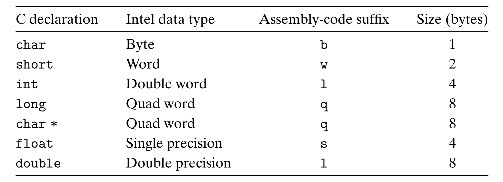
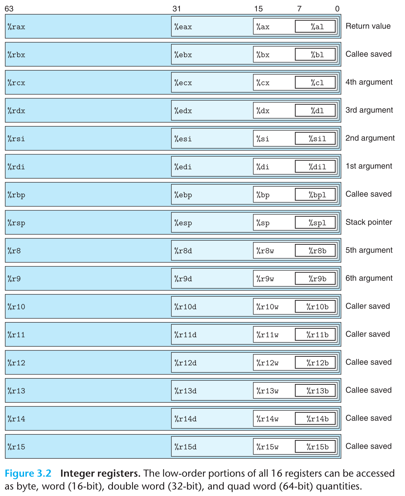
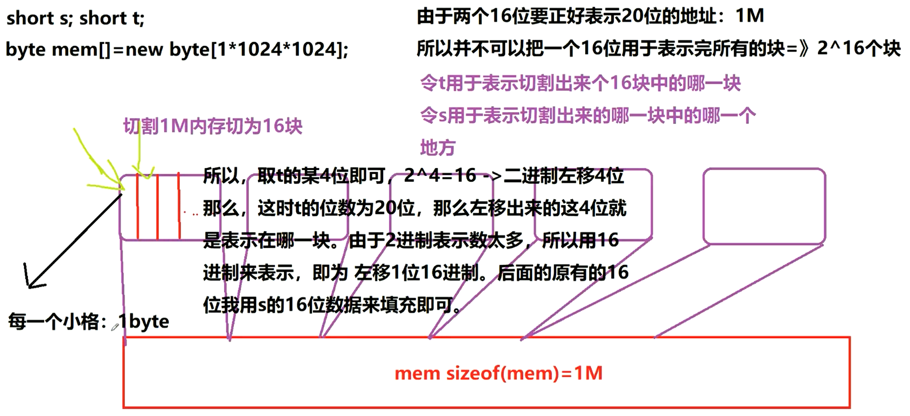
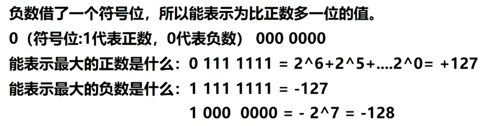
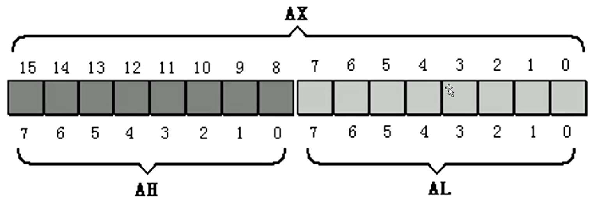
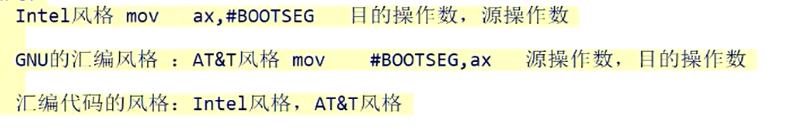
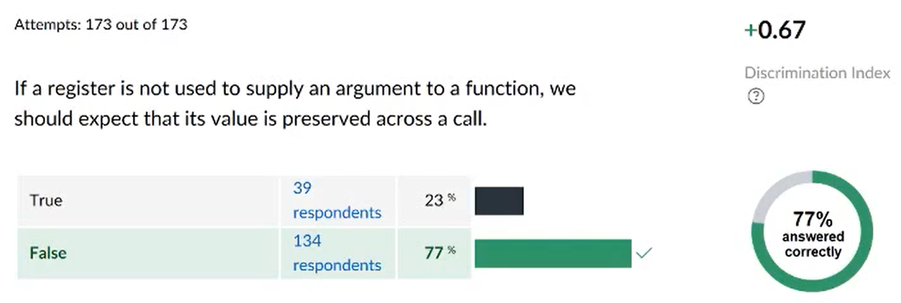
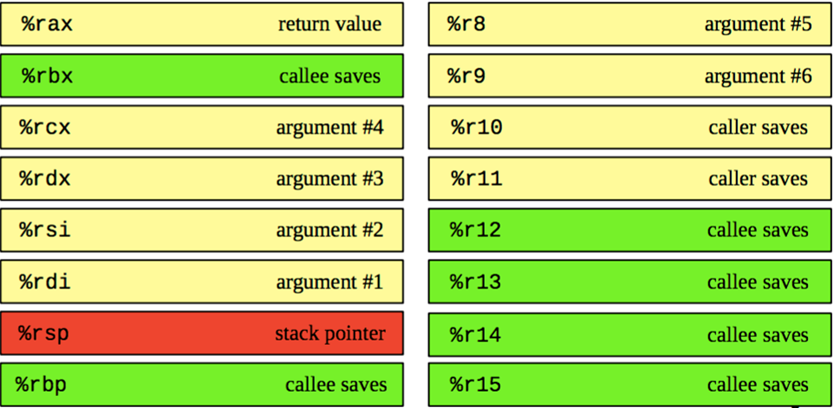

# 深入理解计算机系统 笔记

ptrace 是用来 debug 的

gcc用来编译 gdb用来调试

##### 八门神器原理

八门神器的原理是监听汇编代码里的寄存器的修改 看你往哪个寄存器里面写了什么东西 和你的一样 找到了汇编代码操作的内存地址是0x多少 知道你这个地方是存金币的 让后往这个地方疯狂写数据 写一个9999 就破解成功了 因为每个进程的虚拟地址都一样 不可能每次启动都不一样 原理就在于此

当然如果用到了随机栈SLR技术 这个技术就会将栈随机映射 不是在一个固定的地方 但是也可以破解得出 后来有了无法破解的游戏 是加载了网络的东西 不走你本地

##### Assembly-code suffix

As the table of Figure 3.1 indicates, most assembly-code instructions generated by gcc have a single-character suffix denoting the size of the operand. For example, the data movement instruction has four variants: movb (move byte), movw (move word), movl (move double word), and movq (move quad word). The suffix ‘l’ is used for double words, since 32-bit quantities are considered to be “long words.” The assembly code uses the suffix ‘l’ to denote a 4-byte integer as well as an 8-byte double-precision floating-point number. This causes no ambiguity, since floating-point code involves an entirely different set of instructions and registers.

##### 寄存器

##### 内存分段机制

参考：https://zhuanlan.zhihu.com/p/324210723

在16位或者更早的Intel CPU上，CPU工作在实模式，即直接使用物理地址，没有OS虚拟地址的概念。因此，在这些平台上，进行访问的线性地址 = 物理地址：

##### 为什么负数最小是 2^32？

因为负数借了一个符号位，所以能表示为比正数多一位的值

#### 8086 CPU 14个 通用寄存器

16位寄存器分为2个8位寄存器的情况

8086 CPU 中寄存器总共为 14 个，且均为 16 位。

即 AX，BX，CX，DX，SP，BP，SI，DI，IP，FLAG，CS，DS，SS，ES 共 14 个。而这 14 个寄存器按照一定方式又分为了通用寄存器，控制寄存器和段寄存器。

#### 通用寄存器

- AX，BX，CX，DX 称作为数据寄存器
  - AX (Accumulator)：累加寄存器，也称之为累加器
  - BX (Base)：基地址寄存器
  - CX (Count)：计数器寄存器
  - DX (Data)：数据寄存器
- SP 和 BP 又称作为指针寄存器
  - SP (Stack Pointer)：堆栈指针寄存器
  - BP (Base Pointer)：基指针寄存器
- SI 和 DI 又称作为变址寄存器
  - SI (Source Index)：源变址寄存器
  - DI (Destination Index)：目的变址寄存器

#### 控制寄存器

- IP (Instruction Pointer)：指令指针寄存器
- FLAG：标志寄存器

#### 段寄存器

- CS (Code Segment)：代码段寄存器（指向代码所在的段）
- DS (Data Segment)：数据段寄存器（存放段地址，再用指令访问数据段中的具体单元）
- SS (Stack Segment)：堆栈段寄存器（SS存放栈顶的段地址，SP存放偏移地址）
- ES (Extra Segment)：附加段寄存器

##### 寄存器组合

- CS*16+IP：当前要读取指令的地址

#### 调用者保存 vs 被调用者保存

##### x86-64 Register Usage Conventions

