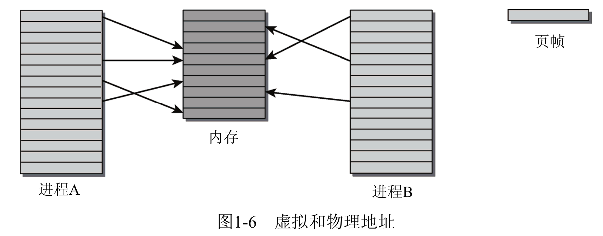

# 深入 linux 内核架构

在 Java 盛行的时候，C 也没人看，C++，汇编就更不用说了。Java 为什么出现，是因为有一帮人聚在一起，说，我怎么开发一种语言，不需要大量学习成本，就能拿来用，于是 Java 就产生了，所以你们要看，一个语言，它的发展，它开发时候的目的是什么，就是让人很容易能够简单的和计算机沟通，但是让人变得越来越不懂底层的东西。然后就像现有的，听 linux 内核，说，你在说啥？我听不懂啊。其实放在 10, 20 年前，这是一个程序员最基本要求掌握的东西。比如说你是 Java 程序员，你了解了 volatile 是什么东西，了解了内存读写屏障， 了解了这些东西，你就觉得你很牛，事实上在 20 年前，没有 java 之前，你会知道这都是 C 语言的程序员必须要了解的东西。他们不了解这些，根本没法写代码。包括你在依赖于垃圾回收器、即时编译器的时候，放到 20，30年前，你会发现，这帮写 C++ 的对于这帮东西，他也是很精通，只不过这帮程序员被替代掉了，换成了 java coder，和一些 go 相关的，把一些东西全削掉了，削掉了之后，你就会发现，学一门语言，特别轻松，特别简单，但是底层逻辑全部忘掉了，甚至根本就没学过，这样的情况就会导致你在业务上出现的一些疑难杂症，你都不了解，因为Java不涉及这些东西，甚至出了一些异常，你都不知道它是用来干啥的，所以这就是为什么要学底层。当然你不学底层，也可以很好地工作只不过你学底层是为了更好地享受生活，享受程序而已。

##### 开机过程

Linux 操作系统的开机过程是这样的，即从 BIOS 开始，然后进入 Boot Loader，再加载系统内核，然后内核进行初始化，最后启动初始化进程。初始化进程为 Linux 系统的第一个进程，它需要完成 Linux 系统中相关的初始化工作，为用户提供合适的工作环境。

##### 操作系统常问：进程间 IPC 的方式？

- 信号量

- 管道：无名管道，有名管道

- 消息队列

- 共享内存（两个进程同时映射了同一片内存空间）

  
